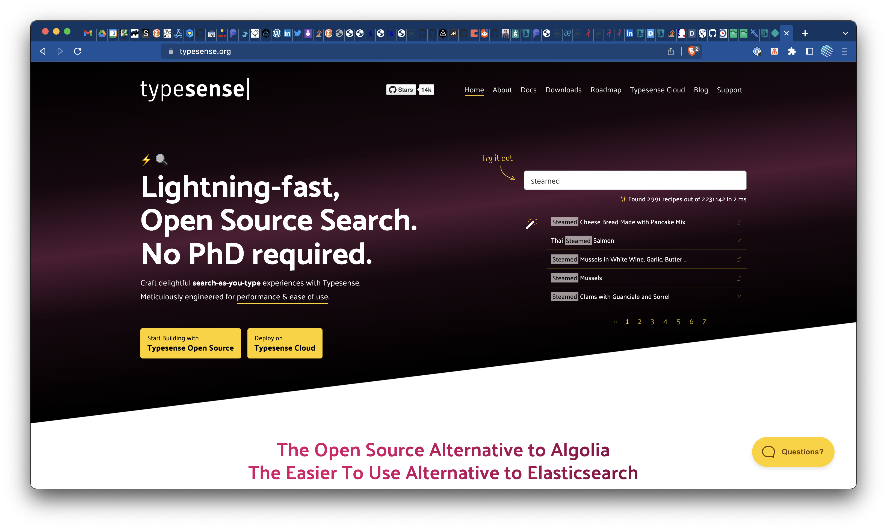
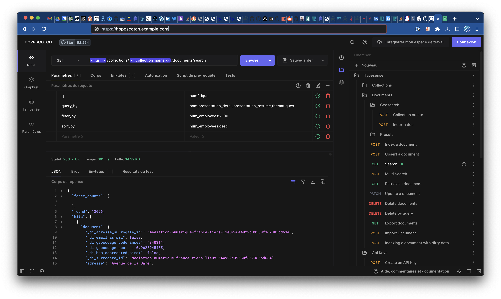
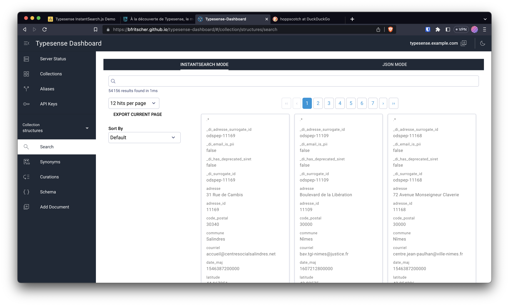
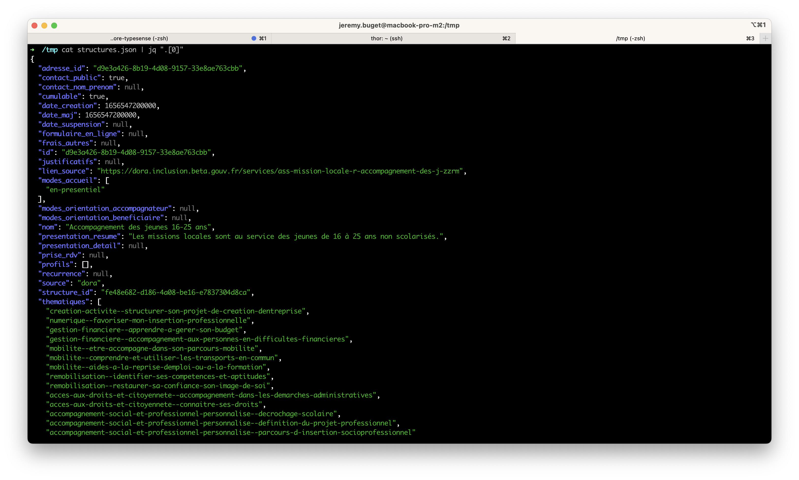
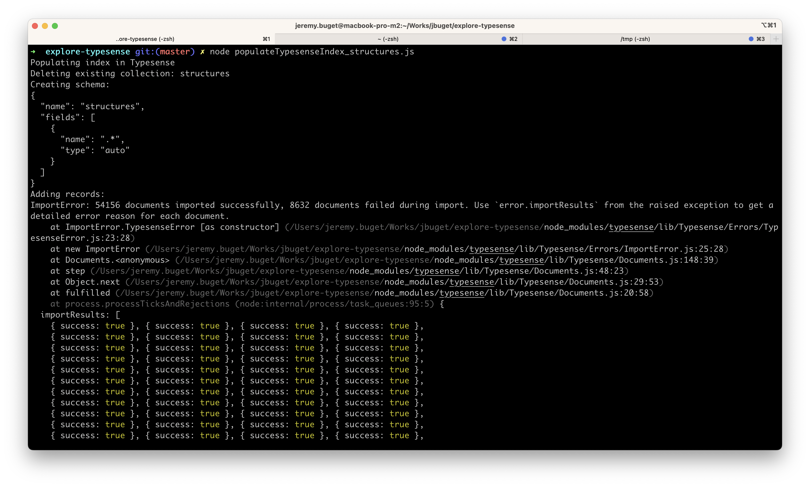
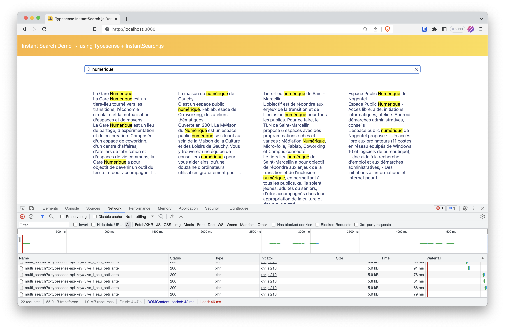

## Table des matières

- [Table des matières](#table-des-matières)
- [Introduction](#introduction)
- [Présentation](#présentation)
- [Installation](#installation)
  - [1/ Configurer la zone DNS](#1-configurer-la-zone-dns)
  - [2/ Définir la stack Docker Compose](#2-définir-la-stack-docker-compose)
  - [3/ Démarrer les services Traefik et Typesense](#3-démarrer-les-services-traefik-et-typesense)
  - [(option) Installation locale avec Docker](#option-installation-locale-avec-docker)
- [Usage](#usage)
- [Administration](#administration)
  - [Endpoints](#endpoints)
  - [CLI](#cli)
  - [Collection Postman](#collection-postman)
  - [Dashboard](#dashboard)
- [Intégration](#intégration)
- [Démonstration](#démonstration)
  - [Contexte](#contexte)
  - [Déroulement](#déroulement)
  - [Résultat](#résultat)
- [Conclusion](#conclusion)


## Introduction

Voilà plusieurs mois que j'entendais parler de [Typesense](https://typesense.org/), un moteur d'indexation et de recherche, alternative à Algolia ou ElasticSearch. La première fois, c'était lorsque je cherchais une solution pour proposer de la recherche sur mon mon site (celui-là même où vous lisez ces lignes), un site statique généré grâce au CMS Hugo. 

Récemment, un collègue – Louis-Jean, si tu passes par là 😘 – a monté un POC basé sur [MeiliSearch](https://www.meilisearch.com/), une autre alternative open source du domaine. Je me suis dit que c'était l'occasion d'étudier la solution et son écosystème.

## Présentation



Typesense est un moteur d'indexation et recherche distribué sous licence open source [GPLv3](https://github.com/typesense/typesense/blob/main/LICENSE.txt). C'est une alternative à Algolia (SaaS), ElasticSearch (ex-*vrai* open source), OpenSearch (fork open source de ElasticSearch initié et mené par Amazon) ou MeiliSearch (autre moteur open source).

Typesense permet d'indexer des *collections* de *documents* afin de faire de la recherche full-text sur les champs définis / requêtés des documents indexés.

Typesense propose plusieurs modes d'installations, ainsi qu'un [déploiement en cluster](https://typesense.org/docs/guide/high-availability.html) pour les architectures et systèmes traitant de gros volumes de données.

Personnellement, je trouve que Typesense plus simple à appréhender, installer, configurer et administrer qu'ElasticSearch ou son fork, OpenSearch. Plus simple aussi, à mon sens, que MeiliSearch, l'autre alternative open source aux deux premiers, qui nécessite de gérer un serveur frontal (Nginx, Caddy, Apache, HA Proxy) en amont.

Tout comme les autres solutions concurrentes du marché, Typesense se gère principalement via une API RESTful, elle aussi très accessible :
- des endpoints en écriture pour déclarer les schémas de documents
- un endpoint en écriture pour insérer et indexer les données
- un endpoint en lecture pour requêter des documents (avec des paramètres de filtrage, tri, pagination, sélection de champs, etc.)
- des endpoints d'administration et monitoring

Pour permettre aux utilisateurs d'un site d'effectuer des recherches via Typesense, il convient d'ajouter du code ou d'intégrer des composants / libs UI côté front-end.

Typesense est compatible avec [InstantSearch](https://www.algolia.com/doc/guides/building-search-ui/what-is-instantsearch/js/) le composant de barre de recherche intelligente initié, développé et maintenu par Algolia (merci à eux). La lib d'adaptation est [typesense-instantsearch-adapter](https://github.com/typesense/typesense-instantsearch-adapter) .

## Installation

Typesense propose une offre SaaS appelée [Typesense Cloud](https://cloud.typesense.org/).

Ce qui m'intéresse plus est la possiblité d'installer le système sur sa machine ou en mode *self-hosting*.

Ci-dessous, la procédure pour installer et configurer une instance de Typesense sur un VPS (dans mon cas hébergé chez PulseHeberg) supervisé via Traefik avec Docker & Compose.

### 1/ Configurer la zone DNS

Je recommande de commencer par cette étape afin d'éviter des soucis de génération de certificats Let's Encrypt par Traefik (au moment où il découvre et se met à gérer un service Docker).

```yaml
# Extrait de la zone DNS pour example.com
traefik 10800 IN A 12.34.56.78
typesense 10800 IN CNAME traefik.example.com.
```

> On utilisera le domaine `example.com` pour illustrer les exemples de l'article. L'IP `12.34.56.78` est celle du serveur sur lequel est déployé l'instance de Traefik.

### 2/ Définir la stack Docker Compose

Celle-ci définit : 
- 1 conteneur Traefik
- 1 conteneur TYpesense
- 1 réseau "web" externe (auquel peuvent se brancher d'autres conteneurs, sur d'autres stacks)

> 💡 J'ai rédigé une série d'articles pour découvrir comment [héberger ses propres services managés sur un VPS avec Træfik et Docker / Compose](/posts/héberger-ses-propres-services-managés-sur-un-vps-avec-traefik-et-docker-compose/part-1/).

```yaml
# docker-compose.yml
version: '3'

services:

  traefik:
    image: traefik:v2.10.3
    command:
      - "--api"
      - "--providers.docker=true"
      - "--providers.docker.exposedbydefault=false"
      - "--providers.file.directory=/etc/traefik"
      - "--providers.file.watch=true"
      - "--entrypoints.http.address=:80"
      - "--entrypoints.http.http.redirections.entryPoint.to=https"
      - "--entrypoints.http.http.redirections.entrypoint.scheme=https"
      - "--entrypoints.https=true"
      - "--entrypoints.https.address=:443"
      - "--certificatesresolvers.myresolver.acme.tlschallenge=true"
      - "--certificatesresolvers.myresolver.acme.email=admin@example.com"
      - "--certificatesresolvers.myresolver.acme.storage=/letsencrypt/acme.json"
    labels:
      - "traefik.enable=true"
      - "traefik.docker.network=web"
      - "traefik.http.routers.api.rule=Host(`traefik.example.com`)"
      - "traefik.http.routers.api.entrypoints=https"
      - "traefik.http.routers.api.tls.certresolver=myresolver"
      - "traefik.http.routers.api.service=api@internal"
    networks:
      - web
    ports:
      - "80:80"
      - "443:443"
      - "8080:8080"
    volumes:
      - "./letsencrypt:/letsencrypt"
      - "/var/run/docker.sock:/var/run/docker.sock:ro"
      - "./traefik:/etc/traefik"
      - "./traefik/log:/var/log"

  typesense:
    image: typesense/typesense:0.24.1
    command: '--data-dir /data --api-key=vive_l_eau_petillante --enable-cors'
    labels:
      - "traefik.enable=true"
      - "traefik.docker.network=web"
      - "traefik.http.routers.typesense.rule=Host(`typesense.example.com`)"
      - "traefik.http.routers.typesense.entrypoints=https"
      - "traefik.http.routers.typesense.tls.certresolver=myresolver"
      - "traefik.tcp.routers.typesense.tls.passthrough=true"
      - "traefik.http.services.typesense.loadbalancer.server.port=8108"
    networks:
      - web
    volumes:
      - ./typesense-data:/data

networks:
  web:
    external: true
```

> ℹ️ À titre perso, sur mon serveur, le service Traefik est défini dans un fichier `docker-compose.yml` spécifique et dédié. Comme je propulse et administre une douzaine de services, ça me permet de mieux organiser et découper mon infra.

Suite à des expériences douloureuses de conteneurs Docker qui s'auto-update… et plantent, j'ai pris l'habitude de spécifier la version des composants et services que je déclare. En l'occurrence, ici, j'utilise l'image `traefik:v2.10.3` ([lien](https://hub.docker.com/layers/library/traefik/v2.10.3/images/sha256-79c24d0686fa0679cde49f275e694afb7ef6d182b9fe21a219463e2a6bfe4ece?context=explore)) et `typesense:0.24.1` ([lien](https://hub.docker.com/layers/typesense/typesense/0.24.1/images/sha256-e6ef6a082a62fb19c7fa80f596293f6519ce445670a59ae6ec4b750283865859?context=explore)).

Quand on déclare un conteneur Typesense, le plus simple (mais il est possible et même recommander d'aller plus loin pour la production) pour pouvoir l'exploiter en sécurité est d'expliciter une clé d'API via l'argument `--api-key=xxx`.

Surtout, on n'oublie pas de dire à Traefik de *wrapper* le port `8108`, port exposé par défaut par l'image Typesense.

### 3/ Démarrer les services Traefik et Typesense

C'est aussi simple que faire : 

```shell
$ docker compose up -d
```

À partir de là, l'instance est fonctionnelle, écoute en interne (sur le réseau `web`) sur le port 8108, et est accessible depuis l'extérieur, à l'adresse `typesense.example.com`. Grâce à Traefik (et le libellé Docker `"traefik.http.services.typesense.loadbalancer.server.port=8108"`) il n'y a pas besoin de préciser de port (par défaut, il s'agira du port `80`).

### (option) Installation locale avec Docker

Pour celles et ceux qui veulent juste lancer une instance de Typesense en local pour voir vite fait ce que ça donne :

```yaml
# docker-compose.yml
version: '3'

services:

  typesense:
    image: typesense/typesense:0.24.1
    volumes:
      - ./typesense-data:/data
    command: '--data-dir /data --api-key=vive_l_eau_petillante --enable-cors'
    ports:
      - "8108:8108"
```

## Usage

Maintenant qu'on a une instance qui tourne, accessible sur Internet, nous pouvons commencer à définir des indexes, schémas de données, collections et documents.

**1. Déclarer un schéma de données "books"**

```shell
$ curl https://typesense.example.com/collections \
        -X POST \
        -H "X-TYPESENSE-API-KEY: vive_l_eau_petillante" \
        -d '{
              "name": "books",
              "fields": [
                {"name": "title", "type": "string" },
                {"name": "author", "type": "string" },
                {"name": "ratings", "type": "int32" }
              ],
              "default_sorting_field": "ratings"
            }'
```

Les différents types possibles sont définis dans [cette section](https://typesense.org/docs/0.24.1/api/collections.html#field-types).

**2. Injecter des documents de type "books"**

```shell
$ curl https://typesense.example.com/collections/books/documents/import \
        -X POST \
        -H "X-TYPESENSE-API-KEY: vive_l_eau_petillante" \
        -d '
          {"title":"Book 1","author":"Author1","ratings":24}
          {"title":"Book 2","author":"Author2","ratings":31}
          {"title":"Book 3","author":"Author3","ratings":30}'
```

**3. Récupérer tous les "books"**

```shell
$ curl https://typesense.example.com/collections/books \
        -H "X-TYPESENSE-API-KEY: vive_l_eau_petillante" \
        | jq
```

> 💡 Comme d'habitude, dès que je dois manipuler des données JSON, je sors `jq` 🔥

## Administration

### Endpoints

Typesense fournit une API permettant de gérer des collections, documents, de la recherche – textuelle, géospatiale (via la saisie de coordonnées longitude et latitude, ainsi qu'un périmètre de correspondance) ou vectorielle –, des synonymes ou alias, etc.

L'API Typesense comprend aussi un endpoint `GET /health` afin de monitorer l'état (d'un nœud) du système.

Autre endpoint intéressant (pour du monitoring / alerting DevOps) : `GET /stats.json` qui fournit des informations telles que le nombre moyen de requêtes par seconde, ou la latence moyenne de toutes les requêtes au cours des 10 dernières secondes.

Typesense propose d'autres endpoints d'administration pour réaliser des opérations de backup des données, gérer les nœuds pour les systèmes clusterisés, ou gérer des logs / de la config.

Pour finir, Typesense permet de générer et gérer plusieurs clés d'API, avec des portées et droits plus ou moins élevé, depuis la lecture seule sur un type de document, jusqu'à l'administration complète du système.

Le tout est intuitif tout en paraissant suffisamment complet.

### CLI

La communauté Typesense met à disposition [une CLI](https://github.com/AlexBV117/typesense-cli) non-officielle.

Malheureusement, elle ne semble plus avoir trop évoluer (dernière évolution à la rédaction de cet article : près de 2 ans).

### Collection Postman

Typesense maintient et met à disposition [une collection Postman](https://github.com/typesense/postman/blob/master/typesense.postman_collection.json) officielle avec les différents services consommables via l'API Restful (ainsi que la config des [variables d'environnement](https://github.com/typesense/postman/blob/master/typesense.postman_environment.json)).

Contrairement à la CLI, celle-ci semble être en maintenance active (dernier commit < 3 mois).

> 🤩 J'ai même réussi à l'importer et la faire fonctionner parfaitement dans mon instance de [Hoppscotch](https://hoppscotch.com/) (une alternative open source de Postman, que je valide et recommande à 1000%) !



### Dashboard

Par défaut, Typesense ne fournit aucune interface graphique d'administration de la plateforme ou des objets (collections, documents). En revanche, ils en proposent une avec la version SaaS.

Heureusement, des âmes charitables se sont emparé du sujet et proposent une application web open source : [typesense-dashboard](https://github.com/bfritscher/typesense-dashboard).

La même équipe expose gratuitement [une instance](https://bfritscher.github.io/typesense-dashboard/#/collection/structures/search) sur internet, via GitHub Pages.

> ⚠️ Attention ! Il s'agit d'une application pure front-end (avec des appels AJAX) qui vous demande de saisir vos identifiants de serveur Typesense. On ne peut jamais être certain de ce qui est déployé sur Internet. L'application me paraît saine à utiliser mais pour des systèmes complexes et critiques en production, je déconseille l'usage de cette application au profit de votre propre client ou isntance.



Typesense Dashboard est plutôt complet et permet de connaître l'état du système (ressources consommées, mémoire, etc.), de gérer (CRUD) les collections et documents, d'effectuer des recherches, de tester des requêtes, etc.

## Intégration

Contrairement à Algolia, Typesense ne propose pas de bibliothèques de composants UI sur étagère ou *built-in*.

Cependant, Typesense maintient et met à disposition [plusieurs clients dans différents langages](https://typesense.org/docs/guide/installing-a-client.html) (JavaScript, PHP, Python, etc.).

Le plus simple, pour intégrer le moteur de recherche à son site, est de suivre [le guide officiel](https://typesense.org/docs/guide/building-a-search-application.html), et en particulier s'inspirer ou cloner [l'application de démo](https://github.com/typesense/typesense-instantsearch-demo) (ce que j'ai fait).

Pour voir ce qu'il est possible de faire simplement grâce à Typesense et InstantSearch, je vous invite à consulter [la page des démos en ligne](https://typesense.org/docs/overview/demos.html).

## Démonstration

Le bla-bla, c'est bien ; une démo sur un cas concret professionnel c'est mieux.

Dans cette section, je vous propose d'explorer un véritable cas d'usage que j'ai mis en œuvre récemment basé sur la Startup d'État data·inclusion et les données qu'elle publie sur data.gouv.fr. Je souhaitais vérifier la qualité des données produites et leur simplicité d'utilisation. J'avais aussi en tête d'aider Louis-Jean à valider une hypothèse produit (*"les usagers finaux, personnes éloignées de l'emploi, pourraient trouver de la valeur à rechercher elles-mêmes un service de l'IAE via un moteur de recherche"*) grâce à un POC vite fait.

### Contexte

Au sein de la Plateforme de l'inclusion, nous recensons, raffinons et partageons les données publiques à notre disposition dans le cadre d'une démarche Open Data.

En particulier, l'équipe [data·inclusion](https://inclusion.beta.gouv.fr/nos-services/datainclusion/) collecte et expose les données des structures de l'inclusion et leurs offres de services via une API REST-ful sur [api.gouv.fr](https://api.gouv.fr/les-api/api-data-inclusion) et des jeux de données, très régulièrement et fréquemment mis à jour sur [data.gouv.fr](https://www.data.gouv.fr/fr/datasets/6233723c2c1e4a54af2f6b2d/) (depuis novembre 2021).

Les données peuvent être accédées ou récupérées dans différents formats : `.xlsx`, `.csv`, `.json`.
C'est ce dernier format qui nous intéresse et qu'on va exploiter.

### Déroulement

**1/ Récupérer les données**

La première chose à faire est de télécharger les données. data·inclusion met à disposition deux types de données : les structures de l'insertion et les services (thématisés) qu'elles proposent pour les personnes en difficultés ou éloignées de l'emploi.

Pour nos travaux, nous utiliserons les données des structures de l'insertion, qui contient (entre autres) comme informations :
- le nom de la structure,
- son adresse,
- ses coordonnées de géolocalisation (longitude et latitude)
- la description courte et longue de la structure,
- sa typologie.

> Ce qui est intéressant avec ce dataset est la diversité de nature des informations : chaînes de caractères et textes (courts et longs), coordonnées spatiales, liste d'énumérations. Ça permet de tester pas mal de cas.

```shell
$ curl https://static.data.gouv.fr/resources/referentiel-de-loffre-dinsertion-liste-des-structures-et-services-dinsertion/20230703-175217/services-inclusion-2023-07-03.json -o data/structures.json
```

Dans mon cas, je décide de télécharger et manipuler le fichier dans mon répertoire `/tmp`.

**2/ Vérifier et comprendre les données**

On vérifie dans un premier temps que le fichier contient bien des données et les bonnes. Aussi, on analyse les champs et leur type à disposition.

```shell
$ cat ./data/structures.json | jq ".[0]"
```



**3/ Injecter les données dans Typesense**

Typesense maintient et met à disposition [plusieurs clients dans différents langages](https://typesense.org/docs/guide/installing-a-client.html) (JavaScript, PHP, Python, etc.).
Nous utiliserons le client JavaScript.

Le plus simple est de repartir et copier le fichier `populateTypesenseIndex.js` en `populateTypesenseIndex_structures.js`.

```javascript
const Typesense = require('typesense');

module.exports = (async () => {
  const typesense = new Typesense.Client({
    nodes: [
      {
        host: 'typesense.example.com',
        protocol: 'https',
      },
    ],
    apiKey: 'vive_les_vacances',
    connectionTimeoutSeconds: 120,
  });

  const schema = {
    name: 'structures',
    fields: [
      {"name": ".*", "type": "auto" }
    ]
  };

  console.log('Populating index in Typesense');

  try {
    await typesense.collections('structures').delete();
    console.log('Deleting existing collection: structures');
  } catch (error) {
    // Do nothing
  }

  console.log('Creating schema: ');
  console.log(JSON.stringify(schema, null, 2));
  await typesense.collections().create(schema);

  console.log('Adding records: ');
  const structures = require('./data/structures.json');
  try {
    const returnData = await typesense
      .collections('structures')
      .documents()
      .import(structures);
    console.log(returnData);
    console.log('Done indexing.');

    const failedItems = returnData.filter(item => item.success === false);
    if (failedItems.length > 0) {
      throw new Error(
        `Error indexing items ${JSON.stringify(failedItems, null, 2)}`
      );
    }

    return returnData;
  } catch (error) {
    console.log(error);
  }
})();
```

Dans les choses à noter, plutôt que déclarer chaque champs (et son type) à indexer dans le schéma, j'utilise [les capacités d'auto-détection de Typesense](https://typesense.org/docs/0.24.1/api/collections.html#with-auto-schema-detection) : 

```javascript
  const schema = {
    name: 'structures',
    fields: [
      {"name": ".*", "type": "auto" }
    ]
  };
```

On déclenche l'import grâce à Node : 

```shell
$ node populateTypesenseIndex_structures
```



**4/ Développer l'application cliente**

Là aussi, on se base et duplique le fichier `./app.js`

Par rapport à la dernière mise à jour du projet, il m'a fallu réaliser quelques changements pour que le tout fonctionne :
- dans le fichier `package.json` monter de version les dépendances `typesense` (*devDependencies*, de "^1.5.0-0", à "^1.5.4") et `typesense-instantsearch-adapter` (*depdendencies*, de "^2.5.0" à "^2.7.0")
- changer le style d'écriture des paramètres de requête : passer du *camelCase* au *pascal_case*
- dans le fichier `index.html`, mettre à jour la lib `instantsearch.js` (de "4.44.0" à "4.56.4") :

```html
<script src="https://cdn.jsdelivr.net/npm/instantsearch.js@4.56.4"></script>
```

- adapter le templating / rendering par rapport aux champs du schéma de données :

```javascript
/* global instantsearch */

import TypesenseInstantSearchAdapter from 'typesense-instantsearch-adapter';

const typesenseInstantsearchAdapter = new TypesenseInstantSearchAdapter({
  server: {
    apiKey: 'vive_les_vacances',
    nodes: [
      {
        host: 'typesense.example.com',
        protocol: 'https',
      },
    ],
  },
  additionalSearchParameters: {
    query_by: 'nom,presentation_detail,presentation_resume,thematiques'
  },
});
const searchClient = typesenseInstantsearchAdapter.searchClient;

const search = instantsearch({
  searchClient,
  indexName: 'structures',
});

search.addWidgets([
  instantsearch.widgets.searchBox({
    container: '#searchbox',
  }),
  instantsearch.widgets.configure({
    hitsPerPage: 8,
  }),
  instantsearch.widgets.hits({
    container: '#hits',
    templates: {
      item(item) {
        return `
        <div>
          <div class="hit-nom">
            ${item._highlightResult.nom.value}
          </div>
          ${item._highlightResult.presentation_resume
            ? `<div class="hit-presentation-resume">
            ${item._highlightResult.presentation_resume.value}
            </div>`
            : ``
          }
          ${item._highlightResult.presentation_detail
            ? `<div class="hit-presentation-detail">
            ${item._highlightResult.presentation_detail.value}
            </div>`
            : ``
          }
        </div>
      `;
      },
    },
  }),
  instantsearch.widgets.pagination({
    container: '#pagination',
  }),
]);

search.start();
```

**5/ Lancer et utiliser le tout**

```shell
$ npm start
```

Accéder à l'interface à l'interface via l'URL : [http://localhost:3000](http://localhost:3000).



### Résultat

Malheureusement, à l'heure actuelle, je n'ai pas de résultats produit / métier à vous partager.
Mais techniquement, je suis impressionné de la simplciité et rapidité déconcertante avec laquelle j'ai pu obtenir un résultat concret, exploitable, et hyper encourageant.

> 😅 Il m'a fallu 10 fois (je n'exagère pas) plus de temps pour mettre en documentation et partager cette expérimentation dans le présent article 😭 😭 😭

## Conclusion

Cet article n'est qu'une introduction à Typesense.

La simplicité de mise en œuvre et d'utilisation me pousse à croire que la solution est moins avancée que des solutions plus établies comme ElasticSearch (et la suite ELK), OpenSearch (géré par Amazon qui propose des commodités d'infra, via ses services AWS) ou un éditeur SaaS tel qu'Algolia (mais qui facture une blinde).

Cela dit, de tout ce que j'ai vu et testé jusqu'à présent, la solution a l'air déjà très mature et me semble couvrir tous les besoins généraux pour des systèmes classiques de petite et moyennes tailles (au pif, < 100 000 documents, < 100 000 utilisateurs/jours).

Je ne sais pas ce que ça vaut en termes de clustering et scaling horizontal.

J'ai vu des pages de documentaion à propos de la recherche géo-spatiale ou vectorielle. Je n'ai pas testé. Je ne sais pas dans quelle mesure elle est efficace, pratique et facile à mettre en œuvre.

Enfin, je vois des intégrations pour pas mal de frameworks. Malheureusement, pas d'intégration pour Hugo 😢. Je ne sais pas dans quelle mesure c'est simple à intégrer au cycle de compilation en vue de l'industrialiser.

Finalement, c'est une très belle surprise et une nouvelle arme précieuse dans mon arsenal technique ✅.