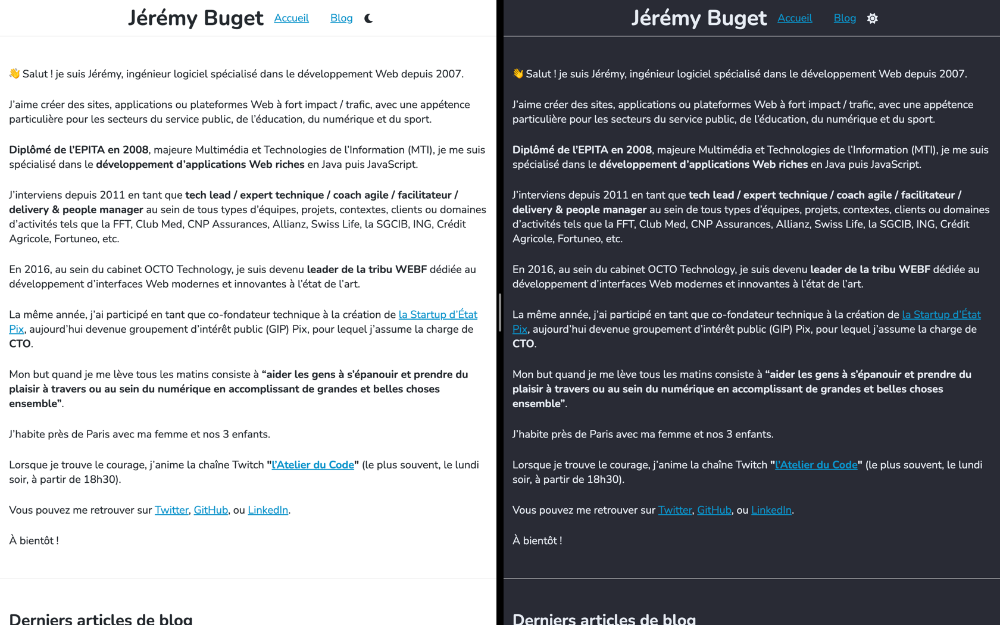
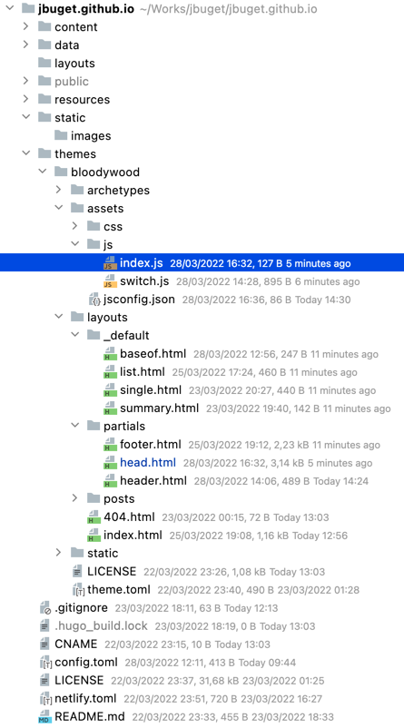
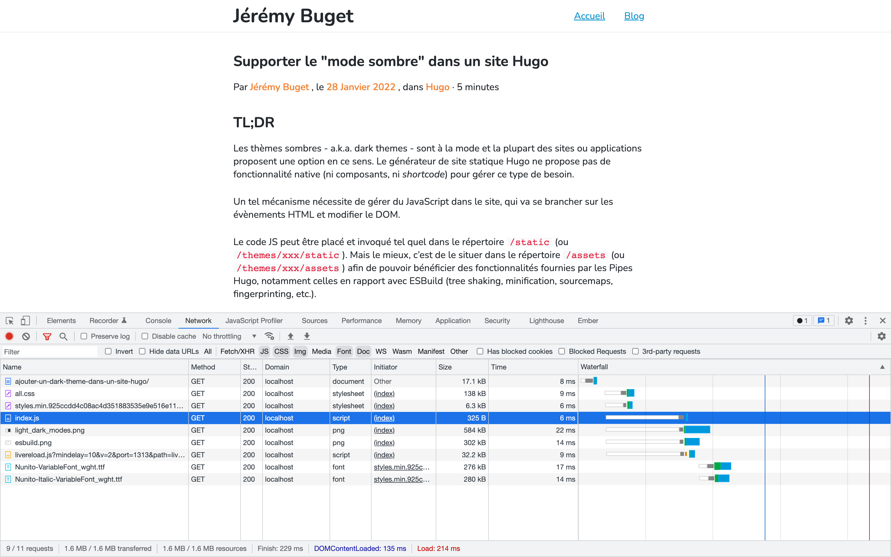
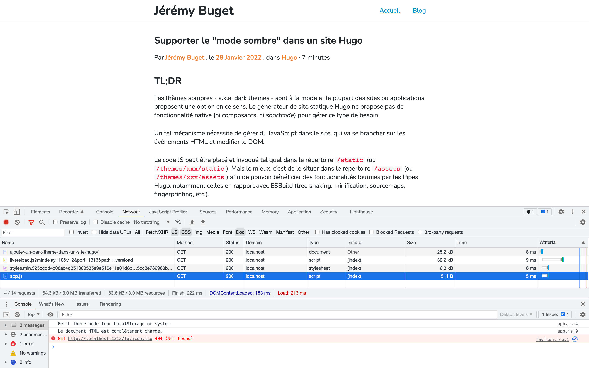
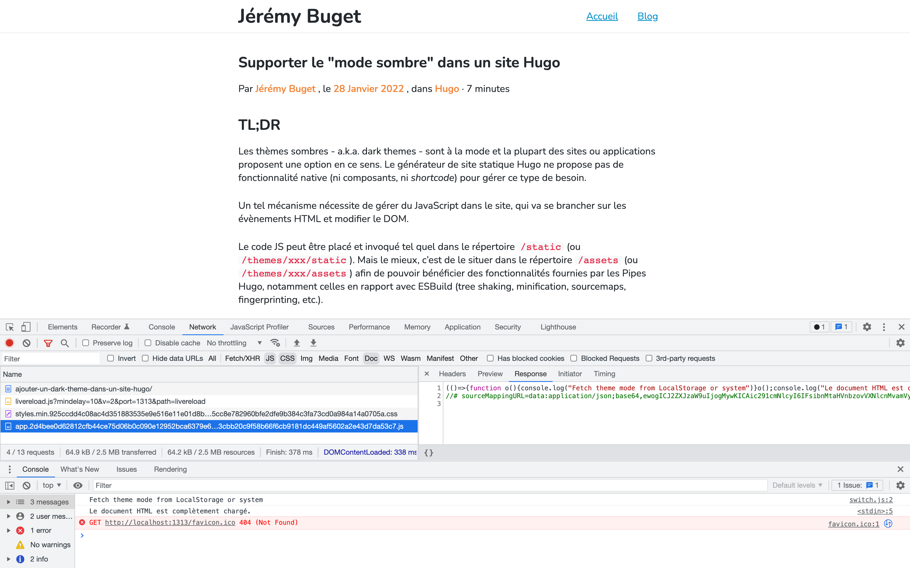
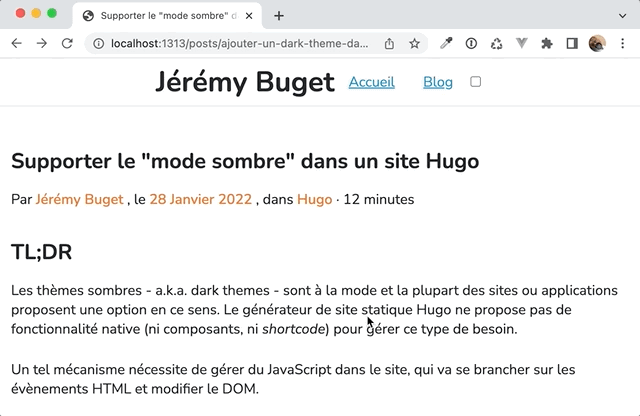

## TL;DR

Les thèmes sombres - a.k.a. dark themes - sont à la mode et la plupart des sites ou applications proposent une option en ce sens.
Le générateur de site statique Hugo ne propose pas de fonctionnalité native (ni composants, ni _shortcode_) pour gérer ce type de besoin.

Un tel mécanisme nécessite de gérer du JavaScript dans le site, qui va se brancher sur les évènements HTML et modifier le DOM.

Le code JS peut être placé et invoqué tel quel dans le répertoire `/static` (ou `/themes/xxx/static`).
Mais le mieux, c'est de le situer dans le répertoire `/assets` (ou `/themes/xxx/assets`) afin de pouvoir bénéficier des fonctionnalités fournies par les Pipes Hugo, notamment celles en rapport avec ESBuild (tree shaking, minification, sourcemaps, fingerprinting, etc.).

## Table des matières

- [Introduction](#introduction)
- [1. Conception](#conception)
  - [1.1. Existant](#11-existant) 
  - [1.2. Pistes de réflexion](#12-pistes-de-réflexion) 
  - [1.3. Solution retenue](#13-solution-retenue) 
- [2. Préparation](#2-préparation)
  - [2.1. Gérer le JavaScript dans un site Hugo](#21-gérer-le-javascript-dans-un-site-hugo)
  - [2.2. Modulariser les ressources JavaScript](#22-modulariser-les-ressources-javascript)
  - [2.3. Optimiser les ressources JavaScript](#23-optimiser-les-ressources-javascript)
  - [2.4. Réflexion sur les dépendances externes](#24-réflexion-sur-les-dépendances-externes)
- [3. Implémentation](#3-implémentation)
  - [Découpage en tâches](#-découpage-en-taches)
  - [1. Préparer les thèmes CSS](#1-préparer-les-thèmes-css)
  - [2. Changer le thème en fonction d’un bouton](#2-changer-le-thème-en-fonction-dun-bouton)
  - [3. Permettre à l’utilisateur de conserver son choix](#3-permettre-à-lutilisateur-de-conserver-son-choix)
  - [4. Supporter les préférences système de l’utilisateur](#4-supporter-les-préférences-système-de-lutilisateur)
  - [5. Ajouter une icône dynamique](#5-ajouter-une-icône-dynamique)
- [Conclusion](#conclusion)
- [Liens](#liens)

## Introduction

Nous avons vu dans un précédent billet [comment gérer & héberger des polices d'écriture personnalisées](/posts/utiliser-des-fonts-google-localement-avec-hugo/) et comment les intégrer via CSS / SCSS et le système de Pipes du framework.

Dans la continuité de ma découverte et montée en compétence sur le générateur de sites statiques Hugo, je m'intéresse cette fois à la gestion des assets JavaScript.

Pour ce faire, je m'appuie sur un cas d'usage assez courant : la mise en place du support d'un "mode sombre", a.k.a. _dark theme_ :

> En tant que **visiteur du site**, nouveau ou revenant
> 
> Je souhaite **disposer d'un mode sombre**, facilement activable ou désactivable, accessible et qui tient compte de mes préférences systèmes ou de navigation (si je suis déjà venu) 
> 
> Afin de **rendre plus agréable mon expérience utilisateur** (et parce que c'est mouf-mouf)

L'objectif est d'obtenir ce type de résultat, à savoir :
- un thème light
- un thème dark
- un bouton pour passer de l'un à l'autre

Par ailleurs, on souhaite aussi :
- tenir compte des préférences système de l'utilisateur (feature à la mode) par défaut
- tenir compte du mode préféré de l'utilisateur en cas de re-visite (ex : _page reload_)
- un mécanisme accessible, au sens #A11y, qui fonctionne au clavier et qui permet la lecture par les outils de lectures d'écran



Dans un premier temps, nous ébaucherons une solution conceptuelle / stratégie de réalisation, applicable au-delà de tout framework.
Dans un second temps, nous préparerons le terrain côté Hugo, avec la mise en place du nécessaires pour bien gérer des ressources JavaScript.
Enfin, dans un dernier temps, et à nouveau de façon agnostique (CSS / _vanilla JS_), nous verrons comment implémenter le tout.

## 1. Conception

### 1.1. Existant

Pour commencer, j'ai regardé s'il n'existe pas une solution sur étagère, prête à l'emploi, proposée par Hugo, son écosystème, sa communauté.
Je n'ai rien trouvé de satisfaisant ou de suffisamment standard en ce sens, si ce n'est un thème Hugo - Annubis - qui propose cette fonctionnalité ([cf. code source](https://github.com/Mitrichius/hugo-theme-anubis/blob/master/layouts/partials/theme-switcher.html)).

### 1.2. Pistes de réflexion

Il existe plusieurs méthodes pour gérer le changement de styles : 
- utiliser un attribut `data-theme` attaché à l'élément `document.html` ou `document.body` [comme proposé ici](https://codyhouse.co/blog/post/dark-light-switch-css-javascript), modifié à la volée
- dans le même registre, utiliser une classe CSS, elle aussi modifiée à la volée
- charger ou supprimer une feuille de style à la volée, [comme ici](https://radu-matei.com/blog/dark-mode/)

Dans tous les cas, la solution implique : 
- un bouton (ou autre élément interactif) HTML
- du code JavaScript, qui va écouter un évènement (`clik` ou `change`) et réagir en fonction du contexte, obtenu en effectuant un test sur une propriété (ex : `input[checkbox].checked`), une classe CSS (ex : `className === "dark"`) ou une variable globale (😖 bouh !)

Reste à savoir :
- comment écrire le code JavaScript ?
- où le mettre dans l'arborescence de code ? 
- comment l'injecter / appeler ?
- comment l'optimiser (concaténation, minification, fingerprinting, etc.) ?

Un point que je souhaitais aborder, mais qui ne s'est pas présenté est : "comment intégrer des dépendances tierces ?".
À voir dans un prochain article.

### 1.3. Solution retenue

Pour ce qui est de la solution et par rapport aux pistes ci-dessus, j'ai retenu : 
- un champ de saisie de type "checkbox" `input[checkbox]` pour pouvoir être accessible a minima au clavier (touche `espace`, en cas de focus)
- celui-ci sera _rendu mais pas visible_
- à cette checkbox, on attache un listener sur l'évènement `change`
- au sein de ce listener, on teste la valeur cochée ou non du bouton
- en fonction de celui-ci, on ajuste l'attribut `data-theme` de l'élément `document.html` (en s'inspirant de [cet article](https://lukelowrey.com/css-variable-theme-switcher/))
- on gère le style grâce à la fonctionnalité des [variables CSS](https://developer.mozilla.org/fr/docs/Web/CSS/Using_CSS_custom_properties) (compatible avec Sass)
- pour gérer le retour d'un visiteur, on stocke et gère l'information via le [`localStorage`](https://developer.mozilla.org/fr/docs/Web/API/Window/localStorage)
- l'information doit être mise à jour à chaque fois que l'on modifie la valeur de la _checkbox_
- il faut aussi qu'elle soit lue pour pouvoir adapter le mode d'affichage ("light" ou "dark") à chaque chargement d'une page du site
- bonus : par défaut, on se base sur les préférences système de l'utilisateur, via [la media feature CSS `prefers-color-scheme`](https://developer.mozilla.org/en-US/docs/Web/CSS/@media/prefers-color-scheme)

## 2. Préparation

### 2.1. Gérer le JavaScript dans un site Hugo

Par défaut, Hugo permet de gérer des [ressources statiques](https://gohugo.io/content-management/static-files) (fonts, images, styles, scripts, etc.) dans le répertoire éponyme `static/`.
Tout ce qui se trouve dans ce dossier peut-être accédé directement.
{.pros}

> Par exemple, lors de mon précédent article sur les Fonts Google, c'est ici que j'avais mis les fichiers de police d'écriture.
> 
> De fait, les fichiers de la police _Nunito_ que j'utilise ici sont directement consultables depuis [`https://jbuget.fr/fonts/Nunito-VariableFont_wght.ttf`](https://jbuget.fr/fonts/Nunito-VariableFont_wght.ttf).
>
> En revanche, j'avais créé le répertoire `assets/` pour y mettre les fichiers de style, afin d'avoir le support des pipelines Hugo et notamment du processing Sass.

Le problème, c'est qu'il n'est pas possible de "travailler" les ressources statiques au moment de la génération des pages du site (NDLA : en même temps, c'est dans le titre 🙃).
{.cons}

Ainsi, il n'est pas possible, avec cette méthode d'optimiser ses ressources, à savoir : les nettoyer, réorganiser, concaténer, minifier, _fingerprinter_.
{.cons}

> **Optimiser ses ressources est une étape importante** qui permet de diminuer le nombre de requêtes (et donc la charge serveur/CDN), réduire la bande-passante, accélérer les temps de chargement/traitements, sécuriser l'application et ses ressources, permettre/fluidifier/fiabiliser la mise en cache.
> 
> C'est important pour l'expérience utilisateur générale, l'accessibilité, le référencement, la sécurité, la préservation du SI et l'écologie.

Pour ce faire, il faut passer une nouvelle fois par le répertoire `assets/`, qui permet d'accéder à tout un ensemble d'outils, notamment des fonctionnalités built-in exploitant la lib [ESBuild](https://esbuild.github.io/).
{.pros}

On obtient le résultat suivant :



```javascript
/* Fichier : themes/bloodywood/assets/js/index.js */

console.log('Le document HTML est complètement chargé.');
```

```go-html-template
<!-- Fichier : themes/bloodywood/partials/head.html -->
<head itemscope itemtype="{{ .Site.BaseURL }}">
    ...
    {{ $script := resources.Get "js/index.js" }}
    <script type="text/javascript" src="{{ $script.RelPermalink }}" defer></script>
    ...
</head>
```

> **💡 À noter :** le fait d'utiliser la propriété `defer` de la balise `<script>` nous garantit que le chargement de la ressource ne sera pas bloquant lors de l'analyse et exécution du document HTML et que le script sera exécuté _de façon différée_ (là encore, tout est dans le titre), une fois le document HTML complètement chargé.
> 
> Je vous invite à consulter [la page MDN dédiée](https://developer.mozilla.org/fr/docs/Web/HTML/Element/script) pour en apprendre davantage sur cette propriété pus subtile qu'il n'y paraît, ainsi qu'à vous délecter de [cette discussion](https://stackoverflow.com/questions/42950574/are-deferred-scripts-executed-before-domcontentloaded-event#:~:text=The%20DOMContentLoaded%20event%20is%20fired,executed%20before%20CSSOM%20is%20ready.) qui donne plein d'éclairages intéressants sur les limites et autres bonnes pratiques.
> 
> Personnellement, j'ai pris le parti / l'habitude d'appeler les scripts JS dans la partie `<head>` (plutôt que `<body>` ou `<body#footer>`), via la propriété `defer`, sans passer par un event listener sur l'évènement `DOMContentLoaded` (car l'évènement `DOMInteractive` permettant d'intéragir avec le document a lieu préalablement, juste avant l'exécution du script différé).



### 2.2. Modulariser les ressources JavaScript

À partir de là, tout est en place pour mieux gérer nos assets JavaScript.
Pour cela, nous allons solliciter les _processing pipes_ JavaScript fournis par Hugo.

La première chose que l'on souhaite faire est de pouvoir gérer des modules JS, en vue de découper notre code, pour le rendre plus lisible et maintenable.

Pour commencer, on déclare le module "switch.js" dans lequel nous mettrons toute la logique technique pour gérer le switch :
```javascript
/* Fichier : themes/bloodywood/assets/js/switch.js*/

export function loadTheme() {
  console.log('Fetch theme mode from LocalStorage or system');
}
```

On importe le module dans le fichier "index.js" :
```javascript
/* Fichier : themes/bloodywood/assets/js/index.js*/

import { loadTheme } from './switch';

loadTheme();

console.log('Le document HTML est complètement chargé.');
```

Et on pense bien à activer le processing pipe ESBuild :
```go-html-template
<!-- Fichier : themes/bloodywood/partials/head.html -->
<head itemscope itemtype="{{ .Site.BaseURL }}">
    ...
    {{ $script := resources.Get "js/index.js" }}
    <script type="text/javascript" src="{{ $script.RelPermalink }}" defer></script>
    ...
</head>
```

Sans aucune autre forme de configuration (NDLA : "je repense à toutes mes années require.js ou Webpack…"), nous obtenons un fichier "app.js" qui fait bien la concaténation des ressources sollicitées 🙌. 
{.pros}



### 2.3. Optimiser les ressources JavaScript

Nous pouvons aller [plus loin encore](https://gohugo.io/hugo-pipes/js).

J'active la minification, les sourcemaps (plus pour s'amuser que par réelle nécessité, surtout en production) et le fingerprinting (bénéfique pour la sécurité et le [_cache busting_](https://www.keycdn.com/support/what-is-cache-busting#:~:text=Cache%20busting%20solves%20the%20browser,server%20for%20the%20new%20file.)).
{.pros}

```go-html-template
<!-- Fichier : themes/bloodywood/partials/head.html -->
<head itemscope itemtype="{{ .Site.BaseURL }}">
    ...
    {{ $opts := dict "targetPath" "app.js" "minify" "true" "sourceMap" "inline" }}
    {{ $built := resources.Get "js/index.js" | js.Build $opts }}
    {{ $securedJS := $built | resources.Fingerprint "sha512" }}
  <script type="text/javascript" src="{{ $securedJS.RelPermalink }}" defer></script>
  ...
</head>
```



Tout est enfin prêt pour vraiment démarrer notre éveloppement !

### 2.4. Réflexion sur les dépendances externes

Dans le cadre de cet exercice, "malheureusement", je n'ai pas l'occasion de requérir une dépendance externe.
Je ne suis pas sûr, pour l'heure, de connaître la meilleure pratique.

J'ai vu des choses dans la documentation à base de _shims_ ou d'_externals_.

_Traditionnellement_, une bonne pratique mise en œuvre par les équipes soucieux de la qualité de leur application de même que par une majorité de frameworks front, consiste à générer constamment 2 types de bundles pour chaque type de ressources (JS, CSS) :
- un premier bundle dit `vendors.min.__fingerprint__.js` pour les dépendances externes
- un second bundle dit `app.min.__fingerprint__.js` contenant le code applicatif

Par défaut, je pense que je me contenterais de télécharger les fichiers et de les héberger en local dans `static/vendors/my_external_lib`, pour appeler directement leur version minifiée.

Et si je vois que j'ai trop de dépendances (ce qui commencerait à être suspect pour un site statique), alors je tenterais de les optimiser via un _bundle vendors_.

Une chose me semble sûre à date : je ne m'embêterais pas à bundler les ressources en dehors de l'outillage fourni par Hugo (via un sous-projet npm ou un truc du genre). 

Bref, à creuser.

Passons à l'implémentation véritable de notre "theme switcher".

## 3. Implémentation

> **💡 Cette partie est tout à fait agnostique de Hugo et fonctionne pour n'importe quel site HTML + CSS + JS classique.**
> 
> À la rigueur, la toute petite originalité est l'utilisation de SCSS / Sass, dont il est très facile de se passer.

### Découpage en tâches

1. préparer les 2 thèmes CSS :
   1. définir un jeu de variables CSS 
   2. en fonction de l'attribut `document#html[data-theme]` 
   3. et les utiliser dans le style global
2. ajouter un bouton de type checkbox (pour l'accessibilité) dans le header qui permet de changer la valeur de l'attribut
3. rendre persistant le choix du visiteur via le _Local Storage_
4. tenir compte des préférences systèmes de l'utilisateur pour sa première visite via la _media query_ `prefers-color-mode`
5. ajouter une icône via [FontAwesome](https://fontawesome.com/) (_free pack_) qui change en fonction du mode affiché
  - en mode `light` → une lune pour indiquer de passer en mode sombre
  - en mode `dark` → un soleil pour indiquer de passer en mode clair

### 1. Préparer les thèmes CSS

> Rappel : j'utilise Sass pour mon blog, mais vous pouvez très bien faire sans.

L'objectif de cette étape est de **définir la valeur des variables CSS** qui seront appliquées en fonction du mode sélectionné par l'utilisateur.

On peut voir, dans ce contexte, [les variables CSS](https://developer.mozilla.org/fr/docs/Web/CSS/Using_CSS_custom_properties) comme une forme de _Modele_ (de données) dans une pseudo-représentation MVC de la partie CSS.

> 📝 _Les propriétés personnalisées CSS (custom properties en anglais, aussi parfois appelés variables CSS) sont des entités définies par les développeurs ou les utilisateurs d'une page Web, contenant des valeurs spécifiques utilisables à travers le document. Elles sont initialisées avec des propriétés personnalisées (par exemple `--main-color: black;`) et accessibles en utilisant la notation spécifique `var()` (par exemple : `color: var(--main-color);`)._
> 
> -- MDN

On décide de faire porter le thème du site ou de la page actuelle directement au niveau du document HTML, c'est-à-dire de la balise `<html>`.

Une variante courante consiste à le faire porter par l'élément `<body>`.
🤷‍♂️ Personnellement, je ne trouve ni ne vois aucun avantage à l'une ou l'autre technique.
Je suis ouvert et preneur d'avis sur le sujet.

Pour fixer un style par défaut à l'élément <html>, on utilise [la pseudo-classe `:root`](https://developer.mozilla.org/fr/docs/Web/CSS/:root).

> 📝 _La pseudo-classe `:root` permet de cibler la racine de l'arbre représentant le document. Pour un document HTML, `:root` ciblera donc l'élément `<html>` et aura le même comportement que le sélecteur html mais sa spécificité sera plus forte._
> 
> -- MDN

Pour distinguer le mode et appliquer le bon thème, on utilise un [attribut de données](https://developer.mozilla.org/fr/docs/Web/HTML/Global_attributes/data-*) personnalisé : `data-theme`.

> 📝 _Les attributs universels `data-*` forment une classe d'attributs, appelés attributs de données (data attributes). Ils permettent d'échanger des données propriétaires entre le HTML et la représentation du DOM, qu'on peut manipuler avec des scripts._
>
> -- MDN

```scss
/* Fichier : themes/bloodywood/assets/css/themes.scss */

@import "colors";

:root {
  --background-color: #fff;
  --text-color: #24292f;
  --link-color: #{$blue1};
}

/* Light */
html[data-theme='light'] {
	--background-color: #fff;
	--text-color: #24292f;
	--link-color: #{$blue1};
}

/* Dark */
html[data-theme='dark'] {
	--background-color: #282b35;
	--text-color: #e7ecf3;
	--link-color: #{$orange2};
}
```

À noter que pour pouvoir [déclarer des variables CSS avec Sass](https://sass-lang.com/documentation/breaking-changes/css-vars), basées sur des variables SCSS (exemple ici avec les couleurs), il faut utiliser la notation `#{}`.
{.pros}

Ceci étant fait, on peut désormais utiliser les variables très simplement dans le reste du projet, par exemple dans le fichier de styles global :

```scss
/* Fichier : themes/bloodywood/assets/css/global.scss */

@import "themes";

html {
  font-family: Nunito, sans-serif;
  font-size: 18px;
  background: var(--background-color);
  color: var(--text-color);
}

a {
  color: var(--link-color);
}
```

Désormais, en fonction de la valeur de l'attribut `[data-theme]` associé à l'élément `<html>`, le style CSS et le rendu visuel de la page changeront (à chaud, sans nécessité de recharger la page). 
{.pros}

### 2. Changer le thème en fonction d'un bouton

L'objet de cette étape consiste à ajouter une case à cocher qui, en fonction de son état, activera l'un ou l'autre mode graphique :
- [x] coché → _dark_ theme
- [ ] décoché → _light_ theme

La première chose à faire revient à ajouter l'élément HTML dans le DOM.

```go-html-template
<!-- Fichier : themes/bloodywood/layouts/partials/header.html -->

<header class="page-header">
  <div class="container">
    <div class="row">
      <h1>{{ .Site.Title }}</h1>
      <nav role="navigation">
        <ul>
          <li><a class="navlink" href="/">Accueil</a></li>
          <li><a class="navlink" href="/posts">Blog</a></li>
        </ul>
        <label class="switch">
          <input id="dark-mode-toggle" type="checkbox">
        </label>
      </nav>
    </div>
  </div>
</header>
```

Il faut ensuite faire en sorte que lorsque l'utilisateur intéragit avec la case à cocher, l'attribut `document#html[data-theme]` change de valeur.

Pour cela, on branche un Event Listener sur l'évènement `change` du bouton.

````javascript
/* Fichier : themes/bloodywood/assets/js/switch.js*/

const html = document.querySelector('html');
const darkModeSwitcher = document.getElementById("dark-mode-toggle");

darkModeSwitcher.addEventListener("change", (event) => {
  const mode = (event.target.checked) ? 'dark' : 'light';
  setTheme(mode);
});

function setTheme(mode) {
  document.documentElement.setAttribute('data-theme', mode);
}

export function initTheme() {
  setTheme('light');
  darkModeSwitcher.checked = false;
}
````

🎉 Ça fonctionne !



> ℹ️ Remarque : il faut bien penser à assigner la case à cocher à l'état "non coché" par défaut, sous peine de devoir faire un double-clic la toute première fois.

### 3. Permettre à l'utilisateur de conserver son choix

Pour cela, nous allons utiliser la fonctionnalité [Local Storage](https://developer.mozilla.org/fr/docs/Web/API/Window/localStorage) fournie par tous les navigateurs modernes.

> 📝 _La propriété `localStorage` vous permet d'accéder à un objet local Storage. Le `localStorage` est similaire au `sessionStorage`. La seule différence : les données stockées dans le `localStorage` n'ont pas de délai d'expiration, alors que les données stockées dans le `sessionStorage` sont nettoyées quand la session navigateur prend fin — donc quand on ferme le navigateur._
> 
> -- MDN

De cette façon, chaque fois que l'utilisateur reviendra sur le site ou rechargera une page du site, son choix sera conservé.
{.pros}

Par défaut, le mode activé sera le thème clair.


/* Fichier : themes/bloodywood/assets/js/switch.js*/

const html = document.querySelector('html');
const darkModeSwitcher = document.getElementById("dark-mode-toggle");

darkModeSwitcher.addEventListener("change", (event) => {
    const mode = (event.target.checked) ? 'dark' : 'light';
    setTheme(mode);
    localStorage.setItem("theme", mode);
});

function setTheme(mode) {
    document.documentElement.setAttribute('data-theme', mode);
}

export function initTheme() {
    const mode = localStorage.getItem('theme') || 'light';
    setTheme(mode);
    darkModeSwitcher.checked = (mode === 'dark');
}



### 4. Supporter les préférences système de l'utilisateur

Les navigateurs modernes supportent la requête média `prefers-color-scheme` dont la valeur peut être changée par l'utilisateur au niveau de son système d'exploitation (Android/Iphone, Windows/Mac/linux).
{.pros}

> 📝 _La caractéristique média prefers-color-scheme permet de détecter les préférences exprimées par l'utilisateur quant au thème à utiliser (sombre ou clair)._
> 
> -- MDN

Faire coexister la persistance du choix via Local Storage tout en gérant correctement les préférences systèmes demande un peu de jus de cerveau.

Le comportement que nous souhaitons est le suivant :
- tant que le visiteur n'a pas coché la case, alors ce sont les préférences système qui s'appliquent
- à partir du moment où le visiteur définit son thème de prédilection - i.e. "le jour où il clique sur la case à cocher" - alors ce sera celui-ci qui sera appliqué

> ℹ️ Pour remettre le thème à zéro, il n'aura alors d'autre choix que de supprimer l'entrée `theme` du Local Storage. 



/* Fichier : themes/bloodywood/assets/js/switch.js*/

/* ... */

export function initTheme() {
    let mode = localStorage.getItem('theme');
    if (!mode) {
        if (window.matchMedia) {
            mode = window.matchMedia('(prefers-color-scheme: dark)').matches ? 'dark' : 'light';
        } else {
            mode = 'light';
        }
    }
    setTheme(mode);
    darkModeSwitcher.checked = (mode === 'dark');
}


Pas mal, mais pas max ! 
Il faut à présent tenir compte de l'éventuel changement _en live_ des préférences utilisateur.

Pour cela, on ajoute un Event Listener sur la _media query_.


/* Fichier : themes/bloodywood/assets/js/switch.js*/

/* ... */

export function initTheme() {
    let mode = localStorage.getItem('theme');
    if (!mode) {
        if (window.matchMedia) {
            const darkModeMediaQuery = window.matchMedia("(prefers-color-scheme: dark)");

            function getModeFromMediaQuery() {
                return darkModeMediaQuery.matches ? 'dark' : 'light';
            }
            
            mode = getModeFromMediaQuery();
            
            darkModeMediaQuery.addEventListener('change', () => {
                if (!localStorage.getItem('theme')) {
                    const newMode = getModeFromMediaQuery();
                    setTheme(newMode);
                    darkModeSwitcher.checked = (newMode === 'dark');
                }
            });
        } else {
            mode = 'light';
        }
    }
    setTheme(mode);
    darkModeSwitcher.checked = (mode === 'dark');
}


Et voilà !


### 5. Ajouter une icône dynamique

Cette étape tient plus du sucre qu'autre chose, mais puisque nous en sommes arrivés là, autant aller jusqu'au bout.

J'ai décidé d'utiliser le pack gratuit de [la bibliothèque d'icônes FontAwesome](https://fontawesome.com/).
{.pros}

Tout comme pour les fonts Google, j'ai décidé d'héberger moi-même les libs que je consomme, pour des raisons de RGPD, sécurité, cohérence globale.
{.pros}

J'ai donc récupéré le pack d'icônes depuis le site de FontAwesome, que j'ai placé délicatement dans `themes/bloodywood/static/vendors/fontawesome`.

> 🏎 Cet article étant déjà beaucoup trop long, je n'aborderai pas ici les problématiques et solutions pour optimiser le chargement des ressources issues de FontAwesome. Sachez cependant que cela est tout à fait possible et assez simple. À vous de jouer !

Je ne rentre pas dans le détail de cette partie-là, qui n'est juste qu'un peu de manipulation de DOM en JavaScript basique avec un peu de style CSS.

## Code final

```go-html-template
<!-- Fichier : themes/bloodywood/partials/head.html -->

<head itemscope itemtype="{{ .Site.BaseURL }}">
    ...
    <!-- Vendors -->
    <link href="/vendors/fontawesome/css/all.css" rel="stylesheet">
    
    <!-- Styles -->
    {{ $styleSass := resources.Get "css/styles.scss" }}
    {{ $styleCSS := $styleSass | resources.ToCSS | resources.Minify | resources.Fingerprint "sha512" }}
    <link rel="stylesheet" href="{{ $styleCSS.RelPermalink }}">
    
    <!-- Scripts -->
    {{ $opts := dict "targetPath" "app.js" "minify" "true" "sourceMap" "inline" }}
    {{ $built := resources.Get "js/index.js" | js.Build $opts }}
    {{ $securedJS := $built | resources.Fingerprint "sha512" }}
    <script type="text/javascript" src="{{ $securedJS.RelPermalink }}" defer></script>
    ...
</head>
```

```go-html-template
<!-- Fichier : themes/bloodywood/layouts/partials/header.html -->

<header class="page-header">
  <div class="container">
    <div class="row">
      <h1>{{ .Site.Title }}</h1>
      <nav role="navigation">
        <ul>
          <li><a class="navlink" href="/">Accueil</a></li>
          <li><a class="navlink" href="/posts">Blog</a></li>
        </ul>
        <label class="switch">
          <input id="dark-mode-toggle" type="checkbox">
          <i id="dark-mode-icon" class="fa-solid"></i>
        </label>
      </nav>
    </div>
  </div>
</header>
```

````javascript
const html = document.querySelector('html');
const darkModeSwitcher = document.getElementById("dark-mode-toggle");
const darkModeIcon = document.getElementById("dark-mode-icon");

darkModeSwitcher.addEventListener("change", (event) => {
    const mode = (event.target.checked) ? 'dark' : 'light';
    setTheme(mode);
    localStorage.setItem("theme", mode);
});

function setTheme(mode) {
    document.documentElement.setAttribute('data-theme', mode);
    darkModeIcon.className = mode === 'dark' ? 'fa-solid fa-sun' : 'fa-solid fa-moon';
}

export function initTheme() {
    let mode = localStorage.getItem('theme');
    if (!mode) {
        if (window.matchMedia) {
            const darkModeMediaQuery = window.matchMedia("(prefers-color-scheme: dark)");
            
            function getModeFromMediaQuery() {
                return darkModeMediaQuery.matches ? 'dark' : 'light';
            }
            
            mode = getModeFromMediaQuery();
            
            darkModeMediaQuery.addEventListener('change', () => {
                if (!localStorage.getItem('theme')) {
                    const newMode = getModeFromMediaQuery();
                    setTheme(newMode);
                    darkModeSwitcher.checked = (newMode === 'dark');
                }
            });
        } else {
            mode = 'light';
        }
    }
    setTheme(mode);
    darkModeSwitcher.checked = (mode === 'dark');
}
````

```scss
/* Fichier : themes/bloodywood/assets/css/switch.scss */

.switch {
	position: relative;
	display: inline-block;
	cursor: pointer;

	/* Hide default HTML checkbox */
	input {
		opacity: 0;
		width: 0;
		height: 0;
		padding: 0.5rem 1rem;
	}

	i {
		position: absolute;
		top: 0;
		left: 0;
		width: 26px;
		height: 26px;
		display: flex;
		flex-direction: row;
		align-items: center;
	}
}
```

## Conclusion

Ouf ! Nous sommes enfin arrivés au bout de l'exercice. Mais le résultat en valait la peine.

Nous avons adressé toutes les contraintes  et couvert tous les besoins que nous nous étions fixés : 
- la possibilité de changer à la volée le thème du site
- un comportement par défaut complet, qui tient compte des préférences utilisateur ou de son expérience au global, à travers le temps
- le tout de façon suffisamment rapide et accessible

Nous pourrions aller plus loin sur ce dernier point (ex : mieux indiquer le title associé au bouton, gérer correctement le liseret focus qui ne s'affiche pas en l'état, conservation uniquement des icônes FontAwesome utiles, optimisation des ressources CSS tierces, etc.).

Par ailleurs, des points restent en suspend :
- modifier le style du code (géré via le plugin [Highlight.js](https://highlightjs.org/) build-in dans Hugo) dynamiquement
- gérer les images en fonction du thème (via le mécanisme d'[images adaptatives](https://developer.mozilla.org/fr/docs/Learn/HTML/Multimedia_and_embedding/Responsive_images) et notamment la propriété `srcset`)
- faire un bouton de switch un peu plus sympa et animé

Peut-être l'histoire d'une prochaine fois…

## Liens

- [prefers-color-scheme: Hello darkness, my old friend](https://web.dev/prefers-color-scheme/) #Article 🇬🇧
- [Dark Mode - The prefers-color-scheme Website Tutorial](https://www.ditdot.hr/en/dark-mode-website-tutorial) #Article 🇬🇧
