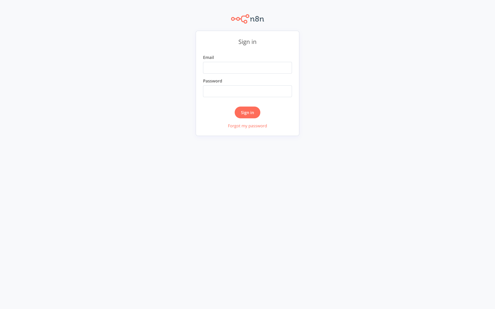
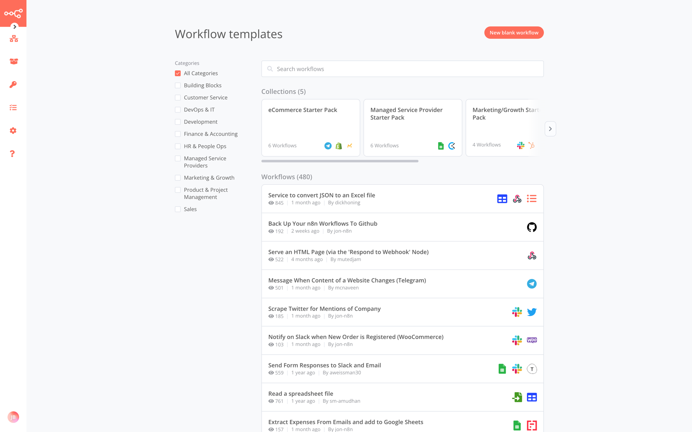

## Présentation

n8n est une solution NoCode open source d'automatisation des tâches, alternative à Zapier, Integromat ou IFTTT.

## Installation

### Prérequis

Déclarer une entrée DNS de type `CNAME` pointant vers votre serveur sous Træfik.

```text
n8n.mon-serveur.jbuget.fr. CNAME mon-serveur.jbuget.fr.
```

### Mise en œuvre

Créer le répertoire `~/services/n8n`.

**~/services/n8n/docker-compose.yml** :
```yaml
version: '3'

services:
  db:
    image: postgres:14.2
    restart: always
    volumes:
      - db:/var/lib/postgresql/data
      - ./init-data.sh:/docker-entrypoint-initdb.d/init-data.sh
    env_file:
      - config.env
    networks:
      - default

  app:
    image: n8nio/n8n
    restart: always
    links:
      - db
    depends_on:
      - db
    volumes:
      - n8n:/etc/shlink
      - ~/.n8n:/home/node/.n8n
    env_file:
      - config.env
    networks:
      - default
      - web
    # Wait 5 seconds to start n8n to make sure that PostgreSQL is ready
    # when n8n tries to connect to it
    command: /bin/sh -c "sleep 5; n8n start"
    labels:
      - "traefik.enable=true"
      - "traefik.docker.network=web"
      - "traefik.http.routers.n8n.rule=Host(`n8n.mon-serveur.jbuget.fr`)"
      - "traefik.http.routers.n8n.entrypoints=websecure"
      - "traefik.http.routers.n8n.tls.certresolver=myresolver"
      - "traefik.tcp.routers.n8n.tls.passthrough=true"
      - "traefik.http.services.n8n.loadbalancer.server.port=5678"

volumes:
  db:
  n8n:

networks:
  default:
  web:
    external:
      name: web
```

**~/services/n8n/config.env** :
```text
POSTGRES_USER=replace_me
POSTGRES_PASSWORD=replace_me
POSTGRES_DB=n8n
POSTGRES_NON_ROOT_USER=replace_me
POSTGRES_NON_ROOT_PASSWORD=replace_me
N8N_BASIC_AUTH_USER=replace_me
N8N_BASIC_AUTH_PASSWORD=replace_me
```

**~/services/n8n/init-data.sh** :
```shell
#!/bin/bash
set -e;


if [ -n "${POSTGRES_NON_ROOT_USER:-}" ] && [ -n "${POSTGRES_NON_ROOT_PASSWORD:-}" ]; then
psql -v ON_ERROR_STOP=1 --username "$POSTGRES_USER" --dbname "$POSTGRES_DB" <<-EOSQL
CREATE USER ${POSTGRES_NON_ROOT_USER} WITH PASSWORD '${POSTGRES_NON_ROOT_PASSWORD}';
GRANT ALL PRIVILEGES ON DATABASE ${POSTGRES_DB} TO ${POSTGRES_NON_ROOT_USER};
EOSQL
else
echo "SETUP INFO: No Environment variables given!"
fi
```

```shell
$ docker-compose up -d
```

> 💡 Notez la création du répertoire ~/.n8n (lien symbolique vers le répertoire interne utilisé par le conteneur n8n).  

## Résultat

Visiter https://n8n.mon-serveur.jbuguet.fr.




