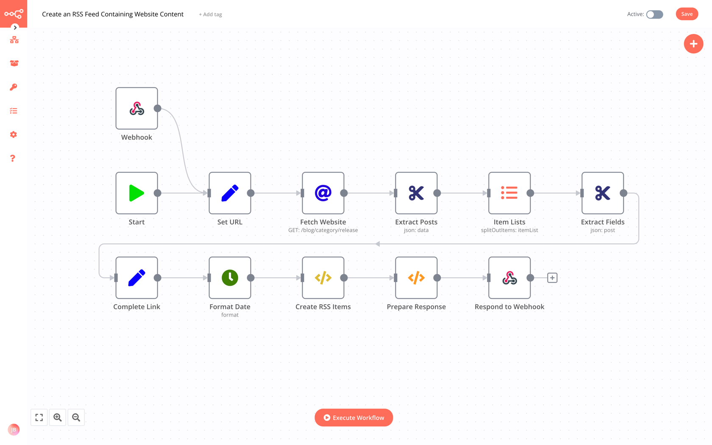
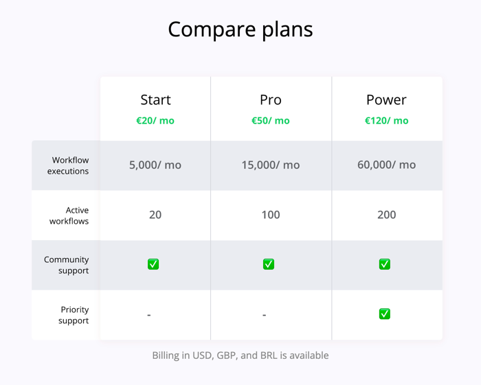
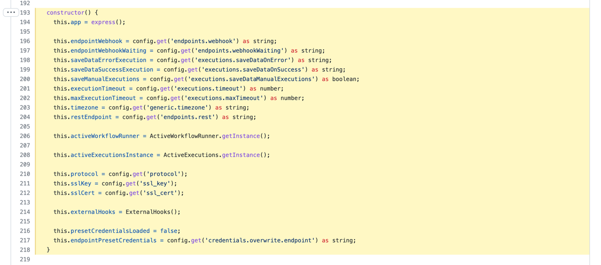
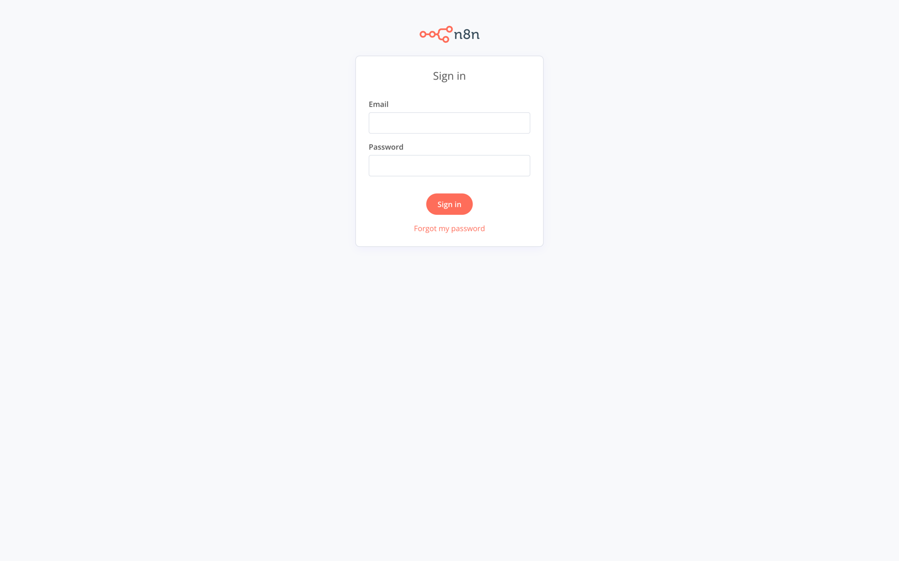
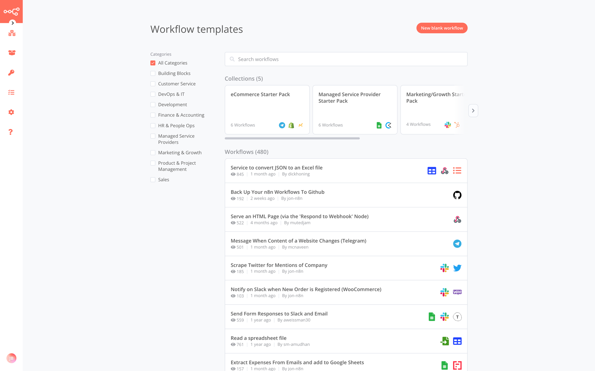

## TLDR

[**n8n**](https://n8n.io) est une solution open source d'automatisation des tâches via un éditeur de workflows. Au même titre que Zapier, IFTTT ou Integromat, ses concurrents privés et payants leaders du marchés, n8n est souvent catégorisé dans les outils Low-Code. Il reste toutefois possible de développer ses propres connecteurs, via les connecteurs proposés ou directement dans le code source.   

## Présentation

En général, je préfère ne pas me prendre la tête avec les services et outils dont j'ai besoin ou qui me sont pratiques au quotidien. 
Malheureusement, pour ce qui concerne l'automatisation de tâches et processus interopérés (CRON, interconnexions de SI ou d'API), je n'ai pas trouvé chaussure à mon pied.
Soit les solutions sont payantes, soit je suis méfiant de l'usage qui est fait de mes données ou des _credentials_ + autorisations demandées.

> Dans un contexte professionnel, je n'ai pas de mal à (faire) payer pour des services qui améliore mon quotidien ou celui de l'équipe. L'expérience me montre que c'est même souvent plus sérieux, efficace et rentable de le faire. 
> 
> Mais pour un usage personnel, je préfère me passer du service que de lâcher un abonnement au destin rarement pérenne.

[**n8n**](https://n8n.io) est une solution NoCode open source d'automatisation des tâches, alternative à Zapier, Integromat ou IFTTT.


n8n est un outil d'automatisation des tâches.
Il se présente sous la forme d'un CLI accompagné d'un éditeur graphique de _workflows_.

Un usage typique consiste à initier un nouveau Workflow, à partir d'un Template, dans lequel on va déclarer et brancher ensemble des Nodes, qui peuvent être de 2 types (Regular pour des traitements ou de la logique technique/métier ou Trigger pour des déclencheurs d'évènements)



Pour chaque workflow, n8n propose un cycle de vie et différents statuts ou propriétés du workflow (draft/published, activated/disabled, etc.). 

Exemples de cas d'usage :
- une tâche qui se lance toute les 30s et qui vérifie la présence en ligne d'un site ; en cas de problème un mail ou un message Slack est envoyé
- un job qui écoute un Webhook d'un service d'hébergement de sites et qui, à chaque nouveau déploiement, émet un commentaire sur le projet GitHub
- un CRON qui récupère toutes les minutes les messages d'un utilisateur posté sur Twitter et qui les publie, si besoin, sur Mastodon

> 💡 Depuis le 17 mars 2022, n8n est passé d'une licence Apache 2.0 Commons Clause, à leur propre licence baptisée "**Sustainable Use License**".
> [La page de documentation](https://docs.n8n.io/reference/faq.html#license) à ce propos est très intéressante à lire.
> 
> Dans les grandes lignes : il est possible d'utiliser n8n pour un usage personnel ou même professionnel, à condition de rester dans une utilisation interne ou non-commerciale.
> Il est possible d'utiliser n8n pour synchroniser des API internes ou même connectées avec des API partenaires.
> En revanche, il est interdit de donner directement accès via paiement à l'instance de n8n.
> De même, il est interdit de proposer un service tarifé qui proposerait un mécanisme one-click permettant de générer un workflow pour un _client_
> 
> Si vous désirez utiliser n8n pour ce type d'usage, il est toujours possible de contacter l'éditeur et de contractualiser un agrément particulier.

Parmi les features qui retiennent mon intention :
- n8n propose (enfin!) une gestion des utilisateurs avec connexion ; ça a longtemps été le point qui a freiné mon adoption (même s'il était possible de mettre des "trucs" en amont)
- n8N propose un catalogue grandissant de workflows et templates ; on reste cependant très loin de ce que propose aujorud'hui IFTTT ou Zapier
- l'interface est fonctionnelle et agréable à utiliser, même si certains fonctionnalités pourraient être mieux présentées à mon sesn (ex : les logs d'exécutions)
- la prise en main n'est pas trop compliquée pour un développeur back-end, habitué de ce genre d'outils et problématiques
- bien qu'étant considéré come un outil Low-Code, on y trouve tout le nécessaire pour coder les fonctionnalités, connexions ou logiques avancées ou particulières

Pour finir, n8n propose [une version SaaS](https://n8n.cloud) de leur produit.
Personnellement, je trouve le pricing vraiment cher.
D'où ma préférence pour en faire un service managé de mon infra (en plus d'avoir le contrôle des données et flux).



## Installation

Dans cette partie, nous allons voir comment utiliser notre [infrastructure à base de VPS + Træfik + Docker Compose](http://localhost:1313/posts/h%C3%A9berger-ses-propres-services-manag%C3%A9s-sur-un-vps-avec-traefik-et-docker-compose/part-1/) pour installer, configurer et exposer notre propre instance de n8n.

### Étude de la solution

J'ai cherché rapidement, mais je n'ai pas trouvé de schéma ou document d'architecture.
Il va falloir creuser [la doc](https://docs.n8n.io/getting-started/installation/docker-quickstart.html), [les repositories](https://github.com/n8n-io) et le code source pour se faire une idée du type de logiciel auquel on a affaire.

Pour commencer, **n8n propose tout le nécessaire pour faire tourner la plateforme dans du [Docker](https://hub.docker.com/r/n8nio/n8n)**.
{.pros}

Je commence par m'intéresser au matériel Docker Compose.
n8n propose 2 exemples : une avec SSL et l'autre sans.
Surprise ! La version avec SSL embarque un conteneur Træfik ! Rigolo.

Dans la mesure où je gère moi-même ma propre instance de Træfik, je pense que je vais plutôt opter pour l'autre configuration, sans le SSL.
Comme son nom l'indique - [withPostgres](https://github.com/n8n-io/n8n/tree/master/docker/compose/withPostgres) - celle-ci embarque une base PostgreSQL et une instance d'image Docker n8n.

À ce stade, j'ai le sentiment que **l'archi est vraiment simple**.
C'est une bonne nouvelle.
{.pros}

Pour m'en assurer, je passe à l'analyse de l'image Docker.
Je me concentre sur l'[image Docker principale](https://github.com/n8n-io/n8n/blob/master/docker/images/n8n/Dockerfile).
Celle-ci me confirme que l'architecture générale est basique, et c'est tant mieux #LessIsMore.
Le gros du traitement consiste à récupérer [le package npm de n8n](https://www.npmjs.com/package/n8n) dans sa bonne version.
Mais nous ne sommes jamais à l'abri d'une déconvenue #LesJoiesDuCode.
Alors je décide de creuser encore un peu plus.

Les points d'entrée à ma connaissance de n8n sont l'éditeur Web ou le CLI.
Je pars du principe qu'il me sera plus facile de comprendre et explorer le code relatif au CLI.
Et effectivement, assez rapidement, je tombe sur un bout de code qui permet de [lancer un serveur Express](https://github.com/n8n-io/n8n/blob/783c8e67f40969f6458c9474e0b5214cc26458ff/packages/cli/src/WebhookServer.ts).
Au passage, on note que le projet est développé en TypeScript #curiosité.



On sait désormais qu'on devra gérer / configurer un serveur Web, avec un port exposé.
Vu qu'on est sur un serveur Node.js, je ne m'attends pas à ce qu'il y ait de serveur Web en frontal (NGINX, Apache Web Server, HAProxy).
La preuve, c'est que les 2 configurations Docker Compose proposées ne proposent rien de tout ça (rappel : Træfik est un reverse proxy, pas un server Web à proprement parlé).

Je pense disposer du minimum d'éléments utile pour passer à la suite : la définition du fichier `docker-compose.yml`.

### Prérequis

[Comme d'habitude](/posts/héberger-ses-propres-services-managés-sur-un-vps-avec-traefik-et-docker-compose/part-3/#procédure), et avant toute chose, la première consiste à déclarer une entrée DNS de type `CNAME` pointant vers votre serveur sous Træfik.

```text
n8n.mon-serveur.jbuget.fr. CNAME mon-serveur.jbuget.fr.
```

### Mise en œuvre

Sur mon VPS, je crée le répertoire `~/services/n8n`.

Ensuite, je récupère les ressources contenues dans le matériel Docker Compose "[n8n/docker/compose/withPostgres/](https://github.com/n8n-io/n8n/tree/783c8e67f40969f6458c9474e0b5214cc26458ff/docker/compose/withPostgres)".

Je modifie le fichier Compose pour ajouter les labels Træfik pour le routage sécurisé :

**~/services/n8n/docker-compose.yml** :
```yaml
version: '3'

services:
  db:
    image: postgres:14.2
    restart: always
    volumes:
      - db:/var/lib/postgresql/data
      - ./init-data.sh:/docker-entrypoint-initdb.d/init-data.sh
    env_file:
      - config.env
    networks:
      - default

  app:
    image: n8nio/n8n
    restart: always
    links:
      - db
    depends_on:
      - db
    volumes:
      - n8n:/etc/shlink
      - ~/.n8n:/home/node/.n8n
    env_file:
      - .env
    networks:
      - default
      - web
    # Wait 5 seconds to start n8n to make sure that PostgreSQL is ready
    # when n8n tries to connect to it
    command: /bin/sh -c "sleep 5; n8n start"
    labels:
      - "traefik.enable=true"
      - "traefik.docker.network=web"
      - "traefik.http.routers.n8n.rule=Host(`n8n.mon-serveur.jbuget.fr`)"
      - "traefik.http.routers.n8n.entrypoints=websecure"
      - "traefik.http.routers.n8n.tls.certresolver=myresolver"
      - "traefik.tcp.routers.n8n.tls.passthrough=true"
      - "traefik.http.services.n8n.loadbalancer.server.port=5678"

volumes:
  db:
  n8n:

networks:
  default:
  web:
    external:
      name: web
```

> 💡 Je note la création et la liaison du répertoire ~/.n8n. À l'occasion et par curiosité, j'irai jeter un œil.

**~/services/n8n/.env** :
```text
POSTGRES_USER=replace_me
POSTGRES_PASSWORD=replace_me
POSTGRES_DB=n8n
POSTGRES_NON_ROOT_USER=replace_me
POSTGRES_NON_ROOT_PASSWORD=replace_me
N8N_BASIC_AUTH_USER=replace_me
N8N_BASIC_AUTH_PASSWORD=replace_me
```

**~/services/n8n/init-data.sh** :
```shell
#!/bin/bash
set -e;


if [ -n "${POSTGRES_NON_ROOT_USER:-}" ] && [ -n "${POSTGRES_NON_ROOT_PASSWORD:-}" ]; then
psql -v ON_ERROR_STOP=1 --username "$POSTGRES_USER" --dbname "$POSTGRES_DB" <<-EOSQL
CREATE USER ${POSTGRES_NON_ROOT_USER} WITH PASSWORD '${POSTGRES_NON_ROOT_PASSWORD}';
GRANT ALL PRIVILEGES ON DATABASE ${POSTGRES_DB} TO ${POSTGRES_NON_ROOT_USER};
EOSQL
else
echo "SETUP INFO: No Environment variables given!"
fi
```

Je lance la stack.

```shell
$ docker-compose up -d
```

Je vérifie les logs.

```shell
$ docker-compose logs -f
```

Tout semble ok.
Le script d'initialisation de la base de données s'est bien exécuté.

Je redémarre mon instance de Træfik pour être sûr qu'il prenne en compte les nouveaux conteneurs et génère le certificat SSL Let's Encrypt.

```shell
cd ~/traefik
docker-compose restart
```
Je visite mon service en ligne https://n8n.mon-serveur.jbuget.fr.
🎉 It works!





## Conclusion

Nous disposons désormais d'une magnifique instance de n8n, la solution open source Low-Code alternative de IFTTT, Zapier et consorts, qui se développe rapidement.
Nous pouvons à présent automatiser toutes les tâches et process que l'on souhaite.
Il ne reste plus qu'à trouver lesquelles 😅

## Liens
- [n8n docs](https://docs.n8n.io/) #documentation 🇬🇧
- [GitHub n8n](https://github.com/n8n-io/n8n) #documentation 🇬🇧
- [Premiers pas avec n8n : l'automatisation en mode open-source](https://www.youtube.com/watch?v=tANxPGSmB6Q) #vidéo 🇫🇷
- [Introduction to n8n](https://www.youtube.com/watch?v=AcgkvxismG0) #vidéo 🇬🇧

