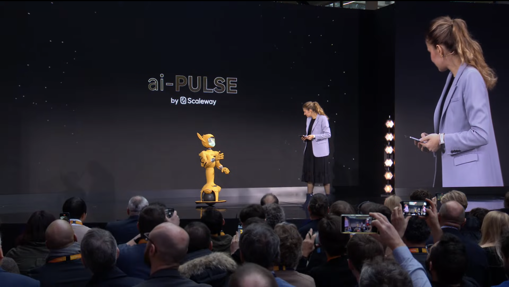
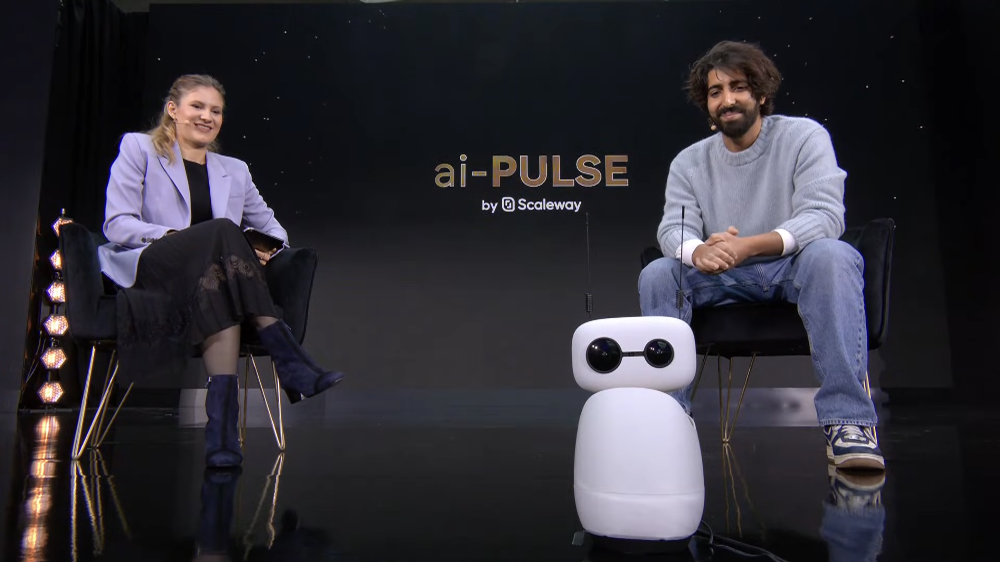
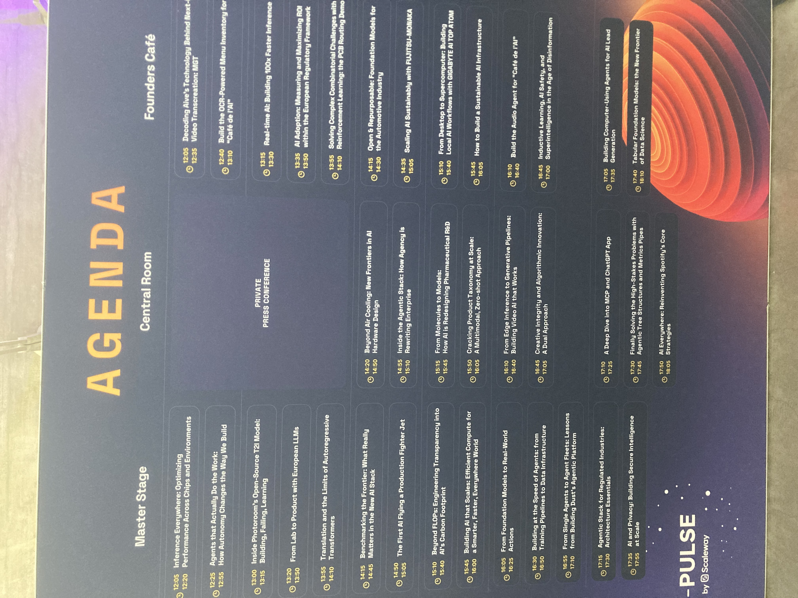
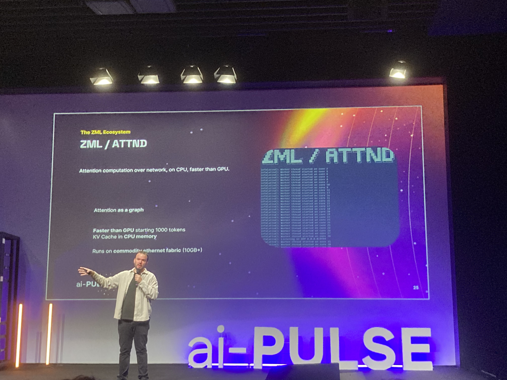
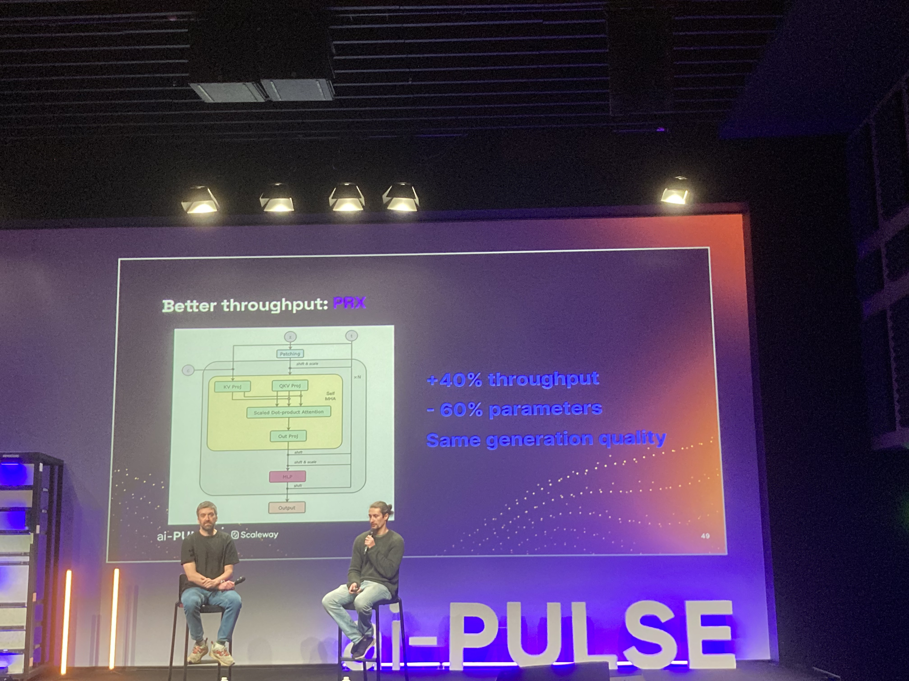

## ai-PULSE 2025 : la conférence IA européenne

Cette année, j’ai eu la chance d’assister, pour la première fois, à la conférence ai-PULSE, organisée par Scaleway dans les locaux de l’incubateur de startups Station F, à Paris. Il s’agit d’un évènement d’envergure européenne,  dédié à l’IA sous toute ses formes, dans tout ce qu’elle permet et pour tout ce qu’elle implique. Toutes les sessions sont en anglais, avec des speakers, en solo / duo / trio / plus de tous horizons.

Au programme, près d’une trentaine de talks, de 15 à 35mn, qui s’enchaînent tout au long de la journée, de 10h00 à 17h30, avec tout juste 30mn de pause à 11h00. Le rythme était vraiment très intense. Trop pour moi. J’ai commencé à décrocher à partir de 14h30, le temps d’aller déjeuner dans le coin. Je me suis refait une petite session groupée de 15h30 à 17h30, avant de décamper (le foot du jeudi soir n’attend pas). J’ai donc raté, à contre-cœur, la keynote de fermeture et le pot de fin de journée.

Globalement, j’ai trouvé l’évènement très bien organisé, avec des bons sujets d’actualité, des speakers intéressants à suivre, pertinemment bien catégorisés. Après, entendre parler d’IA et de robotique pendant toute une journée, à la fin, ça fait quand beaucoup. Aussi, pour une fois, je suis allé seul à une conférence et je n’ai retrouvé aucune connaissance sur place, ce qui fait que je n’ai pas pu partager et me suis senti un peu perdu ou esseulé à certains moments.

> ❤️ Dans tous les cas, un immense merci à Scaleway et en particulier Erwann pour l’invitation. Je sors de cet évènement sur l’IA avec finalement pas mal d’optimisme sur l’état de nos forces et compétences européennes sur le sujet, et des idées plus fraîches, plus claires et actionnables par rapport à mon quotidien professionnel et personnel.

## Résumé des conférences auxquelles j’ai assistées

### Keynotes d’ouverture — Yann Le Cun & Pim de Witte

La journée a débuté par une courte introduction de Xavier Niel, PDG du Groupe Iliad, auquel appartient Scaleway, l’organisateur principal de l’évènement. Rapidement, celui-ci a passé la main à Aude Durand, CEO adjointe du Groupe iliad, qui a – excellemment bien – animé les différentes interventions lors des keynotes de la matinée.

<iframe width="560" height="315" src="https://www.youtube.com/embed/xsQ-8_Ajd04?si=qeQYb_RtyhAdCso1" title="YouTube video player" frameborder="0" allow="accelerometer; autoplay; clipboard-write; encrypted-media; gyroscope; picture-in-picture; web-share" referrerpolicy="strict-origin-when-cross-origin" allowfullscreen></iframe>

La première conférence était une interview en binôme avec Yann Le Cun et Pim de Witte. Le premier, personnage historique imminent dans le domaine de l’IA, considéré comme l’un de ses pères fondateurs, a quitté tout récemment Meta (société mère de Facebook), dont il ne partageait plus la vision stratégique sur le sujet, pour se consacrer à la voie des “world models”. Le second est un ingénieur et entrepreneur tech, CEO et co-fondateur de General Intuition, une startup AI suisse dont l’idée est d’exploiter l’IA dans le monde du jeu vidéo : RAG avec des NPC / PNJ, doublage automatique, génération procédurale avancée, optimisation de calcul de frames / rendu graphique, etc.

Yann Le Cun a partagé sa vision sur le plafond de verre des LLM et d’une IA basé essentiellement sur le texte, alors que le monde réel exploite tellement plus, notamment, le visuel dans sa globalité, pas juste des symboles. Pim a renchérit en affirmant que “la prochaine génération d’IA devra comprendre les pixels avant de comprendre les mots”. Cela implique des architectures nouvelles, capables de modéliser la physique, l’espace, les interactions, plutôt que de prédire du texte “à la chaîne”.

Yann a rappelé deux phénomènes importants : 

- les modèles chinois sont aujourd’hui les plus avancés
- l’open-source reste indispensable pour attirer les talents et faire progresser l’état de l’art

Aude l’a interrogé sur son nouveau projet post-Meta, autour des world models. Yann a annoncé qu’il s’appelait AMI – pour Advanced Machine Intelligence (prononcé “ami”, clin d’œil assumé) – sans rentrer dans le détail de ce que ça allait donner concrètement. J’avoue être déçu et frustré de ne pas en avoir appris plus.

Pim de Witte, dans la continuité, a insisté sur la nécessité de sortir d’une logique de “boîte noire” purement textuelle pour aller vers des agents qui perçoivent, interprètent et interagissent avec leur environnement.

Un premier talk qui a parfaitement lancé la journée.

### Aude et Miraka — une petite scène qui en dit long

Juste après, nous avons assisté à une petite scènette entre [le robot Miraka](https://enchanted.tools/characters) et Aude, l’animatrice des keynotes. Ce n’était pas une keynote, plutôt un interlude, mais cela a eu le mérite de rendre tangible un point important : les agents IA sont en train de quitter l’écran pour entrer dans l’espace physique.

Une tendance que plusieurs speakers développeront ensuite.

### Jérôme Monceaux — Enchanted Tools

Juste après, Jérôme Monceaux, CEO d’Enchanted Tools, figure historique de la robotique française et papa des robots Mirakaï (dont le fameux Miraka), a expliqué comment ils conçoivent des robots réellement utiles, acceptables et adoptables.

Quelques points m’ont marqué :

- ils n’ont pas doté leurs robots de jambes volontairement : cela rend le mouvement plus fluide, plus stable, moins inquiétant ;
- leur design vise à être mignon et rassurant, parce qu’un robot “efficace mais froid” ne fonctionne pas en contexte réel ;
- leur partenariat avec Google DeepMind souligne le sérieux du projet ;
- les premiers usages concrets sont en gériatrie et en pédiatrie, dans des environnements hospitaliers très standardisés — un atout pour la robotique.

L’exemple de Miroka, qui accompagne des enfants atteints de cancer dans les salles de scanner (où aucun adulte ne peut rester pendant l’examen), était très parlant et intéressant. Dans un contexte oppressant, la présence d’un être à l’apparence et aux interactions rassurantes, bienveillantes, “amicales”, rend l’expérience plus supportable et moins traumatisante. Par ailleurs, le fait d’avoir un assistant capable de relayer et d’accomplir des actions directement dans la pièce, donne des possibilités supplémentaire à l’équipe soignante et la rend plus efficace. L’utilisation la plus humaine de l’IA est parfois la plus simple.

### Damien Lucas — Scaleway

Damien Lucas, CEO de Scaleway, a déroulé les annonces stratégiques de l’année.

Le message global : « Bring AI to the data », c’est-à-dire rapprocher les modèles de l’endroit où les données vivent.

Parmi les annonces :

- nombreuses nouvelles fonctionnalités depuis ai-PULSE 2024 ;
- intégration de solutions de quantum computing (Quandela, Pasqal, IQM) ;
- nouvelle puce GPU B3000 ;
- Model-as-a-Service : inférence managée, API génératives ;
- partenariat renforcé avec Hugging Face ;
- participation à un consortium européen, AION, pour structurer la filière IA.

L’ensemble va dans le sens d’un cloud IA souverain, performant, ouvert, européen, ce qui me parle particulièrement, dans mon contexte professionnel.

### Rémi Cadène — UMA

Rémi Cadène, ancien de Tesla (autopilot), a présenté [UMA](https://uma.bot/) – Universal Mechanical Assistance, une nouvelle entreprise robotique lancée cette année à Paris.

Son pitch était clair : conduire n’est qu’un sous-ensemble des comportements humains, et l’on peut généraliser l’approche à d’autres tâches nécessitant des micro-décisions très rapides.

Leur enjeu principal : la déxtérité, qui reste l’un des plus grands défis de la robotique.

On sent une forte inspiration “Tesla-like” :

- focus sur la donnée humaine ;
- importance du hardware robuste ;
- conception d’un corps agile et sûr ;
- forte culture open source.

Selon lui, l’Europe est le meilleur marché possible pour ce type de technologie, grâce à son histoire industrielle, ses talents, et sa culture du partage. Un discours rare et stimulant.

### Neels Gado — Gradium (spin-off KYUTAI)

En 2023, lors de la toute première occurence de ai-PULSE, Xavier Niel, Rodolphe Saadé (CMA-CGM) et Eric Schmidt (ex-PDG de Google) ont annoncé [la création de KYUTAI](https://www.iliad.fr/fr/actualites/article/lancement-de-kyutai-le-1er-laboratoire-de-recherche-europeen-independant-dedie-a-l-open-science-en-ia-co-fonde-par-le-groupe-iliad-cma-cgm-et), le premier laboratoire de recherche européen indépendant dédié à l’open science en Intelligence Artificielle.

Malgré l’annonce en grandes pompes, les nouvelles et projets ont depuis été plutôt rares ou discrèts : 

- lancement de Moshi, une IA vocale open source (été 2024), décrit comme le “premier assistant vocal vraiment naturel” issu de leur recherche ; Moshi ne se contente pas de transcrire–traiter du texte, mais “écoute” la voix, comprend l’intonation, les émotions, les nuances, et peut répondre “vocalement” — promettant une interaction beaucoup plus fluide et humaine qu’un simple chatbot texte ↔ voix
- la présentation et publication d’une version light de leur modèle d’IA Helium, un modèle multilingue (français, anglais, allemand, italien, espagnol, portugais) calibré pour fonctionner plus efficacement, potentiellement même sur un smartphone ou un appareil peu puissant.  

Lors de cet ai-PULSE 2025, Neels a annoncé la création d’une entreprise spin-off – [Gradium](https://gradium.ai/) – dont le but est d’exploiter les recherches autour de la voix et les industrialiser pour pouvoir développer et exploiter de vrais produits à visée commerciale.

Les applications évoquées portent sur des agents vocaux pour le jeu vidéo, la prise de commande optimisée dans la restauration ou des assistants personnels.

L’intervention de Neels s’est conclue avec une démonstration en live – très convaincante ! – de Moshi, doté d’une corps robotique physique spécialement pour l’occasion. 

Avant de nous quitter, Neels a ajouté des axes de progrès sur lesquels ils travaillent actuellement :

- toujours plus de rapidité de réponse pour de meilleures interactions
- la compréhension émotionnelle (actuellement très limitée : dire “mon chien est malade” et recevoir “oh c’est super !” reste un classique…).

Il a souligné un autre problème auquel on ne pense pas tout de suite : la gestion du son de la foule, très compliquée pour l’IA vocale.

## Résumé de conférences

Il s’agissait de la dernière keynote généraliste de la matinée. La suite de la conférence a consisté à enchaîner des sessions de 15-30mn sur des sujets beaucoup plus précis et pointus. 

Il y en avait “beaucoup” ! J’ai rarement vu un programme aussi dense et chargé. Le tout, exclusivement en anglais. Impossible de tout suivre, surtout qu’il y avait aussi des ateliers et animations sur le reste du salon. 

Ci-dessous, petit résumé des sessions qui m’ont le plus marquées.

### Inference Everywhere : optimizing performance

Je suis arrivé en cours de route et je dois avouer que le sujet m’a un peu échappé. 

J’ai compris que ça parlait de [ZML](https://zml.ai/), une sorte d’alternative à Ollama, plus performante grâce à une représentation et l’exploitation de graph, plutôt que du “brute force statistique”.

> En creusant un peu ZML, j’ai réalisé qu’il ne joue pas sur le même terrain qu’Ollama. Ollama, c’est avant tout une **runtime LLM “clé en main”**, pensée pour tester rapidement un modèle en local, bricoler un agent, prototyper une idée ou simplement utiliser un LLM chez soi. L’outil mise sur la simplicité : installation rapide, ergonomie soignée, zéro friction. ZML, à l’inverse, s’apparente plutôt à une **stack d’inférence complète**, conçue pour la production, capable de faire tourner des modèles variés — pas seulement des LLM — tout en optimisant finement le matériel sous-jacent. C’est une approche beaucoup plus bas niveau, presque “ingénierie système”. Pour en tirer parti, il faut accepter de compiler des modèles via Bazel, configurer les runtimes (GPU, TPU, etc.) et gérer toute la tuyauterie technique. Là où Ollama privilégie un usage immédiat, ZML s’adresse clairement aux équipes DevOps, infra ou R&D qui veulent un contrôle total, de la performance brute et une portabilité matérielle maximale

### Agents that actually do the work: how autonomy changes the way we build

Il s’agissait d’une table ronde entre Robert Rizk (Co-Founder & CEO de [Blackbox.ai](http://blackbox.ai/)), Benjamin De Almeida (CEO de [Socle.ai](http://socle.ai/)) et Ramine Roane (VP AI DevRel chez AMD), animée par Fred Bardolle (Head of Product, AI chez Scaleway).

Après une courte présentation des trois acteurs — [Blackbox.ai](http://blackbox.ai/) comme assistant de développement dopé à l’IA, [Socle.ai](http://socle.ai/) comme plateforme visant une IA souveraine, et AMD comme fournisseur matériel majeur — la discussion a rapidement tourné autour de trois thèmes : la souveraineté, la confiance, et les changements culturels induits par les agents autonomes.

Benjamin a insisté sur l’importance des questions de souveraineté, de confidentialité et d’infrastructure maîtrisée : avant même de parler “d’agents qui font des vraies choses”, il faut être capable de garantir où les données circulent, comment elles sont traitées et sous quelles conditions.

Robert a apporté une perspective plus “terrain”. Selon lui, il existe un véritable apprentissage culturel à mener pour travailler efficacement avec des agents. Non seulement les utilisateurs ne sont pas encore habitués à interagir avec des systèmes autonomes, mais les équipes techniques doivent aussi apprendre à ajuster leurs workflows. Il a également évoqué un point technique intéressant : dans un agent, il y a souvent beaucoup plus de tokens générés qu’on ne le voit — ceux utilisés pour raisonner, explorer, planifier — ce qui complexifie la compréhension du comportement réel de l’agent.

Côté [Blackbox.ai](http://blackbox.ai/), il a aussi rappelé qu’une partie du travail consiste à optimiser l’environnement virtuel local dans lequel évolue l’agent, afin qu’il ressemble le plus possible au monde réel. Plus l’environnement est riche et cohérent, plus l’agent peut agir de manière fiable.

Ramine, chez AMD, est revenu sur un cas très concret concernant les caméras en visioconférence : si un enfant apparaît à l’écran, son image peut être automatiquement transmise aux serveurs pour traitement, sans que l’utilisateur en soit conscient. Cela pose immédiatement des questions de design, de confiance et de conformité. Pour AMD, ces problématiques imposent une approche zero-trust de la communication — c’est-à-dire considérer que rien n’est implicitement sûr et que tout flux doit être contrôlé, chiffré, et vérifiable.

Globalement, cette table ronde a mis en lumière que construire “des agents qui font vraiment le travail” n’est pas seulement un défi technique. C’est aussi un enjeu humain, culturel et architectural : comment garantir la souveraineté, inspirer la confiance, et fournir aux agents des environnements suffisamment réalistes pour qu’ils puissent agir de manière fiable et prédictible ?

### Inside Photoroom’s Open-Source T2I model

Photoroom est une entreprise française spécialisée dans l’édition d’images augmentée par l’IA, connue surtout pour son application mobile et web permettant de retoucher des photos automatiquement, notamment pour des usages e-commerce, marketing, réseaux sociaux ou créatifs.

Photoroom a présenté un travail particulièrement intéressant autour de la génération d’images. Leur équipe a [récemment open-sourcé un modèle T2I (text-to-image) pré-entraîné](https://www.photoroom.com/fr/inside-photoroom/open-source-t2i-announcement), pensé comme une alternative ouverte et européenne aux géants du secteur, type MidJourney. L’objectif est double : apprendre plus, mais surtout apprendre mieux.

Ce qui distingue leur démarche, c’est l’usage intelligent du RAG appliqué aux annotations d’images. Plutôt que de se contenter des légendes parfois approximatives de leurs datasets, ils s’appuient sur un pipeline de récupération d’information pour réécrire et enrichir les captions de chaque image. En clarifiant ce que contient réellement une image — objets, relations, contexte, nuances visuelles — ils permettent au modèle d’avoir une compréhension beaucoup plus fine de son corpus d’entraînement.

Résultat : un modèle qui ne génère pas seulement “des images jolies”, mais des images cohérentes, structurées et fidèles au prompt, car il a appris sur une base plus propre, mieux décrite et plus riche. Une démonstration bienvenue que, dans la course à l’IA générative, la qualité du dataset compte autant, sinon plus, que la taille du modèle lui-même.

### From lab to product with European voice model

Cette session, dédiée aux modèles vocaux européens, a rappelé une réalité que l’on oublie souvent : la voix est infiniment plus complexe que le texte. Là où un texte est neutre, universel, peu volumineux et facile à structurer, la voix dépend d’une multitude de facteurs : lieu, bruit, rythme, accent, ton, appareil, émotion, état de la personne qui parle… et même de l’état d’esprit du testeur lorsqu’il évalue la qualité du modèle. Résultat : la marge d’erreur perçue est beaucoup plus grande, parce que la voix est profondément humaine, subjective, et chargée d’émotions.

- Les intervenants ont aussi rappelé que, malgré son attrait “cool & sexy”, tous les cas d’usage ne nécessitent pas une interface vocale. La voix a des limites :
- elle ne permet pas de transférer rapidement beaucoup d’informations ;
dans un open-space, si tout le monde se met à parler à son assistant, c’est le chaos assuré ;
- elle induit des ambiguïtés et des attentes émotionnelles que les systèmes peinent encore à satisfaire.

Sur le plan technique, deux grandes architectures coexistent :

1. Speech → Text → Speech : la plus pragmatique, car elle réutilise l’écosystème déjà riche des modèles textuels.
2. Speech → Speech : plus élégante et plus naturelle, mais qui nécessite de réentraîner entièrement les modèles pour chaque usage, chaque langue, chaque variation. Beaucoup plus coûteux, beaucoup plus complexe.

Les chercheurs travaillent également sur des systèmes capables de basculer automatiquement entre un modèle local et un modèle cloud, en fonction de la question, du contexte ou du besoin utilisateur — un compromis intéressant entre confidentialité, performance et coût.

Un point important a été rappelé : comprendre la voix et produire de la voix sont deux compétences très différentes. La compréhension est de loin la plus difficile, car elle doit s’adapter à des situations, des personnes, des cultures et des dialectes extrêmement variés. Par exemple, détecter la langue au début d’une conversation est assez facile ; changer de langue en plein milieu l’est beaucoup moins.

Le volet culturel n’est pas anodin non plus : en Italie, par exemple, on refuse les voix “neutres”. On veut reconnaître une origine, un ancrage, une identité. Une voix n’est jamais juste une voix : c’est un signal social.

Enfin, les intervenants ont rappelé que le passage du laboratoire au produit impose de comprendre l’usage réel : un modèle vocal pour un standard téléphonique n’a rien à voir avec une interaction sur un salon, ni avec une commande vocale en voiture ou à la maison. Le métier, le contexte et l’environnement façonnent entièrement les exigences du système.

### From Foundation Models to Real-World Actions

Jean-Baptiste Kempf (CTO chez Scaleway), s’entretenait avec Firas Abi Farraj et Grégoire Linard, tous deux co-CTO chez Enchanted Tools, une startup française qui a pour ambition de créer une nouvelle génération de robots humanoïdes — les Mirokaï — combinant ingénierie de pointe, intelligence artificielle, robotique physique et design narratif / esthétique. Leur credo : apporter à la robotique non seulement de l’utilité, mais aussi du “merveilleux” — rendre les robots capables d’interagir avec les humains de façon intuitive, empathique, presque “magique” (cf. résumé keynote ci-dessus).

Enchanted Tools a ceci de particulier qu’ils ont 3 CTO qui cohabitent et co-lead l’entreprise. En réalité, c’est une organisation plutôt classique dans le domaine de la robotique, qui couvre énormément de domaines différents (hardware, software, data, IA, traitement du signal, perception, design d’interaction, etc.).

Les intervenants — dont ceux derrière les robots Miraki et Miraka, conçus pour des interactions sociales — ont insisté sur un point clé : ces robots permettent de comprendre “comment on utilise un robot” au quotidien. Pas seulement comment il se déplace ou reconnaît un objet, mais comment il s’intègre dans un contexte humain, dans des routines, dans une relation.

À partir de là, la discussion s’est recentrée sur ce que l’IA change réellement dans la robotique. Les progrès du deep learning, puis l’arrivée du reinforcement learning, ont permis aux robots d’être conscients de leur environnement, de raisonner sur des séquences longues et d’accomplir des tâches complexes. Avec l’IA moderne, un robot ne traite plus des actions de quelques secondes : il doit gérer des chaînes d’actions longues, avec de nombreuses dépendances et contraintes physiques.

Techniquement, les robots modernes s’appuient sur plusieurs couches de modèles :

- un modèle fondamental (foundation model) pour la vision et la compréhension générale,
- des modèles spécialisés, petits et embarqués, pour la perception fine, l’audio, la proprioception, la sécurité.
Cela ressemble à une architecture de type Mixture of Experts, répartie entre le cloud et l’onboard. Ces petits modèles locaux, peu gourmands, sont essentiels : plus rapides, plus sûrs et moins coûteux.

La dimension matérielle reste un défi : certains robots embarquent 2 GPU et plus de 20 CPU, avec un usage massif de CNN pour la vision. La majorité s’appuie encore sur l’écosystème NVIDIA. Mais les intervenants pensent que, d’ici cinq ans, nous disposerons de suffisamment de données pour entraîner des modèles embarqués plus efficaces et moins dépendants.

Enfin, ils ont insisté sur la distinction entre fonction et émotion. Beaucoup d’acteurs se concentrent sur les capacités — perception, manipulation, navigation — alors qu’un robot social doit aussi inspirer la confiance. Cette connexion émotionnelle repose autant sur le design (forme familière mais non réaliste) que sur le logiciel (adaptation au rythme et au style d’un enfant, d’un adulte, d’un senior).

Les robots sont également volontairement limités pour des raisons de sécurité : types d’objets qu’ils peuvent saisir, surfaces qu’ils peuvent emprunter, actions qu’ils peuvent engager, afin de minimiser les risques et garantir une interaction contrôlée avec le monde réel.

## Conclusion

En quittant ai-PULSE, j’ai surtout eu la confirmation que nous arrivons au bout d’un cycle : celui des LLM basés essentiellement sur le texte. Ils ont ouvert la voie, mais leur plafond est désormais visible. Pour aller plus loin, il faudra explorer d’autres dimensions — le visuel (images, vidéo, perception), la voix, l’espace, le physique, l’émotion, tout ce qui fait la richesse du monde réel et que le texte seul ne peut capturer.

J’ai aussi mesuré à quel point tout cela repose sur une évidence parfois sous-estimée : **il faut toujours plus de données**. Des données mieux décrites, mieux annotées, mieux contextualisées. Que ce soit pour la génération d’images, pour les modèles vocaux, pour les robots ou pour les agents, la qualité du corpus d’apprentissage fait toute la différence.

L’autre constat majeur, c’est que **l’IA redonne un second souffle à la robotique**. Pendant longtemps, les robots étaient essentiellement limités par leur perception : trop rigide, trop pauvre, trop fragile. L’IA moderne change complètement la donne. Désormais, ils peuvent exploiter simultanément un ensemble hétérogène de capteurs — vision, audio, proprioception, signaux physiques — et en tirer des comportements plus naturels, plus cohérents, plus sûrs. La robotique sort enfin de son “plafond de verre”.

Mais cela ne signifie pas que tout est résolu. Au contraire : nous avons encore énormément à apprendre sur ce qu’il faut faire, ne pas faire… et **ne jamais faire**. Les robots et l’IA ne seront acceptés que s’ils sont conçus avec lucidité : respect du contexte, compréhension des usages réels, sensibilité culturelle, capacité à créer de la confiance. L’adoption dépendra autant du design, de l’éthique et de la psychologie que de la technique.

Enfin — et c’est probablement ce qui m’a le plus marqué — nous avons, en Europe, **bien plus de ressources, de talents et de capacités réelles** que ce que les États-Unis ou la Chine aimeraient nous laisser croire. Entre la recherche ouverte (Kyutai), l’infrastructure souveraine (Scaleway), la robotique incarnée (Enchanted Tools, UMA), et les startups qui innovent sur des segments pointus (Photoroom, Gradium…), la dynamique est là. Solide. Vivante. Ambitieuse.

Une chose est sûre : nous n’avons pas fini d’entendre parler d’IA et de robotique. Pour le meilleur et pour le pire. Et personnellement, après cette journée, je me sens un peu mieux armé pour comprendre ce qui se joue… et pour contribuer, à mon humble niveau, à façonner la suite.
