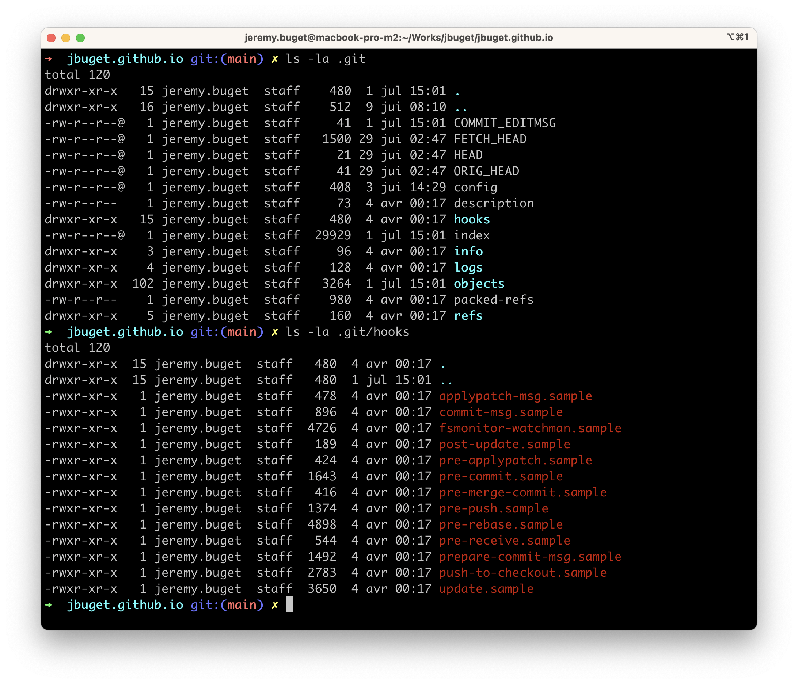

## Table des matières

- [Introduction](#introduction)
- [1. Comprendre Git et ce qu'est un conflit de fusion](#1-comprendre-git-et-ce-quest-un-conflit-de-fusion)
- [2. Organiser intelligemment les travaux en amont](#2-organiser-intelligemment-les-travaux-en-amont)
- [3. Modulariser suffisamment son code](#3-modulariser-suffisamment-son-code)
- [4. Travailler sur des branches séparées](#4-travailler-sur-des-branches-séparées)
- [5. Synchroniser son travail très souvent et régulièrement](#5-synchroniser-son-travail-très-souvent-et-régulièrement)
- [6. Résoudre les conflits rapidement](#6-résoudre-les-conflits-rapidement)
- [7. Faire des commits fréquents et atomiques](#7-faire-des-commits-fréquents-et-atomiques)
- [8. Mettre en place des outils de contrôle et formatage de code](#8-mettre-en-place-des-outils-de-contrôle-et-formatage-de-code)
- [9. Définir des standards, règles et normes d'équipes](#9-définir-des-standards-règles-et-normes-déquipes)
- [10. Automatiser les traitements ou contrôles via les hooks Git](#10-automatiser-les-traitements-ou-contrôles-via-les-hooks-git)
- [11. Mettre en place un pipeline d'intégration continue](#11-mettre-en-place-un-pipeline-dintégration-continue)
- [12. Communiquer, communiquer, communiquer](#12-communiquer-communiquer-communiquer)
- [Conclusion](#conclusion)

## Introduction

Lorsque l'on travaille sur un projet en équipe, il est courant de rencontrer des conflits d'édition ou fusion de code. C'est une situation tout à fait "normale" de Git.

Si le plus souvent, tout se passe très bien, la résolution de conflit reste un exercice délicat et dans certains cas, la situation peut rapidement déraper et [virer au cauchemar (pendant des heures, des jours, voire des mois)](/posts/techniques-pour-fusionner-deux-versions-d-un-projet-shopify-grace-a-git).

**La meilleure façon de traiter les conflits efficacement est de les éviter, les réduire ou les prévenir autant que possible.** Pour ce faire, il existe certaines techniques, bonnes pratiques, outils et autres astuces.

## 1. Comprendre Git et ce qu'est un conflit de fusion

C'est tout à fait basique, mais la première chose à faire pour éviter des conflits de Git est de comprendre *a minima* comment fonctionne le logiciel de gestion de versions et les concepts qu'il met en œuvre ou implémente : 
- l'aspect décentralisé via les *remotes* (distant et local),
- le suivi et indexation des modifications via la notion d'*areas* (working, staging, commited),
- la façon de modéliser des changements de code à travers les *commits*,
- la parallélisation de chantiers grâce au système de *branches*,
- etc.

Aussi, il est primordial de comprendre ce qu'est un conflit de fusion (aussi appelé "conflit de merge"), ce que cela signifie, pour quel scope, dans quelles circonstances il survient, quand, pourquoi et comment le résoudre ("`git rebase -i` mon ami pour la vie ❤️"), etc. 

Le site d'Atlassian fournit [une bonne explication](https://www.atlassian.com/fr/git/tutorials/using-branches/merge-conflicts) :

> Les conflits surviennent généralement lorsque deux personnes ont modifié les mêmes lignes dans un fichier, ou si un développeur a supprimé un fichier alors qu'un autre développeur le modifiait. Dans ces cas, Git ne peut pas déterminer automatiquement la version correcte. Les conflits n'affectent que le développeur qui effectue le merge, les autres membres de l'équipe ne sont pas conscients du conflit. Git marquera le fichier comme étant en conflit et arrêtera le processus de merge. Il incombe alors aux développeurs de résoudre le conflit.


Il existe plusieurs situations classiques, récurrentes ou banales qui peuvent entraîner l'apparition d'un conflit parmi lesquelles : 
- **modification concurrente** : quand plusieurs développeurs modifient la même ligne de code d'un même fichier et tentent de fusionner le changement sur une même branche ; quand on effectue un *cherry-pick de commit* et que les changements contenus dans celui-ci portent sur le même fichier ou ligne(s) de code
- **suppression de code / fichier** : quand un développeur supprime un fichier (ou une ligne), qu'un autre développeur a édité(e), et que chacun des deux cherchent à fusionner sa modification sur une même branche ;
- **déplacement ou renommage de fichier** : quand un développeur renomme ou déplace un fichier, pendant que dans le même temps, un autre développeur y a apporté des modifications
- **fusion de branches** : lorsqu'un développeur souhaite intégrer une branche sur une autre, toutes deux ayant subies des modifications aux mêmes endroits, ex : au moment de fusionner une pull / merge request (resp. GitHub/GitLab), opération consistant à réintégrer la branche Git correspondante sur la branche principale du repository (`main` ou `master`) ;
- **rebasage de branche** : lorsque l'on effectue une opération de *rebasage* ("action consistant à décaler une série de commits") sur une branche

Ce ne sont là que quelques situations. Il en existe beaucoup d'autres, plus contextuelles ou spécifiques. Je vous laisse et vous souhaite le plaisir de les découvrir par vous-mêmes 😂. *Indice : en général, ça se produit quand on on y est le moins apprêté / propice à gérer ces situations 😭…*

Il existe tout plein de ressources très bien faites (et en français), expliquant comment résoudre un conflit de Git. Je n'aborderai pas ce sujet dans cet article.

Le souci des conflits de code que je vois sont les suivants : 
- c'est une opération qui peut être compliquée, avec pour conséquence, si elle est n'est pas parfaite, d'introduire un bug ou une régression, ou de "perdre" une évolution ou fonctionnalité nouvellement ajoutée ;
- c'est ce qui la rend stressante ;
- d'autant plus qu'une telle situation intervient souvent à un moment inopportun. Ex : lorsque l'on voit le bout d'un chantier et qu'on ne souhaite qu'une chose, l'envoyer en validation (relecture de code, recette fonctionnelle). Ex : le matin, au moment de faire un rebasage routinier pour bien se lancer ("et mince ! je vais devoir perdre plusieurs minutes à me projeter sur le code des autres plutôt que juste reprendre où j'en étais la veille…")
- c'est un évènement qui vient interrompre "[l'état de flow](https://www.cairn.info/revue-staps-2008-1-page-9.htm)" dans lequel on se situe parfois et qui entraîne un fort changement de colntexte (a.k.a. "context switching"). C'est coûteux en temps, en énergie, en motivation.

## 2. Organiser intelligemment les travaux en amont

Les conflits de code proviennent de travaux plus ou moins parallèles, sur un même pans de code, plus ou moins étendu.

Quelque soit le méthode de développement ou de gestion de projet qui est la vôtre, il existe toujours une phase en amont de la tâche / fonctionnalité / chantier de projection et d'organisation du travail de l'équipe et des équipiers (ou prestataires ou partenaires).

Exemples de situations qu'il est possible d'éviter avec une organisation qui tient compte et tente de prévenir les conflits de code : 
- lancer et gérer 2 chantiers conséquents par 2 sous-traitants indépendants dont l'impact porte sur tout ou grande partie du code (encore une fois, cf. [cette expérience](/posts/techniques-pour-fusionner-deux-versions-d-un-projet-shopify-grace-a-git/))
- ajouter en continu des exigences ou critères d'acceptation à une MR / PR / branche ouverte depuis plusieurs semaines - les grosses branches qui durent sont une calamité
- planifier un sprint technique - *NDLA : plus le temps passe, mois je suis fan de ce type de tactique, approche ou initiative* -  mêlant l'upgrade majeure du framework principal de l'application tout en menant un refactoring conséquent

Au moment de la phase de planification des tâches, **se poser la question de l'intersection des modifications, fichiers, bouts d'application éventuellement impactés** peut économiser pas mal de ressources (et de soucis) à l'équipe. Je ne dis pas qu'il est toujours possible d'éviter tout conflit, mais le cas échéant, l'équipe est mieux armée et peut réagir plus rapidement, efficacement, sereinement.

## 3. Modulariser suffisamment son code

De ce que j'ai pu constater, les applications les plus modulaires ou modularisées comptent parmi celles qui permettent le mieux d'éviter les conflits de code.

La contre-partie, c'est que ça fait beaucoup d'abstractions, de packages, de modules, de répertoires, de fichiers (parfois très similaires) à tenir compte. Ça induit une "charge mentale". Cela peut être intimidant et long à appréhender pour des profils juniors ou des nouveaux membres de l'équipe.

L'intérêt des abstractions (interfaces, classes abstraires, wrapper, clients, etc.) c'est que ça pousse naturellement et en priorité les changements de code de l'équipe vers de l'ajout d'objets (fichiers, méthodes) plutôt que de la modification et la manipulation de l'existant.

Il vaut mieux travailler sur des fonctions de petites tailles, bien distinctes les uns des autres et restreintes à une même typololgie de traitements / instruction, plutôt que sur une même fonction de 100-200 lignes mêlant des vérifications d'arguments, des contrôles de permissions et accès, des calculs métiers avancés, du stockage, du formatage, etc.

Bref, **vive [les principes SOLID](https://fr.wikipedia.org/wiki/SOLID_%28informatique%29) (*) !**

> (*) À mon sens, les principes SOLID sont valables dans tous les styles ou paradgimes de programmation, pas juste la Programmation Orientée Objet.

## 4. Travailler sur des branches séparées

C'est la base. Les mécanismes et fonctionnalités autours de la gestion des branches sont un élément central de Git, la façon dont le logiciel est conçu et implémenté. Ce serait dommage de passer à côté.

Au-delà de la satisfaction intellectuelle de comprendre et mettre en œuvre les concepts inhérents au branching Git, exploiter les branches permet de simplifier sensiblement la gestion des conflits de code.

**Mener des chantiers sur des branches parallèles permet d'éviter les conflits le temps de son développement.** Ce qui est déjà un avantage.

Ensuite, une fois qu'un développement est accompli, il est possible de *squash* les commits (rassembler plusieurs commits en un seul) pour n'avoir plus qu'un commit, et limiter là aussi le nombre de commits à confronter avec les autres branches et à gérer en cas de conflit.

Personnellement, je ne suis pas particulièrement fan de squasher les commits d'une branche. Je n'ai absolument rien contre. Il y a des "pour" et des "contre". C'est une simple question de goût personnel.

> **Edit. 06/07/2023** : [Stéphane](), un collègue chez BetaGouv, a évoqué la pratique "*[trunk-based development](https://www.atlassian.com/continuous-delivery/continuous-integration/trunk-based-development)*", qui fut son réflexe de pensée quand il a vu le titre de l'article. Effectivement, je n'en ai pas parlé.
>
> Ma raison : j'entends parler de trunk-based de temps en temps ces dernières années. Ça me rappelle le temps où je faisais du SVN et où on utilisait cette pratique. Je n'ai plus appliqué cette approche depuis que je suis passé à Git.
>
> Mon parti pris, c'est qu'une bonne gestion de branche est d'avoir des branches courtes et petites. Ça va dans mon approche d'avoir des US qui font 2-3 jours max de dev (hors review). (et du coup → #noestimate 🙌)
>
> Je trouve néanmoins important de le mentionner.


## 5. Synchroniser son travail très souvent et régulièrement

C'est la base d'une bonne hygiène Git : il faut rebaser très souvent et très régulièrement sa branche ou son code avec la branche principale.

À titre perso, je le fais **a minima tous les matins, sur chacune de mes branches** (en général, je n'en ai qu'une, mais lorsqu'elles sont petites, je peux en avoir plusieurs en parallèle). J'ai pris l'habitude ces dernières années de le faire aussi très souvent en fin de journée (dans le voyage du train).

Je préfère faire régulièrement des petits efforts, alors que je dispose de mes pleins moyens de concentration et motivation, plutôt que me prendre d'un coup une énorme charge imprévue, dans un moment et un état de relâchement (fin de tâche).  

## 6. Résoudre les conflits rapidement

Ce point s'inscrit dans la continuité du précédent.

En termes de gestion de conflits, il ne faut pas laisser une situation s'envenimer. C'est pareil avec Git. Plus on traîne à synchroniser une branche et résoudre les problèmes, plus ils vont s'accumuler et rendre la tâche compliquée, voire complexe et risquée.

## 7. Faire des commits fréquents et atomiques

Une façon de résoudre les commits simplement et rapidement est d'effectuer des commits de qualité - cf. [Qu'est-ce qu'un bon commit Git ?](/posts/qu-est-ce-qu-un-bon-commit-git).

Cela permet de fusionner et résoudre les conflits au fur et à mesure de l'avancement de votre travail.


## 8. Mettre en place des outils de contrôle et formatage de code

Mécaniquement, moins il y a de changements dans le code, moins il y a de conflits. Une façon efficace de prévenir les conflits est donc de faire en sorte que chacun et chaque poste respectent scrupuleusement les mêmes règles de formattage ou d'organisation du code. 

Il est très frustrant et gênant de faire un `git pull --rebase` ou de consulter les modifications de sa pull request et d'observer un paquet de changements sans intérêt tels que : ajout ou suppression de sauts de ligne, passage d'instruction sur plusieurs lignes, ajout ou suppression d'espaces, tabulations, points-virgules ou parenthèses, etc.

Il existe des outils pour garantir que la forme du code, a.k.a. "sa consistence",  est la même pour tous, et limiter ces désagréments : 
- [ESLint](https://eslint.org/) : outil d'analyse de code statique permettant d'identifier des erreurs dans du code JavaScript
- [Prettier](https://prettier.io/) : formateur de code *dogmatique*
- [Stylelint](https://stylelint.io/) : un linter CSS extensible qui assure une consistence de code CSS, SCSS, Sass et Less
- [EditorConfig](https://editorconfig.org/) : un fichier `.editorconfig` à mettre à la racine du projet et qui indique aux IDE (VScode, IntelliJ IDEA, etc.) quelles règles de formatage de code ils doivent suivre

> 💡 Tous ces outils proposent des plugins pour les principaux édtieurs de code du marché. Pour aller au bout de la démarche tout en améliorant son confort de confoort (raccourcissement de la boucle de feedback, etc.), je conseille que tous les membres d'une équipe les installent sur son poste respectif.

Liens : 
- https://blog.theodo.com/2019/08/empower-your-dev-environment-with-eslint-prettier-and-editorconfig-with-no-conflicts/

## 9. Définir des standards, règles et normes d'équipes

Bien que les outils de linting proposent par défaut une très grande quntité de règles, et malgré qu'il existe un nombre encore plus importants d'extensions ou modules qui se proposent de les compléter, il n'est parfois pas possible ou pertinent de déclarer une règle spécifique à son contexte.

Dans ce cas, et toujours en vue de limiter les conflits de code, le plus simple est de définir une règle d'équipe, à transmettre et vérifier le plus régulèrement possible.

Par le passé, avec une équipe, nous avons convenu que les imports suivraient l'ordre suivant : 
1. les dépendances vendors en premier
2. les dépendances du plus proche (nombre de `../`) à la plus éloignées
3. par ordre alphabétique

```javascript
import vendor1 from 'vendor'
import { method } from 'xyz'
import sameLayerModule from 'sameLayerModule'
import upperModule from '../upperModule'
import firstFarModule from '../../../firstFarModule'
import lastFarModule from '../../../lastFarModule'
```

Autre proposition de règle du même ordre : trier ses fonctions ou méthode par ordre alphabétique (ou pas typologie, ex : controller, vue, etc.) 

Ce type de règle permet de décider plus vite, en tant que développeur, où insérer un import. 

Par ailleurs, une telle répartition va naturellement diminuer le risque de voir du code inséré au même endroit. Et donc limiter les conflits.

> 💡 En vrai, concernant l'ordre alphabétique, il existe une règle ESLint : [`sort-imports`](https://eslint.org/docs/latest/rules/sort-imports). Mais pour l'ordre par "éloignement", je n'ai encore rien trouvé.

## 10. Automatiser les traitements ou contrôles via les hooks Git

Git propose un mécanisme appelé "[Git hooks](https://git-scm.com/book/en/v2/Customizing-Git-Git-Hooks)" qui permet de définir et exécuter des traitements automatisés lors de certaines étapes ou phases importantes de sa gestion de source.

Pour ce faire, il convient de définir des scripts shell (ou Perl, Python, etc. à préciser en première ligne du script, avec le `#!`) dans le répertoire `.git/hooks` à la racine du projet.



> ⚠️ Les scripts doivent être exécutables. Il faut donc bien penser à leur accorder les droits nécessaire (via `chmod +x`).

Exemple de script hook avec le fichier **.git/hooks/pre-commit.sample** : 

```shell
#!/bin/sh
#
# An example hook script to verify what is about to be committed.
# Called by "git commit" with no arguments.  The hook should
# exit with non-zero status after issuing an appropriate message if
# it wants to stop the commit.
#
# To enable this hook, rename this file to "pre-commit".

if git rev-parse --verify HEAD >/dev/null 2>&1
then
	against=HEAD
else
	# Initial commit: diff against an empty tree object
	against=$(git hash-object -t tree /dev/null)
fi

# If you want to allow non-ASCII filenames set this variable to true.
allownonascii=$(git config --type=bool hooks.allownonascii)

# Redirect output to stderr.
exec 1>&2

# Cross platform projects tend to avoid non-ASCII filenames; prevent
# them from being added to the repository. We exploit the fact that the
# printable range starts at the space character and ends with tilde.
if [ "$allownonascii" != "true" ] &&
	# Note that the use of brackets around a tr range is ok here, (it's
	# even required, for portability to Solaris 10's /usr/bin/tr), since
	# the square bracket bytes happen to fall in the designated range.
	test $(git diff --cached --name-only --diff-filter=A -z $against |
	  LC_ALL=C tr -d '[ -~]\0' | wc -c) != 0
then
	cat <<\EOF
Error: Attempt to add a non-ASCII file name.

This can cause problems if you want to work with people on other platforms.

To be portable it is advisable to rename the file.

If you know what you are doing you can disable this check using:

  git config hooks.allownonascii true
EOF
	exit 1
fi

# If there are whitespace errors, print the offending file names and fail.
exec git diff-index --check --cached $against --
```

Utiliser les hooks Git permet de limiter les conflits de code en automatisant les traitements tels que l'exécution des tests automatisés, les contrôles de linting et de formatage, etc.

> ⚠️ Attention ! Le dossier `.git` n'est pas versionné et donc il faut que chaque membre d'équipe pense à importer / activer les scripts au sein de son propre dossier. Pour remédier à ce problème, il existe un utilitaire appelé [`Husky`](https://typicode.github.io/husky/), qui permet de gérer très facilement les hooks Git.

Les hooks Git peuvent être définis côté client (sur la machine des développeuses·eurs) ou côté serveur.

Côté client, les hooks les plus importants ou utiles : 
- `pre-commit`
- `prepare-commit-msg`
- `commit-msg`
- `post-commit`
- `post-checkout`
- `pre-rebase`

Je vous invite à consulter l'article d'Atlassian - [Hooks Git 🇫🇷](https://www.atlassian.com/fr/git/tutorials/git-hooks) - qui est hyper détaillé et pratique à ce sujet.

## 11. Mettre en place un pipeline d'intégration continue

> Edit. 06/07/2023 : j'avais complètement zappé 


## 12. Communiquer, communiquer, communiquer

On en arrive à mon dernier point, qui est en fait sûrement le plus important de tous : la meilleure façon d'éviter les conflits (Git et au-delà) est de beaucoup et bien communiquer.

Comme je l'ai dit en introduction, dès lors qu'on travaille en équipe, il arrive forcément un moment où l'on sera confronté à une fusion de code un peu plus délicate engendrant un conflit. Ce n'est pas une fatalité. C'est une situation normale. Pour peu qu'on fait l'effort de bien échanger, se donner les bonnes infos au bon moment, se montrer disponible pour répondre à des interrogations, faire les bons choix, en assumer les conséquences (régressions ?) ensemble, alors ça passe tout seul.

Exemple de temps où la communication permet d'éviter un conflit : 
- lors du découpage en tâches
- lors de la conception technique
- lors de la revue de code (écrit, orale)
- dans les messages de commit
- via un commentaire dans le code (perso, je préfère les détails dans les messages de commits, cf. item juste au-dessus)
- juste avant un rebasage (ou si on se rend compte qu'un `git pull --rebase` provoque des conflits) etc.

## Conclusion

Si vous vous organisez bien, que vos tâches et votre code sont bien découpés, que vous communiquez bien, que vous avez une bonne gestion des branches et une bonne hygiène Git (rebasages et synchronisations fréquentes, commits de qualité, résolution de conflits au plus tôt, etc.), que vous avez défini des standards (grâce à ESlint, Prettier, ou autres règles et normes d'équipe) et automatisé leur contrôle via les hooks Git (ou Husky), alors vous devriez sensiblement réduire le risque et la difficulté d'être confronté à des conflits de code.

