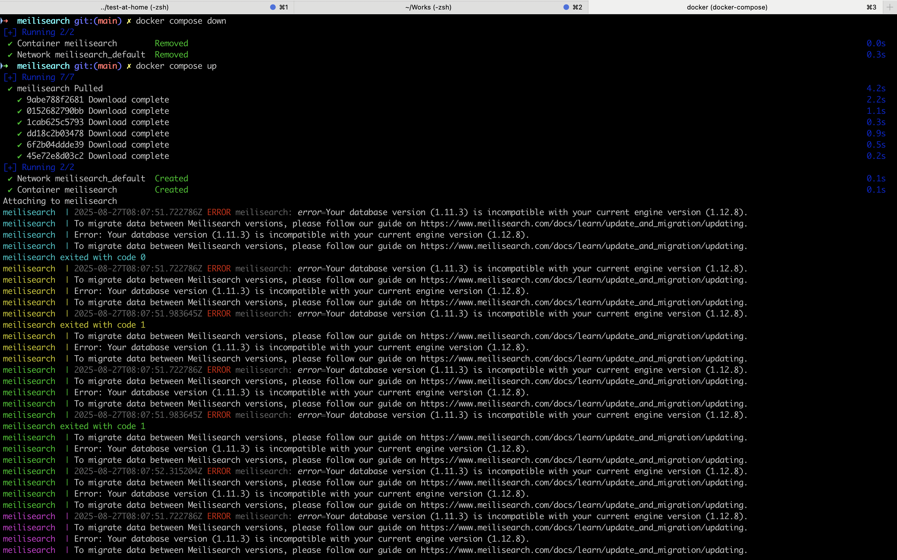
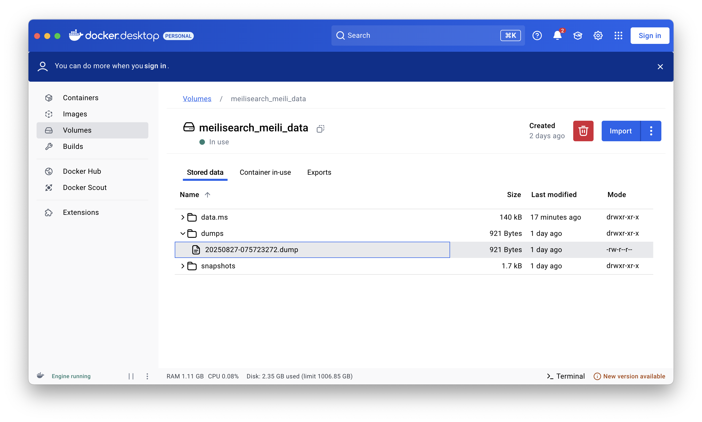
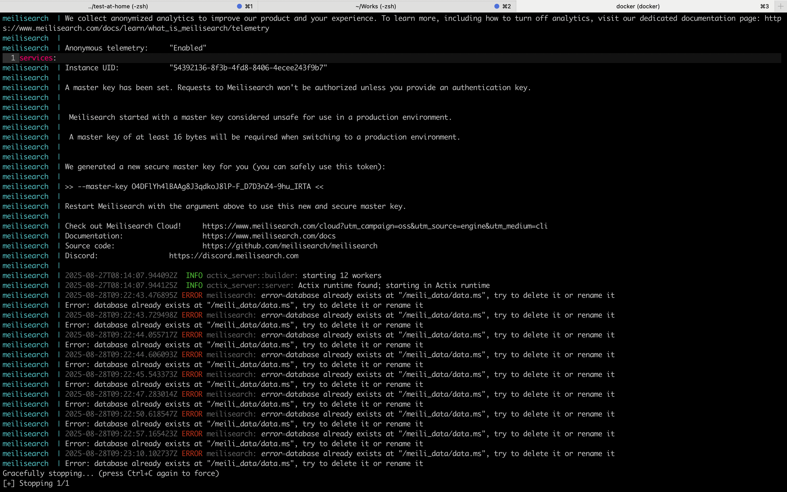
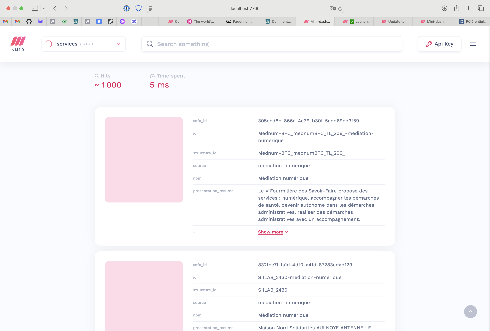

## Table des matières
- [Introduction](#introduction)
- [Problème pour la montée de version de la v1.11 à la v1.14](#problème-pour-la-montée-de-version-de-la-v111-à-la-v114)
- [Solution pour la montée de version de la v1.11 à la v1.14](#solution-pour-la-montée-de-version-de-la-v111-à-la-v114)
- [Conclusion](#conclusion)

## Introduction

[**Meilisearch**](https://www.meilisearch.com) est un logiciel open-source de moteur de recherche. La solution supporte plusieurs types de recherche : full-text, vectorielle / sémantique, hybride, multimodale, géospatiale. Il s'agit d'une alternative très intéressante à **Algolia** (trop cher), **Elasticsearch** / **OpenSearch** (très compliqué), **Typesense** (moins complet), **Qdrant** (plus spécifique).

> 💡 Pour rappel, j'ai rédigé un article intitulé ["À la découverte de Typesense"](/posts/a-la-decouverte-de-typesense-le-moteur-de-recherche-open-source) pour celles et ceux qui veulent tester via Docker / Træfik.

En ce moment, je joue beaucoup avec, dans l'éventualité de remplacer le moteur de recherche actuel de mon site web. Pour rappel, celui-ci tourne (avec succès 😎) depuis plusieurs années grâce [au framework / CMS Hugo](https://gohugo.io). La recherche est gérée via [**Pagefind**](https://pagefind.app), une bibliothèque de recherche statique, basée sur un index généré en amont, à la compilation du site. Jusqu'à présent, je n'ai pas à m'en plaindre : la mise en place a été relativement simple, de même que l'intégration au workflow de build. Par curiosité, je continue de tester et étudier s'il n'y a pas moyen de proposer une recherche plus riche et performante encore, toute aussi simple (et peu onéreuse) à maintenir. Mais, je m'égare…

La première fois que j'ai joué avec Meilisearch remonte à plusieurs semaines / mois. À cette époque, le soft était alors en v1.11.3. Pour mes tests, je fais tourner l'instance dans un service Docker Compose.

```yaml
# docker-compose.yml
services:
  meilisearch:
    image: getmeili/meilisearch:v1.11
    container_name: meilisearch
    restart: unless-stopped
    ports:
      - "7700:7700"
    environment:
      MEILI_MASTER_KEY: "myMasterKey"   # à personnaliser
    volumes:
      - meili_data:/meili_data

volumes:
  meili_data:
```

## Problème pour la montée de version de la v1.11 à la v1.14

Lorsque j'ai repris mes travaux, mon premier réflexe a été de voir s'il n'y avait pas une nouvelle version et effectivement, c'est bien le cas. Meilisearch est désormais en v1.14 et a, entre temps, sorti des évolutions qui m'intéressent :consolidation de la recherche hybride, amélioration des performances + optimisation de consommation des ressources pour traiter de plus grands volumes de données, support d'attributs filtrables et enrichissement des embeddings, etc.
{.cons}

J'ai donc modifié la version de l'image dans le fichier **docker-compose.yml**. Et là, c'est le drame….

Erreur lors du passage de la v1.11 à la v1.12 :
{.underlined}



Comme tout bon informaticien qui se respecte, c'est seulement à partir de cet instant (quand c'est déjà bien la m****) que je décide de regarder [la procédure officielle](https://www.meilisearch.com/docs/learn/update_and_migration/updating#updating-a-self-hosted-meilisearch-instance) 🤡.

Autant, la documentation et la prise en main générale de l'outil sont hyper simples, claires et rapides ; autant la procédure de montée de version est étonnament décevante et peu pratique.
{.cons}

L'idée, c'est de générer un dump des données depuis l'ancienne version, pour ensuite supprimer les données (😰) avant de relancer l'instance en version supérieure en spécifiant le dump à ré-importer. En tant qu'opérateur de la solution, c'est vraiment stressant. Et encore ! là, je ne fais que jouer avec de la donnée peu importante, sur une instance locale de test…

La documentation, pour une instance *self-hosted*, indique 2 procédures : une expérimentale, depuis la v1.12, qui permet de se passer de la génération d'un dump complet ; et l'autre, la classique, avec génération + import d'un dump complet.

Partant de la v1.11 (et passant trop vite à la v1.14), je n'ai malheureusement pas testé la montée de version dumpless.

## Solution pour la montée de version de la v1.11 à la v1.14

En revanche, je suis parvenu à effecteur la montée de version via le dump de données.

**1/** S'assurer d'avoir l'ancienne instance Meilisearch qui tourne (cf. docker-compose.yml ci-dessus). Par défaut, le service écoute le port **http://localhost:7700**.

```shell
$ docker compose up -d
```

**2/** Générer le dump des données.

```shell
# Génération d'un dump
$ curl -X POST 'localhost:7700/dumps' -H "Authorization: Bearer myMasterKey"

> {"taskUid":1,"indexUid":null,"status":"enqueued","type":"dumpCreation","enqueuedAt":"2025-08-27T07:57:23.267343093Z"}%
```

**3/** Il est possible de consulter les opérations en cours :

```shell
# Liste des tâches
$ curl -X GET 'localhost:7700/tasks' -H "Authorization: Bearer myMasterKey"

> {"results":[{"uid":1,"batchUid":null,"indexUid":null,"status":"succeeded","type":"dumpCreation","canceledBy":null,"details":{"dumpUid":null},"error":null,"duration":"PT0.003889208S","enqueuedAt":"2025-08-27T07:57:23.267343093Z","startedAt":"2025-08-27T07:57:23.272331552Z","finishedAt":"2025-08-27T07:57:23.27622076Z"},{"uid":0,"batchUid":null,"indexUid":null,"status":"succeeded","type":"dumpCreation","canceledBy":null,"details":{"dumpUid":"20250827-074754782"},"error":null,"duration":"PT0.006271250S","enqueuedAt":"2025-08-27T07:47:54.776220222Z","startedAt":"2025-08-27T07:47:54.781835722Z","finishedAt":"2025-08-27T07:47:54.788106972Z"}],"total":2,"limit":20,"from":1,"next":null}%
```

```shell
# Détail d'une tâche
$ curl -X GET 'localhost:7700/tasks/1' -H "Authorization: Bearer myMasterKey"

> {"uid":1,"indexUid":null,"status":"succeeded","type":"dumpCreation","canceledBy":null,"details":{"dumpUid":"20250827-075723272"},"error":null,"duration":"PT0.006601458S","enqueuedAt":"2025-08-27T07:57:23.267343093Z","startedAt":"2025-08-27T07:57:23.270994802Z","finishedAt":"2025-08-27T07:57:23.27759626Z"}%
```

**4/** Vérifier que le fichier a bien été généré.

```shell
docker run --rm -it -v meilisearch_meili_data:/data alpine sh
# puis dans le shell du conteneur
cd /data && ls -lah
```

Ou plus simplement, depuis l'application Docker, si elle est installée.



**5/** Couper l'instance Meilisearch.

```shell
$ docker compose down
```

**6/** Renommer (plutôt que supprimer, par mesure de fiabilité) le répertoire **data.ms**

```shell
$ docker run --rm -v meilisearch_meili_data:/data alpine sh -c 'mv /data/data.ms /data/data.ms.$(date +%Y%m%d%H%M%S).bak'
```
**7/** Editer le fichier docker-compose.yml pour préciser la nouvelle version et surtout, faire en sorte que la première relance, ré-importe le dump.

```yaml
services:
  meilisearch:
    image: getmeili/meilisearch:v1.14
    container_name: meilisearch
    restart: unless-stopped
    ports:
      - "7700:7700"
    environment:
      MEILI_MASTER_KEY: "myMasterKey"   # à personnaliser
    volumes:
      - meili_data:/meili_data
    command: meilisearch --import-dump dumps/20250827-075723272.dump

volumes:
  meili_data:
```

**8/** Relancer le service.

```shell
$ docker compose up -d
```

🎉 Cette fois, l'instance se lance parfaitement dans sa nouvelle mouture.

**MAIS** ce n'est pas fini !  Il faut bien penser à…

**9/** Ré-éditer le fichier docker-compose.yml pour supprimer la commande de ré-import du dump.

Si on ne fait pas ça, alors à la prochaine relance du conteneur, on obtient l'erreur suivante :



**10/** Couper puis relancer une dernière fois le service (avant la prochaine mise à jour, en espérant que l'update dumpless fonctionne cette fois-ci)

```shell
$ docker compose down && docker compose up -d
```

🚀 Cette fois-ci, c'est tout bon ! On peut à nouveau accéder sereinement à son instance Meilisearch en toute confiance : http://localhost:7700 !



## Conclusion

Mettre à jour une instance **Meilisearch** n’est pas aussi trivial qu’un simple changement de version Docker. Il faut bien avoir en tête que les formats de base de données peuvent évoluer rapidement d’une version à l’autre, et que la manière la plus fiable (en attendant que la fonctionnalité dumpless soit stabilisée) reste de **générer un dump** puis de le **réimporter**.  

Dans mon cas, la migration de la v1.11 vers la v1.14 a nécessité plusieurs étapes manuelles (dump, renommage du répertoire `data.ms`, réimport, ajustement du `docker-compose.yml`), mais j’ai pu préserver toutes mes données et repartir sur une base propre.  
