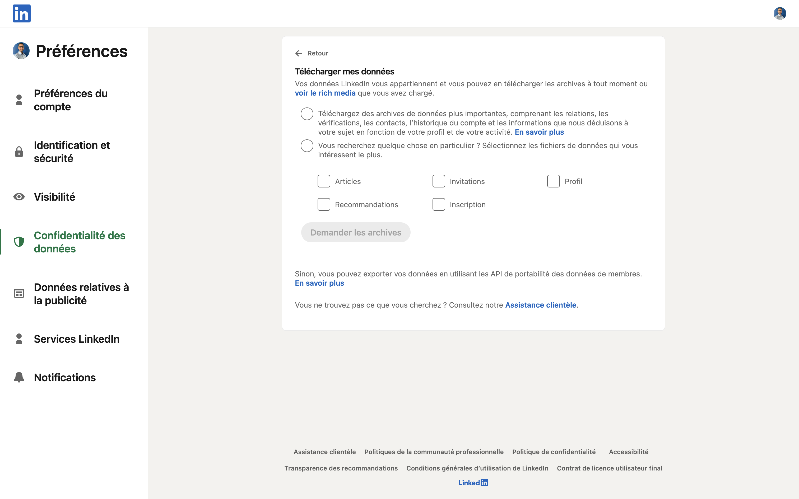
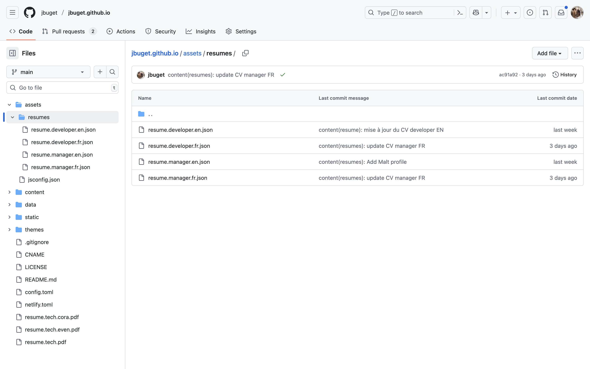
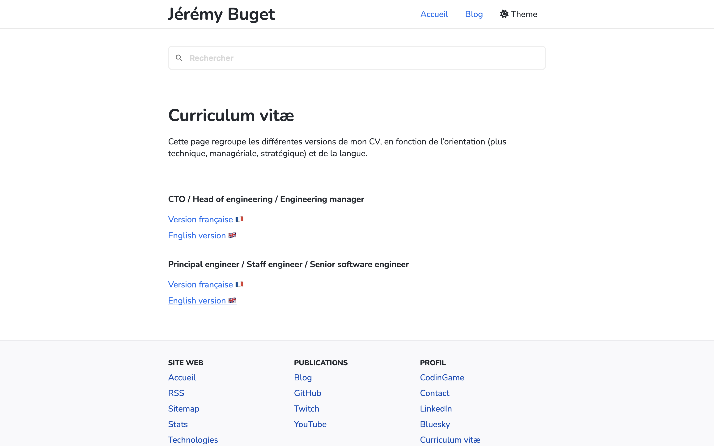

## TL&DR;

Dans le cadre d’une recherche d’emploi un peu hybride, j’ai récemment dû rédiger plusieurs CV, mettant à chaque fois en avant un type de profil particulier, le tout dans  plusieurs langues. Plutôt que tout miser sur LinkedIn, qui verrouille complètement les données de profil qu’on y injecte et qui n’offre aucune API Profile pour rendre la chose pratique, je me suis basé sur le format JSON Resume, dont la spécification, la communauté et l’écosystème me permettent aujourd’hui d’intégrer et gérer simplement une CVthèque sur mon site web (cf. page "[Curriculum Vitæ](/resumes)"), dont la génération de PDF.

## Table des matières

- [Introduction](#introduction)
- [LinkedIn et les autres plateformes de recrutement](#linkedin-et-les-autres-plateformes-de-recrutement)
- [Une stratégie de gestion du contenu basée sur LinkedIn inadaptée](#une-strategie-de-gestion-du-contenu-basee-sur-linkedin-inadaptee)
- [From LinkedIn to JSON Resume](#from-linkedin-to-json-resume)
- [JSON Resume et autres formats de structure de CV](#json-resume-et-autres-formats-de-structure-de-cv)
- [From JSON Resume to PDF](#from-json-resume-to-pdf)
- [Nouvelle stratégie, avec moins de LinkedIn et plus de CVs](#nouvelle-strategie-avec-moins-de-linkedin-et-plus-de-cvs)
- [Nouvelle section pour mon site web : *ma* CVthèque](#nouvelle-section-pour-mon-site-web-ma-cvtheque)
- [Conclusion](#conclusion)

## Introduction

Au terme de mon expérience avec la Plateforme de l’inclusion, je me suis mis en quête d’une nouvelle aventure professionnelle. Passée la première étape de définition de mon projet professionnel (au moins 1/3 de tech et 1/3 de leadership), est venue celle de mettre à jour mon CV.

La dernière fois que j’ai eu à le faire remonte à une douzaine d’années. Depuis, j’ai pu me contenter de simplement mettre à jour mes expériences sur LinkedIn. 

Quoiqu’il en soit, cela faisait longtemps que je projetais d’intégrer mon CV à mon site web (avec une section portfolio quelque part). C’était donc l’occasion idéale pour concrétiser ce projet.

## LinkedIn et les autres plateformes de recrutement

Initialement, la stratégie de gestion de mon contenu type CV était la suivante : 

1. faire de LinkedIn la “source de vérité”
2. trouver et mettre en place un moyen d’exporter le contenu dans un format standard (a priori JSON Resume)
3. injecter le contenu, grâce au format standard dans mon site (ou ailleurs)

Tout ne s’est pas passé comme prévu et j’ai dû changer de stratégie à mesure de ma recherche d’emploi et de l’implémentation de cette solution.

Intrinsèquement, je ne suis pas fan du réseau, qui devient à mon sens le “Instagram de l’entreprise pour les gens en quête de likes”. Dans les faits, depuis plusieurs mois, la plateforme semble devenir LA place de recrutement dominante en France et dans le monde. C’est en tout cas mon ressenti, et ce qu’en disent plusieurs personnes autour de moi, RH, dirigeants et autres agents de carrière.

> 💡 Par souci d’exactitude, j’ai mené une recherche (très) rapide sur le web (via DuckDuckGo) et en demandant à ChatGPT + Gemini. Apparemment, ce sentiment n’est pas tout à fait avéré et :
> 
> - dans le monde :
>     - **Indeed** est le site RH (emplois & carrières) le plus visité au monde avec 408,4 millions de visites par mois en juillet 2025 ;
>     - **LinkedIn** arrive seulement second avec plus d’un milliard de profils enregistrés revendiqués dans le monde en 2024 (mais j’imagine qu’il y a un paquet de bots, de comptes en doublons ou plus et d’autres inactifs)
>     - Pour la 3ème position, Gemini et ChatGPT indiquent tout deux **Glassdoor** avec 60–70 millions de visiteurs mensuels, puis **Monster** (~20–30 millions visiteurs/mois)
> - en France :
>     - **France Travail** est le site le plus visité avec 18,5 millions de visites par mois (mars 2025)
>     - **Indeed** arrive en seconde position avec 9,4 millions de visites mensuelles
>     - **LinkedIn** est seulement 3ème
>     - puis suivent **HelloWork** (3,97 millions de visites/mois), **Welcome to the jungle** (655 200 visiteurs/mois), etc.

En ce qui concerne ma propre recherche, pour mon secteur (la tech / le numérique), je trouve que l’offre est la plus riche sur LinkedIn, mais plus précise sur Welcome. Je ne suis pas hyper convaincu ni par HelloWork ni par Indeed.

Me voilà donc à mettre à jour mes expériences sur LinkedIn avec mes 2 dernières expériences de ces 8 dernières années.

## Une stratégie de gestion du contenu basée sur LinkedIn inadaptée

Une fois mon profil LinkedIn fraîchement à jour, j’ai entamé les démarches de prospection / sollicitation / candidature. Tous les formulaires de candidature possèdent un champs “profil LinkedIn”. Cela semblait valider ma stratégie de gestion du contenu. 

Jusqu’au moment où un recruteur me demande une version “plus technique” de mon CV. 

Initialement, malgré ma volonté de me rapprocher du terrain, de viser un poste avec une vraie composant *hands-on*, il est vrai que j’avais tourné mes expériences d’un point de vue très manager. Ce qui correspond réellement à l’un des aspects que je recherche. 

Malheureusement, **LinkedIn ne permet pas de gérer plusieurs CV ou profils**. Me voilà donc confronté à une première contrainte, et même “limite” stratégique.
{.cons}

Rapidement m’est apparue une autre limite : parmi les fiches de poste qui m’intéressaient, certaines étaient en anglais et requéraient un CV dans la langue de Shakespeare 🇬🇧. Là encore, **impossible dans LinkedIn de gérer plusieurs langues**. J’aurais pu opter pour un contenu tout en anglais, mais je n’étais pas fan de proposer un CV dans une langue différente de celle de la fiche de poste à laquelle je réponds. Je trouvais que ça faisait trop “candidature générique” et je craignais que ce soit un micro-détail qui me fasse louper de belles opportunités. 
{.cons}

S’en est rapidement suivie une troisième puis une quatrième limite.

Mon second principe stratégique de gestion du contenu était de exporter / convertir mon profil LinnkedIn dans un format de données standard ouvert. Une brève recherche m’a mené vers la spécification JSON Resume. En creusant un peu, il se trouve que c’est exactement le standard que j’avais en tête (la suite de l’histoire le confirmera). 

Malheureusement (bis), **LinkedIn ne propose rien pour convertir son profil au format JSON Resume**. Il existe bien un export de ses propres données de profil, mais la fonctionnalité est peu mise en avant et ne permet pas vraiment de récupérer toutes ses informations. Des sections comme “Intérêts”, “recommandations/références”, “skills endorsements” ne sont pas toujours complètes ni bien structurées. 
{.cons}

Sans compter que le fichier obtenu est une archive ZIP, avec plusieurs fichiers / dossiers, de différentes natures (un peu de CSV, de JSON, de HTML). Bref, c’est difficilement exploitable et automatisable (si besoin, [voici le lien](https://www.linkedin.com/mypreferences/d/download-my-data)).
{.cons}



J’ai regardé sans trop y croire du côté de l’API LinkedIn. Evidemment, j’avais raison de ne pas espérer grand chose. À part à quelques partenaires triés sur le volet (i.e. d’une certaine taille et qui s’accommodent à n’en pas douter d’une taxe conséquente), **LinkedIn ne propose pas d’API de lecture  – ni même d’écriture** (ce qui est une contrainte dure supplémentaire à toute stratégie de contenu incluant LinkedIn !) **– des informations de profil**.
{.cons}

La plateforme propose bien une API en lecture/écriture… mais uniquement pour publier des posts, commentaires et réactions. (*)

> 💡 (*) J’en profite pour faire de la pub à mon mutu et ancien collègue chez OCTO, [Julien Collet](https://www.linkedin.com/in/julien-collet/), et son produit ✨ [Scheduled](https://www.scheduled.so/fr) ✨ qui permet de planifier et gérer des contenus publiés sur LinkedIn via Notion.

Tout cela traduit haut et fort que LinkedIn est en position de monopole et qu’en tant que plateforme à but lucratif, sa stratégie à elle (et à Microsoft, sa société mère) est de rendre captif le plus possible ses utilisateurs / clients / partenaires. Bienvenue dans le monde merveilleux des GAFAM et du *vendor lock-in* !
{.cons}

Moralité : **pour des questions autant éthique que technique et pratique, je ne peux pas baser ma stratégie de gestion du contenu de ma CVthèque sur LinkedIn ❌**.

## From LinkedIn to JSON Resume

Si j’avais été un utilisateur classique de LinkedIn, j’aurais sûrement baissé les bras et accepté de traiter LinkedIn comme vitrine de mon CV (mixant indifféremment manager et tech, en anglais), avec gestion de diverses versions de CV en PDF à côté. Mais je suis un “vieux tech” et je me doute que des milliers d’autres devs ont déjà eu la problématique avant moi, et ont déjà trouvé une ou plusieurs solutions.

En effet, j’ai pu découvrir et tester plusieurs pistes : 

- des extensions navigateur ([ex](https://github.com/oflenake/jt-linkedin-to-jsonresume?tab=readme-ov-file) ✅)
- divers scripts de scrapping HTML d’une page profil LinkedIn
- un site web / webapp (OSS) d’extraction de données depuis une page profil LinkedIn ([ex](https://jmperezperez.com/linkedin-to-json-resume/) ✅)
- un CLI d’extraction de données (inclus dans le projet ci-dessus)
- un bookmarklet d’extraction de données depuis une page profil LinkedIn ([ex](https://github.com/RemseyMailjard/scrape-linkedin) ✅)

La solution qui a fonctionné le plus rapidement pour moi – mais pas la plus automatisable – est celle du bookmarklet. 

Quoiqu’il en soit, j’ai réussi à obtenir un CV au format JSON Resume depuis ma page de profil LinkedIn 🙌.

## JSON Resume et autres formats de structure de CV

Lorsqu’on s’intéresse aux formats de structuration d’un CV, celui qui ressort systématiquement en premier est [**le format JSON Resume**](https://jsonresume.org).

C'est un standard très populaire, en particulier dans le milieu de la tech. Il s'agit d'un format de données simple basé sur JSON (JavaScript Object Notation) qui permet de décrire l'ensemble des informations d'un CV de manière structurée :
{.pros}
- `basics` (informations personnelles)
- `work` (expériences professionnelles)
- `education` (formations)
- `skills` (compétences)
- `projects` (projets)
- `volunteer` (bénévolat)
- `awards` (prix et distinctions)
- etc.

L'avantage principal de JSON Resume est sa flexibilité. Un seul fichier .json peut être utilisé pour générer différents CV visuels (PDF, HTML, etc.) grâce à [des thèmes et des outils de ligne de commande](https://www.npmjs.com/search?ranking=maintenance&q=jsonresume-theme) (cf. ci-dessous). Il est open-source et géré par une communauté, ce qui garantit sa pérennité.
{.pros}

D’autres formats de données existent, qui répondent à des contextes, enjeux ou besoins spécifiques :

- [**HR-XML / HR Open Standards**](https://www.hropenstandards.org/) : il s’agit d’un ancien standard basé sur XML, moins utile / utilisé par les particuliers, dont le but est de faciliter l’échange de candidatures et de données en ressources humaines entre systèmes (logiciels de recrutement, plateformes d’offres d’emploi, etc.) ;
- [**Europass CV**](https://europass.europa.eu/fr) : c’est un standard européen dont le principal avantage est sa reconnaissance officielle et sa lisibilité (par des SI publics) dans tous les pays de l'Union européenne. Plus institutionnel que JSON Resume, il très adapté pour les candidatures académiques ou administratives ;
- [**YAMLResume**](https://yamlresume.dev/) : une adaptation de JSON Resume en YAML (et sans espace dans le titre, juste pour bien se démarquer 😏) ;
- [**Open Skills Project :**](https://www.openskillsnetwork.org/osmt) il s’agit d’un standard plutôt orienté compétences que CV complet, mais il fournit des taxonomies réutilisables permettant de générer un CV.

Sans trop de difficulté ni de doute, **j’ai opté pour JSON Resume comme format de données de ma CVthèque**. C’est le format le plus populaire et standard. Il jouit d’une vraie communauté et d’un écosystème riche (templates, CLI, webapps d’édition et de validation), à la page. Et surtout, si besoin, **il est très facile d’ajouter des informations / champs custom**.
{.pros}

Ex : définir un champs `works/work/x-technologies` pour indiquer les technologies utilisées sur un projet, pour un CV dans l’IT.

> ⚠️ EDIT : lors d'un entretien, mon interlocuteur m'a remonté – à très juste titre – qu'il manquait un numéro de téléphone. Sachant que le code est versionné dans GitHub, je n'ai pas envie que ce type d'information très personnelle y traîne. Dans tous les cas, même si on ne l'affiche pas à l'écran, la data serait tout de m^mee remonté dans la page HTML. Donc c'est "non". Je dirais que c'est l'une des plus grosses limites de tout ce système. J'ajouterais tout de même que sur LinkedIn non plus, je n'affiche pas publiquement mon numéro de téléphone.

## From JSON Resume to PDF

À ce stade du processus, je disposais d’un profil LinkedIn à jour ainsi que d’une première version d’un fichier JSON Resume. La suite consistait à enrichir / corrigé / améliorer le contenu (et mieux coller au format) pour générer une version PDF.

Pour la partie correction et amélioration, je me suis servi de l’IA (ChatGPT-5.0). Comme LinkedIn ne propose qu’un seul champs texte brut pour définir une expérience, il est de coutume d’y mettre plusieurs sections, ex : un texte de présentation générale du rôle, les missions réalisées, des chiffres clés, les technologies du projet. Avec JSON Resume, il est prévu / préférable d’utiliser le champs `highlights` pour décrire les missions ou réalisations marquantes. Grâce à ChatGPT, la réécriture des champs `summary` (description générale) et `highlights` a été largement simplifiée et optimisée.

Comme mentionné plus tôt, **l’une des forces du format JSON Resume est son écosystème**. Toutes les libs ne sont pas correctement maintenues, à jour ou faciles d’usage. Mais dans l’ensemble, on trouve rapidement l’outil de choix qui permet de faire ce qu’on veut.
{.pros}

En l’occurrence, le projet le plus avancé, à jour et opérationnel est ✨ [**resumed**](https://github.com/rbardini/resumed) ✨, une CLI inspirée de [resume-cli](https://github.com/rbardini/resumed?tab=readme-ov-file#motivation).

Imaginons que l’on souhaite imprimer son CV au format JSON Resume (dans un fichier nommé **./resume.json**), en utilisant le thème Straightforward, il suffit de faire :

```jsx
npm install -g resumed
npm install -g jsonresume-theme-straightforward
npx resumed export ./resume.json --theme jsonresume-theme-straightforward --format pdf
```

Et c’est ainsi que j’ai obtenu le fichier **🎁 resume.pdf 🎁**, que j’ai déposé directement sur mon site web ([et sur mon GitHub](https://github.com/jbuget/jbuget.github.io/)), pour qu’il (me) soit facilement accessible en ligne.

## Nouvelle stratégie, avec moins de LinkedIn et plus de CVs

Une fois ce résultat obtenu, j’étais plutôt satisfait et serein quant à la suite… même si je trouvais que tout cela manquait d’industrialisation et de pérennité / praticité à long terme.
{.cons}

J’avais déjà acté de ne plus considérer LinkedIn comme mon référentiel de contenu. En en parlant et en demandant autour de moi, c’est **OK d’avoir un CV à côté de son profil LinkedIn, un peu différent, plus complet, plus spécifique** (notamment à la fiche de poste).

Ma nouvelle stratégie est devenue la suivante : 

- faire de JSON Resume la pierre angulaire de ma gestion de contenu
- éditer / publier / maintenir plusieurs fichiers resume.type.lang.json dans mon site, versionnés dans Git
- trouver un mécanisme pour simplifier la génération et gestion de PDF
- accessoirement, sur LinkedIn, orienter mon profil pour un type et une langue particulier, un peu l’équivalent du CV “par défaut” (en l’occurrence, ici, orienté manager, en français 🇫🇷)

À ce stade, je n’avais qu’un seul fichier resume.json, orienté manager, en FR_fr. J’ai utilisé une première fois ChatGPT-5.0 pour initier une version “*developer*”, que j’ai ensuite retravaillée et enrichie pour qu’elle corresponde à une recherche de Staff Engineer / Solutions Architect. Je me suis ainsi retrouvé avec 2 fichiers : resume.manager.json et resume.developer.fr.json.
{.pros}

J’ai ensuite utilisé une seconde fois l’IA pour qu’il traduise chacun de ses 2 CV en anglais 🇬🇧. J’ai ainsi obtenu les 2 nouveaux fichiers : resume.manager.en.json et resume.manager.fr.json.



## Nouvelle section pour mon site web : *ma* CVthèque

Désormais, il ne me restait alors plus que 2 challenges :

- trouver le moyen le plus simple, rapide et pratique de générer chacun des fichiers PDF correspondant
- proposer une visualisation de chaque CV directement sur mon site web

Après un brin de réflexion, la solution la plus pragmatique et adaptée qui m’est apparue a été de “tout bêtement” **créer un template de pages web en HugoCMS** ([le framework principal de mon site](https://jbuget.fr/technologies/)) et déclarer une page par CV.

Par ailleurs, le Web et HTML étant idéalement conçus et pensés pour être accessibles au plus grand nombre dans un maximum de conditions / situations, plutôt que bidouiller un mécanisme compliqué d’automatisation de génération de PDF via un outil JS/NPM, autant faire en sorte que l’impression de pages web (a.k.a. `Ctrl + P` ) fonctionne correctement !

Quelques heures de dev plus tard, et avec l’aide de Claude Code, j’ai finalement obtenu le résultat (cf. page [/resumes](/resumes)) qui me convient plainement, et dont je suis même un petit peu fier ! Au point d’en rédiger un (trop long) article de blog… 😉



## Conclusion

En partant d’une dépendance quasi-totale à LinkedIn, j’ai finalement construit une **CVthèque libre, personnalisée et interopérable**. Le format **JSON Resume** m’a offert la flexibilité nécessaire pour décliner mes CV selon les langues, les profils et les contextes, tout en les rendant exportables et faciles à maintenir.  

Cette démarche m’a permis de **reprendre le contrôle sur mes données** et de rendre mon site web non seulement plus riche, mais aussi plus aligné avec mes valeurs de transparence, d’ouverture et d’autonomie.  

LinkedIn conserve évidemment son rôle de vitrine incontournable pour la visibilité professionnelle, mais il n’est plus mon unique point de référence. Désormais, ma **CVthèque est une brique de mon identité numérique** que je peux enrichir, adapter et faire évoluer librement.  

En somme, ce projet m’a rappelé une évidence : dans un monde dominé par les plateformes fermées, il existe toujours des solutions ouvertes et élégantes pour reprendre la main. Et parfois, c’est aussi simple qu’un fichier JSON.

*Et vous, comment gérez-vous vos CV ? Quelle plateforme / outil(s) / formats ?*

## Bonus 

Exemple (réel) de fichier JSON Resume pour la version "technique" / "FR" : 

```JSON
{
  "$schema": "https://raw.githubusercontent.com/jsonresume/resume-schema/v1.0.0/schema.json",
  "basics": {
    "name": "Jérémy Buget",
    "label": "Principal / Staff / Senior software engineer",
    "image": "",
    "email": "contact@jbuget.fr",
    "url": "https://jbuget.fr",
    "summary": "Ingénieur logiciel senior, passionné par le développement, l’architecture et le mentoring technique. 20+ ans d’expérience en back-end, front-end et infrastructure. Habitué à concevoir et livrer des applications web complexes, robustes et scalables, tout en accompagnant de près les équipes dans leurs choix techniques, leur organisation et leurs bonnes pratiques.",
    "location": {
      "countryCode": "FR",
      "address": "France"
    },
    "profiles": [
      {
        "network": "LinkedIn",
        "username": "jbuget",
        "url": "https://www.linkedin.com/in/jbuget/"
      },
      {
        "network": "Malt",
        "username": "jeremybuget",
        "url": "https://www.malt.fr/profile/jeremybuget?overview"
      },
      {
        "network": "GiHub",
        "username": "jbuget",
        "url": "https://github.com/jbuget"
      },
      {
        "network": "CodinGame",
        "username": "jbuget",
        "url": "https://www.codingame.com/profile/8380d1e36b678496bb5742cafa095f3c8437914"
      },
      {
        "network": "Bluesky",
        "username": "jbuget",
        "url": "https://bsky.app/profile/jbuget.fr"
      }
    ],
    "driving": {
      "license": ["Permis B"]
    },
    "x-workPreferences": {
      "remote": true,
      "hybrid": true,
      "onsite": false
    }
  },
  "work": [
    {
      "name": "La Plateforme de l'inclusion",
      "position": "Principal Engineer / CTO hands-on de transition",
      "startDate": "2022-05-01",
      "endDate": "2025-08-31",
      "summary": "En tant que CTO de transition *hands-on*, j'ai œuvré à la constitution, la structuration et la pérennisation du groupement d'intérêt public Plateforme de l'inclusion. Ma mission a consisté principalement en la mise en place ou la migration sur un plan aussi opérationnel que stratégique, d'outils et briques techniques vers des solutions unifiées pour tous les produits ou projets (~12) internes ou publiques de la PDI, sur tout type de problématiques (métier, plateforme, productivité).\n\nDans ce cadre, j'ai été amené à très souvent mettre les mains dans le code, intervenir lors de réflexions techniques et participer au support pour le travail auquel j'ai contribué auprès des équipes / collaborateurs (~120) / partenaires / utilisateurs (100K visiteurs/jour).",
      "highlights": [
        "Contribution régulière au [code](https://github.com/gip-inclusion) (features, bugfix, refactoring) sur plusieurs projets (Python / Django / FastAPI, Svelte / Sveltekit, JavaScript / Typescript / Node.js) en suivant les bonnes pratiques d'artisanat logiciel (DDD, TDD, pair/mob-programming, Extreme programming, etc.)",
        "Architecture et implémentation de nouvelles API (REST, GraphQL) et intégrations (Webhooks, automations)",
        "Optimisation des performances back-end, front-end, data (PotsgreSQL) et ressources machines (Linux / Docker)",
        "Déploiement et passage à l'échelle d'une solution unique de web analytics (Matomo) auto-hébergée pour tous les produits au sein de l'organisation (1M events/jour)",
        "Supervision et accompagnement à la migration d'infrastructure Cloud de plusieurs projets",
        "Mise en place, maintenance et suivi d'évolution de plusieurs instances Metabase",
        "Mise en œuvre d'une instance n8n et de workflows (métier, marketing, techniques, support, plateforme)",
        "Supervision et contribution au décommissionnement d'une application déployée sur plusieurs départements",
        "Migration et unification de plusieurs systèmes de messagerie d'entreprise vers une solution unique",
        "Acquisition et mise en œuvre d'un domaine gouvernemental : inclusion.gouv.fr",
        "Mise en place de la suite Google Workspace à l'échelle de l'entreprise",
        "Migration et unification sur plusieurs produits vers une même suite de gestion d'envoi des emails / SMS (Brevo)",
        "Mise en place d’outillage DevOps et CI/CD (Git, Shell scripts, Sentry.io, Datadog, GitHub Actions)",
        "Mentoring technique de développeurs seniors et juniors",
        "Recrutement, renfort et management de plusieurs équipes produit",
        "Animation et leadership de la communauté tech (devs, ops, data, engineers)"
      ],
      "x-keywords": [
        "Python",
        "Django",
        "FastAPI",
        "Wagtail",
        "JavaScript",
        "Typescript",
        "Node.js",
        "SvelteKit",
        "Tailwind",
        "PostgreSQL",
        "Redis",
        "Hasura",
        "Grist",
        "Docker",
        "Scalingo",
        "Clever Cloud",
        "Scaleway",
        "Matomo",
        "Metabase",
        "n8n",
        "Brevo",
        "Sentry",
        "Datadog",
        "Git",
        "GitHub",
        "Bash",
        "Unix"
      ],
      "url": "https://inclusion.gouv.fr",
      "location": "Paris, France"
    },
    {
      "name": "Pix",
      "position": "Co-founder & Principal Engineer / CTO",
      "startDate": "2016-06-01",
      "endDate": "2022-04-30",
      "summary": "En tant que Co-fondateur, premier développeur puis CTO de Pix, j'ai contribué à concevoir, mettre en œuvre et déployer la plateforme au niveau national (France), puis francophone (Maghreb) et européen (Belgique). La solution a déjà été utilisée par +2M usagers qui ont ainsi pu évaluer, développer et certifier leurs compétences numériques (~150K visiteurs/jour).\n\nLes premières années ont consisté à poser les bases techniques (architecture clients-serveur *API-first*, [mono-repo](https://github.com/1024pix/pix), Clean Architecture, infrastructure, pipelines CI/CD, outillage SRE / observability, web analytics, dispositifs et mesures de sécurité, tenue de charge et WebPerf, etc.). Puis est venu le temps du passage à l'échelle : recrutement, mentoring / coaching, management, splits / création d'équipes sur le modèle Team Topologies, animation de communautés de pratique. Jusqu'aux responsabilités plus stratégiques, de mise en conformité (RGPD, RGS, RGAA) ou de rayonnement de l'organisation (participation à des conférences tech, publication du [blog technique](https://engineering.pix.fr/), organisation d'évènements tech internes ou avec des partenaires).",
      "highlights": [
        "Open labs réguliers les premiers mois pour évaluer les maquettes et premières versions (POC, MVP, MVF)",
        "Initialisation de la stack et développement des premières briques : Pix App et Pix API",
        "Développement full-stack et mise en production des modules et fonctionnalités principales",
        "Optimisations régulières de la base de données PostgreSQL (tuning de requêtes ORM/SQL), des algorithmes, de l'architecture et de l'infrastructure pour tenir la charge grandissante ou les pics de trafics exceptionnels",
        "Intégrations d'API, connecteurs et modules d'authentification tierces : EduConnect, FTConnect, FCAgents",
        "Mise en place d'outils, process et scripts SRE (observability, monitoring, alerting)",
        "Recretement, encadrement, mentorat et management technique d’équipes pluridisciplinaires",
        "Architecture et mise en œuvre de dispositifs techniques généraux : caches multi-niveaux, sécurité, WAF, etc.",
        "Manipulation de l'architecture applicative pour en extraire et permettre une meilleure évolutivité des modules clés : Pix Orga, Pix Certif, Pix Editor, Pix Accounts, Pix Data, etc.",
        "Diverses missions et activités plus stratégiques, administratives ou de rayonnement",
        "Mise en place de tout l'outillage de productivité des différents services : suite bureautique (Google Workspace), suite documentaire collaborative (Confluence), messagerie d'entreprise connectée à tout l'outillage technique (Slack + custom apps + webhooks), suite d'outils UX/UI, etc.",
        "Animation et leadership de la communauté tech (devs, ops, data, engineers)"
      ],
      "x-keywords": [
        "JavaScript",
        "Typescript",
        "Node.js",
        "Knex.js",
        "Ember.js",
        "Nuxt.js",
        "Prismic",
        "PostgreSQL",
        "Redis",
        "Docker",
        "Scalingo",
        "OVH",
        "Scaleway",
        "Airtable",
        "Matomo",
        "Metabase",
        "n8n",
        "Brevo",
        "Sentry",
        "Datadog",
        "CircleCI",
        "Git",
        "GitHub",
        "Bash",
        "Unix"
      ],
      "url": "https://pix.fr",
      "location": "Paris, France"
    },
    {
      "name": "OCTO Technology",
      "position": "Leader de la tribu WEBF",
      "startDate": "2016-06-01",
      "endDate": "2017-12-31",
      "summary": "Au sein d'OCTO Technology, la tribu WEBF est dédiée au développement, au conseil, à la formation et à l'accompagnement à la mise en œuvre stratégique et opérationnelle d'applications Web front-end. J'ai intégré la tribu puis en ai pris le leadership suite au départ du fondateur principal et historique. En tant que Leader de tribu, j'ai contribué à son développement (passage de 6 consultants à 21 en 18 mois), participé activement à la veille technologique et à l'animation de la tribu, accompli un rôle d'encadrement technique et suis intervenu en mission en tant que développeur web front-end senior sur des application métier critiques complexes (Vue.js, Ember.js, Backbone.js, Java/J2E, Spring/Hibernates).",
      "url": "https://www.linkedin.com/company/octo-technology/",
      "location": "Région de Paris, France",
      "highlights": [
        "Création de projets de veilles ou pratiques internes : benchmark de différentes technologies SPA/MPA (Vue.js, React.js, Ember.js, Elm), Job board interne, boussoles des frameworks et technologies JS",
        "Tenue d'une veille technique et méthodologique active partagée à l'organisation, nos partenaires et nos clients",
        "Création d'une offre de service complète : « conseiller, réaliser, éclairer et former aux technologies Web front-end »",
        "Publication d'articles techniques et retours d'expérience sur le blog d'OCTO Technology",
        "Participation active au programme OCTO Skool, ",
        "Création et animation d'une formation autour de JavaScript, son écosystème et les bonnes pratiques à l'état de l'art",
        "Management, coaching et mentoring des collaborateurs membres de la tribu"
      ]
    },
    {
      "name": "OCTO Technology",
      "position": "Senior software engineer",
      "startDate": "2013-02-01",
      "endDate": "2017-12-31",
      "summary": "En tant que consultant senior chez OCTO Technology – cabinet de conseil et réalisation – j'ai été amené à réaliser tout types de mmissions, allant du leadership technique (tech lead sur plusieurs projets), à l'expertise avancée (tests end-to-end ou de charge / perf), en passant par des missions de R&D ou de conseil (études préalable, dossiers de cadrage, audit technique dans le cadre de due deal, etc.). J'ai aussi été amené à contribuer à la vie interne de l'entreprise (animation d'ateliers, de formations ou partage de REX) et à intervenir en avant-vente (cadrage / chiffrage, entretiens short list lors d'appels d'offre ou en avant-vente).",
      "url": "https://octo.com",
      "location": "Paris, France",
      "highlights": [
        "Développement d’une plateforme de Startup d’État (cf. expérience « CTO Pix » ci-dessus)",
        "Cadrage 360° puis réalisation / tech leading de la refonte complète du site de billeterie de Roland-Garros",
        "Développement d’une plateforme numérique innovante de produits d’assurance premium / Lean Startup *by the book*",
        "Développement d’une plateforme de formulaire santé en ligne pour SwissLife",
        "Audit logiciel (~5 millions de lignes de code) pour Allianz",
        "Coaching d’une équipe projet chez CNP Assurances",
        "Coaching agile de deux équipes projet chez TF1",
        "Présentation « Initiation à WebAssembly »",
        "Animation du séminaire d’introduction à l’agilité pour les nouveaux arrivants chez OCTO",
        "Formation « Introduction aux bases de JavaScript pour les OCTO skoolers (nouveaux consultants juniors) »",
        "Étude de l’état de l’art du développement Web pour Fortuneo",
        "Animation d'une formation interne sur le framework Spring"
      ],
      "x-keywords": [
        "JavaScript",
        "Typescript",
        "Node.js",
        "Backbone.js",
        "Java/J2E",
        "Spring",
        "SpringBoot",
        "Hibernate",
        "Play Framework",
        "PostgreSQL",
        "SQL Server",
        "MariaDB",
        "Tomcat",
        "WebLogic",
        "Redis",
        "Docker",
        "Scalingo",
        "ELK",
        "OVH",
        "Brevo",
        "Sentry",
        "Grafana",
        "Jenkins",
        "SonarQube",
        "Artillery",
        "Gatling",
        "Git",
        "GitHub",
        "Bash",
        "Unix"
      ]
    },
    {
      "name": "Objet Direct, racheté par VISEO",
      "position": "Software engineer & ScrumMaster",
      "startDate": "2010-03-01",
      "endDate": "2013-01-31",
      "summary": "En tant que consultant confirmé pour Objet Direct, société de conseil dans le numérique (ESN), puis de VISEO suite à l'acquisition de la première par la deuxième, j'ai participé au développement de plusieurs applications métier  Java/J2E et web. J'ai aussi été amené à assumer des rôles et missions de ScrumMaster et formateur interne.",
      "url": "https://www.viseo.com",
      "location": "Paris, France",
      "highlights": [
        "Développement full-stack d'une application de vidéo-surveillance via Internet/Mobile (avant l'arrivée de l'iPhone)",
        "Développement full-stack d'une plateforme multi-pays de produits financier pour la Société Générale",
        "Participation à plusieurs missions d'avant-vente",
        "Création et animation de formations internes sur Hibernate et Spring framework"
      ],
      "x-keywords": [
        "Flex/Air",
        "Angular",
        "Apache Wicket",
        "HippoCMS",
        "C/C++",
        "QT",
        "Java/J2E",
        "Spring",
        "SpringBoot",
        "Hibernate",
        "PostgreSQL",
        "MySQL",
        "Tomcat",
        "OVH",
        "Jenkins",
        "SonarQube",
        "Zabix",
        "VMware",
        "Git",
        "SVN",
        "Bash",
        "Unix"
      ]
    },
    {
      "name": "People in action",
      "position": "Software engineer",
      "startDate": "2007-09-01",
      "endDate": "2010-02-28",
      "summary": "En tant que stagiaire puis ingénieur logiciel junior au sein de cette petite structure (20+ personnes), j'ai été amené à participer au développement de plusieurs applications full-stack Java/J2EE, Flex/Air et MySQL",
      "url": "https://www.linkedin.com/company/people-in-action/",
      "location": "Paris, France",
      "highlights": [
        "Développement full-stack d'une plateforme internationale de suivi de la performance et des indicateurs clé pour l'institut allemand d'études de marché GFK",
        "Développement full-stack d'une application middle-office en milieu bancaire pour Rotschild",
        "Développement full-stack d'une application interne de gestion du temps (CRA)",
        "Développement d'un artefact boilerplate pour boostrapper rapidement des projets Java/J2E + Flex/Air/ActionScript"
      ],
      "x-keywords": [
        "Flex/Air",
        "Java/J2E",
        "JSF",
        "Hibernate",
        "PostgreSQL",
        "MySQL",
        "Tomcat",
        "Jenkins",
        "SonarQube",
        "VMware",
        "SVN",
        "Bash",
        "Unix"
      ]
    }
  ],
  "skills": [
    {
      "name": "Technologies",
      "keywords": [
        "Node.js",
        "TypeScript",
        "JavaScript",
        "Express.js",
        "Fastify",
        "Prisma ORM",
        "Knex.js",
        "Java",
        "Spring",
        "Hibernate",
        "Python",
        "Django",
        "SvelteKit",
        "Vue.js",
        "Ember.js",
        "Matomo",
        "Metabase",
        "n8n",
        "Airtable",
        "Grist"
      ]
    },
    {
      "name": "Architecture logicielle",
      "keywords": [
        "API REST",
        "GraphQL",
        "Webhook",
        "domain-driven architecture",
        "clean/hexagonal architecture",
        "microservices",
        "scalabilité",
        "sécurité",
        "Open API"
      ]
    },
    {
      "name": "Bases de données",
      "keywords": [
        "SQL",
        "PostgreSQL",
        "Redis",
        "modélisation",
        "indexation",
        "optimisation"
      ]
    },
    {
      "name": "DevOps & CI/CD",
      "keywords": [
        "Linux",
        "Scripts Shell",
        "Docker",
        "sysadmin",
        "DNS",
        "CDN",
        "WAF",
        "SMTP",
        "Scalingo",
        "Clever Cloud",
        "Scaleway",
        "OVH",
        "AWS",
        "CircleCI",
        "GitHub Actions",
        "Jenkins",
        "Ansible",
        "Sentry",
        "Datadog",
        "ELK"
      ]
    },
    {
      "name": "Tests & qualité",
      "keywords": [
        "TDD",
        "BDD",
        "tests unitaires",
        "tests E2E",
        "tests de charge/perf",
        "pair/mob programming",
        "revues de code",
        "standards de code"
      ]
    },
    {
      "name": "Gestion de projet / produit",
      "keywords": [
        "méthodes agiles",
        "Extreme Programming",
        "Lean",
        "Kanban",
        "Lean Startup",
        "Scrum",
        "ScrumMaster"
      ]
    }
  ],
  "references": [
    {
      "name": "Vincent Hardouin (Pix, 24/10/2023)",
      "reference": "J'ai travaillé avec Jérémy chez Pix. Je suis très impressionné par ses compétences et son professionnalisme. Dans les faits, Jérémy sait parfaitement comprendre un besoin utilisateur et trouver une solution adéquate, qu'elle nécessite du développement ou non.\n\nGrâce à ses différentes expériences, Jérémy a une bonne vision du développement logiciel : il sait mettre en place une architecture avec du sens et pérenne dans le temps. Il sait prendre des décisions et les argumenter.\n\nPour le développement, Jérémy sait manier ses outils, ce qui fait de lui une personne efficace (IDE, pratique de développement : TDD, BDD, archi hexagonale, clean archi, clean code, … ).\n\nEnfin, le travail de Jérémy est d'une très bonne qualité. Je suis très content d'avoir travaillé à ses côtés et je le recommande vivement à toute personne qui cherche un professionnel compétent et fiable."
    },
    {
      "name": "Guillaume Lagorce (Hey GUL, 10/03/2023)",
      "reference": "J'ai eu la chance de travailler avec Jérémy au sein de contextes variés, d'abord en tant que collègue chez Octo, puis en tant que partenaire (développeur freelance) au sein du GIP Pix dont Jérémy était le CTO.\n\nJ'ai pu à chaque fois bénéficier de ses nombreuses qualités et compétences : rigueur, bonne humeur, exigence et excellence.\n\nPlus que tout, j'ai apprécié la confiance et l'autonomie que Jérémy place en ses collègues / partenaires, participant à la création d'équipes réellement agiles.\n\nJérémy sait poser les bonnes questions, prendre du recul sur sa propre situation et solliciter les expertises de toutes et tous, quel que soit le parcours de chacune et chacun.\n\nSi vous cherchez un développeur expérimenté et si la qualité de votre produit est un impératif, ne cherchez plus : contactez Jérémy."
    },
    {
      "name": "Romain Detre (Baage, 28/02/2023)",
      "reference": "Jeremy intervient régulièrement pour nous en tant qu'expert technique. Nous le recommandons vivement. Il est très à l'écoute.\n\nSon sens de l'analyse et ses actions en découlant sont à chaque fois très pertinentes et structurées.\n\nUn réel plaisir de travailler avec ce grand professionnel, qui a le goût du travail bien fait et aime faire partager sa passion."
    }
  ],
  "education": [
    {
      "institution": "EPITA",
      "area": "Multimedia et Technologies de l'Information",
      "studyType": "Master 1 (CTI)",
      "startDate": "2003-01-01",
      "endDate": "2008-12-31",
      "score": "",
      "courses": []
    },
    {
      "institution": "Lycée Sainte-Geneviève",
      "area": "spé. Mathématiques",
      "studyType": "Baccalauréat S",
      "startDate": "1990-01-01",
      "endDate": "2003-12-31",
      "score": "",
      "courses": []
    }
  ],
  "certificates": [
    {
      "name": "Certified ScrumMaster® CSM® (ScrumAlliance®)",
      "date": "2011-02-01",
      "issuer": "AgilBee"
    }
  ],
  "languages": [
    { "language": "fr", "fluency": "Langue maternelle" },
    { "language": "en", "fluency": "Maîtrise professionnelle" },
    { "language": "it", "fluency": "Niveau conversationnel" }
  ],
  "interests": [
    {
      "name": "Engagement",
      "keywords": [
        "Mentorat tech (bénévole)",
        "Live coding (Twitch)",
        "Vie associative de quartier"
      ]
    },
    {
      "name": "Pratique sportive",
      "keywords": ["Football", "Tennis", "Course à pied", "Escalade"]
    },
    {
      "name": "Loisirs",
      "keywords": ["Echecs", "Cartomagie", "Jeux vidéo", "Mixologie", "Randonnée en famille"]
    },
    {
      "name": "Culture",
      "keywords": [
        "Science-fiction",
        "Littérature asiatique",
        "Astronomie"
      ]
    }
  ]
}
```

Et le fichier PDF obtenu 👉 [lien](cv_developer_fr_2026-08-26.pdf) 👈.