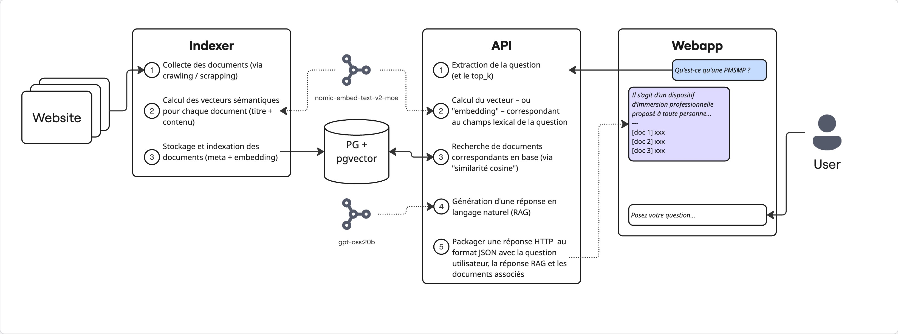
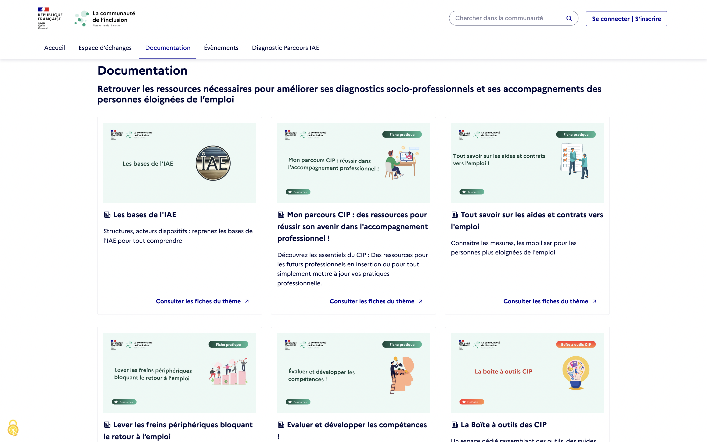
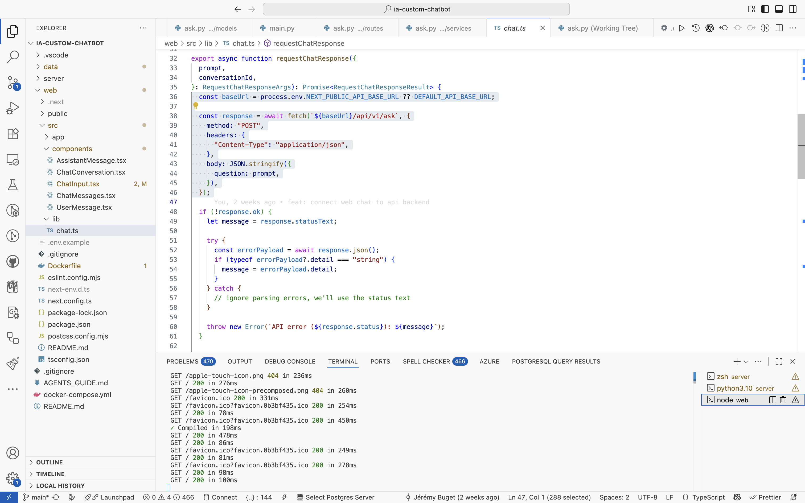

## Introduction

Comme tout le monde, j'ai intégré et continue d'incorporer de plus en plus de pratiques, raisonnements et outils IA dans mon quotidien, pro ou perso : **agents conversationnels** (ChatGPT, Gemini) pour comprendre des choses et générer / améliorer du contenu ; **compagnons techniques** (Codex, Claude Code, Zed) pour m'aider à produire et gérer du code ; **algorithmes et modèles** (LLM, OCR, STT/TTS) pour réaliser des tâches relativement compliquées ou rébarbatives comme extraire, modifier ou transformer des informations sous toutes les formes.

Savoir utiliser cette technologie et ce qu'elle implique me paraît désormais une compétence professionnelle essentielle, quel que soit le métier en question, relatif à l'informatique ou non. En tant que développeur, j'ai cherché à aller un cran plus loin et exploré comment concevoir et produire un outil exploitant l'IA *dans* et *pour* un domaine fonctionnel particulier.

C'est ainsi que j'ai réalisé un petit chatbot capable d'interroger un corpus prédéfini de documents spécifiques pour élaborer des réponses sourcées, dans la limite du champs défini.

## TL;DR

- J'ai développé un chatbot IA spécialisé dans le domaine de l'inclusion socio-professionnelle
- Cet agent se base sur un corpus de documents issus du site [La communauté de l'inclusion](https://communaute.inclusion.gouv.fr/)
- J'ai démarré un serveur Ollama avec le modèle open-weight de OpenAI : `gpt-oss:20b`
- J'ai codé **un script de crawling** (en Node.js, avec Cheerio.js) pour récupérer des fiches d'information
- J'ai installé **une base de données PostgreSQL** et activé l'extension **pgvector**
- J'ai déclaré une base avec une table disposant d'une colonne de type `embedding VECTOR(768)`
- J'ai vectorisé ces fiches grâce à la lib python **Sentence Transformers** (768 dimensions) et au modèle `nomic-ai/nomic-embed-text-v2-moe`
- J'ai indexé les embeddings obtenus dans la base PG
- J'ai développé **une API (Python/FastAPI)** pour mobiliser les différentes briques IA (query + RAG) sollicitées
- Lorsqu'un utilisateur interroge le chatbot, son prompt est à son tour vectorisé pour effectuer une recherche par comparaison de vecteurs. On obtient ainsi un ensemble de "documents sources" correspondants (avec un pourcentage de pertinence)
- Je passe alors ces documents comme éléments exclusifs de "contexte" dans l'instruction que soumets au **LLM responsable de la génération de la réponse** (en interrogeant `/api/chat` de l'API exposée par Ollama)
- Je passe aussi au LLM les autres (précédents) messages de la conversation en cours
- J'ai développé **une webapp chatbot-like** toute simple pour poser des questions et afficher les réponses
- Le code source est disponible sur GitHub : [jbuget/ia-custom-chatbot](https://github.com/jbuget/ia-custom-chatbot)



## Objectifs

Mon objectif, à travers ce POC (proof of concept), était de **comprendre comment exploiter l'IA d'un point de vue véritablement métier, plus seulement comme outil de production ou aide à la création**. Je souhaitais aussi découvrir les solutions envisageables, évaluer leur potentiel et me confronter à leurs limites / contraintes.

Concrètement, je voulais concevoir une API / webapp capable de d'interagir (écouter et répondre) en langage naturel, avec des utilisateurs spécifiques d'un domaine, pour répondre le plus précisément à des questions métier, en s'appuyant et en citant des sources que j'aurais au préalable collectées et indexées.


## Cas d'usage

J'ai pas mal cherché sur quel champs fonctionnel baser le projet.

Ayant beaucoup œuvré dans le service public ces dernières années, j'ai d'abord creusé du côté de [data.gouv.fr](https://data.gouv.fr). S'il y a énormément de données rendues accessibles par les administrations, les collectivités et leurs partenaires, la plupart des datasets sont des données fortement structurées, en colonnes. Pour mon cas d'usage, je souhaitais de la données moins structurées, à base de contenu et textes riches.

Je me suis tourné vers les sites et plateformes de datasets, comme [Kaggle](https://www.kaggle.com/datasets). Mais là encore, c'était beaucoup de données structurées, de qualité à géométrie vraiment variable.

Je pense qu'on retrouve ce type de données précieuses en entreprise, et qu'il faut pouvoir les intégrer et en tenir compte lors de requêtes utilisateurs, mais dans le cadre de mon projet d'IA, je voulais vraiment mettre l'accent sur l'exploitation de documents bruts.

Finalement, j'ai eu l'idée de m'appuyer sur les fiches d'information publiées sur le site de [La communauté de l'inclusion](https://communaute.inclusion.gouv.fr), pour **proposer un agent conversationnel expert dans le domaine de l'insertion socio-professionnelle**.

J'ai cherché à obtenir un chatbot capable de répondre à des questions sur l'IAE, les PMSMP et d'aider les professionnels de l'inclusion dans leur accompagnement de demandeurs d'emploi.




## Conditions opérationnelles et matérielles

J'ai conçu, développé et exécuté le programme exclusivement en local sur ma machine.

> 💻 Il s'agit d'un Macbook Pro M2 Max, 64Go RAM, 12 cœurs, sans carte graphique / GPU.

Je me suis fixé comme contrainte de n'utiliser **que des modèles open-weight et des logiciels / briques open-source**.

J'ai ainsi utilisé [Ollama](https://ollama.com/) comme serveur de modèles IA ouverts (thinking, embedding, vision, etc.).


## Collecte de données

La communauté de l'inclusion est une plateforme communautaire en ligne d'espaces de discussion sur des sujets relatifs à l'insertion socio-professionelle. On y trouve des "forums" et des "topics". On y trouve surtout des "fiches pratiques" officielles, éditées et maintenues par la Plateforme de l'inclusion (PDI), de très grande qualité (fond, forme, fraîcheur).

Le point de départ de mon projet IA a donc consisté à récupérer ces fameuses fiches d'information. Malheureusement, la PDI ne diffuse pas ces informations en open content sur data.gouv.fr.

Je n'ai pas eu d'autre choix que de développer un petit programme (en Node.js / TypeScript) pour crawler/scrapper les données directement depuis le site web. Les sources sont disponibles sur GitHub : [jbuget/crawler](https://github.com/jbuget/meilisearch-crawler/blob/main/src/crawler.ts).

Je me suis contenté de récupérer les fiches pratiques, pas les questions / réponses, car beaucoup de questions ne sont pas réellement pertinentes ou directement corrélées au domaine, contiennent des données personnelles, ne sont pas répondues ou sont des redites ou pointeurs vers les fiches pratiques.

C'est ainsi que j'ai obtenu un fichier JSON avec les URLs des fiches pratiques et le contenu textuel (HTML → texte) des pages (merci Cheerio.js). Soit un corpus, en français, de près d'un millier de documents.

```JSON
// data/topics.json

[
  {
    "id": "12513c26d6e647fc537447aad16bd9337988933bd44f0517cd3c0767b3f9bde0",
    "url": "https://communaute.inclusion.gouv.fr/forum/fiche-pratique-cellule-alerte-inclusion-163/",
    "title": "Fiche pratique Cellule-alerte-inclusion",
    "subtitle": "Vous êtes intervenant social ou bénévole et vous estimez qu’une personne que vous suivez devrait bénéficier du dispositif de plafonnement des frais bancaires ou de l’offre spécifique clientèle fragile ? Vous accompagnez une personne dépourvue de compte bancaire ? Vous pouvez saisir la cellule alerte inclusion.",
    "content": "- lien vers la page de présentation sur banque-france.fr\n\n- lien vers le flyer de présentation"
  },
  {
    "id": "aa946e302c55270dffd388b3f289a443727651ad69df3c47d9adc3bcbddd9f09",
    "url": "https://communaute.inclusion.gouv.fr/forum/m%C3%A9mo-de-vie-prot%C3%A9ger-vos-documents-et-vos-t%C3%A9moignages-162/",
    "title": "Mémo de vie - Protéger vos documents et vos témoignages",
    "subtitle": "La plateforme Mémo de Vie est destinée à toute personne victime de violences sans distinction de genre, ni de sexe et en questionnement sur des violences subis.",
    "content": "lien vers memo-de-vie.org"
  },
  {
    "id": "e7ff95de2617b05b7e1ed0fbe059d5436029e8c4a964b782e5a8ef2e5deb6939",
    "url": "https://communaute.inclusion.gouv.fr/forum/outils-de-pr%C3%A9vention-prostitution-jeunes-161/",
    "title": "Outils de Prévention Prostitution Jeunes",
    "subtitle": "Conçu par l’Amicale du Nid. Ses objectifs : sensibiliser les jeunes à la question de la prostitution, prévenir les risques prostitutionnels, informer sur les droits et le fait qu’un accompagnement est possible pour sortir de la prostitution.",
    "content": "lien vers la médiathèque jenesuispasavendre.org"
  },
  ...
]
```


## Indexation vectorielle

Une fois la collecte des données réalisées, il a fallu les déverser de façon appropriée "quelque part" (spoiler alert : dans une base de données).

### 1. Choix du système de gestion de base de données (SGBD)

Ces derniers temps, j'ai beaucoup joué avec **Typesense** ou **Meilisearch**. Ces deux solutions sont des moteurs de recherche (textuelle) intégrant de la recherche vectorielle pour des usages IA. Il existe des bases de données spécialisées dans la recherche vectorielle comme **ChromaDB** (open-source, self-hostable ou SaaS), **Pinecone** (SaaS), **Qdrant** (open-source, self-hostable ou SaaS), **Weaviate** (open-source, self-hostable ou SaaS) ou **Milvus** (open-source, self-hostable ou SaaS).

Dans la mesure où j'ai relativement peu de documents et que mon serveur (c-à-d ma machine) ne dispose pas de capacités GPU, j'ai préféré opter pour la solution **PostgreSQL + extension `pgvector`**, a priori adaptée pour des volumes et besoins de taille moyenne.

### 2. Création de la base + table

À l'initialisation de la base (script init.sql), j'ai commencé par activer l'extension pgvector.

Puis, j'ai créé la table "topics" avec une colonne "embedding".
Dans la mesure où j'exécute le système sur mon poste, j'ai opté pour une configuration moyenne à 768 dimensions.
Il semble pertinent de cibler 1536 dimensions pour du requêtage plus fin.

> ⚠️ Il faut bien faire attention à retenir ce dimensionnement (768) lors du requêtage de données côté back-end.

Enfin, j’ai déclaré un index IVFFLAT `idx_topics_embedding` pour accélérer la recherche vectorielle.

```sql {hl_lines=[14]}
-- data/init.sql

CREATE EXTENSION IF NOT EXISTS vector;

CREATE TABLE topics (
    id bigserial PRIMARY KEY,  
    embedding VECTOR(768), 
    title TEXT,
    subtitle TEXT,
    content TEXT,
    url TEXT UNIQUE
);

CREATE INDEX idx_topics_embedding ON topics USING ivfflat (embedding vector_l2_ops) WITH (lists = 100);
```

L’extension `pgvector` supporte plusieurs types d’index pour la recherche de similarité, dont les deux plus courants sont `ivfflat` (Inverted File Flat) et `hnsw` (Hierarchical Navigable Small World Graph).

* IVFFLAT est plus adapté pour des volumes de données moyens (quelques milliers à centaines de milliers d’éléments) ou quand on dispose de ressources plus limitées (mémoire, espace disque) ; à noter que le temps d'indexation est plus réduit ;
* HNSW est plus adapté pour les larges jeux de données, pour des données qui changent régulièrement, pour des recherches plus rapides et lorsque l'on dispose de ressources supérieures (ex : GPU)

> 💡 Si on envisage de manipuler des millions de vecteurs ou de faire évoluer régulièrement la base, HNSW serait un meilleur choix. > Pour des projets exploratoires ou des démonstrations, comme c'est mon cas ici, IVFFLAT reste la solution la plus pragmatique et légère.

Pour aller plus loin, je vous invite à lire ce billet : "[PGVector: HNSW vs IVFFlat — A Comprehensive Study](https://medium.com/@bavalpreetsinghh/pgvector-hnsw-vs-ivfflat-a-comprehensive-study-21ce0aaab931)".

### 3. Indexation des documents

L'indexation d'un document dans la base de données se passe comme suit :

* on exécute un calcul de *vectorisation* (via un LLM) du contenu textuel du document
* on insère dans la table topics une nouvelle entrée avec les champs structurés `url`, `title`, `subtitle` ainsi que le champs vectorisé `embedding` 
* le requêtage de documents se fait alors en comparant le vecteur du prompt (obtenu via le même modèle, à la volée) et les différents vecteurs stockés en base

C'est ici que j'ai rencontré des soucis de pertinence des résultats et qu'il m'a fallu considérer deux approches / types de modèles de vectorisation.


#### 3.1) Vectorisation des topics

Dans un premier temps, j'ai fait appel à l'API de Ollama [`/api/embeddings`](https://docs.ollama.com/api#generate-embedding). – dont le modèle sous-jacent par défaut est [`nomic-embed-text:v1.5`](https://ollama.com/library/) – pour obtenir des vecteurs (a.k.a. "embeddings") de chaque document (rappel : des *topics*). Ça a semblé fonctionné techniquement, mais à l'usage (requêtage), je trouvais les résultats insatisfaisants. 

Certaines questions invoquaient les bons documents, mais beaucoup d'autres, notamment celles tournant autour d'acronymes ("PMSMP", "IAE", "CIP"), ne remontaient aucun documents correspondants. Les réponses formulées par la partie RAG (cf. ci-dessous) n'étaient donc pas très pertinentes ni exploitables pour de vrais utilisateurs. "Shit in, shit out".

J'ai tenté avec plusieurs dimensionnements (1536) et modèles d'embedding proposés par Ollama (comme `mxbai-embed-large` (mars 2024)), mais aucun ne me donnait satisfaction. J'ai alors décidé de générer moi-même les vecteurs de chaque topic.

> 💡 En rédigeant cet article, je découvre que Ollama propose maintenant un modèle d'embedding plus puissant (et un peu plus lourd) : [bge-m3](https://ollama.com/library/bge-m3). Peut-être aurait-il fait l'affaire.

Pour cela, j'ai utilisé la bibliothèque Sentence Transformers (a.k.a. [SBERT](https://www.sbert.net/)), avec l'évolution du modèle standard de Ollama : [`nomic-embed-text-v2-moe`](todo), lequel implémente le concept de [Mixtures of Experts](https://huggingface.co/blog/moe).

```python
# data/load_topics_with_embeddings.py

model = SentenceTransformer(
            model_name="nomic-ai/nomic-embed-text-v2-moe",
            device="cpu",
            trust_remote_code="true",
        )

text = [
    part.strip()
    for part in (
        topic.get("title", ""),
        topic.get("subtitle", ""),
        topic.get("content", ""),
    )
    if isinstance(part, str) and part.strip()
]

vector = model.encode(
            text,
            convert_to_numpy=True,
            normalize_embeddings=False,
            show_progress_bar=False,
        ).tolist()

# ...

return [float(value) for value in vector]
```

> 💡 Lors du tout premier appel à Sentence Transformers, celui-ci doit télécharger le modèle indiqué dans le client, ce qui peut prendre quelques minutes.

C'est ainsi que pour chaque topic, j'ai obtenu un vecteur propre calculé depuis les propriétés concaténées `title` + `subtitle` et `content` :

```python
# Input
title : "Fiche pratique Cellule-alerte-inclusion"
subtitle : "Vous êtes intervenant social ou bénévole et vous estimez qu’une personne que vous suivez devrait bénéficier...""
content : "- lien vers la page de présentation sur banque-france.fr\n\n- lien vers le flyer de présentation..."

# Output
embedding : [-0.0030780921,-0.03730278,0.0012224227,0.001161514,-0.008647267,0.0004938656,-0.036171958,0.02440677,... (x760)]
```

#### 3.2) Insertion des documents en base

Une fois les vecteurs calculés, il ne restait plus qu'à enregistrer les données en base, avec un simple `INSERT INTO ... VALUES` :

```python
# data/load_topics_with_embeddings.py

def reset_and_insert_topics(
    conn: psycopg.Connection, payload: list[tuple[object, object, object, object, object]]
) -> int:
    with conn.cursor() as cur:
        cur.execute("TRUNCATE TABLE topics RESTART IDENTITY CASCADE")
        if payload:
            cur.executemany(
                """
                INSERT INTO topics (title, subtitle, content, url, embedding)
                VALUES (%s, %s, %s, %s, %s)
                """,
                payload,
            )

    return len(payload)
```

Nous obtenons alors ce type d'objets en base : 

```shell
chatbot=> select id, url, title, embedding from topics where url='https://communaute.inclusion.gouv.fr/forum/fiche-pratique-cellule-alerte-inclusion-163/';

-[ RECORD 1 ]-
id          | 47
url         | https://communaute.inclusion.gouv.fr/forum/fiche-pratique-cellule-alerte-inclusion-163/
title       | Fiche pratique Cellule-alerte-inclusion
subtitle    | Vous êtes intervenant social ou bénévole et vous estimez qu’une personne que vous suivez devrait bénéficier...
embedding   | [-0.0030780921,-0.03730278,0.0012224227,0.001161514,-0.008647267,0.0004938656,-0.036171958,0.02440677,... (x760)]
```

Tout était prêt désormais pour passer à la suite : développer une API exploitant la recherche vectorielle et formulant une réponse RAG sur la base et limitée aux documents résultants.

## Conception de l'API

À ce stade, je possédais une base avec des données prêtes à être requêtées et passées en contexte d'instructions données à un LLM, chargé lui de générer une réponse à l'utilisateur, en langage naturel, sur la base des documents remontés.

J'ai commencé par initialiser un projet Python / FastAPI, qui expose le endpoint `POST /api/ask`.

Son fonctionnement est le suivant :

1. on extrait les paramètres de la requêtes HTTP, en particulier la question (phrase)
2. on vectorise la question, avec le même algo / modèle utilisé pour indexer les topics
3. on effectue une recherche des topics par comparaison vectorielle avec celui de la question
4. on génère une réponse via un second LLM en lui passant en contexte les documents remontés
5. on formatte et renvoie un objet JSON dans la réponse HTTP

Cette route prend en paramètres :

- `question` : la question utilisateur à interpréter
- `top_k` (optionnel) : le nombre maximum de documents à citer.

```shell
# Request HTTP

curl --request POST \
  --url http://localhost:8000/api/v1/ask \
  --header 'Content-Type: application/json' \
  --data '{
	"question": "Qu'\''est-ce qu'\''une PMSMP ?",
	"top_k": "5"
}'
```

Elle retourne un objet JSON avec les champs :

- `answer` : la réponse formulée par l'assistant
- `documents` : les documents cités pour appuyer la réponse

```shell
# Response HTTP (extrait)

{
	"answer": "**Qu’est‑ce qu’une PMSMP ?**\n\n- **Période de Mise en Situation en Milieu Professionnel (PMSMP)**  \n  Il s’agit d’un dispositif d’immersion professionnelle proposé à toute personne, quel que soit son statut ou son âge, lorsqu’elle bénéficie d’un accompagnement social ou professionnel personnalisé :  \n  - personnes sans activité en parcours d’insertion (recherche d’emploi, jeunes accompagnés par la Mission locale, bénéficiaires du RSA, etc.)  \n  - personnes en activité engagées dans une démarche d’insertion ou de réorientation professionnelle (salariés en réorientation, accompagnés par une SIAE, salariés en CUI, etc.).  \n  Cette période permet à la personne de vivre une expérience concrète dans un environnement de travail réel, afin d’identifier ses forces, ses besoins de formation et d’enrichir son projet d’emploi.  \n  *(source : [Doc1])*\n\n- **Cadre de l’expérience accompagnée**  \n  Dans le modèle d’accompagnement vers l’emploi « expérience accompagnée », la PMSMP constitue l’un des outils clés. Elle est combinée aux Actions de Formation en Situation de Travail (AFEST) et à la Préparation Opérationnelle à l’Emploi (POEI / POEC) pour offrir des immersions réelles et des occasions d’apprentissage sur le terrain.  \n  *(source : [Doc2])*\n\nEn résumé, une PMSMP est une période d’immersion professionnelle destinée à aider les personnes éloignées de l’emploi à tester, acquérir et valoriser des compétences dans un cadre réel, dans le cadre d’un accompagnement individualisé.",
	"documents": [
		{
			"rank": 1,
			"topic_id": 68,
			"title": "La PMSPM : Période de Mise en Situation en Milieu Professionnel",
			"url": "https://communaute.inclusion.gouv.fr/forum/la-pmspm-p%C3%A9riode-de-mise-en-situation-en-milieu-professionnel-124/",
			"excerpt": "- Les PMSMP sont ouvertes sur prescription à toute personne quel que soit son statut ou son âge, dès lors qu'elle fait l'objet d'un…",
			"similarity": 0.6959141391237493
		},
		{
			"rank": 2,
			"topic_id": 87,
			"title": "🤝👩L'expérience accompagnée des publics éloignés de l'emploi",
			"url": "https://communaute.inclusion.gouv.fr/forum/lexp%C3%A9rience-accompagn%C3%A9e-des-publics-%C3%A9loign%C3%A9s-de-lemploi-190/",
			"excerpt": "L'expérience accompagnée est une méthode d'accompagnement vers l'emploi qui propose un changement de paradigme par rapport aux approches…",
			"similarity": 0.5818639535972785
		},
		{ ... },
		{ ... },
		{ ... }
	]
}
```

## Recherche sémantique par comparaison vectorielle

> 💡 Par souci de lisibilité, j'ai volontairement réduit et simplifié le code ci-dessous. Pour rappel, tout le code est disponible [sur mon GitHub](https://github.com/jbuget/ia-custom-chatbot/).

En premier lieu, on calcule "l'embedding" ou "vecteur" de la question. 

Pour que la comparaison sémantique entre la question et les documents indexés en base de données puisse se faire, **il faut s'assurer d'utiliser le même modèle de calcul d'embedding**, ici `nomic-ai/nomic-embed-text-v2`.

On obtient un tableau de 768 valeurs flottantes, soit le nombre de dimensions définies pour le champs embeddings de la table topics.

```python
# Calcul du vecteur de la question

model = await asyncio.to_thread(
    SentenceTransformer,
    "nomic-ai/nomic-embed-text-v2",
    "cpu",
    trust_remote_code=True,
)

vector = await asyncio.to_thread(
    model.encode,
    text,
    show_progress_bar=False,
    convert_to_numpy=True,
    normalize_embeddings=False,
)

values = vector.tolist()

embedding = [float(value) for value in values]

return embedding
```

Une fois cet embedding obtenu, il suffit de préparer et exécuter une requête SQL qui trie les documents correspondant à la question par rapport à leur "proximité" ou "similarité".

**La métrique de similarité utilisée ici pour effectuer la comparaison est la `distance cosine`.**

> Il existe plusieurs métriques de similarité utilisées pour comparer des vecteurs selon le type d’application :
> - **la similarité cosinus** (utilisée ici, via l'opérateur `<=>`) mesure l’angle entre deux vecteurs et est couramment utilisée pour la recherche sémantique sur du texte, car elle évalue la proximité de sens indépendamment de la longueur des vecteurs.
> - **la distance euclidienne (L2)** (via l'opérateur `<->`) calcule la distance géométrique directe entre les points et convient mieux à des cas où la position ou la magnitude ont du sens, comme la recherche géospatiale ou les données physiques.
> - **le produit scalaire (Inner Product)** tient compte à la fois de l’orientation et de la taille des vecteurs, ce qui le rend particulièrement adapté aux systèmes de recommandation, où l’intensité d’une préférence ou d’une relation est importante.

```python
# Requêtage de la BDD

pool = get_pool()
    
vector = f"[{", ".join(f"{value:.10f}" for value in embedding)}]"

async with pool.connection() as conn:
    async with conn.cursor(row_factory=dict_row) as cursor:
        await cursor.execute(
            """
            SELECT
                id,
                title,
                subtitle,
                content,
                url,
                1 / (1 + (embedding <=> %s)) AS similarity
            FROM topics
            WHERE embedding IS NOT NULL
            ORDER BY embedding <=> %s
            LIMIT %s
            """,
            (vector, vector, limit),
        )
        rows = await cursor.fetchall()

        if rows:
            return rows

return rows
```

C'est ainsi qu'on se retrouve avec un tableau de `top_k` documents correspondant sémantiquement à la `question` posée.

## Génération de la réponse

Maintenant que nous disposons des topics susceptibles de fournir une réponse à notre question, nous pouvons les utiliser pour générer une réponse formelle en langage naturel.
Pour cela, nous utilisons un second modèle LLM, dit de raisonnement et génération de contenu textuel.

Pour l'expérience, j'ai testé plusieurs LLMs open weight.
J'ai obtenu les meilleurs par rapport à ma machine et au temps acceptable (60s) avec `gpt-oss:20b`.

### 1. Instructions système

Les *instructions système* définissent le rôle du modèle et le cadre général dans lequel il doit opérer.
On peut les voir comme la personnalité “squelette” du modèle — ce qui va orienter son comportement quel que soit le sujet.
Elles jouent le rôle de "personnalité" et de garde-fou conceptuel du LLM : elles lui rappellent ce qu’il est censé faire, comment il doit répondre, et surtout ce qu’il ne doit pas faire.

Dans notre cas, le modèle est explicitement positionné comme un assistant expert du domaine de l’insertion socio-professionnelle et des politiques publiques associées.
Ces consignes garantissent que le modèle reste centré sur le périmètre métier et qu’il s’exprime en français, de manière rigoureuse, structurée et sourcée.

Elles imposent également plusieurs contraintes essentielles :

* Limiter la réponse aux seules données issues du corpus interne (les fiches documentaires).
* Citer les identifiants des documents utilisés ([Doc1], [Doc2], etc.), afin d’assurer la traçabilité et la vérifiabilité des réponses.
* Signaler explicitement les lacunes ou les incertitudes du corpus, au lieu de produire des approximations.

L’objectif de ce prompt système est donc de verrouiller le comportement du modèle pour qu’il reste un agent d’analyse documentaire fiable, et non un générateur de texte généraliste.

```python
# Prompt système

system_prompt = (
    "Vous êtes un assistant expert spécialisé dans le milieu de l’insertion socio‑professionnelle, à l’accompagnement des personnes éloignées de l’emploi, et aux dispositifs publics en France (ex. PMSMP, accompagnement, dispositif public, prestataires, droits, obligations).\n"
    "Vous devez :\n"
    "1. Répondre **en français**, de façon claire, factuelle, structurée (paragraphes, listes si utile).\n"
    "2. Ne mentionner dans votre réponse que les informations **strictement issues des documents de la base** (les fiches scrappées).\n"
    "3. Chaque fois que vous citez une donnée / règle / information provenant d’une fiche, indiquer explicitement son identifiant (ex. `[Doc12]`, `[Doc5]`).\n"
    "4. Si une question demande une information **non présente dans les documents**, l’indiquer clairement, de sorte que l’utilisateur sache que la source n’a pas fourni cette réponse.\n"
    "5. Ne pas halluciner : ne pas inventer des dispositifs, articles ou chiffres non présents dans vos documents, sauf si vous avez la certitude (et toujours en précisant la source).\n"
    "6. Si la question porte sur une mise à jour récente (loi, jurisprudence) ou une zone d’incertitude, vous pouvez signaler les limites, et recommander à l’utilisateur de vérifier les textes officiels ou sources actualisées."
    "\n\n"
    "Même si aucune réponse exacte n’est disponible, propose des éléments proches ou des démarches pour trouver l’information recherchée.\n"
    "\n\n"
    "**Objectif :** servir de “point de vérité” extrait des fiches de la “Communauté de l’Inclusion”, et aider l’utilisateur à approfondir ses recherches via ces documents internes.\n" 
)
```

### 2. Instructions utilisateur

Les *instructions utilisateur* servent à contextualiser la requête ponctuelle adressée au modèle et à guider la génération de la réponse.
Elles traduisent la question de l’utilisateur (`query`) et le contexte documentaire pertinent (`context`) issu de la phase de recherche sémantique.
Autrement dit, c’est à ce stade que le modèle reçoit les éléments concrets sur lesquels il doit raisonner.

Le prompt utilisateur précise aussi les attentes rédactionnelles : réponse factuelle, concise, ancrée dans le champ de l’inclusion et de l’insertion professionnelle.
En cas d’information manquante dans le corpus, le modèle est invité à le signaler clairement — évitant ainsi toute hallucination.
Il peut, à titre facultatif, proposer des pistes complémentaires de recherche ou de vérification.

Ce découplage entre le prompt système (invariants) et le prompt utilisateur (spécifique à la requête) permet d’obtenir une réponse contextualisée mais disciplinée, fidèle à la philosophie du RAG : produire une synthèse fiable à partir de données internes.

```python
# Prompt user

user_prompt = (
    f"Question : {query}\n\n"
    "Contexte disponible (extraits / documents pertinents) :\n"
    f"{context}\n\n"
    "**Instructions pour la réponse :**"  
    "- Donne une réponse factuelle, concise et structurée."
    "- Evite les généralités, les formules vagues ou les réponses hors sujet."
    "- Gardes en tête que tu dois toujours envisager ta réponse dans le contexte de l'insertion socio-professionnelle et de l'inclusion par l'activité économique."
    "- Bases-toi en priorité sur les informations présentes dans le contexte."
    "- Quand tu cites une information, indique l’identifiant du document (ex. `[Doc3]`, `[Doc7]`).  "
    "- Si une partie de la réponse demandée n’est pas couverte par le contexte, indique clairement : « Je n’ai pas trouvé d’information dans les documents fournis concernant … ».  "
    "- Si tu peux proposer une piste ou question complémentaire (sans l’imposer), tu peux l’ajouter à la fin (en précisant que c’est une suggestion)."
    "\n\n"
    f"Répond maintenant à la question :  \n**{query}**"
)

```

### 3. RAG

La dernière étape consiste à exécuter la génération de la réponse à proprement parler.
C’est ici que s’effectue la mise en œuvre du mécanisme de RAG (Retrieval-Augmented Generation) : le modèle est alimenté à la fois par les instructions et par le contexte documentaire issu de la recherche vectorielle.

Le code présenté illustre un appel asynchrone à l’API `/api/chat` d’Ollama, qui permet de dialoguer avec un modèle local open-weight (ici `gpt-oss:20b`).
Le flux de sortie est traité en continu (*streaming*), ce qui offre une meilleure réactivité et permet d’afficher la réponse au fur et à mesure de sa génération.
En cas d’erreur réseau ou de réponse vide, des exceptions explicites sont levées afin de faciliter le diagnostic.

Cette approche simple mais robuste constitue un prototype minimal fonctionnel de pipeline RAG :

1. récupération du contexte pertinent ;
2. préparation des prompts ;
3. appel du modèle ;
4. restitution d’une réponse sourcée et structurée.

Bien que ce code soit volontairement expérimental et non industrialisé, il démontre la faisabilité d’un chatbot métier reposant exclusivement sur des modèles open weight et des technologies ouvertes, garantissant la maîtrise totale des données et du comportement du modèle.

```python
# Appel de l'API /generate

try:
    answer = await request_ollama_chat(
        [
            {"role": "system", "content": system_prompt},
            {"role": "user", "content": user_prompt},
        ]
    )
except LLMServiceError as exc:
    raise AnswerGenerationError(str(exc)) from exc

return AskResponse(answer=answer, documents=documents)

```

```python
# Définition de la méthode pour appeler l'API /api/chat de Ollama

async def request_ollama_chat(messages: Iterable[Mapping[str, str]]) -> str:
    """Call the Ollama chat endpoint and return the assistant content."""

    payload = {"model": settings.ollama_model, "messages": list(messages)}

    chunks: list[str] = []

    try:
        async with httpx.AsyncClient(timeout=settings.ollama_timeout_seconds) as client:
            async with client.stream(
                "POST",
                f"{settings.ollama_base_url}/api/chat",
                json=payload,
            ) as response:
                response.raise_for_status()

                async for line in response.aiter_lines():
                    if not line:
                        continue
                    try:
                        data = json.loads(line)
                    except json.JSONDecodeError:
                        # Ignore malformed chunks, continue reading stream.
                        continue

                    message = data.get("message") if isinstance(data, dict) else None
                    if isinstance(message, dict):
                        content_piece = message.get("content")
                        if isinstance(content_piece, str):
                            chunks.append(content_piece)

                    if data.get("done") is True:
                        break
    except httpx.HTTPStatusError as exc:
        detail = exc.response.text
        raise LLMServiceError(
            f"LLM request failed with status {exc.response.status_code}: {detail}"
        ) from exc
    except httpx.HTTPError as exc:
        raise LLMServiceError("Unable to contact LLM service") from exc

    content = "".join(chunks).strip()
    if not content:
        raise LLMServiceError("LLM response missing assistant content")

    return content

```

> ☝️ Le seul mérite du code ci-dessus est d'être fonctionnel.
> Je l'ai écrit dans le cadre d'un projet de R&D non-industrialisé à des fins de veille technologique et de satisfaction de ma curiosité personnelle.
> Il est très largement perfectible et améliorable et ne doit surtout pas être déployé en production en l'état !

## IHM

Pour la partie IHM, je ne me suis pas trop pris la tête. 
J'ai demandé à ChatGPT / Codex de me générer une application Next.js de type Chatbot qui interroge l'API développée plus haut.

Le code source est disponible depuis le sous-répertoire [/web](https://github.com/jbuget/ia-custom-chatbot/tree/main/web).
Pas grand chose de notable ici.




## Conclusion

Nous arrivons au bout de cette aventure et de cet article (😮‍💨 ouf !).

Il y aurait énormément de choses à creuser et d'**améliorations à apporter** pour aller plus loin :

* sécuriser les endpoints, prompts, écrans, points d'accès / sortie
* tester différents algorythmes, que ce soit pour la vectorisation / indexation comme des données ou la génération de réponse
* les prompts systèmes et utilisateurs peuvent aussi être très sensiblement améliorés
* il faudrait tester et comprarer les résultats / temps de réponse avec des ressources GPU
* on pourrait aussi comparer avec des technologies telles que ChromaDB ou Pinecone
* en l'état, l'UX n'est pas très réactive, et le fait d'attendre la génération complète de la réponse ne donne pas "confiance" ou "envie". On pourrait mettre en place du Server-Side-Event ou des Web Sockets pour dynamiser le rendu
* telle qu'elle est implémentée, l'application (front et back) ne tient pas compte des sessions de discussion. On pourrait supporter le multi-messages pour tenir de la mémoire / contexte de toute la discussion pour générer une meilleure réponse
* et plein d'autres choses encore…


Au-delà du code, **j’ai appris pas mal de choses essentielles** dans ce vaste far-west que représente l’IA à l’heure actuelle :

* Ce que j’ai enfin compris : le principe d’*embedding* et la recherche vectorielle — ce n’est pas de la magie, juste une autre façon d’exprimer la proximité entre les idées ;
* Ce que j’ai aimé explorer : différents runtimes et modèles open-source/weight (Ollama, vLLM, `gpt-oss:20b`, `nomic-embed-text-v2-moe`, etc.), chacun avec ses forces et ses limites ;
* Ce que j’ai découvert : qu’Ollama sait faire bien plus que de la génération de texte (notamment l’embedding), même s’il reste parfois limité sur certains modèles récents ;
* Ce qui m’a surpris : manipuler des frameworks comme PyTorch ou Sentence Transformers, c’est finalement assez abordable ;
* Et enfin : après dix ans de Java puis dix ans de JS/TS/Node.js, j’ai vraiment pris plaisir à mettre les mains dans Python (et ce n'était pas gagné 🤣)

Prochaine étape (mais pas tout de suite 🫩) : pousser plus loin ce qu'il est possible de faire avec l'IA, notamment en jouant avec des ressources GPU.

Que tu sois un(e) humain(e) ou un bot, merci pour le courage et la patience de m'avoir lu jusque là 🤗 !