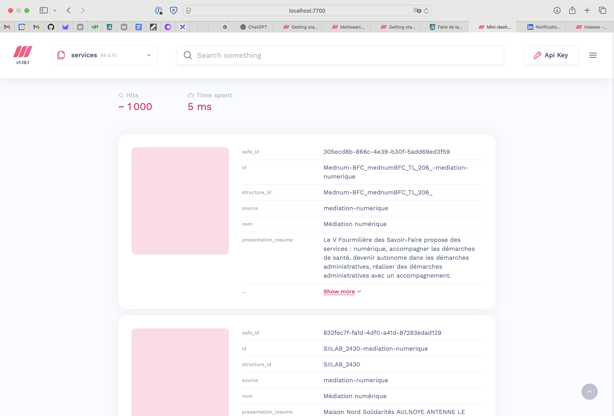
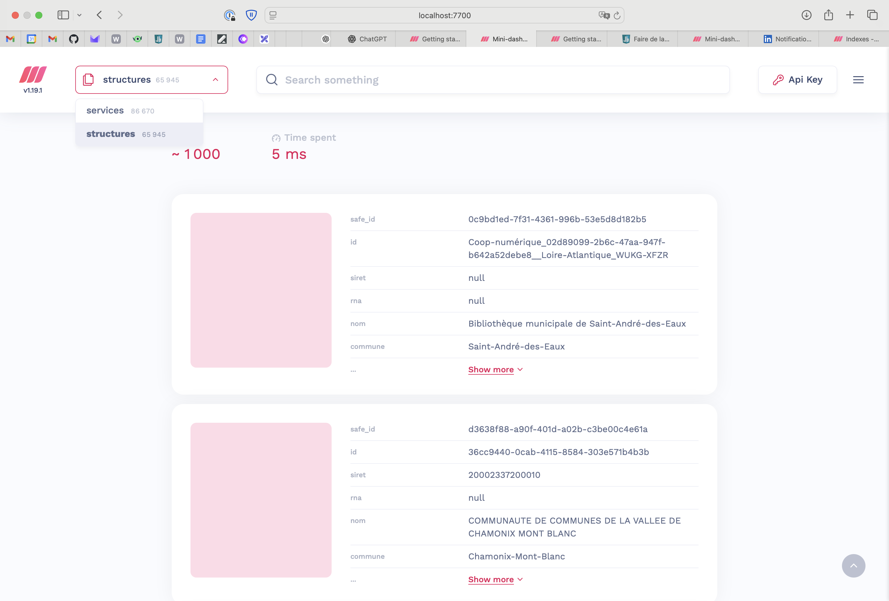

Je continue de creuser [**Meilisearch**](https://www.meilisearch.com), le moteur de recherche hybride (full-text et IA-powered) open-source, alternative à Algolia, Typesense et Elasticsearch. Dans cet article, nous allons voir comment définir et alimenter un index avec près de 90K documents depuis un fichier de données JSON récupéré sur data.gouv.fr (il y a un peu de taff),  comment mettre en place la recherche mixte (textuelle + vectorielle) et ce que ça donne comme résultat.

## 1. Faire tourner une instance Meilisearch avec Docker

```yaml
services:
  meilisearch:
    image: getmeili/meilisearch:v1.19
    container_name: meilisearch
    restart: unless-stopped
    ports:
      - "7700:7700"
    environment:
      MEILI_MASTER_KEY: "myMasterKey"   # à personnaliser
    volumes:
      - meili_data:/meili_data
    command: meilisearch --experimental-dumpless-upgrade

volumes:
  meili_data:
```

Dans Meilisearch (version Community Edition), toute l'administration se passe en ligne de commande (CLI ou API HTTP). Personnellement, mon moyen de prédilection est de faire des requêtes HTTP avec `cURL` et `jq` (pour formatter et manipuler les données JSON en réponse).

> 💡 Avec cURL, j'utilise l'option `-s | --silent` afin de ne pas être pollué par les informations de progression de récupération des données.

Pour toute requête de l'API Meilisearch, il faut passer la master key en header `AUTHORIZATION` #sécurité.
{.pros}

```shell
$ curl -s -X GET 'localhost:7700/indexes' \
  -s -H "Authorization: Bearer myMasterKey" \
  | jq

> {
  "results": [
    {
      "uid": "services",
      "createdAt": "2025-08-28T10:34:15.425435597Z",
      "updatedAt": "2025-08-28T10:34:43.891700971Z",
      "primaryKey": "safe_id"
    }
  ],
  "offset": 0,
  "limit": 20,
  "total": 1
}
```


## 2. Récupérer les données

Pour notre cas d'étude, j'ai décidé d'exploiter des données que je connais bien : l'ensemble des **services d'insertion socio-professionnelles** – alias "offre des services de l'inclusion" – référencés par la Plateforme de l'inclusion, et régulièrement mis à jour et à disposition dans la plateforme de l'état data.gouv.fr (cf. lien vers le fichier de données). Pour compléter un peu plus l'expérience et aller un cran plus loin, je vais aussi récupérer les données des **structures de l'inclusion**.

Les 2 sources de données en question :
* [liste des services](https://www.data.gouv.fr/datasets/referentiel-de-loffre-dinsertion-sociale-et-professionnelle-data-inclusion/#/resources/0eac1faa-66f9-4e49-8fb3-f0721027d89f) – +80K documents / 235Mo
  * **~/Downloads/services-inclusion-2025-08-25.json**
* [liste des structures](https://www.data.gouv.fr/datasets/referentiel-de-loffre-dinsertion-sociale-et-professionnelle-data-inclusion/#/resources/0eac1faa-66f9-4e49-8fb3-f0721027d89f) – +60K documents / 101Mo
  * **~/Downloads/structures-inclusion-2025-08-25.json**


## 3. Déclarer les indexes

À ce stade, nous disposons du contenant (Meilisearch) et d'un contenu (gros fichier JSON). Le prochain objectif est d'injecter les données (services et structures) dans le système.

Pour cela, nous définissons 2 indexes : `/services` et `structures`.

> 💡 Dans Meilisearch (et plus généralement dans les systèmes de moteur de recherche), **un index est une base de données optimisée pour la recherche, qui regroupe des documents partageant la même structure** et sur laquelle on exécute les requêtes full-text, vectorielles ou hybrides.

Dans Meilisearch (version Community Edition), toute l'administration se passe en ligne de commande (CLI ou requêtes HTTP / cURL). Personnellement, je passe pas

De façon pratique, Meilisearch créée automatiquement un index s'il n'existe pas au moment d'injecter des documents. Personnellement, je préfère déclarer les indexes moi-même, car je préfère avoir le contrôle et que dès que l'on utilise réellement la solution, il faut le plus souvent, à un moment ou un autre, paramétrer l'index.
{.pros}

La commande pour **déclarer un index** :

```shell
$ curl -s -X POST 'http://localhost:7700/indexes' \
  -H "Authorization: Bearer myMasterKey" \
  -H 'Content-Type: application/json' \
  --data '{"uid":"services","primaryKey":"id"}' \
  | jq

> {
  "taskUid": 19,
  "indexUid": "services",
  "status": "enqueued",
  "type": "indexCreation",
  "enqueuedAt": "2025-08-28T16:08:21.677341712Z"
}
```

En cas de problème ou d'erreur, il est possible de **supprimer un index** grâce à la ressource `DELETE /indexes/{index_name}` :

```shell
$ curl -s -X DELETE 'http://localhost:7700/indexes/services' \
  -H "Authorization: Bearer myMasterKey" \
  | jq

> {
  "taskUid": 16,
  "indexUid": "services",
  "status": "enqueued",
  "type": "indexDeletion",
  "enqueuedAt": "2025-08-28T16:03:56.477857464Z"
}
```

Après la création des 2 indexes, le listing des indexes devrait ressembler à :

```shell
$ curl -s -X GET 'localhost:7700/indexes' -H "Authorization: Bearer myMasterKey" | jq

> {
  "results": [
    {
      "uid": "services",
      "createdAt": "2025-08-28T16:08:21.680481753Z",
      "updatedAt": "2025-08-28T16:08:21.685127462Z",
      "primaryKey": "id"
    },
    {
      "uid": "structures",
      "createdAt": "2025-08-28T16:08:13.975849291Z",
      "updatedAt": "2025-08-28T16:08:13.983862708Z",
      "primaryKey": "id"
    }
  ],
  "offset": 0,
  "limit": 20,
  "total": 2
}
```

Tout est prêt pour importer notre premier jeu de données, les services.

## 4. Injecter les données

Pour **injecter des documents dans un index**, il faut utiliser la commande :

```shell
$ curl -X POST 'http://localhost:7700/indexes/services/documents' \
  -H "Authorization: Bearer myMasterKey" \
  -H 'Content-Type: application/json' \
  --data-binary "@${HOME}/Downloads/services-inclusion-2025-08-25.json" \
  | jq

> {
  "taskUid": 21,
  "indexUid": "services",
  "status": "enqueued",
  "type": "documentAdditionOrUpdate",
  "enqueuedAt": "2025-08-28T16:20:26.170638547Z"
}
```

Toujours dans un souci de simplifier la vie des développeurs, Meilisearch tente de détecter un champs ID pour en faire la `primaryKey` de l'index. Il se trouve que le schéma de notre jeu de données possède déjà un champs ID. Tout devrait bien se passer. Pour s'en assurer, on peut lire le début du fichier de données :
{.pros}

```shell
$ head -c 1000 ~/Downloads/services-inclusion-2025-08-25.json

> [{"id":"Mednum-BFC_mednumBFC_TL_206_-mediation-numerique","structure_id":"Mednum-BFC_mednumBFC_TL_206_","source":"mediation-numerique","nom":"Médiation numérique","presentation_resume":"Le V  Fourmilière des Savoir-Faire propose des services : numérique, accompagner les démarches de santé, devenir autonome dans les démarches administratives, réaliser des démarches administratives avec un accompagnement.","presentation_detail":"Le V  Fourmilière des Savoir-Faire propose des services : numérique, accompagner les démarches de santé, devenir autonome dans les démarches administratives, réaliser des démarches administratives avec un accompagnement.","types":["accompagnement"],"thematiques":["numerique","numerique--realiser-des-demarches-administratives-avec-un-accompagnement","numerique--devenir-autonome-dans-les-demarches-administratives","numerique--accompagner-les-demarches-de-sante"],"prise_rdv":null,"frais":[],"frais_autres":null,"profils":[],"profils_precisions":null,"%
```

La commande `POST /indexes/services/documents` s'est finie sans afficher aucune erreur. On pourrait donc se satisfaire que tout a fonctionné du premier coup. Malheureusement, ce n'est pas le cas 😩.

Chaque opération effectuée dans Meilisearch prend la forme d'une `Task`, avec différents statuts, qu'il est possible de suivre :

```shell
$ curl -s -X GET 'localhost:7700/tasks' -H "Authorization: Bearer myMasterKey" | jq

> {
  "results": [
    {
      "uid": 21,
      "batchUid": 19,
      "indexUid": "services",
      "status": "failed",
      "type": "documentAdditionOrUpdate",
      "canceledBy": null,
      "details": {
        "receivedDocuments": 86670,
        "indexedDocuments": 0
      },
      "error": {
        "message": "Document identifier `\"Coop-numérique_1a162d63-e303-4fdc-aa08-71d47634b1ff-mediation-numerique\"` is invalid. A document identifier can be of type integer or string, only composed of alphanumeric characters (a-z A-Z 0-9), hyphens (-) and underscores (_), and can not be more than 511 bytes.",
        "code": "invalid_document_id",
        "type": "invalid_request",
        "link": "https://docs.meilisearch.com/errors#invalid_document_id"
      },
      "duration": "PT0.001194792S",
      "enqueuedAt": "2025-08-28T16:20:26.170638547Z",
      "startedAt": "2025-08-28T16:20:26.17297113Z",
      "finishedAt": "2025-08-28T16:20:26.174165922Z"
    },
    # ...
  ]
}
```

❌ Il y a eu un souci lors de l'import des données. L'une des entrées possède des accents dans son ID.

Pas le choix, il faut faire un script pour "adapter les données". Je n'ai pas envie de me prendre la tête, je demande à Claude de me le créer, en Node.js. Précisément, je lui demande de générer un `safe_id` de type UUID pour chacun des objets "services".

```javascript
#!/usr/bin/env node
/**
 * make-services-clean.js
 * Lit un gros JSON (tableau) en streaming, ajoute safe_id=UUIDv4 à chaque objet,
 * et produit un nouveau fichier JSON (tableau) sans charger tout le fichier en RAM.
 *
 * Usage:
 *   node make-services-clean.js \
 *     --in ~/Downloads/services-inclusion-2025-08-25.json \
 *     --out ~/Downloads/services-clean.json
 */

const fs = require('fs');
const path = require('path');
const { pipeline } = require('stream');
const { randomUUID } = require('crypto');
const { parser } = require('stream-json');
const { streamArray } = require('stream-json/streamers/StreamArray');

function expandHome(p) {
  if (p.startsWith('~/')) return path.join(process.env.HOME || process.env.USERPROFILE || '', p.slice(2));
  return p;
}

function getArg(flag, def = null) {
  const idx = process.argv.indexOf(flag);
  return idx !== -1 && process.argv[idx + 1] ? process.argv[idx + 1] : def;
}

const inPath = expandHome(getArg('--in', '~/Downloads/services-inclusion-2025-08-25.json'));
const outPath = expandHome(getArg('--out', '~/Downloads/services-clean.json'));

// Vérifs rapides
if (!fs.existsSync(inPath)) {
  console.error(`Fichier introuvable: ${inPath}`);
  process.exit(1);
}

// Flux lecture JSON + parseur + streamer d'éléments de tableau
const readStream = fs.createReadStream(inPath, { encoding: 'utf8' });
const jsonParser = parser();
const arrayStreamer = streamArray();

// Écriture en flux du tableau de sortie
const writeStream = fs.createWriteStream(outPath, { encoding: 'utf8' });

// On écrit l'ouverture du tableau
writeStream.write('[');

let first = true;
let count = 0;

// À chaque élément {key, value} du tableau d'entrée
arrayStreamer.on('data', ({ value }) => {
  // Ajout d’un UUID v4
  value.safe_id = randomUUID();

  // Écrire la virgule entre éléments (sauf le premier)
  if (!first) {
    writeStream.write(',');
  } else {
    first = false;
  }

  // Écriture compacte pour limiter la taille du fichier
  writeStream.write(JSON.stringify(value));
  count++;
});

// Gestion fin et erreurs
arrayStreamer.on('end', () => {
  writeStream.write(']');
  writeStream.end(() => {
    console.log(`OK ✅  ${count} objets traités`);
    console.log(`→ Fichier écrit : ${outPath}`);
  });
});

arrayStreamer.on('error', (err) => {
  console.error('Erreur streamArray:', err);
  process.exit(1);
});

jsonParser.on('error', (err) => {
  console.error('Erreur parser JSON:', err);
  process.exit(1);
});

writeStream.on('error', (err) => {
  console.error('Erreur écriture fichier:', err);
  process.exit(1);
});

// Chaîner les streams
pipeline(readStream, jsonParser, arrayStreamer, (err) => {
  if (err) {
    console.error('Erreur pipeline:', err);
    process.exit(1);
  }
});
```


Pour l'exécution :

```shell
# 1. On installe les dépendances npm
$ npm i stream-json

# 2. On exécute le programme
$ node make-services-clean.js \
  --in ~/Downloads/services-inclusion-2025-08-25.json \
  --out ~/Downloads/services-clean.json

> OK ✅  86670 objets traités
→ Fichier écrit : /Users/vous/Downloads/services-clean.json
```

⚠️ Il faut regénérer l'index "services" :

```shell
$ curl -s -X DELETE 'http://localhost:7700/indexes/services' \
  -H "Authorization: Bearer myMasterKey" \
  | jq

$ curl -s -X POST 'http://localhost:7700/indexes' \
  -H "Authorization: Bearer myMasterKey" \
  -H "Content-Type: application/json" \
  --data '{"uid": "services","primaryKey": "safe_id"}' \
  | jq
```

On peut à nouveau tenter l'import des données en précisant le nouveau fichier **services-clean.json**.

```shell
$ curl -s -X POST 'http://localhost:7700/indexes/services/documents' \
  -H "Authorization: Bearer myMasterKey" \
  -H "Content-Type: application/json" \
  --data-binary @${HOME}/Downloads/services-clean.json \
  | jq
```

🎉 Cette fois-ci, c'est bon !



Plus qu'à faire pareil pour les structures :

```shell
# Préparation des données
$ node make-services-clean.js \
  --in ~/Downloads/structures-inclusion-2025-08-25.json \
  --out ~/Downloads/structures-clean.json

> OK ✅  65945 objets traités
→ Fichier écrit : /Users/jeremy.buget/Downloads/structures-clean.json

# Suppression de l'index
$ curl -s -X DELETE 'http://localhost:7700/indexes/structures' \
  -H "Authorization: Bearer myMasterKey" \
  | jq

> {
  "taskUid": 25,
  "indexUid": "structures",
  "status": "enqueued",
  "type": "indexDeletion",
  "enqueuedAt": "2025-08-28T17:26:13.15551343Z"
}

# Re-création de l'index (avec safe_id en 'primaryKey')
$ curl -X POST 'http://localhost:7700/indexes' \
  -H "Authorization: Bearer myMasterKey" \
  -H 'Content-Type: application/json' \
  --data '{"uid":"structures","primaryKey":"safe_id"}' \
  | jq

> {
  "taskUid": 26,
  "indexUid": "structures",
  "status": "enqueued",
  "type": "indexCreation",
  "enqueuedAt": "2025-08-28T17:27:18.49903921Z"
}

# Import des données
> curl -X POST 'http://localhost:7700/indexes/structures/documents' \
  -H "Authorization: Bearer myMasterKey" \
  -H "Content-Type: application/json" \
  --data-binary @${HOME}/Downloads/structures-clean.json

> {
  "taskUid":27,
  "indexUid":"structures",
  "status":"enqueued",
  "type":"documentAdditionOrUpdate",
  "enqueuedAt":"2025-08-28T17:27:58.287191339Z"
}
```

🚀 C'est au tour des données de structures de s'afficher !



## 5. Définir des filtres et facettes

## 6. Activer et configurer la recherche par IA (vectorielle)


## Récapitulatif des principales requêtes utilisées

```shell
# Créer un index
$ curl -s -X POST 'http://localhost:7700/indexes' -H "Authorization: Bearer myMasterKey" -H 'Content-Type: application/json' --data '{"uid":"services","primaryKey":"id"}' | jq

# Lister les indexes
$ curl -s -X GET 'localhost:7700/indexes' -H "Authorization: Bearer myMasterKey" | jq

# Supprimer un index
$ curl -s -X POST 'http://localhost:7700/indexes' -H "Authorization: Bearer myMasterKey" -H 'Content-Type: application/json' --data '{"uid":"services","primaryKey":"id"}' | jq

```
