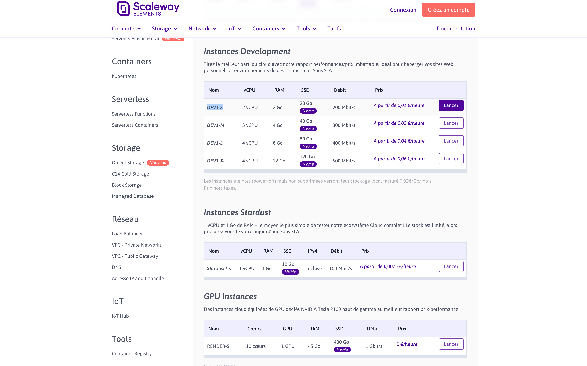
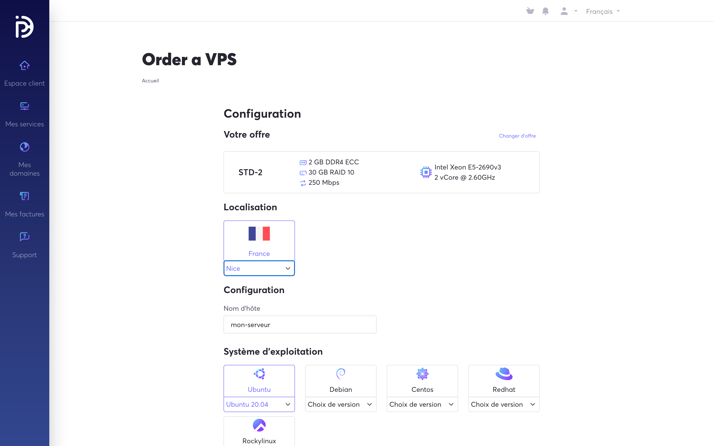
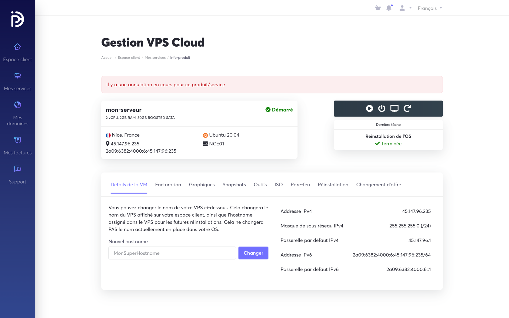
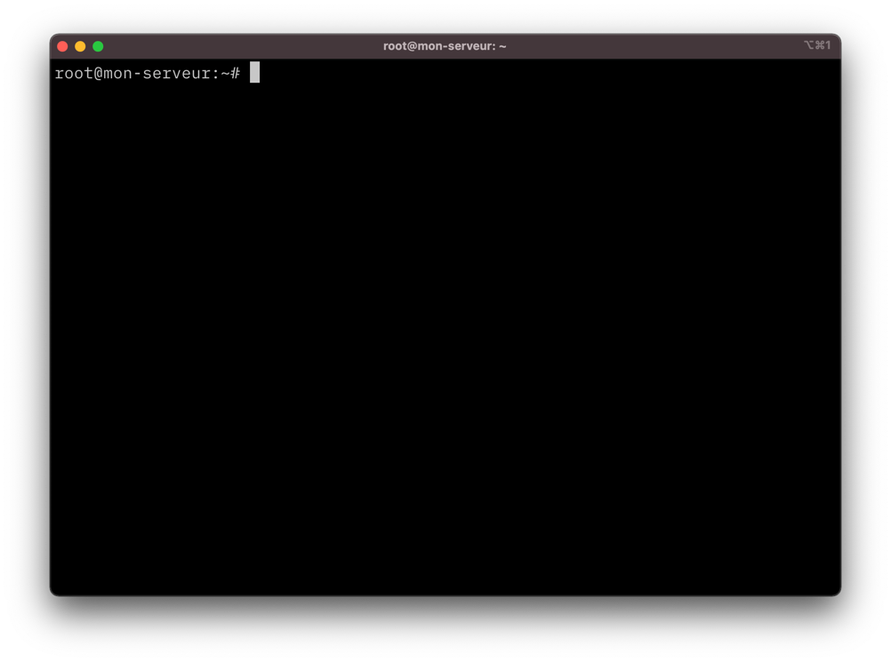
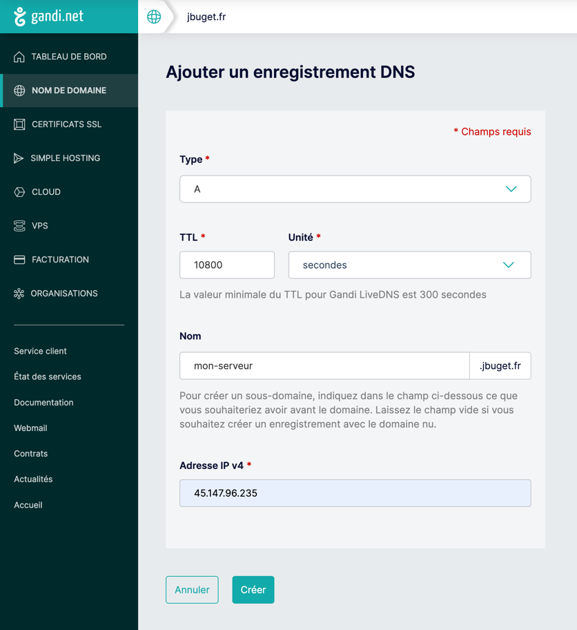

> 📚 Cet article fait partie de la série "Héberger ses propres services managés sur un VPS avec Træfik et Docker / Compose".
> Voir : [part. 1](../part-1) / [part. 2](../part-2) / [part. 3](../part-3)

## TL;DR

Héberger et gérer sa propre infrastructure permet de conserver un maximum de contrôle sur les services que l'on expose, comment et à quel prix.

Les offres d'hébergement et outils actuels simplifient et accélèrent grandement la mise en œuvre de solutions open source de qualité, de façon sécurisée.

Il suffit d'un VPS, d'une instance Træfik (reverse proxy), d'un peu de Docker / Docker Compose (gestionnaire de conteneurs) et de quelques variables d'environnement pour créer de la magie.

## Introduction

L'objet de cet article consiste à commander, installer et configurer un serveur à partir de zéro, pour y gérer simplement et rapidement tout un tas d'applications Web open source, grâce à Docker, Docker Compose et surtout au proxy inverse Træfik.

Ce billet ne couvre pas l'achat et ne rentre pas dans les détails de la gestion d'un DNS.

À la fin, vous devriez disposer de tout le nécessaire pour pouvoir déployer et gérer correctement vos propres services, en toute connaissance de cause.

## Prérequis

☝️ Avant de commencer, assurez-vous de **disposer d'un nom de domaine opérationnel**.

Pour la suite du tutoriel, j'utiliserai mon nom de domaine `jbuget.fr`, administré via [Gandi](https://gandi.net).

## 1. Commande du VPS

J'ai pour habitude de louer des VPS chez [OVH](https://www.ovhcloud.com/fr/vps/) ou [Scaleway](https://www.scaleway.com/fr/tarifs/).

Pour cet article, j'ai décidé de tester un nouvel hébergeur français 🇫🇷, [PulseHeberg](https://pulseheberg.com/), qui présente des tarifs un peu plus bas que la concurrence, à performance et offre de services (sur le papier) comparables (cf. [Annexes](#annexes)).
{.pros}

Je vais partir sur une instance de VPS plutôt petite : la STD-2, 2vCore @ 2,60GHz, 2Go RAM DDR4, 30 Go SSD, 250Mbps, à 4€/mois. 

**Pour un usage plus pérenne, je conseille de prendre la taille du dessus, avec 4vCore et au moins 4Go RAM** (que l'on trouve généralement entre 6 et 10€ sur le marché).

> Pour info, mon infra Web (pour le site et des petits utilitaires Web) tourne sur un VPS OVH S1-4, 1vCore @ 2,4GHz, 4 Go RAM, 20 Go SSD, 100 Mbps, à 6,99€/mois.
> 
> Il serait peut-être temps de songer à changer… 🤔

En revanche, la tarification se fait au mois, et non à la minute, comme les autres hébergeurs (ce qui peut expliquer que PulseHeberg propose des prix légèremment inférieurs).
{.cons}

[Tarifs VPS OVH :](https://www.ovhcloud.com/fr/vps/)


[Tarifs VPS Scaleway :](https://www.scaleway.com/fr/tarifs/)


[Tarifs VPS PulseHeberg :](https://pulseheberg.com/cloud)


La création de compte sur PulseHeberg est rapide.
{.pros}

> ⚠️ Remarque : pensez à bien activer l'authentification à deux facteurs une fois votre compte créé et validé. 
 
De même que la commande du serveur.
{.pros}



À noter toutefois que, depuis le manager (en tant qu'utilisateur connecté), toutes les offres ne sont pas remontées, notamment la machine escomptée. Il faut revenir sur la page des offres depuis le site vitrine. 
{.cons}

> 💡 Lors de la configuration du serveur, spécifié bien un mode de connexion par mot de passe. Nous y reviendrons plus tard, dans la section consacrée à la sécurisation du serveur.

Autre bon point : le VPS est livré rapidement (moins d'une minute).
{.pros}

Juste après l'approvisionnement de la machine, je file dans les options pour résilier le serveur à la fin de la prestation, dans un mois.
Je suis heureux de constater que je peux quand même le manipuler à loisir (ex : le réinstaller complètement parce que j'ai bloqué le compte root) d'ici là.
{.pros}

Nous pouvons commencer à nous amuser 😋 !



## 2. Premiers pas & sécurisation de l'environnement

### 2.1. Vérifier la connexion

Maintenant que nous disposons d'une machine, la première chose à faire est de s'y connecter et voir que tout est ok.

Une fois que votre machine est prête à être utilisée, vous devriez avoir reçu un message, email ou notification de votre hébergeur pour vous donner les informations d'accès, IP (dans mon cas `45.147.96.235`), mot de passe, etc.

```shell
# As localhost

$ ssh root@45.147.96.235
```

Dans la mesure où j'ai demandé la connexion via mot de passe, je dois saisir le mot de passe fourni par PulseHeberg pour valider la connexion.



Tout est ok, nous pouvons passer à la suite.

### 2.2. Brancher un nom de domaine

Cette étape est optionnelle, mais c'est un goût personnel.
Je préfère travailler avec des noms plutôt que des adresses IP.

Dans mon gestionnaire de DNS (rappel : ici, c'est Gandi), j'édite la zone DNS pour y ajouter un enregistrement de type `A` (pointeur d'un nom vers une adresse IPv4).



Cela me permet de me connecter à mon serveur en utilisant la commande : 

```shell
# As localhost

$ ssh root@mon-serveur.jbuget.fr
```

### 2.3. Sécuriser le serveur

Une chose critique à faire, quand on récupère un serveur neuf ou réinstallé entre les mains, est de le sécuriser assez rapidement.

Il existe plein de guides et articles pratiques sur le sujet.
Personnellement, j'aime bien me référer à [la documentation d'OVH sur le sujet](https://docs.ovh.com/fr/vps/conseils-securisation-vps/), que je trouve pertinente et bien faite.
Je vous conseille également la lecture de l'article de Rémi : "[Sécuriser son serveur Linux](https://www.remipoignon.fr/securiser-son-serveur-linux/)". 
Ou bien encore de celui d'Imrane "[Comment sécuriser son VPS](https://imrane.substack.com/p/comment-securiser-son-vps?s=r)".

Ma routine personnelle (à adapter en fonction de vos envies / besoins / compétences) consiste à :
- mettre à jour les paquets
- installer fail2ban
- changer le mot de passe du compte "root" fourni avec la machine
- ajouter un utilisateur usuel ("toor") aux droits restreints
- empêcher la connexion au serveur en tant que "root"
- modifier le port SSH par défaut (22 → [un port non assigné](https://www.google.com/search?q=unassigned+ports) inférieur à 1024)
- générer un jeu de clés SSH et l'ajouter sur le serveur pour l'utilisateur "toor" 

Vous trouverez le détail des commandes et des explications dans les différents articles ci-dessus.

> 💡 La question de changer le port 22 est souvent débattue. 
> Les experts Ops et Sécu avec qui j'ai discuté ont tendance à soutenir que ça ne sert à rien. 
> Dans les faits, on constate que ça écarte surtout les script kiddies, mais ça n'arrête pas les attaques plus sérieuses. Il existe d'autres arguments très pertinents pour ne pas toucher le port (la puissance des standards).
> 
> Personnellement, je n'ai pas d'avis tranché. 
> Je pars du principe que le fait de devoir saisir le port à chaque connexion SSH n'est pas si contraignante, et que la sécurité est d'abord un empilement pertinent et "chiant juste comme il faut pour les personnes autorisées".
> Bref, démerdez-vous avec ça 😆

PulseHeberg propose un firewall dans les options de configuration du serveur.
Je l'ai activé, plus par curiosité qu'autre chose.
Mais pour pouvoir faire des choses avec mon serveur, dont le but dans la vie est d'exposer des applications Web, j'ai activé la règle par défaut "Accept all"
Pas certain que ce soit des plus utile… 🤷‍♂️ 
{.pros}

À partir de là, je me connecte au serveur ainsi : 

```shell
# As localhost

$ ssh -p 326 toor@mon-serveur.jbuget.fr
# → pas besoin de mot de passe grâce aux clés SSH
```

Pour effectuer des commandes en tant que "root" : 

```shell
# As "toor"

$ su root
# → saisie du mot de passe pour le compte "root"
```

### 2.4. Installer Docker

Les instructions ci-dessous sont reprises depuis [le guide d'installation officiel de Docker pour Linux / Ubuntu](https://docs.docker.com/engine/install/ubuntu/).
Elles sont à effectuer en tant que "root" (cf. paragraphe "effectuer des commandes en tant que 'root'" ci-dessus).

```shell
# As "root"

$ sudo apt-get update
$ sudo apt-get install ca-certificates curl gnupg lsb-release
$ curl -fsSL https://download.docker.com/linux/ubuntu/gpg | sudo gpg --dearmor -o /usr/share/keyrings/docker-archive-keyring.gpg
$ echo "deb [arch=$(dpkg --print-architecture) signed-by=/usr/share/keyrings/docker-archive-keyring.gpg] https://download.docker.com/linux/ubuntu $(lsb_release -cs) stable" | sudo tee /etc/apt/sources.list.d/docker.list > /dev/null
$ sudo apt-get update
$ sudo apt-get install docker-ce docker-ce-cli containerd.io
$ sudo docker run hello-world
```

Dans la mesure où l'installation de Docker se fait en tant que "root", nous devons faire en sorte de rendre le programme disponible pour tous les utilisateurs du serveur.

```shell
# As "root"

$ sudo groupadd docker
$ sudo usermod -aG docker toor
```

Pour que la modification soit prise en compte, il faut quitter les sessions "root" et "toor", et se reconnecter au serveur en tant que "toor".
Tout est expliqué dans [les instructions post-installation](https://docs.docker.com/engine/install/linux-postinstall/) de la documentation officielle.
Normalement, Docker est désormais disponible sans avoir à précéder les commandes avec `sudo`.

```shell
# As "toor"

$ docker run hello-world
```

### 2.5. Installer Docker Compose

Pour finir, il nous reste l'installation de Docker Compose avant de pouvoir passer à la suite.

Une fois encore, l'équipe Docker a mâché le boulot, avec une [page de documentation](https://docs.docker.com/compose/install/) fonctionnelle, dont je reproduis ci-dessous les commandes à effectuer :

```shell
# As root

$ sudo curl -L "https://github.com/docker/compose/releases/download/1.29.2/docker-compose-$(uname -s)-$(uname -m)" -o /usr/local/bin/docker-compose
$ sudo chmod +x /usr/local/bin/docker-compose
```

## Conclusion

Désormais, tout est prêt pour s'attaquer véritablement à la mise en œuvre de Træfik et des services managés.

## Tous les articles de la série

- [part. 1](../part-1) (actuel)
- [part. 2](../part-2)
- [part. 3](../part-3)
