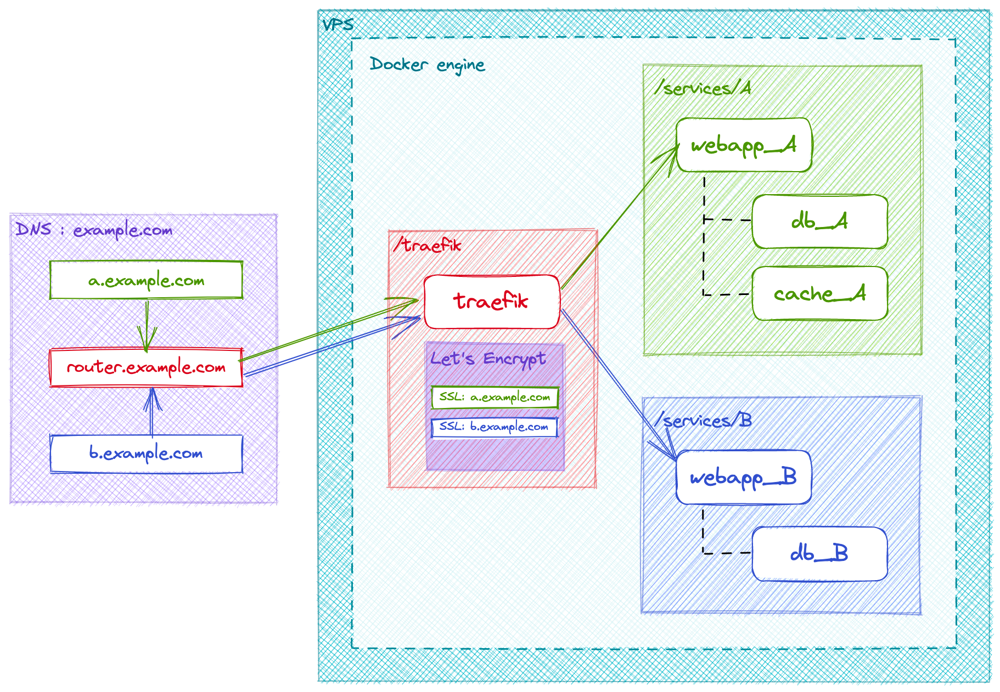
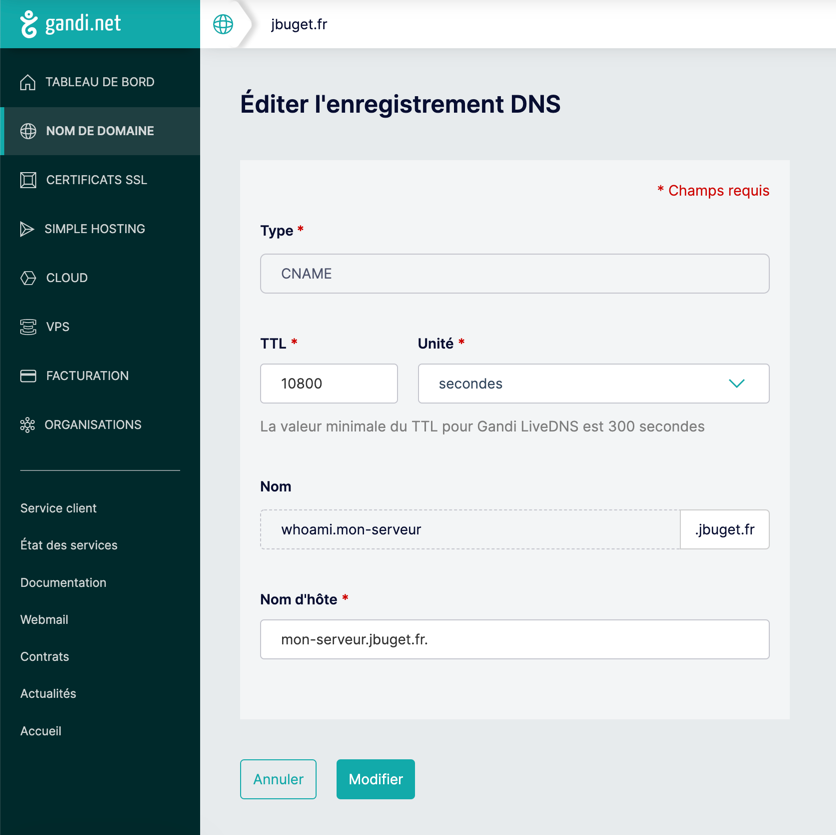
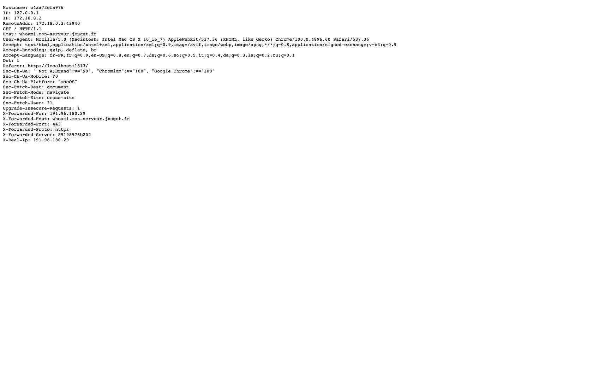

> 📚 Cet article fait partie de la série "Héberger ses propres services managés sur un VPS avec Træfik et Docker / Compose".
> Voir : [part. 1](../part-1) / [part. 2](../part-2) / [part. 3](../part-3)

## Table des matières

- [Introduction](#introduction)
- [Objectif](#objectif)
- [Solution](#solution)
- [Réalisation](#réalisation)
  - [1. Prérequis : déclarer un réseau Docker partagé et exposé](#1-prérequis--déclarer-un-réseau-docker-partagé-et-exposé)
  - [2. Configurer le DNS de notre premier service managé](#2-prérequis--configurer-le-dns-de-notre-premier-service-managé)
  - [3. Faire tourner une instance de Træfik](#3-faire-tourner-une-instance-de-træfik)
  - [4. Quelques explications](#4-quelques-explications)
  - [5. Go live!](#5-go-live)
- [Conclusion](#conclusion)

## Introduction

Il est temps de passer aux choses sérieuses !

Dans cette partie, nous nous concentrerons sur la mise en place d'une instance Træfik via Docker & Compose et nous configurerons + exposerons notre premier service managé, `whoami`, à l'adresse https://whoami.mon-serveur.jbuget.fr.

## Objectif

Le but du jeu est d'obtenir une infrastructure qui permette d'installer, configurer et exposer des services open source (ou propriétaires), de façon simple, rapide, sécurisée, standardisée, performante et sans surcoût (autre que le DNS et le VPS déjà payés).

## Solution

Pour ce faire, nous utiliserons une solution open source de reverse proxy.

> ℹ️ Un proxy inverse (reverse proxy) ou serveur mandataire inverse est un type de serveur, habituellement placé en frontal de serveurs web. Contrairement au serveur proxy qui permet à un utilisateur d'accéder au réseau Internet, le proxy inverse permet à un utilisateur d'Internet d'accéder à des serveurs internes.
> 
> -- [Wikipedia](https://fr.wikipedia.org/wiki/Proxy_inverse)

Les reverse proxy les plus connus et utilisés à ma connaissance sont NGINX, Apache HTTP Server ou encore HAProxy.

Ces derniers temps (18 mois, au moment où j'écris ces lignes), j'ai pris l'habitude d'utiliser Træfik, qui est l'objet de cet article.

**Træfik est une solution complète de reverse proxy open source.**

J'apprécie tout particulièrement plusieurs points avec Træfik :
- c'est développé en Go (oui, c'est un vrai point pour moi, j'aime bien les projets en Go 😅)
- c'est performant et léger (peu de consommation de ressources sur le serveur)
- ça tourne très bien dans un conteneur Docker #inception
- Træfik propose de l'auto-discovery de services
- d'ailleurs, Træfik support plusieurs fournisseurs (_providers_) de services : Docker, configuration fichier, Kubernetes, etc.
- Træfik gère le SSL comme un grand et génère des certificats Let's Encrypt automatiquement
- il est possible de monitorer les services et d'avoir des détails via une interface d'administration
- Træfik repose sur une architecture à base de middlewares
- ce qui lui permet de proposer et supporter : du load-balancing, diverses authentifications, du caching, du rate limiting, etc. 
{.pros}

Bref, Træfik, c'est la vie 🔥

**L'objectif est de faire en sorte que les services que l'on souhaite fournir soient découverts et exposer automatiquement par Træfik, avec la bonne URL.**



Dans l'exemple ci-dessus, nous souhaitons exposer 2 services (ex : A = Plausible, outil de suivi d'audience ; B = Shlink, raccourcisseur d'URL), chacun possédant une architecture technique propre (PHP vs. Node.js).

Nous voulons accéder à chacun de ces services via une URL dédiée :
- [plausible.mon-serveur.jbuget.fr](https://plausible.mon-serveur.jbuget.fr)
- [shlink.mon-serveur.jbuget.fr](https://shlink.mon-serveur.jbuget.fr)

Entre les deux, nous voulons que le routeur écoute l'URL [mon-serveur.jbuget.fr](https://mon-serveur.jbuget.fr).

> 💡 Remarque : on voit dans cet exemple qu'on souhaite avoir un sous-domaine sur 2 niveaux. Dans les faits, je préfère exposer - et c'est tout à fait possible - mes services sur 1 seul niveau, ex : [analytics.jbuget.fr](https://analytics.jbuget.fr).

## Réalisation

Toutes les étapes ci-dessous ont lieu sur le serveur, depuis le compte usuel "toor" (sauf contre-indication).

> ✍️ Pour rappel, nous avons configuré 2 comptes sur notre VPS : "root", qui possède tous les droits d'administration et "toor", qui est un utilisateur usuel / limité #sécurité.

### 1. Prérequis : déclarer un réseau Docker partagé et exposé

Pour commencer, _une chose importantissime_ ❗️ consiste à déclarer un réseau Docker, dont le but est de permettre aux différents conteneurs à exposer des services, de communiquer avec le routeur Træfik, de façon sécurisée.

Ainsi, les services dont la stack est composée de plusieurs conteneurs devant communiquer entre eux devront définir à chaque fois au moins 2 réseaux :
- un network interne (que j'appelle "internal")
- un network ouvert et exposé (que j'appelle "web")

Cela se fait avec la commande : 

```shell
# As "toor"

$ docker network create web
```

Il y sera fait appel (en fin de fichier) dans tous les fichiers docker-compose.yml des services à exposer, y compris celui de notre instance Træfik.

```yaml
# /services/xxx/docker-compose.yml

# ... bla bla bla ...

networks:
  web:
    external:
      name: web
```

### 2. Prérequis : configurer le DNS de notre premier service managé

Toujours dans les prérequis techniques, nous devons déclarer dans notre zone DNS un enregistrement de type `CNAME` (mapping d'un URL à URL) pour notre futur premier service `whoami` (cf. configuration ci-dessous).



> ⚠️ **Attention ! à bien mettre le `.` final dans le nom d'hôte** sous peine de perdre de longues, très longues (30-90mn) minutes à l'aveugle #Vécu…

### 3. Faire tourner une instance de Træfik

Il est possible de faire tourner Træfik en tant que process indépendant ou service unix, via le CLI officiel.
Je préfère m'en tenir à la version Docker, comme préconisée et mise en avant dans [la documentation](https://doc.traefik.io/traefik/getting-started/quick-start/).

Pour commencer, à la racine du compte - `/user/toor/` - on crée le dossier "traefik", que l'on initialise avec un fichier `docker-compose.yml`.

```shell
# As "toor", from ~

$ mkdir traefik
$ cd traefik
$ touch docker-compose.yml
```

Træfik propose 3 façons exclusives (l'une de l'autre) de configurer le proxy : 
- par fichier de configuration (au format YAML, TOML)
- en arguments du CLI
- via des variables d'environnement

> ☝️ Par commodité autant que par habitude, j'utilise la version arguments du CLI depuis Docker.
Je pense quand même que sortir la configurtion dans un fichier dédié est plus propre, et si on me demande, ce serait la version que je préconise. 

L'idée n'est pas que je paraphrase ou recopie ici la documentation officielle.
De même je ne compte pas rentrer dans le détail des explications et m'étendre plus que de nécessaire sur chacun des concepts et terminologies relatives à la technologie.
Je vous invite à consulter la documentation et les nombreuses ressources disponibles sur le Net, si mes explications ne répondent pas complètement à vos questions.

Ci-dessous la configuration que j'utilise pour faire tourner mon instance de Træfik sur mon infra.  

```yaml
# /traefik/docker-compose.yml

version: "3"

services:

  traefik:
    image: "traefik:v2.6"
    container_name: "traefik"
    command:
      - "--api.insecure=true"
      - "--api.dashboard=true"
      - "--providers.docker=true"
      - "--providers.docker.exposedbydefault=false"
      - "--providers.file.directory=/etc/traefik"
      - "--providers.file.watch=true"
      - "--entrypoints.web.address=:80"
      - "--entrypoints.web.http.redirections.entryPoint.to=websecure"
      - "--entrypoints.websecure.address=:443"
      - "--certificatesresolvers.myresolver.acme.tlschallenge=true"
      - "--certificatesresolvers.myresolver.acme.email=some.admin@jbuget.fr"
      - "--certificatesresolvers.myresolver.acme.storage=/letsencrypt/acme.json"
    ports:
      - "80:80"
      - "443:443"
      - "8080:8080"
    volumes:
      - "./letsencrypt:/letsencrypt"
      - "/var/run/docker.sock:/var/run/docker.sock:ro"
      - ".:/etc/traefik"
    networks:
      - web

  whoami:
    image: "traefik/whoami"
    container_name: "simple-service"
    networks:
      - web
    labels:
      - "traefik.enable=true"
      - "traefik.http.routers.whoami.rule=Host(`whoami.mon-serveur.jbuget.fr`)"
      - "traefik.http.routers.whoami.entrypoints=websecure"
      - "traefik.http.routers.whoami.tls.certresolver=myresolver"


networks:
  web:
    external:
      name: web
```

> 🚀 Pour voir le résultat immédiatement, rendez-vous à la section [5. Go live!](#5-go-live) et revenez aux explications après 😉.

### 4. Quelques explications

On remarque que la stack ci-dessus déclare 2 services et 1 network :
- services
  - traefik : notre instance de reverse proxy
  - whoami : [un micro server web](https://github.com/traefik/whoami) développé (en Go 😉) et propulsé par Træfik, qui fournit des informations sur l'OS et les requêtes HTTP 
- network
  - web : notre fameux réseau Docker pour faire communiquer les containers / stacks avec le conteneur Træfik

Les arguments `api.insecure=true` et `api.dashboard=true` permettent à moindre frais (mais avec un déficit de sécurité pour la première) d'exposer le Dashboard de notre instance Træfik.

L'argument `providers.docker=true` indique à Træfik d'écouter l'activité liée aux conteneurs et stacks Docker, et ainsi activer l'auto-découvrabilité pour les services Dockerisés.

Par défaut et pour des soucis de sécurité, je préfère conserver la main sur l'exposition ou non des services.
D'où l'argument `providers.docker.exposedbydefault=false` (par défaut à _true_).

En conséquence de quoi, pour qu'un service soit _découvert_ par Træfik, celui-ci doit être marqué comme exposé via le label `traefik.enable=true`, cf. les labels du service whoami, ci-dessus.

Les arguments `providers.file.directory=/etc/traefik` et `providers.file.watch=true` indiquent à Træfik où se situent les fichiers statiques de configuration de l'instance, et activent le "[mode observation active](https://doc.traefik.io/traefik/providers/file/#watch)" de fichiers.

Les arguments `entrypoints.web.address=:80"`, `entrypoints.web.http.redirections.entryPoint.to=websecure` et `entrypoints.websecure.address=:443` servent à indiquer à Træfik quels ports HTTP(S) écouter, et définissent une redirection automatique de HTTP vers HTTPS.
En langage Træfik, ils permettent de définir 2 points d'entrée ([_entrypoints_](https://doc.traefik.io/traefik/routing/entrypoints/)) : "web" (à ne pas confondre avec le réseau Docker créé tantôt) et "websecure".

Ils sont à considérer avec les options de mapping + exposition des ports `80:80`, `443:443` et `8080:8080` (ce dernier étant requis pour le Dashboard).
Ce sont ces quelques lignes qui font que le reverse proxy Træfik est _connecté_ à l'IP de la machine et branché à Internet #VulgarisationTechnique.  

Enfin, les arguments `certificatesresolvers.myresolver.acme.tlschallenge=true`, `certificatesresolvers.myresolver.acme.email=some.admin@jbuget.fr` et `certificatesresolvers.myresolver.acme.storage=/letsencrypt/acme.json` permettent de configurer la gestion et génération automatique de certificats SSL via Let's Encrypt (grâce à un [Certificate Resolver](https://doc.traefik.io/traefik/https/acme/#certificate-resolvers)) pour chaque service managé.
Ces derniers sont stockés dans le fichier `/traefik/letsencrypt/acme.json`.

> 💡 Dans la mesure où Docker a été installé depuis le compte "root", lorsqu'il génère des fichiers ou répertoires, ceux-ci lui sont attachés.
> 
> Ainsi, il n'est pas possible pour le compte "toor" de lire le fichier ~/traefik/letsencrypt/acme.json même si c'est lui qui a créé le répertoire "traefik" sur son propre espace.
> 
> Pour ce faire, il faut repasser en mode "root".
> Je déconseille, pour des raisons de sécurité, de changer les droits du fichier `acme.json`.

À titre de curiosité, le fichier `acme.json` généré par Træfik devrait ressembler à ceci : 

```javascript
{
  "myresolver": {
    "Account": {
      "Email": "some.admin@jbuget.fr",
      "Registration": {
        "body": {
          "status": "valid",
          "contact": [
            "mailto:some.admin@jbuget.fr"
          ]
        },
        "uri": "https://acme-v02.api.letsencrypt.org/acme/acct/4814..."
      },
      "PrivateKey": "MIIJK...",
      "KeyType": "4096"
    },
    "Certificates": [
      {
        "domain": {
          "main": "whoami.mon-serveur.jbuget.fr"
        },
        "certificate": "LS0tL...",
        "key": "LS0tL...",
        "Store": "default"
      }
    ]
  }
}
```

Penchons-nous à présent du côté du service managé `whoami`.

Outre les éléments habituels `image` et `container_name`, le premier élément remarquable est la déclaration du réseau "web".
Rien de surprenant à ce niveau-là, comme nous l'avons vu à la section "[1. Prérequis : déclarer un réseau Docker partagé et exposé](#1-prérequis--déclarer-un-réseau-docker-partagé-et-exposé)".
Cette configuration indique que le conteneur "whoami" aura accès au réseau Docker "web", et sera lui-même accessible par les autres conteneurs attachés au réseau.

Vient toute une succession d'options de `labels`.
Comme indiqué précédemment, la première option `"traefik.enable=true"` permet d'activer la découverte en tant que service par Træfik.

Les options `traefik.http.routers.whoami.*` servent à définir le comportement du service :
- `"rule=Host('whoami.mon-serveur.jbuget.fr')"` : indique que le service répond au sous-DNS "whoami.mon-serveur.jbuget.fr" (rappel : Træfik est branché et écoute les requêtes pour le sous-DNS "mon-serveur.jbuget.fr")    
- `"entrypoints=websecure"` : indique que le point d'entrée écouté est "websecure" (défini dans la config Træfik ci-dessus)
- `"tls.certresolver=myresolver"` : indique que le résolveur TLS/SSL est "myresolver" (lui aussi défini ci-dessus)

En fin de fichier, on retrouve la déclaration des réseaux utilisés pour cette stack Docker. 

### 5. Go live!

Il est temps de lancer le tout : 

```bash
# As "toor", from ~/traefik

$ docker-compose up -d
```

Si vous vous rendez sur l'URL de votre serveur (ici : `mon-serveur.jbuget.fr`), vous devriez être surpris·e de tomber sur une page blanche "404 page not found".
Pas de panique, cela signifie que le proxy est opérationnel, mais qu'ils n'a pas de contenu à servir sur cette route particulière.


Rendez-vous maintenant à l'URL https://whoami.mon-serveur.jbuget.fr et auto-congratulez-vous 🤝 !



## Conclusion

Et voilà ! Vous avez un serveur avec un _reverse proxy_ moderne prêt à exposer tout plein de services trop stylés grâce à Docker.

Prochaine étape : déclarer et exposer nos premiers "vrais" services managés.

## Tous les articles de la série

- [part. 1](../part-1)
- [part. 2](../part-2) (actuel)
- [part. 3](../part-3)
