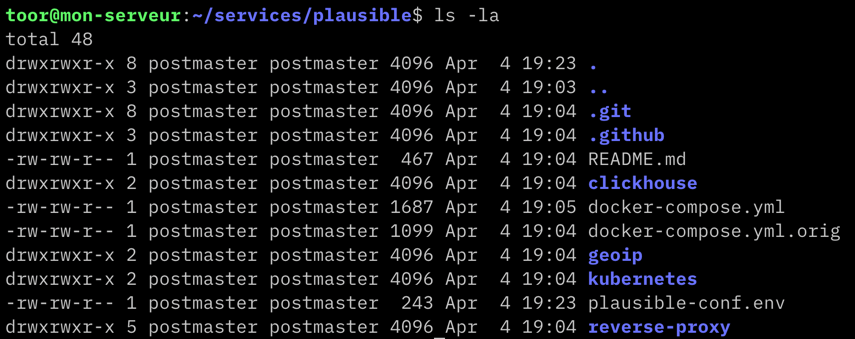
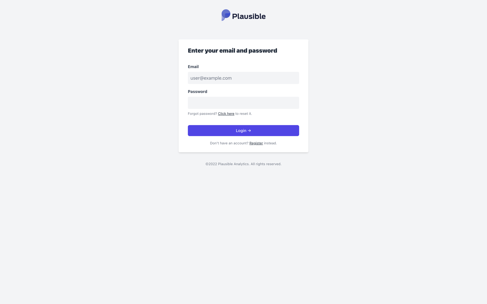
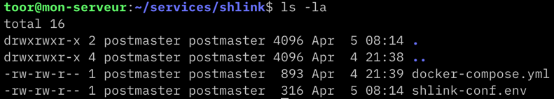
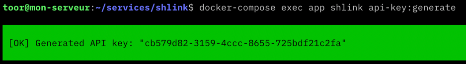
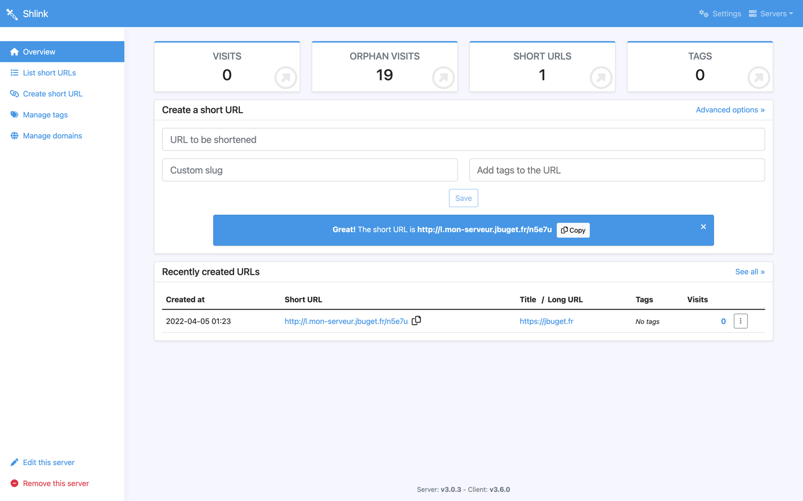

> 📚 Cet article fait partie de la série "Héberger ses propres services managés sur un VPS avec Træfik et Docker / Compose".
> Voir : [part. 1](../part-1) / [part. 2](../part-2) / [part. 3](../part-3)

## Table des matières

- [Procédure](#procédure)
- [Exemple 1 : Plausible](#exemple-1--plausible)
- [Exemple 2 : Shlink](#exemple-2--shlink)
  - [2.1. Comprendre le projet](#21-comprendre-le-projet)
  - [2.2. Définir une entrée DNS](#22-définir-une-entrée-dns)
  - [2.3. Générer une clé GeoLite2](#23-générer-une-clé-geolite2)
  - [2.4. Créer et éditer les fichiers Docker Compose et de configuration](#24-créer-et-éditer-les-fichiers-docker-compose-et-de-configuration)
  - [2.5. Utilisation du client Web en ligne fourni par Shlink](#25-utilisation-du-client-web-en-ligne-fourni-par-shlink)
- [Conclusion](#conclusion)
- [Liens](#liens)

## Procédure

La recette pour déployer et administrer un service Docker via Træfik est un peu toujours la même.

1. Il faut commencer par étudier rapidement l'architecture de la solution pour comprendre quelle sont les briques principales (webapp, api, db, cache, etc.), celles secondaires, les variations d'installation possibles (utiliser telle ou telle base de données, tel ou tel web server, etc.).
2. Une fois qu'on est chaud, on commence par déclarer un enregistrement DNS de type `CNAME` pointant vers l'URL serveur `mon-serveur.jbuget.fr.` (histoire d'éviter des problèmes de génération de certificats SSL/Let's Encrypt) 
3. On recherche au sein du projet ou de l'organisation GitHub / GitLab du matériel Docker, l'idéal étant de trouver un fichier `docker-compose.yml` proposé par l'éditeur et prêt à l'emploi
4. Sur notre serveur, on crée un répertoire dédié pour y déclarer ou copier-coller le fichier `docker-compose.yml` correspondant
5. On renseigne les variables d'environnement dans le fichier Compose ou les éventuels fichiers de config associés
6. Dans le fichier Compose, dans la partie "définition du service Web exposé", on ajoute la partie `labels`
7. Si la stack comporte plusieurs composants qui doivent communiquer entre eux (cas commun), on prend soin de définir pour chaque composant les bons réseaux Docker ("internal" et/ou "web")
8. Si le webserver écoute sur un port autre que 80, on pense à définir le libellé `traefik.http.services.<service>.loadbalancer.server.port=<port>` et à exposer le port en question
9. En fin de fichier, on pense à déclarer le/les volumes et les réseaux utilisés, notamment le réseau "web"
10. Il ne reste plus qu'à démarrer la stack ave cla commande `docker-compose up -d`

## Exemple 1 : Plausible

Plausible est une solution open source de suivi de web analytics. C'est une alternative simple et légère à Google Analytics ou Matomo.

> 💡 Plausible est la solution que j'utilise sur mon site pour suivre et comprendre l'audience, afin de proposer un contenu et une expérience utilisateur pertinente et de qualité. Plus de détails sur la page [/stats](/stats).

Ce premier exemple est intéressant dans la mesure où la stack nécessaire embarque un composant web ("plausible") qui écoute sur le port `8000` (plutôt que `80`) et nécessite de faire communiquer plusieurs composants sur un réseau interne (lequel n'a pas besoin et ne doit pas être ouvert à l'extérieur).

Comme indiqué dans [la documentation officielle](https://plausible.io/docs/self-hosting#:~:text=Plausible%20Analytics%20is%20designed%20to,own%20instance%20of%20Plausible%20Analytics.), l'installation de Plausible se fait en récupérant les sources du projet.

Dans le répertoire `~/services`, créer un nouveau dossier `plausible`.

```shell
# As "toor", from ~/services

$ git clone https://github.com/plausible/hosting plausible && cd plausible
```

On obtient l'arborescence suivante :



> 💡 Noter la présence du fichier `docker-compose.yml.orig` qui est unecopie du fichier initial, au cas où…

Éditer le fichier `docker-compose.yml` comme suit :

```yaml
version: "3.8"
services:
  mail:
    image: bytemark/smtp
    restart: always

  plausible_db:
    image: postgres:14.2
    restart: always
    volumes:
      - db:/var/lib/postgresql/data
    environment:
      - POSTGRES_PASSWORD=postgres
    networks:
      - internal

  plausible_events_db:
    image: yandex/clickhouse-server:21.3.2.5
    restart: always
    volumes:
      - event-data:/var/lib/clickhouse
      - ./clickhouse/clickhouse-config.xml:/etc/clickhouse-server/config.d/logging.xml:ro
      - ./clickhouse/clickhouse-user-config.xml:/etc/clickhouse-server/users.d/logging.xml:ro
    ulimits:
      nofile:
        soft: 262144
        hard: 262144
    networks:
      - internal

  plausible:
    image: plausible/analytics:latest
    restart: always
    command: sh -c "sleep 10 && /entrypoint.sh db createdb && /entrypoint.sh db migrate && /entrypoint.sh db init-admin && /entrypoint.sh run"
    depends_on:
      - plausible_db
      - plausible_events_db
      - mail
    ports:
      - 8000:8000
    env_file:
      - plausible-conf.env
    networks:
      - internal
      - web
    labels:
      - "traefik.enable=true"
      - "traefik.docker.network=web"
      - "traefik.http.routers.analytics.rule=Host(`plausible.mon-serveur.jbuget.fr`)"
      - "traefik.http.routers.analytics.entrypoints=websecure"
      - "traefik.http.routers.analytics.tls.certresolver=myresolver"
      - "traefik.tcp.routers.analytics.tls.passthrough=true"
      - 'traefik.http.services.analytics.loadbalancer.server.port=8000'

volumes:
  db:
    driver: local
  event-data:
    driver: local
  geoip:
    driver: local

networks:
  internal:
  web:
    external:
      name: web
```

Éditer le fichier `plausible-conf.env` comme suit :

```bash
# Les valeurs ci-dessous sont évidemment fausses ;-)

ADMIN_USER_EMAIL=admin@jbuget.fr
ADMIN_USER_NAME=replace_me
ADMIN_USER_PWD=replace_me
BASE_URL=https://plausible.mon-serveur.jbuget.fr
SECRET_KEY_BASE=UAVEL...
```

Relancer l'application :

```shell
# As "toor", from ~/services/plausible

$ docker-compose up -d
```

🎉 L'application est désormais disponible à l'URL https://plausible.mon-serveur.jbuget.fr !



## Exemple 2 : Shlink

[Shlink](https://shlink.io) est une plateforme Web qui permet de gérer des liens raccourcis.
Il s'agit d'une alternative open source à Bitly, TinyURL ou Rebrandly.

### 2.1. Comprendre le projet

[En termes d'architecture](https://shlink.io/documentation/advanced/shlink-architecture/), Shlink se présente sous la forme d'[une application back-end en PHP](https://github.com/shlinkio/shlink) et d'[un client Web front-end](https://github.com/shlinkio/shlink-web-client).

Shlink propose [une instance en ligne](https://app.shlink.io/) de l'application Web cliente, permettant de se connecter à différents back-end.
Dans ces conditions, on peut se contenter de n'installer et gérer que la partie back-end.
{.pros}

> ⚠️ Remarque : je n'ai pas étudié plus que ça le code du client front-end, et on ne peut pas avoir l'assurance uque c'est bien la version open source qui est déployée sur app.shlink.io. Je vous invite à rester prudent et conscient quant à l'usage de cette dernière.

Shlink propose une image Docker et un fichier `docker-compose.yml` (factuellement, plusieurs).
L'étude du fichier Compose donne à penser que celui-ci n'est pas prêt à l'emploi et qu'il faille creuser un peu, pour sélectionner les briques qui nous siéent, ce qui n'est pas une mince affaire _a priori_.

Je conseille de suivre [la documentation officielle](https://shlink.io/documentation/install-docker-image/) fournie par l'éditeur, pour installer sa propre iunstance locale via l'image Docker.

L'observation de [l'image Docker](https://github.com/shlinkio/shlink/blob/develop/Dockerfile) nous révèle que celle-ci contient tout le nécessaire : l'environnement PHP 8.x, les plugins PHP (PDO, cURL, Intl, etc.), un serveur web [openswoole](https://openswoole.com/).
On voit que l'application supporte plusieurs bases de données, dont PostgreSQL que je préfère personnellement aux autres.
On découvre aussi qu'un dossier important est le dossier `/etc/shlink` dont on sent qu'il faudra le mapper avec un volume local.
Enfin, on remarque que le port exposé est le `8080`.
On se prépare à faire quelque chose pour le prendre en compte.

### 2.2. Définir une entrée DNS

Comme d'habitude, on se rend sur notre hébergeur de nom de domaine et on ajoute une entrée DNS de type `CNAME`, depuis `l.mon-serveur.jbuuget.fr` vers notre routeur `mon-serveur.jbuget.fr`.

### 2.3. Générer une clé GeoLite2

Pour pouvoir fournir des métriques d'usage un minimum précises, Shlink permet d'utiliser une base de géolocalisation GeoLite2.
Il faut, pour cela, [disposer d'une clé d'API GeoLite2](https://shlink.io/documentation/geolite-license-key/).

La procédure consiste à :
1. se créer un compte [MaxMind](https://www.maxmind.com/en/home) (gratuit)
2. générer la clé d'API (gratuit)

Une fois le sésame en poche, il faudra la renseigner dans les arguments d'environnement. 

### 2.4. Créer et éditer les fichiers Docker Compose et de configuration  

Comme pour Plausible, tout le nécessaire pour gérer notre instance de back-end Shlink sera géré dans un répertoire dédié : `~/services/shlink`.



Avec tous ces éléments en tête, on peut obtenir le fichier `docker-compose.yml` suivant :

```yaml
# docker-compose.yml

version: '3.8'

services:
  db:
    image: postgres:14.2
    restart: always
    volumes:
      - db:/var/lib/postgresql/data
    env_file:
      - ./shlink-conf.env
    networks:
      - default

  app:
    image: shlinkio/shlink:3.0.3
    restart: always
    links:
      - db
    depends_on:
      - db
    volumes:
      - shlink:/etc/shlink
    env_file:
      - shlink-conf.env
    networks:
      - default
      - web
    labels:
      - "traefik.enable=true"
      - "traefik.docker.network=web"
      - "traefik.http.routers.l.rule=Host(`l.mon-serveur.jbuget.fr`)"
      - "traefik.http.routers.l.entrypoints=websecure"
      - "traefik.http.routers.l.tls.certresolver=myresolver"
      - "traefik.tcp.routers.l.tls.passthrough=true"
      - "traefik.http.services.l.loadbalancer.server.port=8080"

volumes:
  db:
  shlink:

networks:
  default:
  web:
    external:
      name: web
```

```shell
# shlink-conf.env

# Postgres
POSTGRES_USER=postmaster
POSTGRES_PASSWORD=postgres
POSTGRES_DB=shlink

# Shlink
DB_DRIVER=postgres
DB_NAME=${POSTGRES_DB}
DB_USER=${POSTGRES_USER}
DB_PASSWORD=${POSTGRES_PASSWORD}
DB_HOST=db
DB_PORT=5432
DEFAULT_DOMAIN=l.mon-serveur.jbuget.fr
IS_HTTPS_ENABLED=true
GEOLITE_LICENSE_KEY=cbn...
```

Ce qui est intéressant à mon sens ici est de voir qu'on peut utiliser un même fichier de configuration pour 2 services.
Cela dit, ce n'est pas forcément le plus conseillé 😅.
{.pros}

Par ailleurs, je montre ici qu'il est possible et comment appeler une variable d'environnement pour alimenter une autre via la notation `${xxx}`.
{.pros}

C'est parti pour générer notre instance de Shlink !

```shell
# As "toor", from ~/services/shlink

$ docker-compose up -d
```

Si tout s'est bien passé, quand vous accédez à votre service - https://l.mon-serveur.jbuget.fr - vous devriez voir cette page d'erreur (eh oui ! encore une page d'erreur qui est un _bon signe_ #LesJoiesDuBack 🙃) :


### 2.5. Utilisation du client Web en ligne fourni par Shlink

Un prérequis indispensable à cette étape est la création d'une clé d'API pour accéder à notre back-end Shlink.

La façon la plus rapide et simple que j'ai trouvée, consiste à utiliser le CLI Shlink embarqué dans l'image Docker que l'on utilise.

```shell
# As "toor", from ~/services/shlink

$ docker-compose exec app shlink api-key:generate
```



Conserver bien précieusement la clé obtenue avant de passer à la suite.

Allez sur https://app.shlink.io et déclarez un nouveau serveur :
- name: "My Tiny Bitly"
- host: "https://l.mon-serveur.jbuget.fr"
- api key: "cb579..."



## Conclusion

On arrive - enfin ! - au bout de cet série.

Pour récapituler, nous avons :
- commandé, provisionné et sécurisé un serveur IaaS
- attaché celui-ci à notre sous-DNS de routage `mon-serveur.jbuget.fr`
- installé Docker et Docker Compose
- déclaré et démarré une instance de Træfik (via Docker & Compose)
- configuré Træfik pour qu'il auto-découvre des services managés via Docker & Compose
- défini et lancé divers services managés (Woami, Plausible, Shlink) en suivant la recette (en n'oubliant surtout pas le petit enregistrement DNS/CNAME qui va bien)

Pour aller plus loin, il faudrait :
- mettre en place de l'authentification via [Authelia](https://www.authelia.com/docs/deployment/supported-proxies/traefik2.x.html)
- [automatiser le tout](https://thoughtfuldragon.com/a-summary-of-how-i-automated-my-server-with-ansible-docker-and-traefik/) via Ansible
- intégrer d'autres services (n8n, Bitwarden, Discourse, etc.)

## Liens 

- [Træfik Proxy](https://doc.traefik.io/traefik/) #documentation
- [How To Use Traefik v2 as a Reverse Proxy for Docker Containers on Ubuntu 20.04](https://www.digitalocean.com/community/tutorials/how-to-use-traefik-v2-as-a-reverse-proxy-for-docker-containers-on-ubuntu-20-04) #article 🇬🇧
- [Utiliser Træfik comme reverse proxy](https://blog.eleven-labs.com/fr/utiliser-traefik-comme-reverse-proxy/) #article 🇬🇧
- [Traefik 2 - Advanced configuration with Docker Compose](https://mmorejon.io/en/blog/traefik-2-advanced-configuration-docker-compose/) #article 🇫🇷
- [Træfik Examples on GitHub](https://github.com/frigi83/traefik-examples)
- [The story of getting SSH port 22](https://www.ssh.com/academy/ssh/port#the-story-of-getting-ssh-port-22) #article 🇬🇧

## Tous les articles de la série

- [part. 1](../part-1)
- [part. 2](../part-2)
- [part. 3](../part-3) (actuel)
