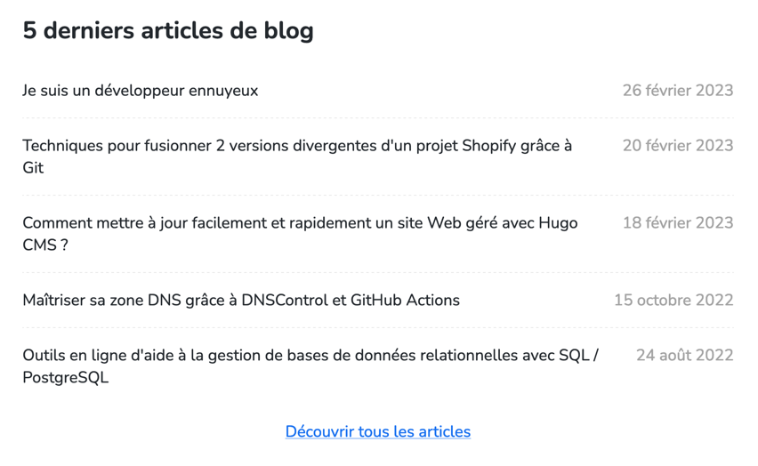
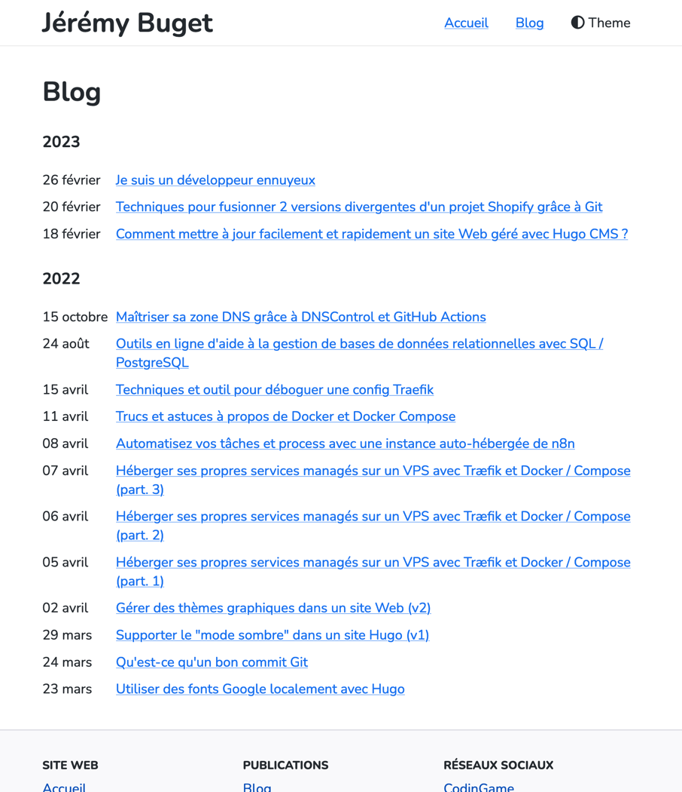
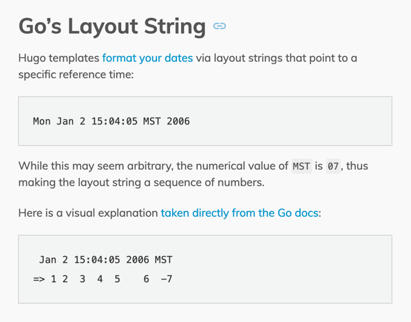
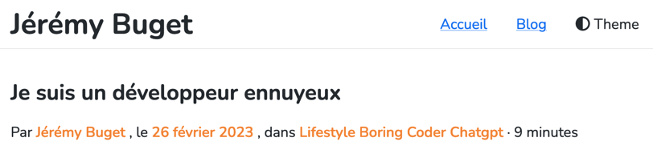

J'ai longtemps galéré à afficher correctement les dates de mes articles. Le plus dur était de trouver le bon point de départ dans la doc. Finalement, c'est relativement assez simple, mais surtout ultra puissant et satisfaisant.

J'ai été confronté à plusieurs problématiques : 
- afficher les date en français 🇫🇷
- afficher des dates au format qui me plaît (différents contextes)
- trier / regrouper les articles "par année de publication" dans la section "Blog“ / "Archives"

À chaque fois, Hugo propose des solutions finalement simples, élégantes, pratiques et très efficaces.

## Table des matières

- [Problème](#problème)
- [Solution](#solution)
  - [1. Définir la langue du site et du contenu en français](#1-définir-la-langue-du-site-et-du-contenu-en-français)
  - [2. Gérer le format des dates](#2-gérer-le-format-des-dates)
  - [3. Regrouper le contenu par année de publication](#3-regrouper-le-contenu-par-année-de-publication)
- [Conclusion](#conclusion)

## Problème

Pendant longtemps, j'ai eu un bug sur le site : tous les articles étaient en date du 1er janvier 2006.

La conséquence est plus pernicieuse qu'il n'y paraît. D'un point de vue éditorial, un contenu visiblement _vieux_ dissuade les visiteurs d'investir dans la lecture (temps, énergie, intérêt) de l'article #badcontent.

Par ailleurs, un blog technique présentant des gros bugs visuels, ne rassure pas sur les compétences de l'auteur, et par extension, du contenu qui y est présenté #badfeeling.

Enfin, un désagrément majeur est un mauvais référencement par les moteurs de recherche qui raffolent et mettent en avant le contenu frais, mais rechignent et dénigrent le contenu, obsolète, faux ou incohérent #badSEO.

Lorsque j'ai entrepris la refonte de mon site personnel afin d'investir un peu plus sérieusement sur la partie blogging, j'avais déjà passé un peu de temps sur le côté francisation, sans obtenir le résultat escompté.

Il était temps de s'attaquer une bonne fois pour toutes à ce problème !

## Solution 

### 1. Définir la langue du site et du contenu en français

**Solution :** 

Renseigner les propriétés [`languageCode`](https://gohugo.io/getting-started/configuration/#languagecode) et [`defaultContentLanguage`](https://gohugo.io/getting-started/configuration/#defaultcontentlanguage) dans le fichier de configuration `./config.toml`.

**Explications :** 

Le premier paramètre `languageCode` permet de remplir correctement l'attribut `lang` de l'élément `<html>` du site, ex : `<html lang="fr">`.

Le second paramètre `defaultContentLanguage` permet d'indiquer à Hugo de compiler / générer du contenu (date, sens de lecture, alphabet) en français. 

Dans les 2 cas, les valeurs possibles sont celles supportées par [la recommandation standard IETF BCP 47](https://fr.wikipedia.org/wiki/%C3%89tiquette_d%27identification_de_langues_IETF), laquelle définit un système de codes Langue-Culture, a.k.a. "étiquettes d’identification de langues IETF", [intégrée dans Go](https://go.dev/blog/matchlang).

```toml
# ./config.toml
title = 'Jérémy Buget'
baseURL = 'https://jbuget.fr'
languageCode = 'fr-FR'
defaultContentLanguage = "fr"
```

> 💡 Note : fonctionne aussi en version v0.110.0 en mettant `LanguageCode` ou `DefaultContentLanguage`

C'est d'autant plus simple dans le cas de mon site que celui-ci est voué à être publié en français exclusivement.

Pour celles et ceux qui en ont besoin, Hugo permet facilement de supporter plusieurs langues au sein d'un même site. Cf. [Multilingual Mode](https://gohugo.io/content-management/multilingual/).

### 2. Gérer le format des dates

**Solution :** 

Exploiter la fonction _built-in_ [`time.Format`](https://gohugo.io/functions/dateformat/)

```html
<!-- ex : themes/bloodywood/layouts/posts/section.html -->
<time datetime="{{ .Date }}">{{ .PublishDate | time.Format "02 January" }}</time>
```

**Explications :**

Une fois que le site est bien configuré (tech + content), il reste à formatter les dates à afficher en fonction de l'endroit et du contenu concerné.

C'est la partie qui m'a posé véritablement problème. Pourtant, après coup, j'ai l'impression que ce n'était pas si compliqué 🤷‍♂️.

Afin de nous simplifier la vie, Hugo propose des mécanismes *built-in* de gestion et formatage des dates, telles que les fonctions `Format` et [`time.Format`](https://gohugo.io/functions/dateformat/), exploitant la puissance des [*"layout strings"*](https://pkg.go.dev/time#example_Time_Format) de Go. 

> 💡 La fonction `time.Format` possède un alias `dateFormat`.

Je crois que dans mon cas, le fait d'avoir 2 fonctions et 3 intitulés m'a plutôt induit en erreur.
D'autant que je ne maîtrise pas Go.

**J'en suis venu à la conclusion que ce qui fonctionne le mieux est d'utiliser partout la fonction built-in `time.Format LAYOUT INPUT`** qui tient bien compte de la langue de contenu du site (définie ci-dessus).

> 😒 En toute franchise, à l'heure où je rédige ces lignes, j'ai l'impression de n'avoir toujours pas saisi entièrement la subtilité de tous ces mécanismes et possibilités.
> 
> Je m'attendais à avoir le même résultat entre `{{ .PublishDate | time.Format "02 January" }}` et `{{ .PublishDate.Format "02 January" }}` mais ce n'est pas le cas du tout.
> 
> Bref, j'arrive à obtenir exactement le résultat que je vise, mais je sens que ce n'est pas esthétiquement et intellectuellement optimal.

Pour l'heure, sur mon site, j'ai 3 endroits avec 3 formats de dates différentes :
- la liste des 5 derniers articles publiés depuis [la page d'accueil](/#last-articles)
- la liste de [tous les articles publiés](/posts), groupés par année de publication
- la page de détail d'un article

<u>a) Format de date pour les 5 derniers articles parus depuis la page d'accueil :</u>

Ici, je cherche à obtenir un format de date classique : "jour mois année", ex "6 mars 2023".



Pour cela, j'utilise une des [*custom layout string*](https://gohugo.io/functions/dateformat/#datetime-formatting-layouts) définies par Hugo : `:date_long`.

```html
<!-- themes/bloodywood/layouts/index.html -->
<time datetime="{{ .Date }}">{{ .PublishDate | time.Format ":date_long" }}</time>
``` 

<u>b) Format de date dans la page des archives / liste des articles :</u>

Ici, dans la mesure où les articles sont déjà regroupés par année de publication (cf. section ci-dessous), je n'ai besoin d'afficher que le mois et l'année dans un format assez compact.



J'utilise encore la fonction `time.Format` mais cette fois en exploitant une layout string propre à Go (vs. custom Hugo).



Ce qui me donne : 

```html
<!-- themes/bloodywood/layouts/posts/section.html -->
<time datetime="{{ .Date }}">{{ .PublishDate | time.Format "02 January" }}</time>
```

C'est cette partie qui m'a pris un peu de temps pour bien comprendre.
Le `02` de l'expression `"02 January"` est vital.
[En langage _Layout String_](https://gohugo.io/functions/format/#gos-layout-string), la valeur `02` signifie "le jour du mois" (au format numéraire).

<u>c) Format de date dans les meta-informations d'un article :</u>

Même format cible que pour les 5 derniers articles parus sur la page d'accueil. 



Et donc, même solution :

```html
<!-- themes/bloodywood/layouts/posts/single.html -->
, le <span><time>{{ .PublishDate | time.Format ":date_long"}}</time></span>
```

### 3. Regrouper le contenu par année de publication

**Solution :** 

Utiliser le template `{{ range .Pages.GroupByPublishDate "2006" }}`

**Explications :**

Savoir définir le format de date de son choix, dans la langue de son choix, c'est déjà une bonne chose.
Je souhaitais aller plus loin et proposer une expérience utilisateur un peu plus pratique et ludique pour la page des archives du blog.
Je m'attends à trouver les ressources personnelles (envie, courage, temps, idées, confiance en soi) pour publier entre 5 et 20 articles par an.
Dans ce contexte, une catégorisation par année de publication me paraissait le bon choix.
Simple. Basique.


J'avais peur que ce soit compliqué (plusieurs heures fastidieuses de recherche et expérimentation) ou très lent à compiler.

Pour le premier point, j'ai eu le plaisir de découvrir que Hugo propose directement [tout le nécessaire dans la doc](https://gohugo.io/templates/lists/#by-publish-date-1) 🙌.

Pour le second point, la compilation est immédiate. Merci Go 🏎 !

Ce qui donne : 

```html
<!-- themes/bloodywood/layouts/posts/section.html -->
{{ define "main" }}
<main class="posts-section">
  <div class="container">
    <div class="row">
      <div class="posts">
        <h1>{{ .Title }}</h1>

        <!-- Groups content by month according to the "publishDate" field in front matter -->
        {{ range .Pages.GroupByPublishDate "2006" }}
        <h3>{{ .Key }}</h3>
        <ul class="posts__list" role="list">
          {{ range .Pages }}
          <li class="posts__item post-line">
            <time class="post-line__date" datetime="{{ .Date }}">{{ .PublishDate | time.Format "02 January" }}</time>
            <a class="post-line__title" href='{{ .Permalink }}'> {{ .Title }}</a>
          </li>
          {{ end }}
        </ul>
        {{ end }}
      </div>
    </div>
  </div>
</main>
{{ end }}
```

## Conclusion

Je suis toujours autant surpris par la simplicité du générateur de site statique Hugo.
Le côté "statique" me fait toujours craindre le pire.
Puis, finalement, c'est toujours le meilleur qui se produit.
Je me demande (mais je suis très confiant) jusqu'où et quand ça va tenir 😁.
