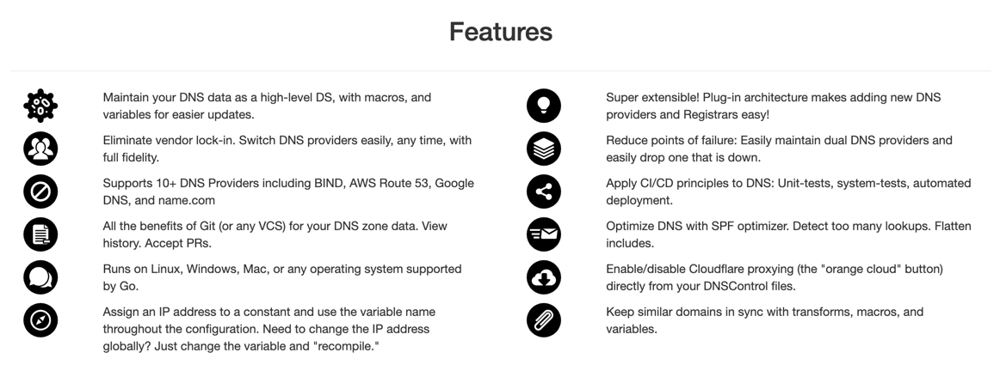
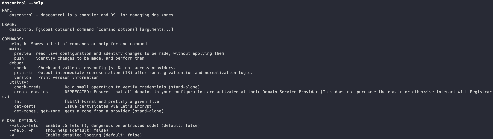
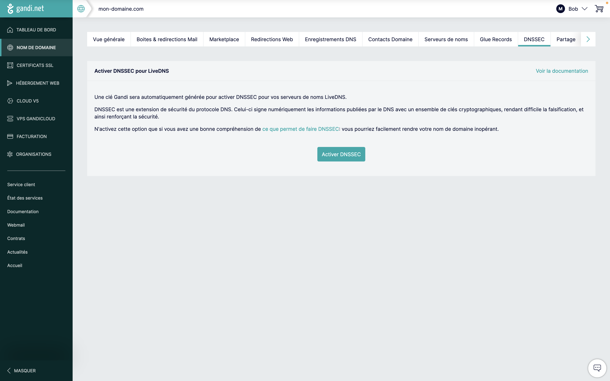
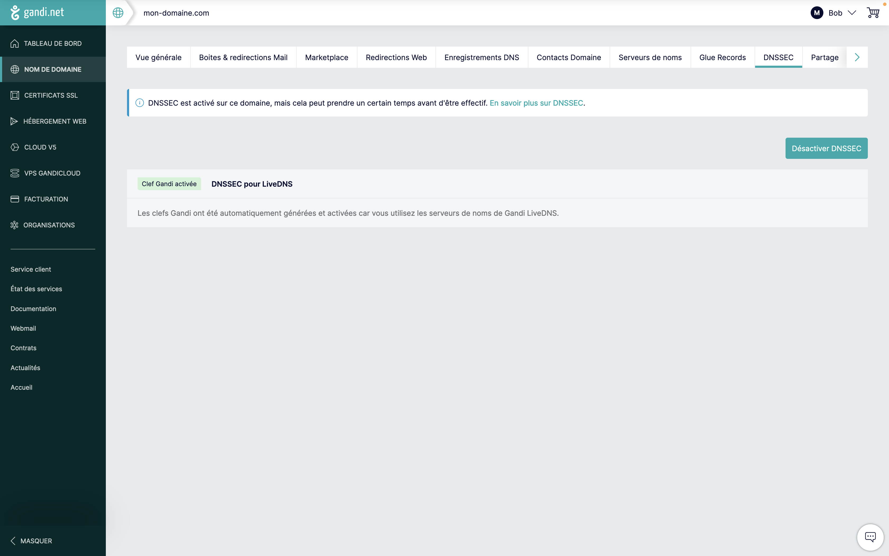
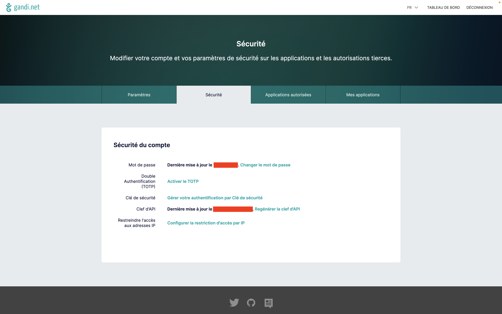
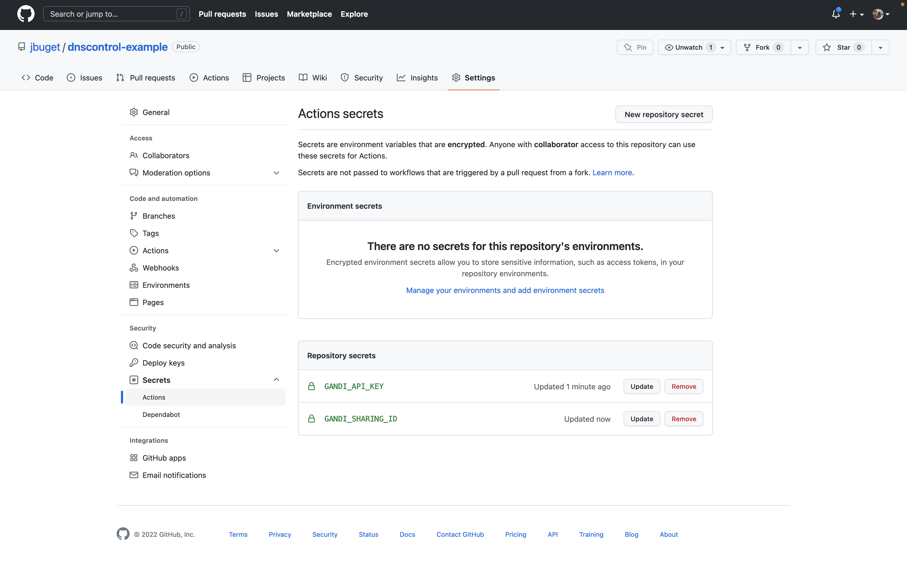
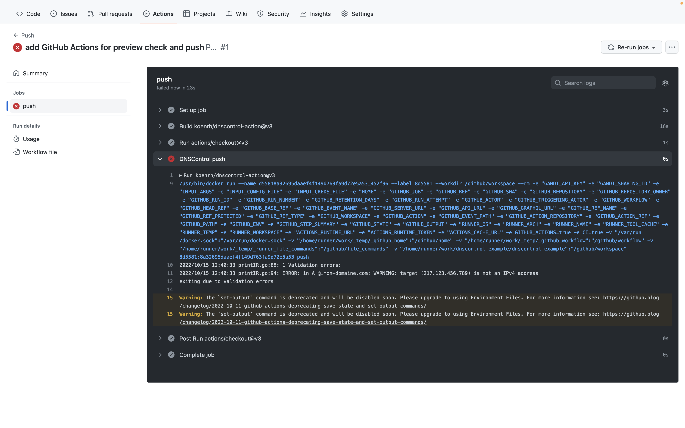
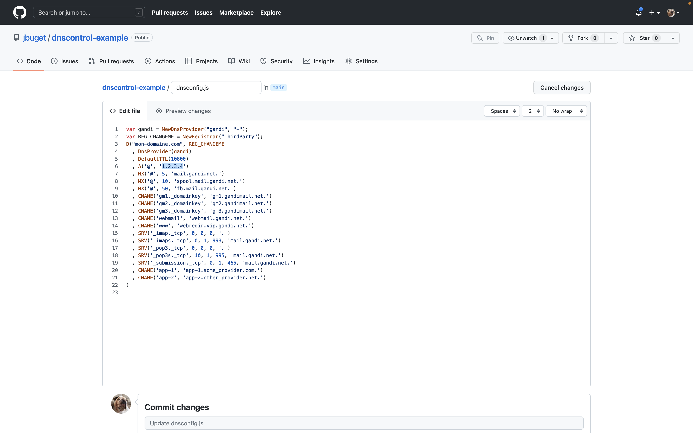

## Table des matières

- [Introduction](#introduction)
- [DNSControl : DSL + CLI de gestion de zone DNS](#dnscontrol--dsl--cli-de-gestion-de-zone-dns)
  - [Présentation](#présentation)
  - [Installation et mise à jour](#installation-et-mise-à-jour)
  - [Usage et aide](#usage-et-aide)
- [Mise en œuvre de la solution complète](#mise-en-œuvre-de-la-solution-complète)
  - [Étapes](#étapes)
  - [Environnement](#environnement)
  - [1. Gandi / API key](#1-gandi--api-key)
  - [2. Git / GitHub](#2-git--github)
  - [3. DNSControl](#3-dnscontrol)
  - [4. GitHub Actions](#4-github-actions)
  - [Bonus n°1](#bonus-n1)
  - [Bonus n°2](#bonus-n2)
- [Resources](#resources)
  - [Code source](#code-source)
  - [Bibliographie](#bibliographie)
- [Conclusion](#conclusion)


## Introduction

Le (nom de) domaine d'un service est souvent un élément crucial et critique de son image de marque, mais aussi de son architecture & infrastructure.

Une mauvaise configuration DNS peut avoir très rapidement des effets dévastateurs sur la plateforme ou l'entreprise en termes de disponibilité (site non atteignable ou fonctionnement défectueux), référencement (mauvais découvrabilité / e-réputation sabordée) ou sécurité (ex : attaque de type "DNS highjacking").

Pour se prémunir contre de tels soucis, les registrars et providers DNS modernes (Gandi, OVH, Cloudflare, Route 53, etc.) proposent des fonctionnalités de gestion et sauvegarde de configurations de zone DNS, ainsi que des API sécurisées en lecture / écriture.

[DNSControl](https://stackexchange.github.io/dnscontrol/) est un logiciel open source qui exploite ces API afin de proposer une solution de type _Infrastructure as Code_ pour mieux gérer ses domaines et sous-domaines.

Couplé à [GitHub Actions](https://github.com/features/actions) ou [GitLab CI/CD](https://docs.gitlab.com/ee/ci/) on obtient un dispositif automatisé pratique, efficace et sécurisé.

## DNSControl : DSL + CLI de gestion de zone DNS

### Présentation

**[DNSControl](https://stackexchange.github.io/dnscontrol/)** est une solution open source de type [Infrastructure as Code](https://fr.wikipedia.org/wiki/Infrastructure_as_code) (IaC), éditée par [Stack Exchange](https://stackexchange.com/about) – l'éditeur de la plateforme [Stack Overflow](https://stackoverflow.com/search?q=dnscontrol).

DNSControl propose un panel d'outils techniques (en ligne de commande) inspirés des bonnes pratiques de développement telles que le versionning (de configuration de zone DNS), des tests automatisés, l'intégration à des CI/CD, la mécanisation de tâches rébarbatives ou _dangereuses_, la variabilisation par environnement, etc.



DNSControl supporte [une très large panoplie de _providers_ DSN](https://stackexchange.github.io/dnscontrol/provider-list) parmi lesquels [Cloudflare](https://stackexchange.github.io/dnscontrol/providers/cloudflare), [Amazon Route 53](https://aws.amazon.com/fr/route53/) ou [DigitalOcean](https://stackexchange.github.io/dnscontrol/providers/digitalocean) pour les plus célèbres 🇺🇸, ou bien encore [Gandi](https://stackexchange.github.io/dnscontrol/providers/gandi_v5) et [OVH](https://stackexchange.github.io/dnscontrol/providers/ovh) pour les français 🇫🇷.
{.pros}

DNSControl se présente sous la forme d'**un binaire installable et exécutable sous tout type de plateforme** susceptible de faire tourner du Go.
{.pros}

Le projet est actif et comptabilise déjà plus de 2.4K _stars_ sur GitHub depuis sa première release en mars 2017.
{.pros}

### Installation et mise à jour

DNSControl propose plusieurs modes d'installation ou d'exécution : via un script Go, via Homebrew ou MacPorts ou encore via Docker.
{.pros}

Dans mon cas (macOS Monterey), je suis passé par Homebrew : 

```shell
brew install dnscontrol
```

Je dois être bête ou aveugle, mais je n'arrive pas à comprendre comment obtenir le numéro de version du programme et la commande `dnscontrol version` ne m'indique rien de bien probant 🥸.
{.cons}

Pour mettre à jour je me contente de déléguer à Homebrew : 

```shell
brew upgrade dnscontrol
```

### Usage et aide

Je trouve la façon dont l'aide s'affiche un peu particulière à interpréter : les commandes sont organisées en catégories (`main`, `debug`, `utility`) qui n'ont pas besoin d'être saisies pour utiliser la commande associée.
{.cons}

Pour connaître l'usage d'une commande, il faut saisir l'option `--help` (ou `-h`) après le nom de la commande :



```shell
# Afficher la liste des commandes par catégories : 
$ dnscontrol -h

# Connaître l'usage pour la commande `check` (appartenant à la catégorie `main`) :
$ dnscontrol preview -h 

# Connaître l'usage pour la commande `check` (appartenant à la catégorie `debug`) :
$ dnscontrol check -h 
```

## Mise en œuvre de la solution complète

### Étapes

Les étapes à suivre pour automatiser la gestion de zone DNS via DNSControl sont les suivantes :
1. (re-)générer une clé ou des identifiants d'API depuis son compte provider
2. renseigner ces identifiants dans un fichier de secrets `creds.json`
3. définir sa configuration DNS dans un fichier `dnsconfig.js` 
4. valider la syntaxe de sa configuration + credentials via la commande `dnscontrol check`
5. simuler (_dry run_) l'exécution des éventuelles modifications portées par la config via la commande `dnscontrol preview` 
6. déployer les changements pour de bon via la commande `dnscontrol push`

### Environnement

**L'exemple qui suit** utilise la stack suivante : 
- OS local : Mac OS X (macOS Monterey)
- Provider DNS : Gandi
- Hosting Git : https://github.com/jbuget/dnscontrol-example
- CI/CD : GitHub Actions

Une alternative possible pourrait être :
- OS local : Docker
- Provider DNS : OVH
- Hosting Git : https://gitlab.com/papa_pupuce/dns-config
- CI/CD : GitLab CI/CD

### 1. Gandi / API key

**a)** La toute première action à effectuer est d'**activer la protection [DNSSEC](https://fr.wikipedia.org/wiki/Domain_Name_System_Security_Extensions)** depuis l'administration du DNS dans Gandi.





**b)** Gandi expose [une API](https://api.gandi.net/docs/) à ses utilisateurs afin de mettre à jour programmatiquement une configuration de zone DNS.

Pour ce faire, il faut au préalable **générer une clé d'API** attachée au compte détenteur du DNS, dans le menu "Compte et sécurité".

La page de gestion de ses identifiants d'API dans Gandi n'est pas facile à trouver. L'URL pour y accéder est : [`https://account.gandi.net/fr/users/<username>/security`](https://account.gandi.net/fr/users/<username>/security).

Cette clé sera utilisée par la suite avec la variable d'environnement `$GANDI_API_KEY`.



**c)** Nous aurons aussi besoin d'un second secret - appelé _sharing ID_ - associé à la variable d'environnement `$GANDI_SHARING_ID`.

Cette information se retrouve dans l'URL, depuis le détail d'une organisation. Il s'agit de la seconde chaîne de caractère _hashée_, juste avant le suffixe "/profile".

Ainsi dans l'URL `admin.gandi.net/organizations/<f1rst_h4sh_num83r>/organizations/<orga_name>/<s3c0nd_h4sh_num83r>/profile`, il s'agit de la valeur `s3c0nd_h4sh_num83r`.

### 2. Git / GitHub

Tout l'enjeu du projet consiste à gérer la configuration DNS via Git et l'outillage automatisé basé dessus, afin de gérer le domaine et ses sous-domaines de façon sécurisée, standardisée, simple et rapide.

**d)** On crée le **dépôt de code [dnscontrol-example](https://github.com/jbuget/dnscontrol-example)**.

**e)** Bien que tout soit mis en œuvre pour qu'aucun secret n'apparaisse dans le code ou l'historique, **le repository doit toujours resté "privé"** afin de limiter un maximum les attaques de type [DNS hijacking](https://en.wikipedia.org/wiki/DNS_hijacking), [DNS spoofing](https://en.wikipedia.org/wiki/DNS_spoofing) ou le DNS crawling.

> 👩‍💼 Dans la mesure où le repository est privé, il n'y a pas eu d'effort accordé au choix de la licence, qui est UNLICENSED par défaut quand on crée un dépôt depuis l'interface GitHub.

En tant que repository privé, seuls les membres de l'organisation (ici, "jbuget") pourront y avoir accès.

**f)** L'entrepôt contiendra principalement 2 fichiers en rapport avec DNSControl :
- `creds.json` : déclaration des secrets et fournisseurs/hébergeurs de DNS (ex: Gandi)
- `dnsconfig.js` : déclaration des zones et entrées DNS (ex: mon-domaine.com)

### 3. DNSControl

Comme on l'a vu en introduction, DNSControl est un petit utilitaire bien sympathique qui offre un DSL et un CLI pour gérer de façon centralisée et versionnée des DNS (ou régions, ou zones, ou entrées, etc.).

**g)** La première chose à faire consiste à déclarer les fournisseurs de DNS (ici Gandi) dans un **fichier de gestion des secrets : `creds.json`**.

Vu que notre DNS est chez Gandi, on se base sur [la page de doc dédiée](https://stackexchange.github.io/dnscontrol/providers/gandi_v5).

```json
{
  "gandi": {
    "TYPE": "GANDI_V5",
    "apikey": "$GANDI_API_KEY",
    "sharing_id": "$GANDI_SHARING_ID"
  }
}
```

**h)** On peut vérifier la validité de cette config via **la commande `check-creds`** de DNSControl :

```shell
$ GANDI_API_KEY=<xxx> GANDI_SHARING_ID=<yyy> dnscontrol check-creds gandi
```

La liste des domaines associés au compte Gandi est affichée.

On en profite pour corriger les éventuels avertissements remontés.

**i)** Il faut ensuite initialiser le fichier de configuration DNS.

Pour cela, on utilise **la commande `get-zones`** telle que préconisée par la doc et qui génère une config depuis une zone DNS.

```shell
$ GANDI_API_KEY=<xxx> GANDI_SHARING_ID=<yyy> dnscontrol get-zones --format=djs --out=dnsconfig.js gandi - mon-domaine.com
```

On obtient le fichier `dnsconfig.js`.

**j)** On peut tester sa validité via la commande `preview` :

```shell
$ GANDI_API_KEY=<xxx> GANDI_SHARING_ID=<yyy> dnscontrol preview
``` 

On en profite pour corriger là encore les éventuels avertissements remontés.

**k)** On teste le tout en production.

```shell
$ GANDI_API_KEY=<xxx> GANDI_SHARING_ID=<yyy> dnscontrol push
```

Depuis l'administration Gandi, on s'assure que la configuration n'a pas bougée en comparant avec la sauvegarde originale du DNS.


### 4. GitHub Actions

Afin de proposer un usage fluide, on met en place le process suivant :
1. déclarer un changement de config via le DSL de DNSControl sur une nouvelle branche
1. générer une PR depuis cette branche
1. vérifier la nouvelle configuration à chaque commit via la commande `dnscontrol preview`
1. valider la PR par un pair ou membre de l'organisation
1. fusionner la PR
1. déployer la nouvelle configuration DNS sur Gandi grâce à la commande `dnscontrol push`

**l)** Pour ce faire, on utilise **l'action GitHub [dnscontrol-action](https://github.com/marketplace/actions/dnscontrol-action)**.

> 💡 Pour info, cette action est utilisée avec succès depuis plusieurs années au sein du [GIP Pix](https://pix.fr) et depuis quelques mois au sein du [GIP Plateforme de l'inclusion](https://inclusion.beta.gouv.fr).

Concrètement, cela revient à déclarer et configurer 2 workflows GHA :
- **Preview** : se déclenche à chaque commit sur une branche associée à une PR et exécute la commande `dnscontrol preview` ; le fichier de définition est `.github/workflows/preview-dns-config.yml` 
- **Push** : se déclenche à chaque fusion de PR sur `main` et exécute la commande `dnscontrol push` ; le fichier de définition est `.github/workflows/push-dns-config.yml`

**m)** Pour pouvoir fonctionner, il faut déclarer nos variables d'environnement `$GANDI_API_KEY` et `$GANDI_SHARING_ID` en tant que **[secrets du repository GitHub](https://github.com/jbuget/dnscontrol-example/settings/secrets/actions)**.



> 🚨 Précédemment, j'ai indiqué que le repository devait absolument resté `privé`. Dans la capture ci-dessus, il apparaît `public`. C'est évidemment à des fins pédagogiques et de partage. **Il faut absolument garder le repository privé !**

Ces secrets peuvent être accédés dans le fichier `<action>.yml` avec l'écriture suivante : `${{ secrets.GANDI_API_KEY }}`.

Exemple :

```yaml
# <action.yml>
jobs:
   <job>:
      steps:
         env:
            GANDI_API_KEY: ${{ secrets.GANDI_API_KEY }}
            GANDI_SHARING_ID: ${{ secrets.GANDI_SHARING_ID }}
```

🎉 À ce stade, le dispositif est complet : 
- à chaque fois qu'on crée une PR pour modifier la config DNS, l'action "Preview" est ajoutée au _checks GitHub_ et exécutée
- si la nouvelle configuration est valide, au moment de fusionner la PR/branche, alors l'action "Push" est déclenchée, laquelle consiste à mettre à jour la configuration DNS directement sur le fournisseur, via son API
- le tout est testé et versionné et il est possible de revenir en arrière à tout moment 🙌



### Bonus n°1

Il est possible de **passer directement par l'éditeur de fichiers de GitHub** pour modifier le fichier `dnsconfig.js`.

Au moment de sauvegarder, il est possible de tirer une branche + PR.
Ça fonctionne trop bien 🔥 !



### Bonus n°2

Une façon de démarrer très rapidement consiste à forker le repository [jbuget/dnscontrol-example](https://github.com/jbuget/dnscontrol-example) au sein de votre compte ou organisation (en pensant bien à le passer en visibilité privée). 

## Resources

### Code source

**Repository exemple :** [dnscontrol-example](https://github.com/jbuget/dnscontrol-example)

**Fichier `creds.json` :**

```json
{
  "bind": {
    "TYPE": "BIND"
  },
  "gandi": {
    "TYPE": "GANDI_V5",
    "apikey": "$GANDI_API_KEY",
    "sharing_id": "$GANDI_SHARING_ID"
  },
  "none": {
    "TYPE": "NONE"
  },
  "ThirdParty": {
    "TYPE": "NONE"
  }
}
```

**Fichier `dnsconfig.js` :**

```javascript
/* Toutes les valeurs indiquées sont fausses car à titre d'exemple… */

var gandi = NewDnsProvider("gandi", "-");
var REG_CHANGEME = NewRegistrar("ThirdParty");
D("mon-domaine.com", REG_CHANGEME
  , DnsProvider(gandi)
  , DefaultTTL(10800)
  , A('@', '1.2.3.4') /* … en particulier cette IP qui n'existe */
  , MX('@', 5, 'mail.gandi.net.')
  , MX('@', 10, 'spool.mail.gandi.net.')
  , MX('@', 50, 'fb.mail.gandi.net.')
  , CNAME('gm1._domainkey', 'gm1.gandimail.net.')
  , CNAME('gm2._domainkey', 'gm2.gandimail.net.')
  , CNAME('gm3._domainkey', 'gm3.gandimail.net.')
  , CNAME('webmail', 'webmail.gandi.net.')
  , CNAME('www', 'webredir.vip.gandi.net.')
  , SRV('_imap._tcp', 0, 0, 0, '.')
  , SRV('_imaps._tcp', 0, 1, 993, 'mail.gandi.net.')
  , SRV('_pop3._tcp', 0, 0, 0, '.')
  , SRV('_pop3s._tcp', 10, 1, 995, 'mail.gandi.net.')
  , SRV('_submission._tcp', 0, 1, 465, 'mail.gandi.net.')
  , CNAME('app-1', 'app-1.some_provider.com.')
  , CNAME('app-2', 'app-2.other_provider.net.')
)
```

**Fichier `.github/workflows/preview-dns-config.yml` :**

```yaml
name: Preview

on: pull_request

jobs:
  preview:
    runs-on: ubuntu-latest
    steps:
      - uses: actions/checkout@v3

      - name: DNSControl preview
        uses: koenrh/dnscontrol-action@v3
        id: dnscontrol_preview
        env:
          GANDI_API_KEY: ${{ secrets.GANDI_API_KEY }}
          GANDI_SHARING_ID: ${{ secrets.GANDI_SHARING_ID }}
        with:
          args: preview
```

**Fichier `.github/workflows/push-dns-config.yml` :**

```yaml
name: Push

on:
  push:
    branches:
      - main

jobs:
  push:
    runs-on: ubuntu-latest
    steps:
      - uses: actions/checkout@v3

      - name: DNSControl push
        uses: koenrh/dnscontrol-action@v3
        env:
          GANDI_API_KEY: ${{ secrets.GANDI_API_KEY }}
          GANDI_SHARING_ID: ${{ secrets.GANDI_SHARING_ID }}
        with:
          args: push
```

### Bibliographie

- [Guide officiel de démarrage](https://stackexchange.github.io/dnscontrol/getting-started)
- [DNSControl and Github Actions](https://www.tiernanotoole.ie/2022/06/18/dnscontrol-and-github-actions.html) (juin 2022)
- [DNS as Code with DNSControl and GitLab](https://sporks.space/2021/02/08/dns-as-code-with-dnscontrol-and-gitlab/) (janv. 2022)
- [How To Deploy and Manage Your DNS Using DNSControl on Debian 10](https://www.digitalocean.com/community/tutorials/how-to-deploy-and-manage-your-dns-using-dnscontrol-on-debian-10) (janv. 2020)
- [Managing DNS with DNSControl, CloudFlare, DNSimple, GitHub, VSTS, Key Vault, and Docker!](https://poshsecurity.com/blog/managing-dns-with-dnscontrol-cloudflare-dnsimple-github-vsts-key-vault-and-docker) (août 2018)

## Conclusion

Grâce aux API mises à disposition par les fournisseurs de DNS modernes, à DNSControl et sa suite d'outils de gestion de zone DNS ainsi qu'aux possibilités offertes par les plateformes d'automatisation des tâches comme GitHub Actions et GitLab CI/CD, gérer sereinement et efficacement un domaine ou sous-domaine n'a jamais été aussi simple et rapide.

Cet article couvre une bonne partie du problème et conviendra à la plupart des organisations ou équipes.

DNSControl permet d'aller plus loin encore, par exemple en gérant plusieurs zones ou registrars DNS 🚀. 

Et vous ? Comment vous y prenez-vous pour gérer vos zones DNS ?

