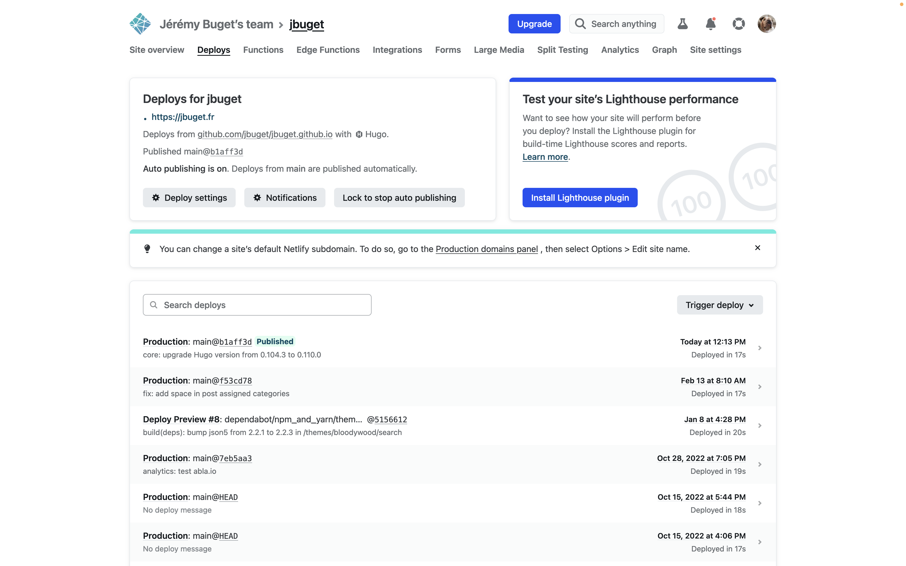

Cela fait plusieurs mois que je n'ai plus mis à jour mon site.

Entre-temps, les choses ont évolué techniquement (Hugo a publié plusieurs versions) et personnellement (j'ai changé d'employeur).

🚀 Letzgoooo !

## 1. Mise à jour de la CLI

Pour commencer, je me remémore ma version actuelle :

```shell
$ hugo version
hugo v0.104.3+extended darwin/amd64 BuildDate=unknown
```

> Pour rappel, j'ai installé Hugo sur mon poste grâce à Homebrew.

💡 Par expérience (de projets Jekyll "compliqués"), je vérifie que le projet tourne toujours sur mon poste. C'est bien le cas 🙌.

J'interroge Google pour connaître [la dernière version officielle d'Hugo](https://github.com/gohugoio/hugo/releases) : v0.110.0.

Pas de migration majeure et breaking change à prévoir. Cool.

> J'aurais pu trouver une commande stylée mais, elle ne me vient pas et les réponses sur Stack Overflow ne sont pas ouf.

Je consulte vite fait les changelogs depuis les 7+ versions. Il y a des choses intéressantes :
- des possibilités nouvelles autour du fil d'Ariane
- de l'amélioration de perf pour tout ce qui est *code highlighting*
- des améliorations de temps de rechargement en mode dev

Il est temps de profiter de ces changements.

```shell
$ brew upgrade hugo
```


Il y a un avertissement à propos d'une bibliothèque devenue obsolète :

```shell
> Warning: Use python-tabulate instead of deprecated libpython-tabulate
```

Je ne maîtrise pas. Je cherche dans les sources du projet s'il est fait mention de `tabulate`.

```shell
$ grep -r tabulate .
```

Aucun résultat. Tant mieux.

Je l'ai vu dans les logs, mais je vérifie quand même la version obtenue :

```shell
$ hugo version
> hugo v0.110.0+extended darwin/amd64 BuildDate=unknown
```

Plus qu'à vérifier que le projet compile et tourne toujours.

```shell
$ hugo serve -D
```


Wouhou ! le projet démarre, sans un message de warning.

## 2. Mise à jour de la version dans les sources

Je commence par chercher les fichiers référençant l'ancienne version du CMS (0.104.3) :

```shell
$ grep -r "0\.104\.3" .
```


1 seul résultat : le fichier `./netlify.toml`.

> Rappel : mon site est hébergé sur Netlify, le DNS est sur Gandi et les sources sur GitHub.

Je mets à jour le numéro de version.

> Je pourrais sortir une commande magique à base de `sed` + `grep`, mais #flemmeduweekend. Je me contente de faire `Cmd + R` dans mon IDE (WebStorm).

Je relance le projet.

```shell
$ hugo serve -D
```

🎉 Tout fonctionne nickel !

## 3. Mise à jour de la production

Je commite et pushe le tout.

Netlify détecte directement le changement de source et lance un déploiement.

En moins de temps qu'il n'en faut pour l'écrire, la nouvelle version est en prod 😎.



## Conclusion

Je suis toujours aussi impressionné de la stabilité, de la simplicité et de l'efficacité fournie par Hugo CMS.

Il est tellement loin le temps où j'angoissais à chaque fois que je me remettais sur mon site version Jekyll et que je devais le faire évoluer (à l'époque sur GitHub Pages).

Je n'ai plus qu'à mettre à jour ma biographie 😉
