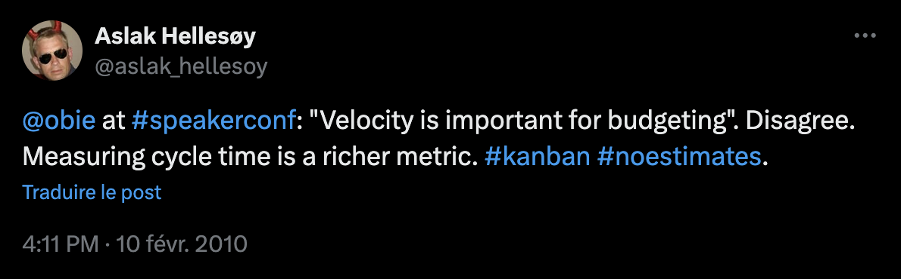

## Table des matières

- [Table des matières](#table-des-matières)
- [Introduction](#introduction)
- 
- 
- [Conclusion](#conclusion)

## Introduction

> "When a measure becomes a target, it ceases to be a good measure"
> -- Loi de Goodhart, d'après l'économiste britanique Charles Goodhart, issu de ses travaux de 1975 portant sur la Politique monétaire des états

On attribue souvent la paternité du mouvement (ou approche méthodologique ou philosphie de pilotage agile) "no estimates"  à [Woody Zuill](https://woodyzuill.com/), personnalité influente au sein de la communauté agile et l'un des pionniers de l'approche [Mob Programming](https://fr.wikipedia.org/wiki/Programmation_en_groupe) ("programmation en groupe", en FR_fr 🇫🇷).

Une recherche avancée sur X (feu-Twitter 😢) permet de remonter jusqu'à [une toute première publication](https://x.com/aslak_hellesoy/status/8904886181) (cf. capture ci-dessous) de [Aslak Hellesøy](https://x.com/aslak_hellesoy) (le papa de [Cucumber](https://cucumber.io/docs), un outil de Behaviour-Driven Development, alias BDD) le 10 février 20210, qui réagit en forte contradiction à un message qu'il a entendu lors d'une conférence de [Obie Fernandez](https://en.wikipedia.org/wiki/Obie_Fernandez), développeur Ruby / Rails, affirmant que : "la vélocité est importante pour la planification budgétaire".

Quelle que soit l'origine exacte du mouvement, elle semble se situer plutôt au début des années 2010, alors que la question des "méthodes agiles", déjà bien diffusées dans l'industrie, commenc à être abordée sous des angles nouveaux tels que la remise en question de l'agilité ou la gestion de la scalabilité du modèle agile dans des orgnisations toujours plus grande.

> **Rappel contextuel #1** : il est courant de faire remonter les prémices de l'agilité à l'article fondateur rédigé par Takeuchi & Nonaka, *The New New Product Development Game*, publié en 1986
> 
> **Rappel contextuel #2** : le manifeste agile, qui peut être vu comme les Tables de la Loi et l'acte fondateur de l'agilité, a été publié pour la première fois en février 2001.

Tous les modèles sont faux ; certains sont utiles. Toutes les estimations sont fausses ; certaines sont utiles.

##

##

Comment calcule-t-on la vélocité d'une équipe en no estimate ?

Comment organise-t-on le travail et le découapge des tâches ?

Comment se projetter dans l'avenir et alimenter la roadmap produit en conséquence ?

Quels sont les pièges à éviter ?

## Conclusion

