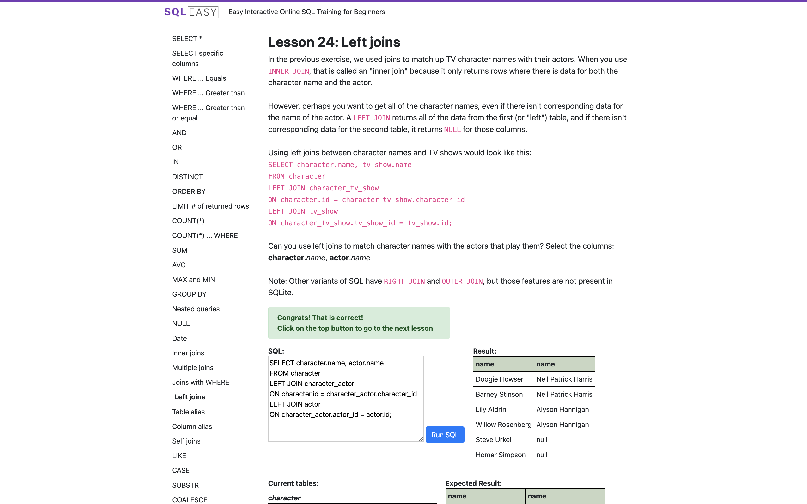
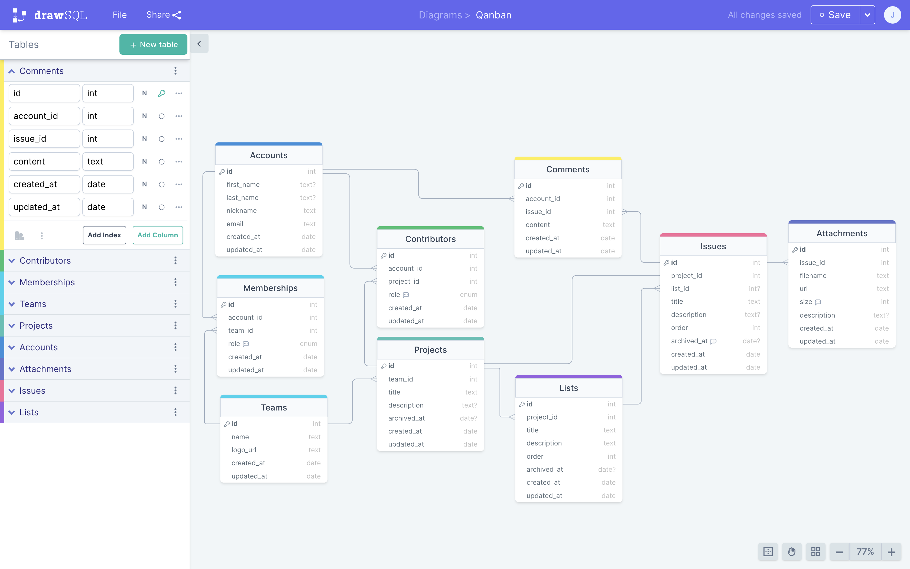
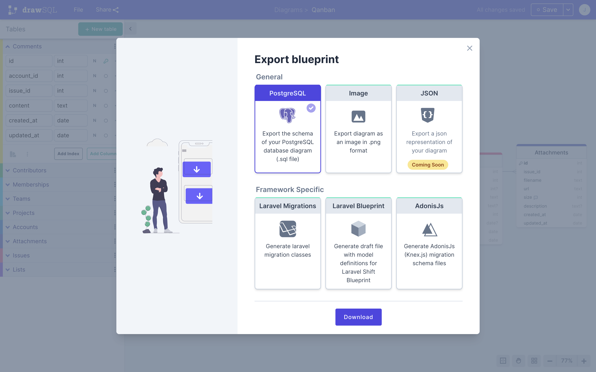
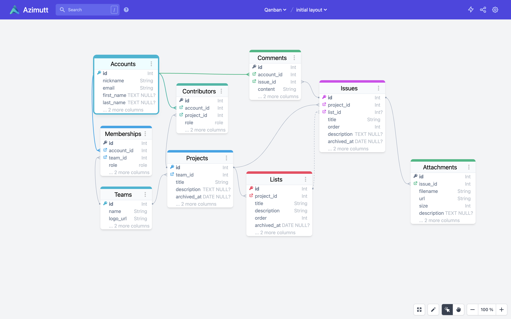
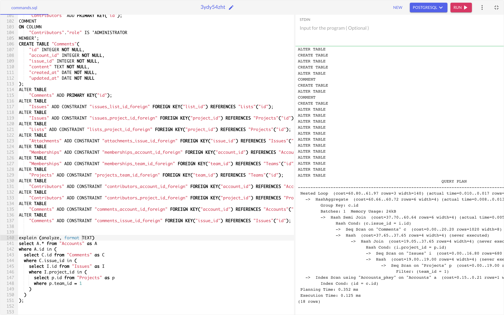
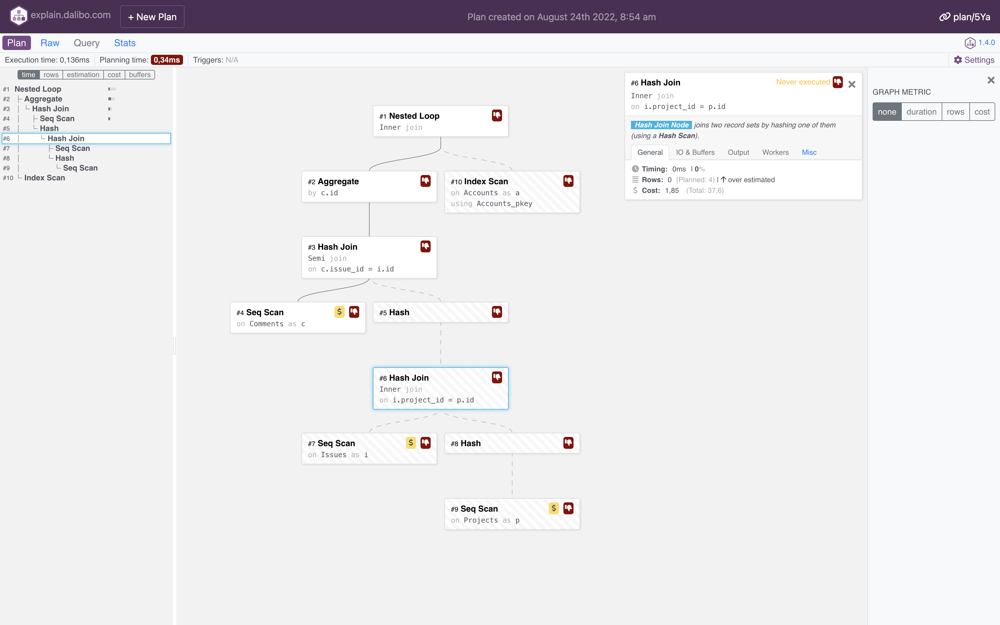
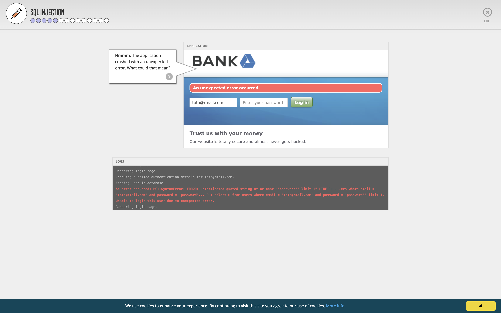
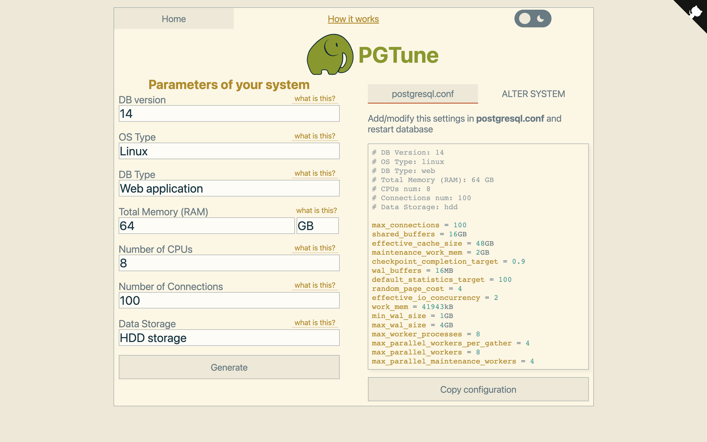
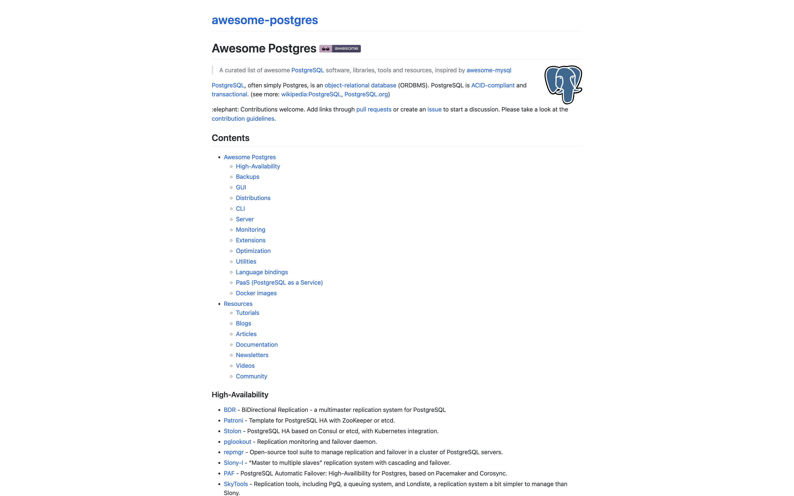

## Table des matières

- [Introduction](#introduction)
- [Avertissement](#avertissement)
- [Apprendre le langage SQL / dialect PostgreSQL](#apprendre-le-langage-sql--dialect-postgresql)
- [Modéliser une base de données](#modéliser-une-base-de-données)
- [Visualiser une base de données](#visualiser-une-base-de-données)
- [Compiler / valider / vérifier des instructions SQL](#compiler--valider--vérifier-des-instructions-sql)
- [Comprendre et analyser un plan d'exécution](#comprendre-et-analyser-un-plan-dexécution)
- [Bonus](#bonus)
    - [1. Comprendre l'attaque par injection SQL](#1-comprendre-lattaque-par-injection-sql)
    - [2. Optimiser les paramètres d'une base PostgreSQL](#2-optimiser-les-paramètres-dune-base-postgresql)
    - [3. Ressources pour aller plus loin avec PostgreSQL](#3-ressources-pour-aller-plus-loin-avec-postgresql)
- [Conclusion](#conclusion)


## Introduction

Le mieux, quand on administre une base de données relationnelle SQL / PostgreSQL, est d'utiliser les outils directement fournis par le [SGBD](https://fr.wikipedia.org/wiki/Syst%C3%A8me_de_gestion_de_base_de_donn%C3%A9es).

Parfois (souvent), ce n'est pas pratique, pertinent ou même possible de dégainer "l'artillerie lourde".
Il existe des cas où des outils en ligne font l'affaire : la modélisation ou visualisation d'une base de données, l'analyse d'un plan d'exécution, la conception rapide ou le prototypage de requêtes avancées, etc.

L'objet de cet article consiste à recenser quelques unes de ces situations et solutions (ainsi que des alternatives ou des liens pour aller plus loin).

## Avertissement

Ci-dessous, je dresse une liste de ressources et services en ligne pratiques et que j'utilise régulièrement dans un contexte professionnel comme personnel (surtout).

> **🚨 Soyez hyper vigilants chaque fois que vous utilisez un service en ligne en rapport avec des données (schémas, bases, informations, scripts).**

J'ai vérifié et ai confiance dans les services mis en avant, mais je me dédouane de tout mauvais usage qui en serait fait ou conséquences néfastes (fuites de données, exploitations à des fins indésirables, etc.).

## Apprendre le langage SQL / dialect PostgreSQL

> 👉 [sql-easy.com](https://www.sql-easy.com) 

SQL est un langage relativement simple (pour un usage basique, voire classique) et pratique à connaître.
Personnellement, je le place au même rang que HTML, CSS ou JS pour un développeur Web un peu touche-à-tout (_je n'ai pas prononcé le mot "full-stack" !_). 

Évidemment, comme tout langage (informatique, naturel ou conceptuel), bien maîtriser SQL – ses subtilités et un usage un tant soit peu intensif ou avancé – requiert inévitablement du temps, des efforts, etc.   

Il existe une quantité de ressources sur le Net pour apprendre tous les langages de ses rêves ([🤯 même Brainfuck](https://www.youtube.com/watch?v=G-tuXeMyb58) !!!).

La façon qui me correspond le mieux et me plaît le plus pour découvrir de nouvelles choses (langages, outils, concepts) est de pratiquer, si possible sans avoir rien à installer (encore moins sur mon poste), via des tutoriels interactifs, bien pensés et agréables (comportements, style, effets, etc.).

> 💡 Par exemple, j'adore et je conseille vivement le site "[Learn Git Branching](https://learngitbranching.js.org/?locale=fr_FR)" que j'inflige à chacune des équipes dans lesquelles j'interviens (en vrai, c'est drôle, ludique et ça se fait bien après le daily, en fin de journée, ou pour reprendre le taff en début d'après-midi).

Pour apprendre SQL, j'ai trouvé mon compte sur le site [sql-easy.com](https://www.sql-easy.com).



Je trouve que ça pourrait être plus joli encore, et je regrette le manque d'auto-complétion / coloration syntaxique dans la zone de saisie de la réponse.
{.cons}

Mais j'apprécie les exercices et explications proposées.
J'ai vraiment eu l'impression de (re-)découvrir des choses et progresser.
{.pros}

**Alternatives :** 
- [sql-practice](https://www.sql-practice.com) → ~50 questions de différents niveaux (easy, medium, hard) avec auto-complétion, auto-formatting, correction, etc. 
- [PostgreSQL Exercises](https://pgexercises.com/) → encore des exercices (70+) bien pensés, utilisant la syntaxe PostgreSQL

## Modéliser une base de données

> 👉 [DrawSQL](https://drawsql.app) 

Une activité qui revient souvent, surtout en début de projet ou d'étude de faisabilité / réalisation, est la modélisation de schéma de données.

Il existe une pléthore d'outils de modélisation (aussi appelés "Data Modeling" ou "Entity Relationship Diagram", a.k.a. _ERD_) de tout type : client lourd (en Java, Python, Rails, C/C++, etc.) ou service en ligne, mono ou multi dialect(s), gratuit ou payant, libre ou fermé, etc.

Un service que j'affectionne et qui m'a permis de démarrer pas mal de projets perso ces derniers temps (dont 99.99% n'ont jamais vraiment abouti, mais ça, c'est le destin commun des _side-projects_ 🤷‍♂️) est [DrawSQL](https://drawsql.app).

Ci-dessous, la modélisation d'une application Web collaborative de gestion de projets via des [tableaux Kanban](https://kanbanize.com/fr/ressources/debuter-avec/tableau-kanban).



DrawSQL est un service freemium, parfaitement adapté à des petits projets ou des projets qui se lancent.
En gros, dans sa version gratuite, c'est surtout fait pour du prototypage.
Et c'est ainsi que je m'en sers.
{.pros}

Dans sa version gratuite permet de définir autant de diagrams / bases que l'on souhaite, à partir du moment où on les rend publiques.
{.pros}

La limite de 15 tables (mais autant de colonnes ou relations que l'on souhaite) est contraignante.
{.cons}

De même qu'en version gratuite, on ne dispose d'aucune fonctionnalité collaborative.
Il faut lâcher au moins 49$/mois (plan "Growth" pour une équipe de 5 pers.) pour en profiter.
{.cons}

Cela dit, il existe un plan gratuit pour les projets open source !
Pour en bénéficier, il suffit d'en exprimer la demande (en fournissant un minimum d'éléments de preuve, j'imagine).
{.pros}

Sans s'étaler sur toutes les fonctionnalités que proposent la plateforme, j'apprécie tout particulièrement : 
- la bibliothèque de diagrammes, qui permet d'être curieux ou de s'inspirer
- la génération de script SQL (export), avec le choix du dialect (cf. [exemple](drawSQL-pgsql-export-2022-08-24.sql))
- la possibilité d'importer une base (dans la limite des 15 tables 😬)
{.pros}



Dans les petits points un peu pénibles : 
- la navigation au clavier est pas dingue (notamment l'ajout / édition / suppression de colonnes)
- le SQL généré (pour du PostgreSQL) pourrait être amélioré, notamment tout ce qui est lié aux contraintes ou relations
- la scène et les changements ne sont pas sauvegardés automatiquement, ce qui peut vous mettre dans l'embarras 😭 #Vécu
{.cons}

Je ne suis pas en capacité (ni en envie) d'effectuer un benchmark complet et précis avec le reste des outils disponibles sur le marché.
Il y en a tellement.
Et les plus gros se valent grosso-modo.
Le mieux, c'est de les essayer dans son contexte et par rapport à son besoin pour se faire une meilleure idée.

**Alternatives :**
- [dbdiagram.io](https://dbdiagram.io/home?utm_source=holistics&utm_medium=top_5_tools_blog) → la conception se fait via un DSL, donc du code, pour ceux qui n'aiment pas la souris ou le glisser-déposer
- [pgAdmin ERD Tool](https://www.pgadmin.org/docs/pgadmin4/6.8/erd_tool.html ) → client lourd de modélisation de DB contenu dans la célèbre suite pgAdmin  

## Visualiser une base de données

> 👉 [Azimutt](https://azimutt.app)

Je suis tombé récemment (encore 🙏 merci [Vincent](https://vincent.jousse.org/)) sur une prometteuse application en ligne de visualisation de base de données : [Azimutt](https://azimutt.app).

Ce type de services est pratique (entre autre) pour : 
- intégrer un nouveau-venu sur un projet et lui présenter la base de façon visuelle
- discuter un problème opérationnel avec une personne du métier / produit
- concevoir une modélisation par rapport à un problème donné
- communiquer auprès de partenaires ou personnes susceptibles d'être intéressées par le projet

L'application - [open source](https://github.com/azimuttapp/azimutt) - est développée en Elm par [Loïc Knuchel (@loicknuchel)](https://twitter.com/loicknuchel) (principal engineer à Doctolib, au moment où je rédige ces lignes).
{.pros}



> 📚 J'ai repris le fichier généré par DrawSQL pour générer ce layouts. 
> J'ai dû modifier la façon de définir les index (lors de la création de la table) ainsi que les clés étrangères. 
> Le dataset est disponible [ici](azimut_dataset.sql).  

J'ai rencontré quelques petits bugs ou détails pas pratiques :
- quand on clique sur un champ l'objet graphique bouge
- la façon de cacher des colonnes ou de les réordonner n'est pas immédiate
- il manque quelques handlers sur la touche entrée pour l'édition de certains champs
- en cas d'erreur d'un import de données, il faut recharger la page pour être sûr que les prochains fonctionnent correctement
- lorsque l'on supprime une base de données, les tables restent préchargées
- il manque une feature pour disperser les tables dans l'espace visuel (à défaut de pouvoir proposer une organisation intelligente et pertinente)
{.cons}

Mais dans l'ensemble, ça tourne bien. Très bien même !
{.pros}

J'ai réussi à importer et visualiser un vrai schéma d'une vraie base de prod (30 tables).
Le résultat est vraiment cool.
{.pros}

<blockquote class="twitter-tweet"><p lang="fr" dir="ltr">📖 Aujourd&#39;hui j&#39;ai découvert (🙏merci <a href="https://twitter.com/JousseVincent?ref_src=twsrc%5Etfw">@JousseVincent</a>) <a href="https://twitter.com/azimuttapp?ref_src=twsrc%5Etfw">@azimuttapp</a>, un service en ligne pour y voir plus clair et plus joli dans son schéma de données. Idéal pour les nouveaux-venus d&#39;un projet.<br><br>👇 modélisation de la base du projet Carnet de bord ~ <a href="https://t.co/CSossRT4wJ">https://t.co/CSossRT4wJ</a> <a href="https://t.co/1VIaMSAlXW">pic.twitter.com/1VIaMSAlXW</a></p>&mdash; Jérémy Buget 🇫🇷 🇪🇺 (@jbuget) <a href="https://twitter.com/jbuget/status/1561708207764029440?ref_src=twsrc%5Etfw">August 22, 2022</a></blockquote> <script async src="https://platform.twitter.com/widgets.js" charset="utf-8"></script>

## Compiler / valider / vérifier des instructions SQL

> 👉 [OneCompiler/postgres](https://onecompiler.com/postgresql)

Toujours dans un contexte de lancement de projet ou de maintenance d'un petit projet, un outil assez pratique qui m'a déjà été utile est un éditeur de requêtes SQL.
En général, j'utilise [OneCompiler](https://onecompiler.com/postgresql).



OneCompiler est un éditeur de code en ligne.
La plateforme supporte tout plein de langages / environnements : Java, NodeJS, HTML, Vue 3, PostgreSQL, MongoDB, Redis, etc.
{.pros}

Côté PostgreSQL, le service supporte un grand nombre d'instructions.
Notamment l'instruction d'analyse des plans d'exécution `EXPLAIN (ANALYZE, FORMAT [TEXT|JSON|…])` 😻.
{.pros}

Petit bémol : il est nécessaire de précharger le modèle de données (suite d'instructions `CREATE TABLE` & cie) pour que le traitement aboutisse.
J'aurais aimé pouvoir définir un environnement persistant et configurable.
Peut-être est-ce dans une version payante, qui ne m'a pas sauté aux yeux.
{.cons}

Autres points positifs :
- OneCompiler est totalement gratuit ["pour toujours"](https://onecompiler.com/about) (remarque : la boîte existe depuis 2018, je ne capte pas leur business model 🤔)
- l'auto-complétion, coloration syntaxique
- la possibilité de sauvegarder et partager ses snippets
- la possibilité de récupérer toutes les commandes exécutées  
- la galerie de [snipets](https://onecompiler.com/wall)
- les nombreux [outils annexes](https://onecompiler.com/tools)
{.pros}

L'exemple en capture repart du projet "Qanban" modélisé avec DrawSQL pour la création du schéma.
Comme évoqué précédemment, j'ai dû l'adapter au niveau des contraintes et index pour qu'il fonctionne.

Notez la présence et l'exécution de l'instruction `EXPLAIN` ainsi que le `QUERY PLAN` en résultat.

> ⚠️ Comme nous sommes dans un contexte bac à sable, sans données (ou très peu), le plan d'exécution ne reflète pas la réalité. 
> Dans un monde de production avec masse de données, les chemins et choix algorithmiques seraient assurément différents.   

**Alternatives**
- [CoderPad](https://app.coderpad.io/sandbox?language=postgresql) → autre éditeur de code PostgreSQL en ligne pour du pur bac-à-sable 
- [pgweb](https://github.com/sosedoff/pgweb) → client Web open source pour bases PostgreSQL écrit en Go

## Comprendre et analyser un plan d'exécution

> 👉 [Explain by Dalibo](https://explain.dalibo.com)

Parfois, il arrive d'être confronté à un comportement de la base ou une requête récalcitrant(e) en termes de performances. 

Dans ce genre de cas, il est fréquent de sortir la carte "[Execution Plan](https://www.postgresguide.com/performance/explain/)", matérialisée par l'instruction `EXPLAIN (ANALYZE, FORMAT [TEXT|JSON|…])`.

> Cette commande affiche le plan d'exécution que l'optimiseur de PostgreSQL™ engendre pour l'instruction fournie. 
> Le plan d'exécution décrit le parcours de la (des) table(s) utilisée(s) dans la requête -- parcours séquentiel, parcours d'index, etc. -- . Si plusieurs tables sont référencées, il présente également les algorithmes de jointures utilisés pour rassembler les lignes issues des différentes tables.
> 
> -- https://docs.postgresql.fr/9.6/sql-explain.html

Vous avez un exemple de résultat d'un plan d'exécution dans la capture précédente à propos de OneCompiler.

Un outil hyper pratique dont je me suis servi en production à plusieurs reprises est [Explain](https://explain.dalibo.com) édité et proposé gratuitement par la société Dalibo, spécialisée dans la gestion de bases PostgreSQL.



Attention, tout comme la commande et les concepts / mécanismes mis en jeu, bien tout interpréter et exploiter demande une connaissance approfondie de PostgreSQL ou plus généralement d'un SGBD.

Pour peu, qu'on ait "les bases" #JeanRoucas, alors Explain prend tout son sens et révèle les étapes coûteuses ou les choix algorithmiques décidés par le moteur de requête inadéquats ou surprenants.

Je n'ai pas de grieff particulier contre la plateforme.
Tout fonctionne bien 👌.
Il y a le bon niveau de fonctionnalités, ni plus ni moins. 
{.pros}

À la rigueur, le fait de filer des exec plans à une société m'émeut quelque peu.
Mais ça s'arrête là.
Comme l'analyse se fait côté front, c'est ok.
À la rigueur, je pourrais pousser plus loin l'analyse des requêtes HTTP qui partent.
je vous laisse ce plaisir 😉
{.cons}

**Exemple de requêtes `EXPLAIN` :** 

```sql
explain (analyze, format text)
select A.* from "Accounts" as A
where A.id in (
  select C.id from "Comments" as C
  where C.issue_id in (
    select I.id from "Issues" as I
    where I.project_id in (
      select p.id from "Projects" as p 
      where p.team_id = 1
    )
  )
);
```

**Exemple de résultat a.k.a. le `QUERY PLAN` :**
```text
Nested Loop  (cost=60.80..61.97 rows=3 width=140) (actual time=0.010..0.017 rows=0 loops=1)
   ->  HashAggregate  (cost=60.66..60.72 rows=6 width=4) (actual time=0.008..0.013 rows=0 loops=1)
         Group Key: c.id
         Batches: 1  Memory Usage: 24kB
         ->  Hash Semi Join  (cost=37.70..60.64 rows=6 width=4) (actual time=0.005..0.008 rows=0 loops=1)
               Hash Cond: (c.issue_id = i.id)
               ->  Seq Scan on "Comments" c  (cost=0.00..20.20 rows=1020 width=8) (actual time=0.003..0.004 rows=0 loops=1)
               ->  Hash  (cost=37.65..37.65 rows=4 width=4) (never executed)
                     ->  Hash Join  (cost=19.05..37.65 rows=4 width=4) (never executed)
                           Hash Cond: (i.project_id = p.id)
                           ->  Seq Scan on "Issues" i  (cost=0.00..16.80 rows=680 width=8) (never executed)
                           ->  Hash  (cost=19.00..19.00 rows=4 width=4) (never executed)
                                 ->  Seq Scan on "Projects" p  (cost=0.00..19.00 rows=4 width=4) (never executed)
                                       Filter: (team_id = 1)
   ->  Index Scan using "Accounts_pkey" on "Accounts" a  (cost=0.15..0.21 rows=1 width=140) (never executed)
         Index Cond: (id = c.id)
 Planning Time: 0.330 ms
 Execution Time: 0.115 ms
(18 rows)
```

> ℹ️ Le _query plan_ ci-dessus n'est pas des plus pertinent car je joue ma requête d'analyse sur une base vide. Donc les chemin utilisés sont les plus naïfs (dans ce contexte, ils sont pertinents et efficaces) et les coûts bien trop négligeables.

Le fait de préciser l'option `ANALYZE` va réellement exécuter la requête et ainsi permettre de déterminer avec exactitude et véracité les chemins empruntés et les coûts (CPU, RAM, temps) induits.
Lorsque l'on fait du debug, c'est plus précis et utile.
La plupart du temps, ça ne pose pas de problème, car ce sont souvent des requêtes de lecture compliquées qui génèrent des problèmes de performance. 
Attention toutefois à ne pas déclencher l'exécution d'une requête qui bloque ou fait planter le système 🙃.

Je recommande les ressources (de niveau medium-avancé) suivantes pour aller plus loin dans la compréhension et l'exploitation d'un query plan :
- [Use the index, Luke!](https://use-the-index-luke.com/fr/sql/plans-dexecution/postgresql/obtenir)
- [Comprendre EXPLAIN](https://public.dalibo.com/exports/conferences/_archives/_2014/201406_explain/comprendre_explain.pdf), le livre blanc (format .pdf) de Dalibo, l'éditeur de l'outil
- [Using EXPLAIN](https://www.postgresql.org/docs/current/using-explain.html), la documentation officielle par PostgreSQL

**Alternatives :**
- [Explain by Depesz](https://explain.depesz.com) → l'outil duquel s'est inspiré Dalibo
- [pgMustard](https://app.pgmustard.com ) → un Explai.Dalibo-like, joli mais freemium (vs. full-free pour Dalibo) et qui oblige à passer du `json`

## Bonus

### 1/ Comprendre l'attaque par injection SQL

> 👉 [Hacksplaining/sql-injection](https://www.hacksplaining.com/exercises/sql-injection)

[Hacksplaining](https://www.hacksplaining.com) est une plateforme d'apprentissage en ligne pour les développeurs sur le thème de la sécurité.
Ils proposent un grand nombre de ressources très intéressantes, notamment des tutoriels interactifs pour comprendre les failles les plus courantes et classique d'attaque.
Une en particulier m'intéresse dans le cadre de cet article : **l'injection SQL**.



C'est hyper didactique et ludique.
Normalement, après cela, vous n'oublierez plus jamais de sécuriser correctement vos requêtes BDD en les _sanitizant_ un max.
{.pros}

````javascript
// Code faible sensible à l'injection SQL
app.post("/records", (request, response) => {
  const data = request.body;
  const query = `SELECT * FROM health_records WHERE id = (${data.id})`;
  connection.query(query, (err, rows) => {
    if(err) throw err;
    response.json({data:rows});
  });
});

// Code un peu plus robuste (mais qui ne suffit pas à garantir une protection totale de l'application / du système)
app.post("/records", (request, response) => {
  const data = request.body;
  connection.query('SELECT * FROM health_records where id = ?', [data.id], (err, rows) => {
    if(err) throw err;
    response.json({data:rows});
  });
});
````

Pour aller plus loin, je vous recommande la lecture sur le sujet de cet article (🇬🇧) : "[Node.js SQL Injection Guide: Examples and Prevention](https://www.stackhawk.com/blog/node-js-sql-injection-guide-examples-and-prevention/)"


### 2/ Optimiser les paramètres d'une base PostgreSQL

> 👉 [PGTune](https://pgtune.leopard.in.ua/)

Délaissons la sécurité pour retourner du côté de la performance.

Un petit service bien pratique qu'il m'est arrivé d'utiliser à titre de conseil / inspiration est PGTune.
Il s'agit d'un simple page Web avec un simple formulaire qui permet de déterminer un genre de configuration technique optimale selon les recommandations de PostgreSQL pour une machine donnée.



> ⚠️ Attention ! Comme ils le mentionnent eux-mêmes, la config qu'ils proposent n'est qu'une piste possible d'optimisation.
> Il ne faut pas oublier de tenir compte de plein d'autres paramètres (la taille de la base, des tables, leur nature, constitution, le type d'usage, etc.) pour définir une configuration la mieux adaptée.

### 3/ Ressources pour aller plus loin avec PostgreSQL

> 👉 [awesome-postgres](https://dhamaniasad.github.io/awesome-postgres/)

Pour finir, je vous partage ce repository GitHub : [AwesomePostgres](https://github.com/dhamaniasad/awesome-postgres) qui contient tout plein de ressources très intéressantes pour progresser dans la pratique et la compréhension de SQL / PostgreSQL.



Bonne lecture !

## Conclusion

De tous les outils que j'ai présentés, ceux qui me sont le plus utiles aujourd'hui sont Azimutt et Explain.Dalibo.

Le premier car, en tant que CTO, je me sens responsable d'avoir un minimum de compréhensio métier et technique (dont la modélisation) des équipes avec lesquelles je travaille.

Le second qui m'a déjà sorti plusieurs fois de problèmes de requêtes mal écrites ou de performances (des index oubliés, mal placés, mal formulés, sur des très grosses tables ou bases).

Encore une fois, **il faut rester extrêmement vigilant par rapport à tous ces projets en ligne plus ou moins gratuits** (_"quand c'est gratuit, c'est toi le produit"_) car on ne peut jamais savoir à 100% ce que les plateformes font de nos données, ni comment ils exploitent nos comportements.

Et ne jamais - JAMAIS ! - saisir ou téléverser de données de production (à la rigueur des _exec plans_ ou des data ano/pseudo-nymisées).

Et vous ? Que pensez-vous de ce type d'outils ? Quels sont ceux que vous utilisez ? Dans quelles circonstances ? Pour quoi faire ?

