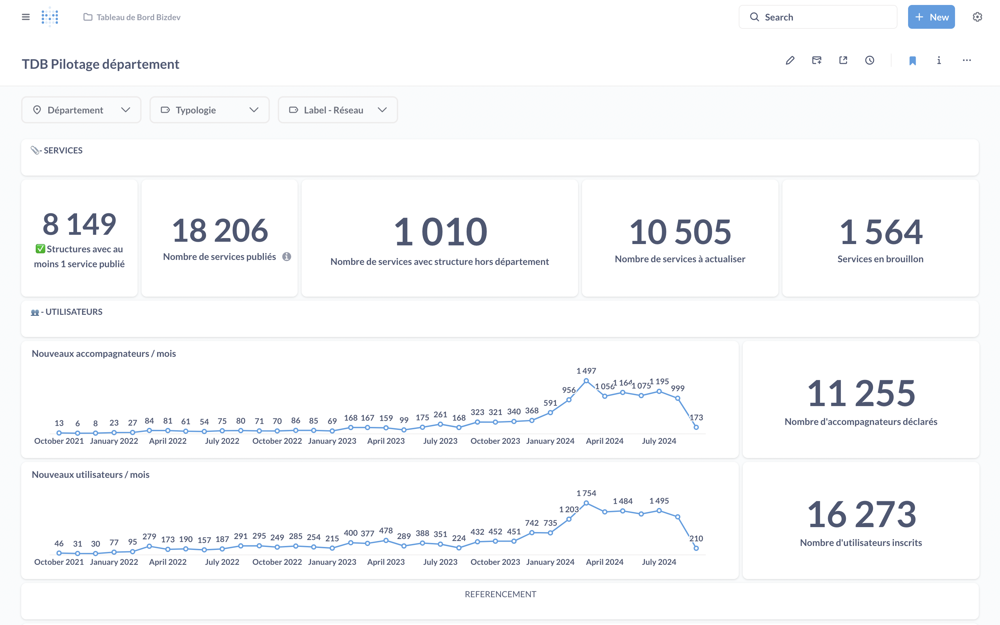

> *« Sans maîtrise, la puissance n'est rien. »* -- [Pirelli](https://www.youtube.com/watch?v=GlwRMdmeoFE)

[Metabase](https://www.metabase.com/) est une solution logicielle open source d'analyse de données et de business intelligence (BI). C'est un outil à la fois très puissant et hyper accessible. Il est extrêmement facile et rapide de déployer une instance, de la configurer, d'y brancher une source de données, analyser les schémas, explorer les tables, définir des questions, élaborer des tableaux de bord riches et dynamiques et les exposer sur Internet. 

La simplicité de prise en main de l'outil est à la fois l'une de ses plus grandes forces, qui justifie son succès auprès de nombreuses équipes, à l'aire du low/no-code, et en même temps son plus grand piège.

Voilà plusieurs années que j'ai découvert cette solution, que je la gère (infogérance, administration, maintenance, optimisation), l'utilise et accompagnent des équipes qui la mettent en œuvre. Si j'apprécie toujours autant le produit au fil du temps et n'hésite pas à en faire la promotion ou le proposer autour de moi, j'en mesure aussi les limites, les difficultés et les écueils.

Cet article dresse la liste des pièges ou difficultés que j'ai rencontrées au cours de mes différentes expériences.

## 1/ Se laisser déborder par les capacités de l'outil

#### Contexte / problème

Il y a un scénario que j'ai vu se répéter à plusieurs reprises, si ce n'est à chaque fois (et pas que sur mes projets). 

Au commencement, Metabase est introduit au sein du SI pour répondre à un petit besoin spécifique : aider le gestionnaire produit (PO ou PM) ou l'UX designer à explorer les données qui commencent à s'accumuler pour vérifier l'usage, l'attraction de celui-ci et/ou envisager les pistes et besoins métiers à creuser ; permettre aux développeurs ou aux personnes du support de réaliser plus facilement des requêtes pour débugger ou étudier le système ; mettre en place une simple [page "Stats"](https://beta.gouv.fr/stats) pour partager l'impact du produit sur le marché ou son écosystème.

La mise en place se fait aisément et rapidement, tout le monde est excité par le résultat et la solution, pragmatique, pertinente, efficace. À ce moment, le périmètre de responsabilité couvert par Metabase est très restreint, secondaire ou carrément interne.

Les semaines et les mois passent. Les membres de l'organisation commencent à se rendre compte des capacités extrêmement avancées de l'outil. En particulier les responsables de déploiement (*bizdevs*) ou commerciaux (*sales*), qui multiplient la création de questions, cartes, modèles, segments, tableaux de bord et collections en tout genre. Les développeurs, eux, sont passés à la suite. Ils ont intégré avec succès le dashboard "Statistiques" dans une iframe ou posé le lien vers le tableau "Pilotage de la structure" et se concentrent sur d'autres pans du SI.

Metabase fait désormais partie du quotidien des bizdevs et pour encourager et facilier le déploiement du produit auprès de clients, partenaires ou "directions sponsors", ils accompagnent leur discours d'outils de pilotage, dont des tableaux Metabase de plus en plus évolués. Ceux-ci affichent des dizaines de métriques, sous toutes les formes, avec plusieurs filtres dynamiques qui recalculent et rechargent les données en direct, depuis le début du projet ou de la collaboration. La page met parfois du temps à s'afficher et il faut parfois la recharger plusieurs fois d'affilé pour que certains chiffres ou courbes apparaissent. Les bizdevs se sentent embêtés lorsque cela arrive *en live* ou lorsqu'un interlocuteur les sollicient directement à ce propos. Quand ce n'est pas un problème d'affichage, c'est un souci de justesse ou de cohérence des données. On en parle vite afit au PO ou parfois en daily / rétro. Mais la roadmap est tellement pleine… on préfère épargner les devs pour qu'il se concentrent sur les autres fonctionnalités, qui sont elles aussi très attendues (notamment par les bizdevs eux-mêmes). 

Les devs savent qu'il y a ce petit bout de leur SI qu'il va bien falloir gérer correctement un jour. Dans un monde idéal, afin de reprendre le contrôle technique de cette partie du produit, on ferait une vraie page "dashboard" directement dans l'application, avec moins de métriques, moins de fonctionnalités et moins de capacités laissées dans les mains de "moldus de la tech". Attendons de voir, le jour où il y aura un problème 🤷‍♂️…

> "Je ne comprends pas, ça tournait parfaitement pendant des mois… On n'a rien touché et là tout d'unn coup, c'est devenu inutilisable !"

Cocorico ! C'est le jour J. Plus rien ne fonctionne. Nous sommes au début du mois (*NDLA : ce détail est important*). Plusieurs responsables partenaires importants nous appellent car la plateforme est lente et qu'ils ne peuvent avoir leurs chiffres, essentiels pour leur activité de reporting. De notre côté, il y a le comité d'investissement très bientôt. ON DOIT FAIRE QUELQUE CHOSE ! 

Malgré les autres priorités produit, on détourne une partie des efforts de l'équipe technique pour résoudre le problème. Cela va prendre plusieurs semaines (entre 2 et 6 pour une première passe de stabilisation du composant).

Au final, Metabase est devenu un élément bien plus important – trop – que prévu, dans le SI, au sein du produit et vis-à-vis d'une population d'utilisateurs (les responsables partenaires) à fort "impact projet" qui n'était pas prioritaire, tout du moins, pas planifié aussi tôt par rapport au développement du produit.

#### Astuces / résolution :

* il faut vraiment **considérer et gérer Metabase et les fonctionnalités qu'on exploite comme une partie désormais intégrante du produit**. Au moment d'intégrer Metabase dans un SI ou sur un produit, bien avoir en tête que, de part ses fonctionnalités puissantes et son accessibilité, il va rapidement devenir un composant important, nécessitant un soin particulier, une organisation / gestion dédiée et ouvrir tout un pan d'activité métier pour lequel il faut se tenir prêt (nouvelles typologie d'utilisateurs, nouvelles tâches du quotidien pour les bizdevs, sales ou resp. support, nouvelles opérations de surveillance et maintenance pour les devs, etc.). 

* côté technique, il est important de **documenter le choix de Metabase, son installation / intégration au projet et mettre en œuvre un outillage minimum** (lui aussi documenté) pour la suite : fichier docker-compose.yml, scripts pour reproduire en local un environnement iso-prod, variables d'environnement dans le code, mécaniques pour versionner les objets ou la base de configuration de Metabase, etc.

* à tout moment, garder en tête que le volume de données va sensibliser augmenter avec le développement du produit, l'accroissement des tables, colonnes et relations, et… le temps (pour les visualisations par jour ou mois qui engendrent des `GROUP BY` et des `SORT` de plus en plus coûteux).

*  lire les point ci-dessous, plus courts, c'est promis 😅
  
## 2/ Brancher Metabase directement sur la base de production

Il s'agit là aussi d'une erreur classique, que je vois presqu'à chaque fois, et qui peut avoir des conséquences importantes sur la bonne santé d'un SI de production.

Il est très facile de monter une instance Metabase (*), de la configurer et de commencer à l'exploiter par les premiers utilisateurs. Il l'est tout autant de déclarer la base de données de production de son SI comme source de données, voir apparaître magiquement les schémas, tables et premières métriques.

> (*) Ça se se fait en [moins de 10mn sur Scalingo](https://doc.scalingo.com/platform/getting-started/getting-started-with-metabase).

Au début, c'est magique et rapide. Puis, à mesure que les usages se font, que les questions se créent, que les dashboards se multiplient, que les données s'accumulent et que les requêtes grossissent (conception et volume de données traitées et/ou retournées), on commence à voir apparaître des soucis de performance, de stabilité, ou de qualité de la donnée (fraîcheur, justesse).

Pis, les traitements transactionnels cœur de métier commencent à être impactés, entraînant une dégradation de l'expérience et de la valeur utilisateur.

Cela s'explique car la nature des traitements opérés sur la base de données de production est différente de ceux pour quoi et comment elle a été destinée jusqu'alors.

Par exemple, certaines requêtes effectuées dans le cadre de Metabase peuvent nécessiter la mise en place d'index spécifiques. À noter, que ceux-ci peuvent avoir un impact négatif non-négligeable sur les opérations d'écriture (insert, update, delete) pour certaines tables ou types d'usage.

#### Astuces / résolution :

* la meilleure solution à mon sens, la plus propre, consiste à **disposer d'une base de données répliquée dédiée à l'analyse de données** (tout ou partie, en temps réel ou a postériori, logique ou physique), afin de conserver la base de données le plus loin possible de Metabase

* il ne faut pas hésiter à effectuer et analyser les plans d'exécution pour **optimiser les requêtes de BI  ou bien configurer les index dédiés**

* il peut être pertinent et utile de fabriquer / maintenir à jour des tables de pré-calculs (aussi appelées "**tables dérivées**") à partir des données de production pour optimiser certaines requêtes SQL / Questions / Modèles Metabase

J'ai vu une équipe utiliser Metabase pour répondre le plus rapidement, simplement et efficacement possible à un besoin utilisateur de suivi d'un type de données en quasi temps réel. L'avantage pour les utilisateurs est aussi de disposer de filtres pour faire joujou avec. Je suis d'accord que la solution Metabase est pragmatique et frugale… dans un premier temps.

Je pense qu'à terme, l'équipe technique doit reprendre la main, dans le code applicatif (ou dans l'organisation) pour adresser *par le code* la problématique couverte. Il me paraît important pour le produit de bien maîtriser son périmètre fonctionnel et de ne pas verser dans le solutionnisme technologique de proposer des features juste parce que "c'était simple à activer", sans que le besoin utilisateur ne soit avéré.

Sans compter qu'introduire une brique comme Metabase n'est pas un acte anodin en terme d'architecture et de maintenance du SI. Pour rappel, Metabase est développé en Kotlin (JVM). Il y a fort à parier que la stack de l'application soit dans un langage éloigné. La gestion de l'infrastructure et des opérations techniques doit aussi être évaluée et intégrée à la décision. De même que l'impact sur l'installation en locale,  sur les environnements de développements (recette jetable) ou sur la chaîne d'intégration continue.

Oui, brancher Metabase directement sur la base de production permet d'avancer plus vite dans un premier temps, de tester la solution ou des hypothèses métier auprès des utilisateurs. Mais à terme, et plutôt rapidement, il est crucial de bien dissocier les aspects transactionnels primaires du SI, des aspects secondaires d'analyse de données.

## 3/ Avoir une gestion débridée et anarchique des objets Metabase (Questions, Modèles, Dashboards)

## 4/ Négliger de versionner la base de configuration de Metabase

## 5/ Perdre le contrôle des utilisateurs / consommateurs des tableaux Metabase

## 6/ Commencer à réaliser des opérations d'écriture depuis Metabase (la boîte de Pandore)

