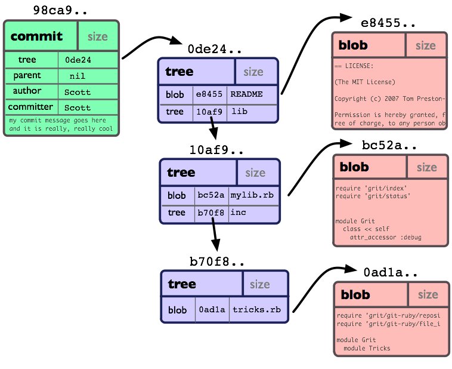
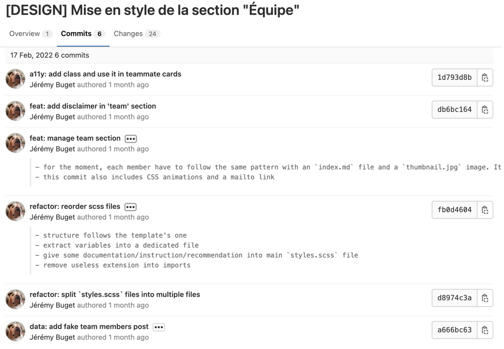

## TL;DR

Pour des projets importants, long terme et multi-collaborateurs, bien gérer son historique Git est important.
Cela passe nécessairement par pousser de bons commits.
À mon sens, un bon commit Git respect 5 critères :
- il est entièrement "vert"
- il couvre une intention claire et unique
- il doit avoir une taille raisonnable (nombre, nature et quantité de fichiers/LoC impactés)
- il comporte un changement complet
- il est bien nommé et décrit

## Table des matières

- [Introduction](#introduction)
  - [Qu'est-ce qu'un commit Git ?](#quest-ce-quun-_commit_-git-)
  - [Dans quel cas et pourquoi le sujet est-il important ?](#dans-quel-cas-et-pourquoi-le-sujet-est-il-important-)
- [Critères de qualité d'un commit Git](#critères-de-qualité-dun-commit-git)
  - [a. Un bon commit doit être entièrement “vert”](#a-un-bon-commit-doit-être-entièrement-vert)
  - [b. Un bon commit doit se restreindre à une intention unique claire](#b-un-bon-commit-doit-se-restreindre-à-une-intention-unique-claire)
  - [c. Un bon commit doit avoir une taille raisonnable](#c-un-bon-commit-doit-avoir-une-taille-raisonnable)
  - [d. Un bon commit doit contenir un changement complet](#d-un-bon-commit-doit-contenir-un-changement-complet)
  - [e. Un bon commit doit avoir un _bon message_](#e-un-bon-commit-doit-avoir-un-_bon-message_)
- [Bonus : quelques bonnes pratiques courantes](#bonus--quelques-bonnes-pratiques-courantes)
- [Conclusion](#conclusion)
- [Liens](#liens)

## Introduction

Récemment j'ai entamé un compagnonnage en tant que mentor auprès d'une nouvelle personne.
Comme d'accoutumée, assez tôt dans notre relation (au bout de la 2ème ou 3ème session), nous avons abordé la question d'un **"bon commit Git"**.
Quite à faire, autant partager ma vision / définition ici.

> **Préambule :** je ne prétends pas détenir la vérité. 
> Tout ce qui suit est issu de mon expérience et reflète mes convictions personnelles.
> Vous pouvez ne pas être d'accord, trouver que c'est ça va trop loin, pas assez loin, pas dans la bonne direction ou autre.
> Au contraire, je serais ravi d'échanger avec vous sur le sujet.

### Qu'est-ce qu'un _commit_ Git ?

Un _commit_ Git est un instantané complet de votre _repository_ à un _temps t_.

Usuellement, un commit contient les changements de code source d'un projet.

Les changements concernés sont de 2 natures (*) :
- l'ajout, le renommage ou la suppression d'un fichier
- l'ajout, l'édition ou la suppression d'une ou plusieurs lignes de code (LoC) pour un fichier donné

_(*) j'ai beau chercher, je ne vois pas d'autres sortes de changement._

Plus concrètement encore un commit comprend (entre autres et _grosso modo_) :
- un [_hash_](https://www.mikestreety.co.uk/blog/the-git-commit-hash/#:~:text=The%20commit%20hash%20is%20an,The%20file%20changes) qui est une chaîne de caractères unique générée via l'algorithme SHA-1 à partir de plusieurs propriétés du commit
- des meta-données : auteur(s), date, commit parent
- les fichiers changés (et leurs modifications)
- un message, champs de donnée textuelle (dont [la taille maximale semble être `size_t`](https://stackoverflow.com/a/9733857))

Pour plus de détails et moins d'approximations, je vous invite à consulter la documentation officielle sur [ce que contient exactement un "Commit Object"](https://git-scm.com/book/en/v2/Git-Internals-Git-Objects).
Spoiler alert : c'est un peu velu 😅.



Point crucial : **un commit est immuable**. Il ne peut JAMAIS être modifié.

> Il n'est pas possible de modifier un commit, mais il est possible et courant de modifier l'historique des commits (grâce notamment à la sacro-sainte commande `git rebase`).
> Le cas échéant, de nouveaux commits seront créés et viendront remplacer les commits concernés.

### Dans quel cas et pourquoi le sujet est-il important ?

Si vous êtes un développeur en solitaire sur un _pet project_, il y a de fortes chances que la question ne soit pas des plus pertinentes.

En revanche, elle le devient - à mon sens - dès lors que vous êtes amenés à contribuer et pousser du code sur un projet ambitieux, multi-collaborateurs, Open Source ou dont le but pour vous est de travailler et présenter un "état de l'art".

Dernièrement, je suis intervenu sur une petite mission d'intégration front-end d'une maquette pour un site Web.
J'étais à ce moment le principal voire quasi unique contributeur du projet.
Celui-ci avait vocation à être repris et poursuivi par mon client (et ses futurs autres prestataires).
C'est simple et bête, mais lorsqu'il a vu le soin que j'apportais à mes commits, il a rapidement été rassuré sur la qualité de ma production.
À la rigueur, d'un point de vue personnel, oui, c'est satisfaisant et ça flatte l'_ego_ mais l'essentiel est ailleurs.
**Quand on se projette au niveau d'une équipe, avoir une véritable hygiène de commit Git est révélateur de l'exigence, de la culture d'ingénierie logicielle et de l'ambition/importance du projet pour celle-ci.**
{.pros}

> _« Aides-toi, le Ciel t'aidera »_
> 
> -- Jean de La Fontaine, [le chartier embourbé](https://www.bonjourpoesie.fr/lesgrandsclassiques/poemes/jean_de_la_fontaine/le_chartier_embourbe)

D'un point de vue plus factuel, **une bonne gestion de ses commits Git facilite et accélère la revue technique (et même fonctionnelle) du code** ou de la PR/MR associée au(x) commit(s).
Relire et valider du code est rarement l'activité favorite des développeurs.
J'ai souvent vu l'étape de _review_ devenir ou être le goulet d'étranglement du flux de développement des équipes auprès ou dans lesquelles je suis intervenu.
Un moyen simple et efficace de fluidifier ce passage (en plus de mieux découper en amont le besoin produit) est de faire l'effort d'avoir des commits bien faits, qui donnent envie d'être relus rapidement et qui permettent de le faire sans trop de douleur pour le(s) relecteur(s).
Quoi de plus frustrant pour un développeur ou une développeuse que de voir sa branche végéter et devoir la synchroniser régulièrement (avec l'angoisse et l'enfer de gérer les conflits).  
{.pros}

Dernier argument important, mais pas des moindres : en cas de gros pépin dans le code, sur son poste local ou pire, sur tout le projet, **avoir un historique de qualité permet de s'économiser bien des tracas**.
Quand un tel problème survient, la jauge de stress augmente très vite et la lucidité devient rapidement une denrée rare.
Autant s'éviter des obstacles supplémentaires, au pire moment 😇.
{.pros}

## Critères de qualité d'un commit Git

À mon sens, un bon commit Git respect 5 critères :
- il est entièrement "vert"
- il couvre une intention claire et unique
- il doit avoir une taille raisonnable (nombre, nature et quantité de fichiers/LoC impactés)
- il comporte un changement complet
- il est bien nommé et décrit

### a. Un bon commit doit être entièrement "vert"

Par "vert" j'entends qu'**un commit doit satisfaire à toutes les exigences et standards métier comme techniques** de l'équipe / projet / organisation.

En premier lieu, les changements de code embarqués dans le commit doivent être opérationnels.
Ils doivent permettre la réalisation complète de l'exigence fonctionnelle ou histoire utilisateur associée.
Le comportement métier qui en découle doit être celui exprimé / attendu.
Il ne doit pas y avoir de bug, défaut ou manquement produit (ou technique, le cas échéant).

Côté implémentation, les tests doivent s'exécuter correctement (attention aux `.only` qui traînent !) et respecter les critères de succès (attention au temps de réponse général qui _dérape_ !) ;
les linters / formatters / validateurs et autres outils ou hooks doivent passer avec succès ;
les standards de design et de code de l'équipe doivent être suivis ; 
l'outillage de CI doit aussi être satisfait dans les bonnes conditions #MD10, etc.

### b. Un bon commit doit se restreindre à une intention unique claire

J'ai tendance à considérer principalement (NDLA : "mais pas que !") 2 types d'intention :
- un changement structurel : remaniement amont ou aval du code dont on n'attend aucune modification fonctionnelle, architecturale, contractuelle, juridique, etc.  
- un changement comportemental : gestion (ajout, évolution, suppression) d'une fonctionnalité ou d'un mécanisme (notification, authentification, journalisation, etc.) du système

Prenons l'exemple d'une _user story_ (US) dont le but est de "permettre à l'utilisateur d'activer ou désactiver via l'API une notification par SMS lors d'un évènement particulier".

L'historique Git de la branche associée à cette US pourrait être le suivant :
1. commit structurel pour ajouter une abstraction à la classe `NotificationService` et la renommer elle-même en `EmailNotificationService`
2. commit comportemental pour ajouter une classe concrète implémentant `NotificationService` nommée `SmsNotificationService`
3. commit comportemental pour modifier le command handler `ManageNotificationHandler` et permettre l'activation / désactivation de la notification SMS 
4. commit structurel pour remanier un peu le code du command handler `ManageNotificationHandler` et mutualiser un peu de code
5. commit documentaire pour formaliser une [ADR](https://github.com/joelparkerhenderson/architecture-decision-record) quant au design ou à la stratégie applicative

**On évite de mélanger les choux et les carottes dans un commit.**
Si mon commit actuel porte sur l'édition de contenu (ex : éditer un article de blog), j'évite de modifier du code relatif à du design général (sauf si requis par le contenu en question), ou de modifier le templating de la page "Contact".
Même si c'est tentant, facile, rapide ou que le fait de le voir devient un irritant instantané !
Toute la discipline que nécessite une bonne gestion de l'historique Git est incarnée par ce dernier exemple.

### c. Un bon commit doit avoir une taille raisonnable

Autant les deux premiers critères sont relativement neutres, objectifs, factuels. Autant celui-ci va nécessiter plus de subtilité de votre part.

Pour être digeste, un commit doit limiter le nombre de fichiers et lignes de code impactées.

**Un "gros" commit aura beaucoup plus de chance de rentrer en collision avec d'autres commits lors d'une fusion ou rebasage**, chose que l'on préfère éviter à tout prix.

Difficile de donner des chiffres faisant office de référence.
Personnellement, je trouve qu'un commit a une taille agréable lorsqu'il touche moins de 5 fichiers et concerne moins de 80 LoC.
Mais ça dépend vraiment de la nature du commit, de ma maîtrise de la partie du code concerné, du design ou architecture dudit code, etc.

Lorsque l'on renomme une variable ou une classe (Java, TS ou même CSS), il est possible que cela impacte des dizaines voire centaines de fichiers.
Le cas échéant, il est très probable de n'avoir aucun sens à splitter le commit en plusieurs.

Idem lorsque l'on déplace un fichier.

Bref, les contre-exemples ne manquent pas. Cependant, si le critère précédent est respecté (à savoir "une intention claire et unique"), il y a des chances pour que la taille soit un mal nécessaire acceptable.

### d. Un bon commit doit contenir un changement complet 

Ce quatrième critère vient directement challenger le critère précédent, sur la taille d'un commit.

On appelle "changement complet" un ensemble de modifications du code qui représente un tout cohérent.

Si je reprends l'exemple de l'US à propos de la notification SMS (critère #2), on voit que le tout premier commit satisfait à ce critère, dans le sens où il touche une classe et son interface (ainsi que les fichiers de tests associés) de façon cohérente, pertinente et consistante.

On aurait pu découper ce commit en 3 :
1. Renommer la classe `NotificationService` en `EmailNotificationService`
2. Ajouter une interface `NotificationService`
3. Modifier la classe `EmailNotificationService` pour qu'elle implémente l'interface `NotificationService`

Mais pour le coup, je trouve personnellement que les commits auraient été "trop petits", augmentant la pénibilité de relecture du code, voire injectant un pseudo context-switching (dans ma tête, 1 commit = 1 contexte).
À la rigueur, le premier commit, qui contient un renommage important, impacte plusieurs fichiers qui l'appellent
Mais le côté "potentiel de code non utile" (car pas utilisé) du second me gêne.

Tout l'enjeu est d'arriver à estimer dans quelle mesure "la complétude" attachée à l'intention sous-jacente du commit est étendue à toute la base de code ou pas.

Autre exemple qui peut être difficile à trancher ou très situationnel : l'ajout d'une règle de _linter_ (changement de nature plutôt structurelle).
Si je vois que l'ajout de la règle modifie considérablement 30+ fichiers, je vais peut-être la restreindre à un sous-ensemble le plus cohérent ou proche possible (pour rester "complet") du code, afin de pouvoir splitter l'intention en plusieurs commits.
Si l'impact porte sur quelques lignes ou fichiers, plutôt localisés ou clairement identifiables, je vais me permettre de le faire d'un seul tenant.

### e. Un bon commit doit avoir un _bon message_

Dernière étape avant de pouvoir pousser un commit sur l'entrepôt de code central distant.
En tant que telle, l'impatience domine généralement notre esprit à cet instant du flux !
D'autant plus quand on dispose d'une bonne CI/CD qui va déclencher la batterie de tâches automatisées jusqu'au déploiement du code dans un environnement partagé (review app, pré-prod, prod). 

Malgré les années, encore aujourd'hui, la tentation reste grande de lâcher un expéditif `git commit -m "fix problem"` pour voir le résultat en live et passer à la suite.

Il faut résister et respecter les règles.
Ce serait dommage d'abandonner si près du but…

#### Bien formuler le titre du message de commit

Et les règles, justement, sont les suivantes :
- tout message de commit doit être exprimé dans la langue fixée par l'équipe ; on évite l'alternance de commits une fois en anglais, une autre en français, etc. 
- comporte un titre
- ce titre doit être explicite sur l'intention du commit ; on évite les titres du style _"fix problem"_ ou _"oups (I did it again)"_
- celle-ci doit être exprimée de la façon la plus métier / produit / utilisateur / _system-level_ possible ; on évite autant que possible les explications ou jargons technico-technique
- au passage, un titre commence par une majuscule, mais ne se termine pas par un point (ce n'est pas un paragraphe) 
- dans la même veine, un titre commence par un message d'action (et non d'état, ni auxiliaire)

Voilà pour les basiques non négociables.
On pourrait s'arrêter là.
Notre historique Git aurait déjà belle allure.
Mais je vous propose d'aller un cran plus loin.

#### Renseigner la partie description 

Lorsque les changements contenus dans un commit comportent une certaine dose de complexité ou de réflexion avancée, **il peut être intéressant de prendre le temps de renseigner la partie description libre du message** permise par Git.

Je dois bien avouer que 90% de mes propres commits se limitent au titre.
Mais lorsque j'estime que le commit recèle quelques subtilités, alors je fais l'effort et je prends le temps de "documenter" mon cheminement d'implémentation, les changements.
En général, j'agrémente le tout de liens qui viennent illustrer ou soutenir la réflexion.

D'expérience, je sais que mes relecteurs proches ou futurs apprécient l'effort.
Moi-même, j'éprouve beaucoup de respect et de gratitude pour mes coéquipiers qui se donnent cette peine.
C'est à mon sens une façon concrète, réelle et intelligente de penser aux autres, à l'équipe, au futur.

#### Préciser l'intention grâce aux meta-données

J'appelle "meta-données" les éléments préfixes au message de titre qui permettent de donner du contexte au commit.

En cela, j'aime bien m'appuyer sur la spécification "[Conventional Commits](https://www.conventionalcommits.org/en/v1.0.0/)" qui donne un vrai cadre de rédaction des messages de commit.
Je trouve la spec plutôt exhaustive et jusqu'à présent je n'ai pas vraiment rencontré de cas pour lequel elle ne m'a pas bien guidé.
Au contraire, les rares fois où ça commençait à m'arriver, c'est que mon découpage de commit n'était pas bon.

Une option que je trouve intéressante est de préciser le(s) scope(s) de fichier ou fonctionnel couvert par le commit, ex : [back], [front], [db], [admin], etc.

> 🎁 **Bonus** : plutôt qu'un tag textuel (ex : "feat", "core", etc.) vous pouvez utiliser la convention [Gitmoji](https://gitmoji.dev/). 

#### Exemple de message

Voici un exemple (inventé) de message de commit tel qu'il pourrait être pour notre fameuse US de notification SMS : 

```
feat [back]: Ajouter un service de notification par SMS

Le service implémente l'interface `NotificationService`.

Ce commit ajoute 3 variables d'environnement dans le fichier `.env` :
- SMS_ENABLE
- SMS_API_ENDPOINT
- SMS_API_KEY

Au passage, on ajoute une dépendance Node à xxx qui contient le client officiel vers leur API.
cf. https://api.xxx.com/documentation#client

Remarques : 
- peut-être qu'il faudrait extraire l'appel au client dans un wrapper dédié.
- en l'état et de fait, on teste le service via des tests d'intégration alors que des TU seraient p-ê plus pertinents
```

### Exemples réels de commits

Ci-dessous, je vous partage d'autres exemples issus de _ma_ vie réelle, piochés à la va-vite dans mes derniers projets.



Avec le recul, et en toute sincérité, ils sont loin d'être parfaits et ne respectent pas tout à fait tous les critères ci-dessus.

- https://github.com/1024pix/pix/pull/3357/commits
- https://github.com/1024pix/pix/pull/3523/commits
- https://github.com/1024pix/pix/pull/1180/commits
- https://github.com/1024pix/pix/pull/2009/commits
- https://gitlab.com/aqoba/aqoba.fr/-/merge_requests/4/diffs?commit_id=7555a038bb2cc52f37227c53094c69a9fb2ef21c
- https://gitlab.com/aqoba/aqoba.fr/-/merge_requests/6/diffs?commit_id=035c0a0feba9f74d3b86452a4b5bebafa1a93d27

## Bonus : quelques bonnes pratiques courantes

- Commiter très souvent
- Pousser sur le repos distant au moins 1 fois par jour
- Ne pas hésiter à modifier / amender un commit (grâce à l'instruction `fixup` de la commande `git rebase -i`)
- Utiliser les hooks Git ou des outils comme Husky

Pour creuser un peu plus ce sujet, je vous invite à consulter [cet excellent article](https://blog.octo.com/en/seven-shades-of-git/) du non moins excellent Léo (😘).

## Conclusion

Produire des bons commits Git n'est pas chose aisée.

Cela demande de l'expérience, prend du temps, est souvent un exercice fastidieux, sans réelle plus-value directe pour le produit ou l'utilisateur.

En revanche, c'est une pratique qui participe grandement à la qualité (et la documentation) du code, la fluidité de l'équipe dans ses interactions (coucou la première valeur du [manifeste agile](https://agilemanifesto.org/iso/fr/manifesto.html)) et peut être véritablement salvatrice le jour hypothétique (qui finit toujours par arriver, loi de Murphy, tout ça) d'un gros pépin.

_Et vous, quelles sont vos critères ou bonnes pratiques Git ?_

## Liens
- [What's in a Good Commit?](https://dev.solita.fi/2013/07/04/whats-in-a-good-commit.html) #article 🇬🇧
- [What Makes a Good Git Commit?](https://www.simplethread.com/what-makes-a-good-git-commit/) #article 🇬🇧
- [Conventional Commits](https://www.conventionalcommits.org/en/v1.0.0/) #spec 🇬🇧
- [Git Guides](https://github.com/git-guides) #articles 🇬🇧
- [The Git Commit Hash](https://www.mikestreety.co.uk/blog/the-git-commit-hash/#:~:text=The%20commit%20hash%20is%20an,The%20file%20changes) #article 🇬🇧
- [Seven shades of Git](https://blog.octo.com/en/seven-shades-of-git/) #article 🇬🇧
