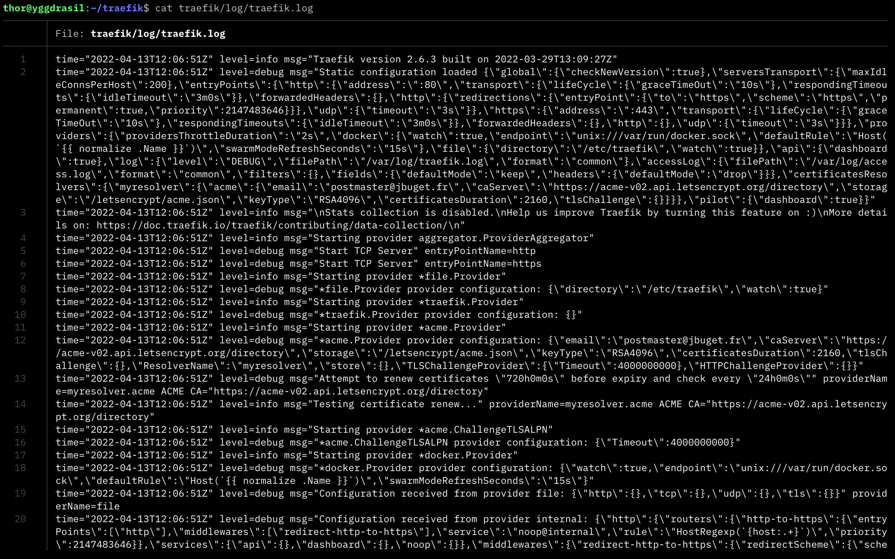
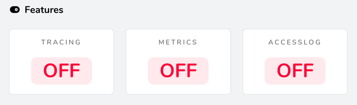
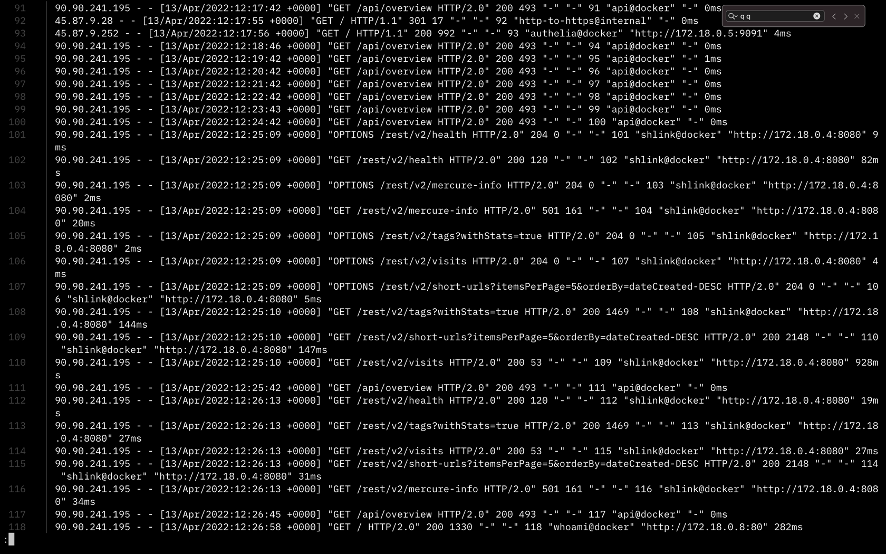
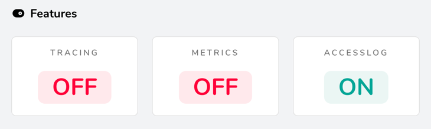
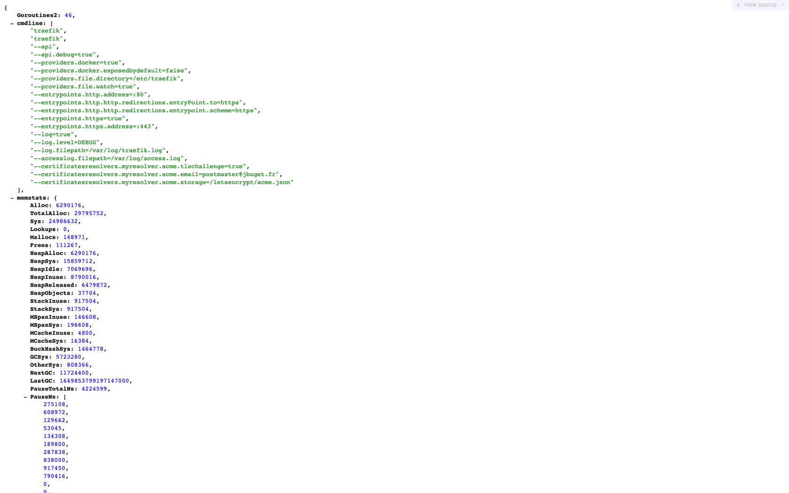
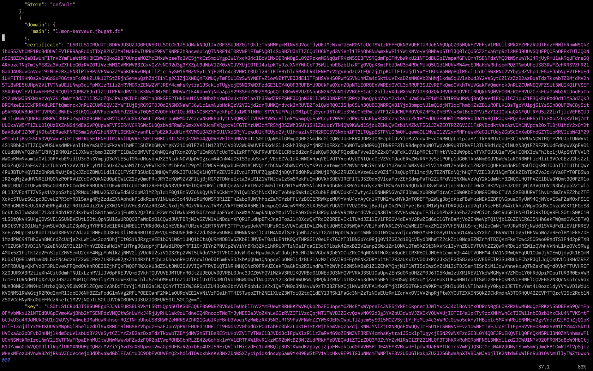
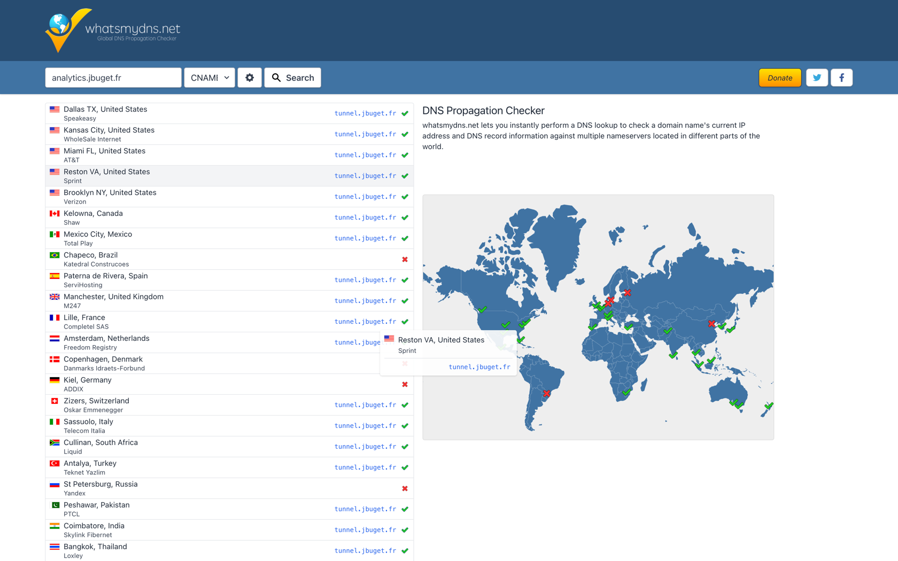

## TL;DR

Traefik est le reverse proxy moderne de choix pour gérer une infrastructure fortement conteneurisée (via Docker ou Kubernetes).

Cependant, déboguer une configuration Docker Compose managée par Traefik peut rapidement et pour longtemps devenir un casse-tête.

Heureusement, il existe tout un tas d'outils, techniques et vérifications pour s'en sortir à moindre mal.

## Table des matières

- [Introduction](#introduction)
- [1. Au niveau de Traefik](#1-au-niveau-de-traefik)
  - [1.1. Activer et exploiter les logs Traefik](#11-activer-et-exploiter-les-logs-traefik)
  - [1.2. Activer et exploiter les access logs Traefik](#12-activer-et-exploiter-les-access-logs-traefik)
  - [1.3. Activer l'API Traefik et son mode debug](#13-activer-lapi-traefik-et-son-mode-debug)
- [2. Au niveau du service](#2-au-niveau-du-service)
  - [2.1. Vérifier que le conteneur du service tourne bien](#21-vérifier-que-le-conteneur-du-service-tourne-bien) 
  - [2.2. Vérifier les logs docker-compose](#22-vérifier-les-logs-docker-compose) 
  - [2.3. Vérifier les copier-coller malheureux](#23-vérifier-les-copier-coller-malheureux) 
  - [2.4. Vérifier la déclaration du réseau en cas de multiples réseaux](#24-vérifier-la-déclaration-du-réseau-en-cas-de-multiples-réseaux) 
  - [2.5. Vérifier l’exposition du port quand l’app web écoute sur un port particulier](#25-vérifier-l-exposition-du-port-quand-l-app-web-écoute-sur-un-port-autre-que-80-ou-443) 
  - [2.6. Vérifier les fautes de typo dans les labels](#26-vérifier-les-fautes-de-typo-dans-les-labels) 
- [3. Au niveau DNS / SSL](#3-au-niveau-dns--ssl)
  - [3.1. Vérifier que l’entrée a été ajoutée au fichier Let’s Encrypt](#31-vérifier-que-lentrée-a-été-ajoutée-au-fichier-lets-encrypt)
  - [3.2. Vérifier la configuration DNS](#32-vérifier-la-configuration-dns)
  - [3.3. Vérifier la propagation DNS](#33-vérifier-la-propagation-dns)
  - [3.4. Vider le cache DNS / browser / local (utiliser un VPN)](#34-vider-le-cache-dns--browser--local-utiliser-un-vpn)
- [4. La solution ultime](#4-la-solution-ultime) 
- [Conclusion](#conclusion)

## Introduction

Traefik est, à mon sens, le reverse proxy de choix pour l'exposition de services managés via des solutions de conteneurisation, type Docker ou Kubernetes (vs. HAProxy ou NGINX).  

Je le trouve "relativement" simple à mettre en œuvre, très extensible, suffisamment performant, bien pratique grâce à sa fonctionnalité d'auto-discovery, bien outillé et pas mal documenté.

En revanche, comme beaucoup d'outils ops / infra, en cas de problème, défaut ou bug, on peut rapidement et facilement se prendre la tête ou des murs avec, en point d'orgue, le risque de détruire ou perdre définitivement des données ou des heures de travail critiques #stress #frustration #découragement.   

Dans cet article je vous partage une liste non exhaustive de pratiques ou vérifications que j'applique et accomplie lorsque je travaille avec Traefik, en espérant vous épargner un maximum de ressources (temps, moral, CPU/RAM, etc.).

> 🥝 Aucun animal ni être humain n'a été maltraité pour l'obtention de ces précieuses connaissances.
> On ne peut malheureusement pas en dire autant de certaines données utilisateurs, conteneurs ou machines (et leurs millions de transistors). 

## 1. Au niveau de Traefik

En cas de pépin, la première chose que l'on va rechercher et sur laquelle on va s'appuyer sont les traces ou journaux, a.k.a. _les logs_.

Traefik propose de générer et gérer 2 types de logs :
- les logs Traefik, qui donnent des informations sur le fonctionnement et l'état interne de Traefik
- les logs d'accès, qui donnent des informations sur les événements qui se sont produits sur le serveur d'hébergement (VPS)

> ⚠️ **Tous les logs sont effacés lorsque le conteneur Traefik est redémarré !**
> Pour vous prémunir contre ce mécanisme, vous pouvez utiliser un programme externe comme [`logrotate`](https://hub.docker.com/r/blacklabelops/logrotate/). 

Exemple de configuration possible : 

```yaml
traefik:
  image: traefik:v2.6
  container_name: traefik
  command:
    - "--api"
    - "--api.debug=true"
    - "--providers.docker=true"
    - "--providers.docker.exposedbydefault=false"
    - "--providers.file.directory=/etc/traefik"
    - "--providers.file.watch=true"
    - "--entrypoints.http.address=:80"
    - "--entrypoints.http.http.redirections.entryPoint.to=https"
    - "--entrypoints.http.http.redirections.entrypoint.scheme=https"
    - "--entrypoints.https=true"
    - "--entrypoints.https.address=:443"
    - "--log=true"
    - "--log.level=DEBUG"
    - "--log.filepath=/var/log/traefik.log"
    - "--accesslog.filepath=/var/log/access.log"
    - "--certificatesresolvers.myresolver.acme.tlschallenge=true"
    - "--certificatesresolvers.myresolver.acme.email=traefik@example.com"
    - "--certificatesresolvers.myresolver.acme.storage=/letsencrypt/acme.json"
  ports:
    - "80:80"
    - "443:443"
    - "8080:8080"
  volumes:
    - "./letsencrypt:/letsencrypt"
    - "/var/run/docker.sock:/var/run/docker.sock:ro"
    - "./traefik:/etc/traefik"
     - "./traefik/log:/var/log"
   networks:
     - web
```

### 1.1. Activer et exploiter les logs Traefik

Les [logs Traefik](https://doc.traefik.io/traefik/observability/logs/) contiennent de précieuses informations au démarrage de l'instance :
- quels sont les services managés, sur quel IP / port, avec quelles options
- un état des lieux des domaines / sous-domaines couverts, par quels certificats SSL / Let's Encrypt
- quels sont les routeurs, services, resolvers SSL ou middlewares pris en compte, etc.

Tous ces éléments sont pratiques pour **détecter un problème de configuration de Traefik ou de l'un des services**, qu'il soit embarqué dans le docker-compose du Traefik ou dans un fichier / stack externe.
{.pros}



Si vous disposez de suffisamment d'espace disque, n'hésitez pas à activer [le niveau de log `DEBUG`](https://doc.traefik.io/traefik/observability/logs/#level).

```shell
--log.level=DEBUG
```

### 1.2. Activer et exploiter les access logs Traefik

Par défaut, les access logs sont désactivés.

Vous pouvez facilement vous en rendre compte si vous avez activé le dashboard Traefik (section Features).



Les access logs contiennent des informations sur tout le trafic qui passe par le serveur :
- les requêtes
- le service managé concerné (ex : shlink@docker)
- les temps de réponse
- etc.

Ces éléments sont pratiques par exemple pour résoudre des soucis liés à une mauvaise configuration du contrôle d'accès à certains services (ex : via [Authelia](https://www.authelia.com/docs/deployment/supported-proxies/traefik2.x.html)).
Ils sont utiles aussi pour vérifier dans quelle mesure un service managé est accédé / atteignable ou pas (port non ouvert, proxy qui bloque, etc.).
{.pros}

Par ailleurs, ils peuvent être utiles pour suivre des métriques d'usage ou mesure / évaluer / qualifier une audience (ou un défaut pour certaines routes ou pages).
{.pros}



Pour l'activer, il faut préciser l'option `accesslog.filepath` :

```shell
--log=true
--accesslog.filepath=/var/log/access.log
```



### 1.3. Activer l'API Traefik et son mode debug

Par défaut, [l'API de Traefik](https://doc.traefik.io/traefik/operations/api/#endpoints) est désactivée.

Il s'agit d'un ensemble de points d'entrée, de fonctionnalités et services qui permettent de récolter des informations précieuses sur Traefik et son état internes.

> 🚨 **Certaines informations disponibles grâce à l'API Traefik sont critiques !**
> Il est fortement recommandé de désactiver l'API en production ou a minima de la protéger via un système de contrôle d'accès (ex : Authelia).

Par défaut, [le mode debug de l'API](https://doc.traefik.io/traefik/operations/api/#debug) est désactivé (même si celle-ci est activée).

Pour l'activer, il faut préciser l'option `api.debug` : 

```shell
--api.debug=true
```

Vous aurez alors accès à de nouveaux _endpoints_ depuis votre dashboard `https://<traefik.example.com>` :
- `/debug/vars`
- `/debug/pprof/` (attention, le `/` final est important ici)



## 2. Au niveau du service

> 💡 Je vous invite à consulter mon article sur les "[Trucs et astuces à propos de Docker et Docker Compose](/posts/trucs-et-astuces-a-propos-de-docker-et-docker-compose/)" si ce n'est pas déjà fait, pour disposer davantages d'outils, réflexes et bonnes pratiques, notamment à propos des logs Docker. 

### 2.1. Vérifier que le conteneur du service tourne bien

C'est très bête, mais la raison première pour qu'un service ne soit pas accessible en ligne, depuis son URL, peut être qu'il n'a pas tout simplement pas démarré.

Une première vérification facile et rapide consiste à lister les process Docker ou de la stack Compose, pour détecter si le vôtre est bien lancé.

Exemples de commandes :

```shell
# avec Docker
$ docker ps
$ docker ps | grep <mon_service>

# avec Docker Compose
$ docker-compose ps
$ docker-compose ps | grep <mon_service>
```

Si vous ne voyez pas votre service ou qu'il n'a pas le statut `up`, c'est qu'il y a un souci dans la config du docker-compose.

Cela peut être dû à un mauvais formatage YAML, un problème de dépendances entre les conteneurs (ex : `depends_on`), une option qui bloque le programme, une commande d'exécution mal définie, etc.

### 2.2. Vérifier les logs docker-compose

Une fois que vous avez l'assurance que votre service tourne, vous pouvez engranger de l'information et des éléments d'exécution via les logs des conteneurs / de la stack.

```shell
# pour toute la stack
$ docker-compose logs
$ docker-compose logs -f

# pour un service en particulier
$ docker-compose logs <mon_service>
$ docker-compose logs -f <mon_service>
```

Cela vous donnera des informations sur les raisons pour lesquelles un service ne démarre pas, ou mal.
{.pros}

On peut y trouver par exemple l'information qu'un script d'initialisation de base de données n'a pas été joué, ou qu'un composant n'est pas atteignable ou mal configuré (base de données, cache Redis, SMTP, LDAP, etc.).

### 2.3. Vérifier les copier-coller malheureux

Une erreur terrible et extrêmement coûteuse qui survient bien trop souvent dans une infra Traefik/Docker/K8s est le mauvais copier-coller.

Je ne compte pas les heures perdues à modifier dans tous les sens une config docker-compose.yml dans le répertoire du service défectueux, à le créer / stopper / redémarrer / vider / torturer, etc.
tout ça parce que dans un autre fichier de config, pour un autre service, dans un autre répertoire, j'ai copié-collé un bout de conf du fameux service, en oubliant de modifier le nom de celui-ci.

> ⚠️ C'est l'un des pièges de Traefik : les labels associés à un service Docker Compose peuvent être dispersés et déclarés dans plusieurs fichiers docker-compose. 

Un cas concret m'est arrivé lorsque je mettais en place le contrôle d'accès via Authelia de mon infrastructure Traefik. 
Sans le faire exprès, j'ai activé la restriction via (le label activant le middleware) Authelia d'un service A dans le docker-compose d'un service B.
J'y ai passé plus d'une heure, sans comprendre quoi que ce soit.
Toutes (presque) les logs étaient vides.
C'est comme s'il ne se passait rien.
J'en étais venu à soupçonner un cache Redis ou de fichiers générés.
J'ai _descendu_ (`docker-compose down`) mon conteneur / ma stack un paquet de fois.
Sur un service plus critique, j'en serais potentiellement venu à supprimer les volumes (dans ce type de cas, on s'approche très dangereusement et bien trop rapidement de "la zone rouge") 
Tout ça pour un malheureux copier-coller !

À bout d'idée et en désespoir de cause, j'ai eu l'illumination : j'ai [recherché toutes les occurrences](https://stackoverflow.com/a/16957078/2120773) de mon service, sur tout mon espace utilisateur (a.k.a. _home_).

🙌 Victoire ! J'ai pu trouver la ligne défectueuse, dans le mauvais fichier et remettre mon service sur pied.

Exemples de commandes :

```shell
$ grep -rnw '.' -e <mon_service>

# pour les utilisateurs UNIX _modernes_ qui ont installé "ripgrep"
$ rg <mon_service>
$ rg <mon_service> -g 'docker-compose.yml'
```

### 2.4. Vérifier la déclaration du réseau en cas de multiples réseaux

Parmi les erreurs courantes, il y a le cas fréquent de la stack faisant intervenir plusieurs réseaux.

Une bonne pratique avec Traefik et Docker consiste à [déclarer un réseau Docker externe](/posts/héberger-ses-propres-services-managés-sur-un-vps-avec-traefik-et-docker-compose/part-2/#1-prérequis--déclarer-un-réseau-docker-partagé-et-exposé).

Une stack Docker Compose est souvent constitué d'un serveur Web (celui qu'on va exposer via les `labels` Traefik), d'une application et d'une ou plusieurs bases de données.
Par mesure de sécurité et pour s'éviter une gestion des ports inter-stacks, une autre bonne pratique consiste à déclarer un réseau interne, grâce auquel les services & conteneurs pourront communiquer entre eux, ainsi que notre fameux réseau externe, accesible par les autres stacks et par un réseau externe (ex : Internet). 

À partir du moment où le service exposé (API Node.js, serveur Apache ou NGINX) déclare plusieurs réseaux (propriété `networks` du service), il faut impérativement préciser le réseau Docker attaché à Traefik.

```yaml
"traefik.docker.network=web"
```

Ci-dessous, un exemple de configuration avec le service Shlink (raccourcisseur d'URL) :

```yaml

app:
  image: shlinkio/shlink:3.0.3
  links:
    - db
  depends_on:
    - db
  networks:
    - internal
    - web
  labels:
    - "traefik.enable=true"
    - "traefik.docker.network=web"
    - "traefik.http.routers.shlink.rule=Host(`l.jbuget.fr`)"
    - "traefik.http.services.shlink.loadbalancer.server.port=8080"
```

### 2.5. Vérifier l’exposition du port quand l’app web écoute sur un port autre que `:80` ou `:443`

Dans le même ordre de problèmes, si votre service de point d'entrée écoute un port autre que ceux définis dans votre config Traefik (`:80` ou `:443`), vous devez le spécifier dans les labels du conteneur.

La propriété à définir est :

```yaml
traefik.http.services.<mon_service>.loadbalancer.server.port=<mon_port>
```

L'exemple de [la section 2.4. ci-dessus](#24-vérifier-la-déclaration-du-réseau-en-cas-de-multiples-réseaux) en est un parfait exemple (avec le port `:8080`).

En cas d'oubli, le résultat est une page blanche avec pour seule indication "Bad gateway".

### 2.6. Vérifier les fautes de typo dans les labels

Autre erreur du type "enfer", l'inversion de caractères.

Malheureusement, l'outillage et l'environnement de travail quand on intervient sur des VPS ou des configs Docker est le plus souvent bien moins développé que pour du dev classique.

Par principe, j'évite d'installer des choses non nécessaires sur des serveurs applicatifs.
Pas de "[Oh My Zsh](https://ohmyz.sh/)" ou autres programmes pourtant bien pratiques que j'utilise sur mon poste local au quotidien.
L'idée est d'éviter d'encombrer le serveur (ROM, RAM, CPU) et d'optimiser l'approvisionnement + installation de ce type de machines.
En outre, lorsqu'il faut déclarer des scripts, cela oblige à s'en tenir aux standards, et s'en éloigner le moins possible #compatibilité #résilienceFuture.

Bref, pour la coloration syntaxique, ou l'auto-complétion, il faut souvent se contenter du strict minimum.
Et en ce qui concerne les labels Docker, c'est pire, il n'y a rien.

Autre élément : lorsque l'on code du logiciel, il est très facile de mettre des tests unitaires et de se laisser guider par des méthodologies à base de test-first / TDD.
C'est notablement plus compliqué (même si pas infaisable avec Ansible & cie) avec de l'infra.

Moralité : si malgré les sections ci-dessus la page blanche persiste, vérifiez autant que nécessaire (et même plus encore) que vous n'avez tout simplement pas inverser le `t` et le `h` (ex : "auth", "height", "width").



## 3. Au niveau DNS / SSL

### 3.1. Vérifier que l’entrée a été ajoutée au fichier Let’s Encrypt

Il arrive qu'après avoir - correctement - configuré, démarré et exposé un service managé et son DNS, au moment d'accéder à l'URL, le navigateur indique que le site ou l'application en question n'est pas sécurisée.
Il manque le certificat SSL.

Si, comme moi, vous gérez vos certificats SSL via Let's Encrypt et la configuration proposée dans [la documentation officielle](https://doc.traefik.io/traefik/https/acme/), il y a de fortes chances qu'ils soient générés dans un fichier `acme.json` quelque part à côté du fichier docker-compose de votre Traefik, cf. la propriété `certificatesResolvers.myresolver.acme.storage`.
Le fichier que vous renseignez pour cette option sera celui qui contiendra tous les certificats SSL, générés via l'API Let's Encrypt 

> ⚠️ Let's Encrypt impose des [_rate limits_](https://letsencrypt.org/docs/staging-environment/#rate-limits) dans la consommation de son API.

Ainsi, un moyen simple pour se rendre compte si service possède bien son certificat SSL Let's Encrypt consiste à consulter le fichier `acme.json` et vérifier qu'il existe bien un objet JSON définissant un jeu de clés chiffrées pour l'URL cible du service.

```shell
$ cat <path/to/file>acme.json
```



> ⚠️ Vous devez disposer des droits "su" pour consulter le fichier `acme.json`.

### 3.2. Vérifier la configuration DNS

Dans le genre "erreurs d'inattention", un problème classique est **l'oubli du point final lors de la définition d'une entrée DNS**.

Pour rappel, pour chaque service managé exposé, il faut définir une entrée DNS de type CNAME du service vers le serveur + instance Traefik, selon le format :

```shell
# <name> : Le premier champ referme l’alias du domaine.
# <ttl> : Le champ « Time to live » (durée de vie) précise la durée pendant laquelle l’enregistrement sera conservé dans le cache. Passé ce délai, l’ordinateur devra à nouveau requérir ces informations.
# <class> : Le champ Class est facultatif. Il permet d’indiquer le type de réseau applicable à l’enregistrement.
# <type> : Ce champ permet de définir le type d’enregistrement. Ici, il s’agit d’un CNAME.
# <rdata> : Le dernier champ renferme les informations qui se rapportent à l’enregistrement lui-même. Ici, il s'agit du véritable nom de domaine

<name> <ttl> <class> <type> <rdata>

# Exemple :
mon_service.example.com. CNAME traefik.example.com.
```

Ah ! et n'oubliez pas de vérifier scrupuleusement le reste du texte, comme pour [le point 2.6.](##26-vérifier-les-fautes-de-typo-dans-les-labels)

### 3.3. Vérifier la propagation du CDN

Tout est bien configuré : Traefik, services de votre stack Docker Compose, labels, DNS.
Et pourtant, vous avez toujours une maudite page blanche !

Si vous venez de corriger votre configuration DNS, il est possible que la modification prenne du temps à se propager, jusqu'à atteindre votre infrastructure ou poste.
Généralement, avec les fournisseurs et infra modernes, il faut compter entre 1 et 5mn (max 1h, contrairement aux 48h annoncés par certains hébergeurs).

Exemples de commandes : 
```shell
$ dig mon_service.example.com
$ host mon_service.example.com
$ ping mon_service.example.com
$ traceroute mon_service.example.com
```

Vous pouvez aussi suivre la propagation de vos modifications DNS via certains sites : 
- [DNSChecker.org](https://dnschecker.org/)
- [WhatsMyDNS.net](https://www.whatsmydns.net/)



### 3.4. Vider le cache DNS / browser / local (utiliser un VPN)

On ne va pas se mentir, en arriver là, c'est généralement le signe d'un manque d'idée et de solution.
Je vais être honnête : votre salut est ailleurs.
Mais, après tout, il ne faut jamais délaisser une piste, aussi originale soit-elle 🤷‍♂️.

Il existe autant de façons et outils pour **vider le cache DNS d'une machine** (serveur ou PC) que de systèmes d'exploitation.

Exemples (non exhaustifs) de commandes sous Unix / Linux : 

```shell
$ sudo /etc/init.d/nscd restart
$ service nscd restart
$ sudo /etc/init.d/dnsmasq restart
$ /etc/init.d/named restart
```

Dans le même ordre d'idées / manipulations, il est possible de **[vider le cache navigateur](https://www.fvsu.edu/how-to-clear-your-browser-cache/)** (ou purement et simplement désactiver le cache navigateur)

Vous pouvez aussi modifier votre [_DNS resolver_](https://www.bortzmeyer.org/resolveur-dns.html) local et utiliser celui de CloudFlare (`1.1.1.1` et `1.1.0.0`), Google (`8.8.8.8` ou `8.8.4.4`) ou tout [autre DNS proposé sur le Web](https://thegeekpage.com/free-open-source-dns-servers/).

> 💡 Personnellement, je conseille et utilise les DNS resolvers de CloudFlare, à ma connaissance un poil plus respectueux de la vie privée et des données des utilisateurs.
> J'ai toujours beaucoup plus de mal à consommer l'infrastructure réseau de Google.

Finalement, une solution plus simple et plus efficace (selon moi), consiste à passer par un VPN et changer sa localisation.

## 4. La solution ultime

Nous arrivons à la fin de l'article et des pistes / pratiques / solutions qui me viennent en tête.

Si vous n'avez toujours pas résolu votre problème, il y a de très fortes chances que vous deviez dérouler à nouveau la liste depuis le début, jusqu'à avoir la révélation.

Il vous reste toutefois une dernière piste à explorer, et pas des moins agréable…

**Faites une pause !** 

Combien de fois je me suis buté des heures sur un problème, avant d'abandonner le cœur et l'ego meurtris pour finalement plier le problème en moins 5mn un peu plus tard ou le lendemain ?! 

Nous sommes d'accord : ce n'est pas vraiment le type de solutions rationnelles que l'on souhaite.
Mais face à des problèmes de configuration serveur, c'est l'une des plus efficaces qu'il m'arrive encore d'éprouver.
La "lucidité" (qui tire la "patience", la "clairvoyance", l'"optimisme" et l'"enthousiasme") est une forme de ressource personnelle qu'il est bon de recharger pour se dépêtrer de situations inconfortables ou compliquées.

## Conclusion

Normalement, vous devriez désormais disposer d'un arsenal d'outils et pratiques suffisant pour vous tirer de la majorité des situations que l'on peut rencontrer avec Traefik.

Encore une fois, cette liste est loin d'être exhaustive.
Je la mettrais à jour régulièrement s'il me vient de nouvelles idées.

Et vous, quelles techniques utilisez-vous pour vous en sortir avec Traefik et Docker Compose ? 

## Remerciements

Un grand merci à [**Jonas**](https://twitter.com/jonasgrilleres) et **[Vincent](https://twitter.com/VincentHardouin)** (qui a aussi entamé [un blog](https://vincenthardouin.dev/)) pour l'idée d'article, les échanges et la relecture. 
