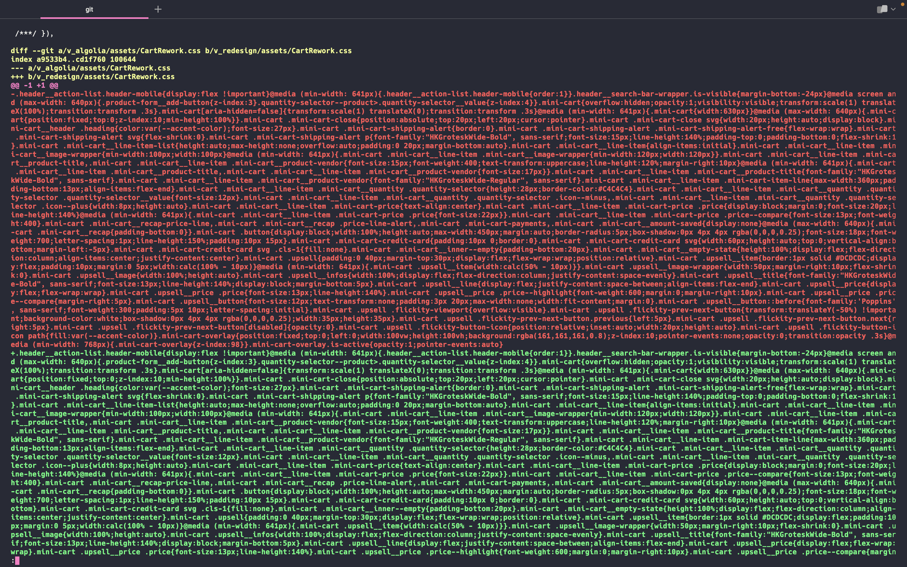
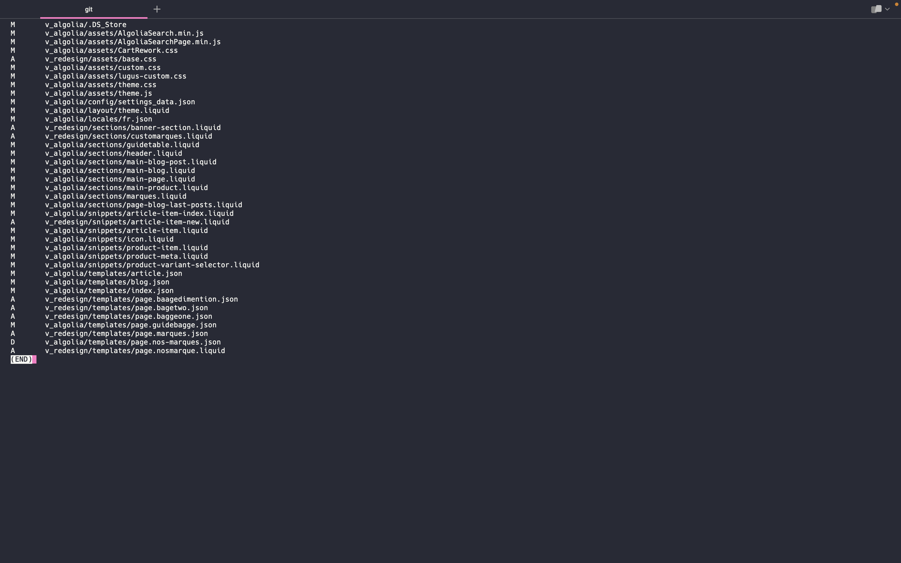
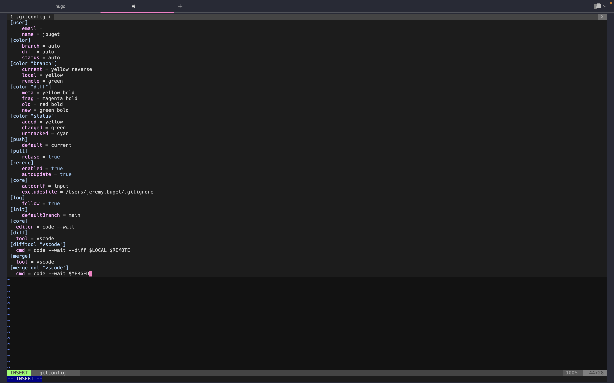
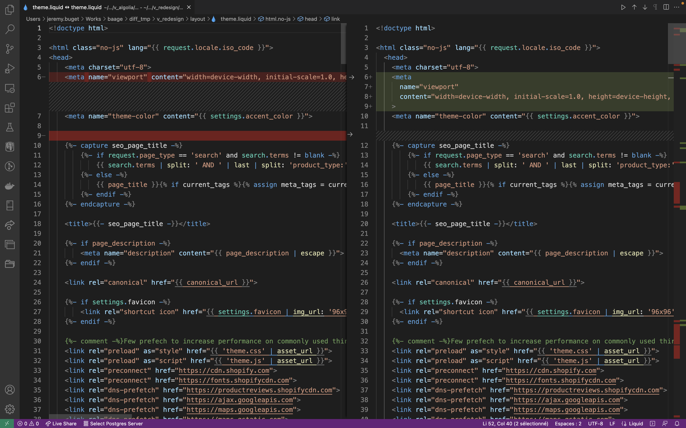
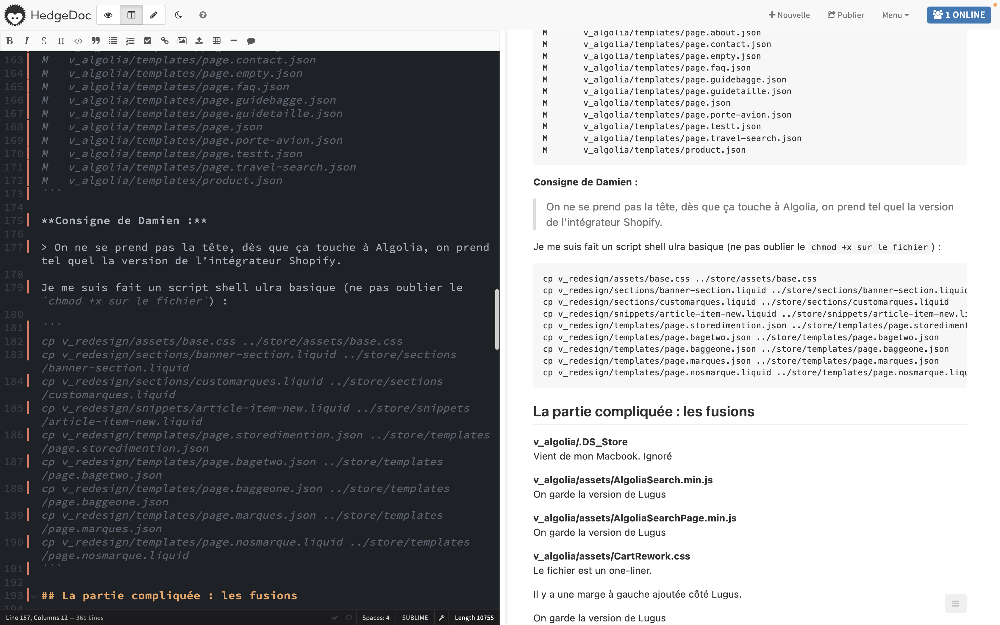

Git est un outil surpuissant qui regorge de commandes annexes et autres options magiques, telles que `git diff --no-index` et `git difftool`. Ce qui est génial, c'est que la plupart de ces commandes peuvent être utilisées et appliquées même dans des contextes ou pour des ressources non-gérées par Git. Idéal pour fusionner 2 versions différentes d'un même thème Shopify, qui ont divergé depuis des mois.

## TL;DR

Pour un projet de type "thème Shopify" (~260 fichiers) contenant une vingtaine de fichiers divergents sur 2 chantiers distincts qui se recoupent tout de même (blog et fiches produits d'un côté VS. intégration d'Algolia comme moteur de recherche de l'autre), il m'a fallu 1 grosse journée de travail (~10h, dont 2~3h gaspillées par ma méconnaissance de l'écosystème Shopify) en binôme avec le responsable produit et en proximité avec les 2 équipes.

Les points importants que je retiens de cette expérience et qui ont fonctionné :

- bien préparer son environnement et ses outils
- `git diff --no-index [--name-status]`
- `git difftool fileA fileB`
- courage, méthodologie, rigueur et patience
- documenter chaque étape / décisions de fusion
- communiquer, communiquer, communiquer

Apprentissages :
- la parallélisation a un coût
- ne JAMAIS sous-estimer une piste
- bien connaître l'environnement permet de s'économiser bien des heures et soucis

## Table des matières

- [La mission](#la-mission)
- [Préparatifs](#préparatifs)
  - [Estimation du nombre de fichiers du projet](#estimation-du-nombre-de-fichiers-du-projet)
  - [Évaluation globale des différences et conflits](#)
- [Le jour J](#le-jour-j)
  - [Seul on va vite ; ensemble on va loin… et plus vite encore !](#)
  - [Tout commence et finit avec Git](#tout-commence-et-finit-avec-git)
  - [Analyse graphique de divergences et résolution de conflits](#)
  - [Documenter c'est gagner ✌](#documenter-cest-gagner-)
  - [Courage, méthodologie, rigueur et patience sont sur un bateau… ✌](#courage-méthodologie-rigueur-et-patience-sont-sur-un-bateau)
- [Épilogue](#épilogue)
- [Conclusion](#conclusion)


## La mission

Dernièrement, un ami COO / PM d'un site de vente en ligne sous Shopify (~10K users/jour) m'a sollicité pour l'aider à finaliser un chantier devenu compliqué : **fusionner les changements opérés depuis 9 mois indépendamment par 2 prestataires différents, sur 2 chantiers différents, mais qui ont fini par se rejoindre sur certains points #conflits**.

Le premier chantier, mené par une équipe (3 personnes) spécialisés en Shopify, consistait à *intégrer et configuer Algolia* comme moteur de recherche.

Le second chantier, confié à un intégrateur Web front-end freelance, consistait à *faire évoluer sensiblement le design du site*, notamment les fiches produit ou la partie blogging. À noter que ce dernier ne maîtrisait pas Git et ne l'a pas utilisé pour sa version du projet.

Au moment où j'ai accepté la mission, je savais que le projet était sous Shopify, mais je n'avais jamais vraiment joué avec. Ni même avec Algolia. Et je n'avais aucune idée des changements (quantité et qualité) réalisés par le dev front-end.

Les jours précédents mon intervention – j'avais réservé un créneau d'une demi-journée – je stressais un peu de la masse de fichiers et conflits qui m'attendaient.

Au cours de mes expériences, j'ai été confronté plusieurs fois à des situations de merge, plus ou moins compliquées. Je ne m'en suis pas toujours bien sorti. C'est toujours une opération délicate et on a tôt fait de commettre des erreurs (jusqu'à l'irréparable) ou de s'engluer dans des fusions ou décisions malheureuses. D'autant plus quand on ne maîtrise pas le contexte ou qu'on navigue sous pression.

Spoiler alert : **ça nous a finalement pris toute la journée, mais nous y sommes parvenus 🎉 !**

## Préparatifs

J'ai beau être (souvent) téméraire, je ne suis pas (tout le temps) fou. Juste après que je me sois engagé à l'aider et quelques jours avant mon intervention, j'ai demandé à mon ami et client – Damien – de me partager les sources (format archive `.zip`) histoire de me faire une idée très vite fait pour annuler si besoin. C'était aussi une façon pour moi de commencer à préparer mes outils / mon travail. Et de me rassurer moi-même 😅.

### Estimation du nombre de fichiers du projet

La première chose que je fais est d'estimer la quantité de fichiers du projet, pour l'une et l'autre version. Pour ce faire, je dégaîne le combo "`find` + `wc`" :

```shell
# pour la version Algolia
$ find v_algolia -type f | wc -l
>     255

# pour la version redesign
$ find v_redesign -type f | wc -l
>     264
```

Apprentissage : **le projet contient ~260 fichiers**, soit une taille plutôt raisonnable #rassurant.

### Évaluation globale des différences et conflits

Il existe plein d'outils, sur tout système d'exploitation, plus ou moins avancés, pour comparer les différences de fichier et contenu entre 2 répertoires ou archives.

L'un des plus connus pour l'écosystème Unix/Linux/Mac est [la commande `diff`](https://man7.org/linux/man-pages/man1/diff.1.html), qui permet de comparer 2 fichiers ligne par ligne.

Mais j'ai mieux ! Grâce à Jonathan Perret, j'ai découvert la puissance de la commande `git diff` et ses options `--no-index` et `--name-status`.

La commande `git diff --no-index <pathA> <pathB>` permet de comparer 2 ressources (fichiers ou répertoires), sans même qu'elles ne soient gérées sous Git.



Comme vous pouvez le constatez, on obtient une immonde – mais très détaillée ! – bouillie de logs un peu absconse à interpréter. Disons que ça donne une idée générale.

C'est là où je dégaine ma seconde arme ! La commande `git diff --no-index --name-status <pathA> <pathB>` qui permet d'avoir une visualisation façon `git status`.

```
$ git diff --no-index --name-status v_algolia v_redesign
```



Ça devient tout de suite beaucoup plus intéressant et simple à déchiffrer !

Un coup de `wc` et on obtient 39 fichiers modifiés à gérer dans le cadre de notre fusion, soit ~15% du nombre totale de fichiers du projet.

Je m'étais fixé 30% comme limite pour faire NOGO. Ça va le faire.

Maintenant que nous savons comment obtenir le statut des divergences, nous pouvons désormais et grâce à la commande `grep` isoler très facilement les fichiers qui vont être simples à traiter de ceux eventuellement plus compliqués.

Pour cela, et dans la mesure où les 2 prestataires ont œuvré sur des fonctionnalités et des parties du code vraisemblablement distinctes et indépendantes (modulo quelques recoupements à la marge que je pressens), je considère que les fichiers qui n'apparaissent que d'un côté (taggués `D` ou `A`) doivent être conservés tels quels. Cette hypothèse va grandement me simplifier et accélérer la tâche, en plus de se révéler tout à fait juste. Il n'y a qu'une seule précaution à prendre : s'assurer qu'un même fichier n'apparaît pas avec 2 statuts différents.

Ce qui donne les commandes :

```shell
# Lister les fichiers ajoutés ou présents seulement sur la version Algolia
$ git diff --no-index --name-status v_algolia v_redesign | grep "D\s"

# Lister les fichiers ajoutés ou présents seulement sur la version Redesign
$ git diff --no-index --name-status v_algolia v_redesign | grep "A\s"

# Lister les fichiers pour lesquels il existe un éventuel conflit d'édition
$ git diff --no-index --name-status v_algolia v_redesign | grep "M\s"
```

Comme d'habitude, on peut coupler le tout à la commande `wc` pour compter les fichiers :

```shell
# Dénombrer les fichiers en conflits
$ git diff --no-index --name-status v_algolia v_redesign | grep "M\s" | wc -l
>     29
```

On a donc 29 fichiers (~11%) en conflit. Let's gooooo 🚀🚀🚀!

## Le jour J

### Seul on va vite ; ensemble on va loin… et plus vite encore !

C'est le grand jour. Damien m'a rejoint. Je n'étais pas sûr qu'il le puisse. Finalement, il restera avec moi et se montrera accessible quasiment toute la journée.

**Je pense que sa disponibilité ainsi que sa connaissance pointue du métier (cf. plus loin) ont été l'élément le plus crucial qui nous a permis d'avancer et de mener à bien l'opération sans trop de soucis.**

Pour rappel, je n'avais aucune connaissance du code source, du site, des technos (Shopify, Algolia, Liquid), des travaux demandés et réalisés, etc.

Damien n'est pas un développeur. Cependant, en tant que COO expérimenté et responsable informatique de sa boîte, il dispose d'une excellente culture tech. C'est quelqu'un de passionné par son métier et qui n'a pas peur de bidouiller dans les options et outils qu'il met en œuvre. Par ailleurs, en tant que PM du site et commanditaire des travaux, il a une connaissance très fine et une mémoire suffisamment bonne pour identifier plus ou moins précisément les demandes sous-jacentes aux bouts de code que je lui montre. Assez pour répondre à mes (très nombreuses) questions et (m'aider à) trancher promptement quand le cas se présente.

Autre élément ultra-important : quand il ne savait pas répondre ou qu'on avait un blocage (ex : obtenir les droits en lecture, puis écriture sur l'entrepôt de code, cf. paragraphe suivant), il pouvait contacter directement et quasi instantanément l'une ou l'autre équipe.

**La réactivité, l'implication et la bonne entente des uns envers les autres ont été une autre clé du succès de la mission.** Ça paraît tellement naïf ou évident à dire ; si seulement, c'était tout le temps le cas…

Nous voilà donc partis pour toute une journée de binômage Git intensif 😁 !

### Tout commence et finit avec Git

Comme je l'ai expliqué plus tôt, l'intégrateur Web ne maîtrisaît pas Git et ne l'a pas utilisé pour ses travaux. Ce qui n'était pas le cas des experts Shopify / Algolia, qui ont bien initié un projet Git, dès lors qu'ils ont eu accès au code source de la boutique Shopify. Un très bon point pour eux.

Après avoir obtenu l'accès en lecture et écriture au référentiel de code (a.k.a. *repository* pour les moins francophones) et constaté qu'ils ont effectué tous leurs développements sur une *feature branch* dédiée, **j'opte pour la stratégie suivante** :

1. tirer une nouvelle branche fusion/algolia_redesign depuis la leure
2. conserver en l'état les fichiers uniques de la version algolia (`D`)
3. copier tous les fichiers uniques de la version redesign (`A`)
4. intégrer après arbitrage les modifications de la version redesign et adapter le code si nécessaire (`M`)
5. pousser la nouvelle branche sur l'entrepôt distant


### Analyse graphique de divergences et résolution de conflits

Avant de me lancer et pour optimiser (simplicité, confort et efficacité) les analyses et arbitrages que nous allons devoir opérer, je décide de prendre du temps pour bien configurer mes outils. En particulier, il me paraît essentiel de **disposer d'un outil graphique et pratique de visualisation / résolution des conflits** prêt-à-l'emploi. La ligne de log c'est sympathique, mais en binôme et sur toute une journée… bref, on se comprend.

> Remarque : j'aurais pu le faire avant. Surtout que ça fait des mois (en vrai, années) que je me le disais.

Par défaut, sur mon MacBook Pro, l'outil de diff utilisé par Git est FileMerge, qui vient avec Xcode. Perso, je préfère utiliser VSCode ou WebStorm :
- [Configurer VSCode comme outil de diff](https://www.roboleary.net/vscode/2020/09/15/vscode-git.html)
- [Configurer PHPStorm ou WebStorm comme outil de diff](https://gist.github.com/jvandyke/4355099)

Dans mon cas, je suis parti sur VSCode. J'ai ainsi dû ajouter les sections suivantes à mon fichier `~/.gitconfig` :

```properties=
 [core]
   editor = code --wait
 [diff]
   tool = vscode
 [difftool "vscode"]
   cmd = code --wait --diff $LOCAL $REMOTE
 [merge]
   tool = vscode
 [mergetool "vscode"]
   cmd = code --wait $MERGED
```



Pour obtenir le diff entre 2 fichiers à fusionner, on peut alors simplement exécuter la commande `git difftool --no-index` :

```shell
$ git difftool --no-index v_algolia/layout/theme.liquid v_redesign/layout/theme.liquid
```



C'est parti pour se la taper pour les 29 fichiers en conflits à merger. Plus si affinité 💪

### Documenter c'est gagner ✌️

J'ai raconté plus haut qu'une des clés du succès fut le fait d'avoir accès et binômer avec "le sachant métier" et d'avoir accès quasi instantanément aux bonnes personnes et aux bonnes réponses. Il y a un autre élément qui s'est révélé déterminant, surtout en fin d'exercice, quand les problèmes post-intégration se sont manifestés : le fait de **documenter les travaux et notre avancée tout au long de la journée**.

En particulier, j'ai tenu et pris soin de noter chaque décision, problème ou interrogation rencontrées.



> **💡 Tip n°1** : j'utilise ma propre instance de [HedgeDoc](https://hedgedoc.org/) que j'héberge sur mon propre serveur VPS avec Docker et Traefik (cf. ma série d'articles sur le sujet) 😁
>
> **💡 Tip n°2** : je me sers aussi de HedgeDoc pour rédiger mes articles de blog, au format Markdown directement, que je n'ai plus qu'à copier-coller dans les sources de mon site.
>
> **💡 Tip n°3** : vous pouvez constater sur la capture d'écran ci-dessus que je me suis fait un script sh ultra basique pour copier les fichiers apparus de la version redesign sur ma branche locale.

Une fois qu'on eût rapatrié tous les nouveaux fichiers et pris en compte toutes les divergences ou conflits, puis déployer la nouvelle version `fusion/algolia-redesign` sur Shopify, nous avons pu constaté que beaucoup de choses fonctionnaient comme espéré (ex : la recherche ou la page de listing des articles de blog), mais que certaines autres se passaient beaucoup moins bien et présentaient des régressions (ex : impossible d'accéder à la page de détail d'un article).

Il se trouve *in fine* que le souci venait de ma mauvaise utilisation de Shopify pour un projet géré dans GitHub. Mais le fait d'avoir le suivi précis de chaque action & décision nous a permis d'avancer plus vite et malgré tout plus sereinement. Cela nous a permi d'en venir plus tôt à "considérer les pistes inconsidérables" (ex : dans Shopify, pusher du code ne le met pas à jour automatiquement sur le store, comme le ferait un PaaS classique 😬).

Au passage, pour une prestation de freelancing, cela peut aussi faire office de livrable.

Mais plus important encore, pour le client, c'est un élément de pérennisation du SI de grande valeur pour le futur #qualité.

### Courage, méthodologie, rigueur et patience sont sur un bateau…

Analyser et fusionner les 29 fichiers en conflit nous a pris 3 heures (sans pause), auxquelles il faut ajouter 1 heure de préparation, réflexion quant à la stratégie à adopter, configuration de son environnement de travail, etc. 

Le risque quand on accomplit ce genre de tâche est de passer en mode "pilote automatique" et chercher à prendre les mêmes décisions ou appliquer les mêmes actions, en voulant éviter de se prendre la tête. Processus normal pour quiconque est confronté à une tâche longue, rébarbative et peu créative. J'ai vraiment pris sur moi pour ne pas craquer et tenter de conserver la même discipline et la même concentration tout du long.

Malgré tout, passé midi, nous avons commencé à vouloir _rusher_. Je n'avais prévu de passer que la matinée sur le sujet et Damien avait aussi des obligations de son côté. Nous nous sommes alors concentrés sur les fichiers qu'il estimait les plus critiques #priorisation. J'aimerais penser que j'aurais pu faire mieux et tenir la ligne directrice qu'on s'était fixée, mais malgré toute la meilleure volonté du monde, après 3 heures sans la moindre pause de comparaison de fichiers et changements, ça devient vraiment dur de rester concentré.

Finalement, nous sommes quand même parvenus à aller jusqu'au bout. Il était 13h00. Nous avions commencé à 9h30. Honnête.

## Épilogue

Comme je l'évoquais plus haut, tout n'a pas bien fonctionné du premier coup et il m'a fallu encore persevérer et me creuser la tête pour que tout finisse par bien s'intégrer et bien fonctionner.

> Petit feedback pour l'équipe Shopify : ce serait bien d'améliorer la gestion des erreurs. Par exemple, un vrai _quick win_ pourrait être d'indiquer au développeur lors d'un redéploiement de sources en échec sur une version issues de Git : "_Il semblerait que la version que vous cherchez à déployer soit issue d'un référentiel Git. Peut-être devriez-vous la réinitialiser depuis la branche associée_". J'aurais économisé 2 ou 3 heures de temps + stress.   

Quel soulagement quand j'ai compris le problème et vu le site enfin fonctionner correctement #sentimentdepuissance #darksoulfeeling !

## Conclusion

À travers cette histoire de développeur, j'espère vous avoir fait découvrir une activité, une façon de l'appréhender, ainsi que des outils et techniques qui vous seront utiles si d'aventure vous êtes confrontés à une situation similaire.

Au-delà des logiciels, pratiques, méthodes et compétences mises en œuvre, cette expérience m'inspire quelques réflexions.

**1/** En cherchant à paralléliser, Damien, le PM du produit pensait sûrement accélérer et s'acheter du temps. Finalement, je ne suis pas loin de penser que la partie "intégration des chantiers" lui en a coûté… ainsi que du stress et de la charge mentale (pour trouver une solution, quelqu'un pour la mettre en œuvre et coordonner tous les acteurs). Bref, **parallélisation rime avec coordination**.

**2/** À un moment, le dev front-end a asséné une indication, que je pensais honnêtement avoir appliquée. Mon premier réflexe de _dev-CTO-full-stack-sénior-++_ a été de prendre l'information de haut. "Il n'y a pas d'âge pour être con". Mais mes années d'expériences m'ont vite rappelé à l'ordre et fait revoir mon jugement. **Il ne faut jamais négliger aucune piste, en particulier les plus visibles ou basiques** (qui sont aussi souvent les plus faciles et rapides à vérifier, raison de plus pour les contrôler). J'ai donc (re)lu la documentation de Shopify (_layouts, templates, sections, blocks, JSON, liquid_, etc.) et explorer l'interface de gestion des versions et déploiements. C'est ainsi que je suis tombé sur le bouton magique qui a résolu tous mes soucis.    

**3/** Un des points-clé que j'ai mis en avant durant tout mon récit est le fait de travailler en équipe, au plus proche du PM et des prestataires. Ce n'est pas une question de titre ou rôle, mais de **proximité avec les "sachants"**. Si je n'avais pas eu un accès direct et privilégié à Damien, et par extension Antoine ou Côme, je ne m'en serais pas sorti. Du coup, bravo et merci les gens 🙏.

Alors, c'est qui le Papa !?!

PS : oui, désolé, j'avais besoin de me lâcher 🤣🤣🤣
