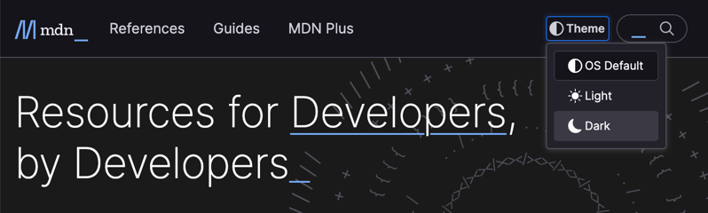
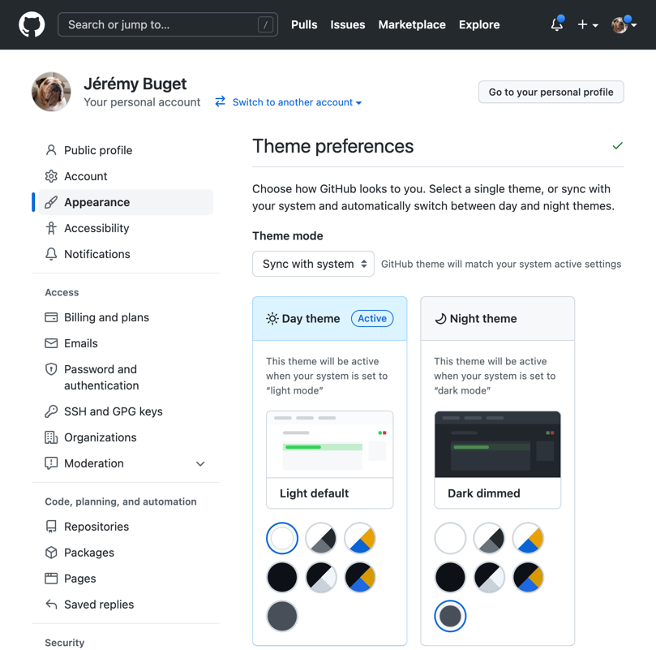
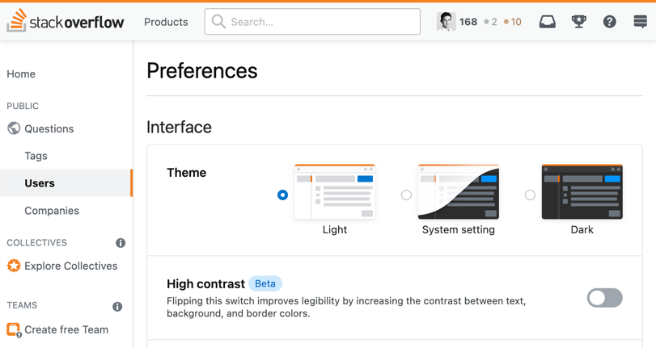
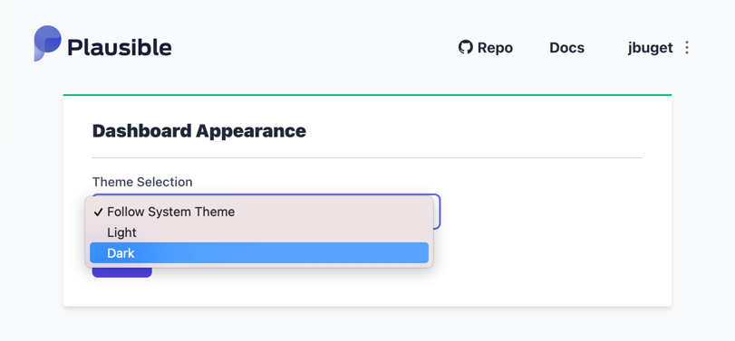

## TL;DR

Intégrer un button de choix du thème graphique, c'est bien ; proposer un menu de sélection du thème permettant de synchroniser à tout moment avec le thème système, c'est mieux !

J'aime beaucoup la façon dont le site [MDN Web Docs](https://developer.mozilla.org) de Mozilla a pensé et implémenté la fonctionnalité de sélection du thème graphique. Tant et si bien que j'ai décidé de le reproduire au sein de mon site.

Le [code final](#code-final) est disponible en fin d'article.


## Introduction

Cet article s'inscrit dans la suite de mon précédent billet ["Supporter le "mode sombre" dans un site Hugo"](/posts/ajouter-un-dark-theme-dans-un-site-hugo/).

Peu après l'avoir publié, je suis tombé sur des ressources en ligne et j'ai eu des retours de personnes soulevant des limites / défauts métier, au mécanisme que j'avais mis en place.

Proposer un thème light et un thème dark, à la convenance de l'utilisateur, est devenu une fonctionnalité basique.
De plus en plus, les sites offrent une troisième option à leurs visiteurs consistant à synchroniser le thème automatiquement avec le thème système.

J'ai bien pris en compte cette fonctionnalité dans mon article.
Cependant, d'un point de vue ergonomie, la solution retenue - un bouton switch, avec un comportement par défaut s'il n'a "jamais" été cliqué - présente plusieurs défauts :
- elle est irréversible
- sauf à aller vider manuellement le Local Storage (bon courage sous iPhone ou Android)
- sans que l'utilisateur en ait conscience ou ne puisse faire quelque chose
{.cons}

Par ailleurs, en termes d'accessibilité, là aussi j'ai fait des efforts et la solution proposée est satisfaisante, mais il y des soucis au niveau du rendu graphique en cas de focus (absence de bordure) et l'utilisation des aria-* n'étaient pas dingue.
{.cons}

Bref, c'était très loin d'être optimal et j'ai décidé de revoir ma copie.

### Exemples

Dans les retours importants qui m'ont été faits (merci à tous pour les feedbacks 🙏), j'ai notamment eu celui de [Vincent](https://vincenthardouin.dev/) (a.k.a. "La Relève") qui m'a pointé l'exemple de Mozilla et son site [MDN Web Docs](https://developer.mozilla.org/).

Au moment où j'écris ces lignes, le menu de sélection du thème de mon site est "très fortement inspiré" du leur.

> (*) en vrai, j'ai quasi tout pompé, jusqu'à la structure HTML et la gestion de l'accessibilité 😬

**MDN Web Docs :**



Ci-dessous, je vous partage des captures de plusieurs autres sites qui proposent eux-aussi une gestion moderne de choix du thème de couleurs.

**GitHub :**



**StackOverflow :**



Même un projet de plus petite envergure comme [Plausible](https://plausible.io) propose un menu de sélection du thème proposant le choix système plutôt qu'un simple bouton toggle.     

**Plausible :**



## Conception

En termes d'attentes, l'objectif est d'avoir exactement le même comportement que le site de Mozilla :

### Visuel

- un élément interactif pour ouvrir le menu des thèmes
  - en l'occurrence, un simple bouton
  - situé dans la barre d'en-tête du site sur toutes les pages, en lieu et place du bouton à bascule initial
- une signalétique / des éléments pour visualiser en un coup le thème actuel
  - une icône dans la barre d'en-tête correspondant au thème sélectionné, associé au bouton déroulant
  - un style particulier pour l'option de thème actuel, dans le menu déroulant
- un menu déroulant avec les 3 options possibles :
  - "os-default", pour synchroniser le thème du site avec les préférences utilisateurs
  - "light", pour forcer le mode clair
  - "dark", pour forcer le mode sombre
  - une icône spécifique pour chaque option (reprise dans l'icône de la barre d'en-tête du site, cf. ci-dessus)

### Comportements

- quand on clique sur le "bouton de sélection du thème", alors 
  - le menu déroulant (menu popup) apparaît,
  - présentant les 3 options de thème
  - avec une visualisation particulière pour le thème actuel
- quand on sélectionne une option :
  - dans tous les cas le menu se ferme et l'icône dans la barre d'en-tête est mise à jour, par rapport au thème sélectionné
  - si le thème sélectionné est celui actuel, rien d'autre ne se passe
  - sinon, l'icône du menu principal change et lorsque l'on ouvre à nouveau le menu déroulant, l'item sélectionné est bien celui précédemment sélectionné
- lorsque le menu déroulant est ouvert, il est possible de le fermer sans effet :
  - en cliquant en dehors du menu
  - en appuyant sur la touche d'échappement

### Autres
- par défaut, le thème sélectionné est celui des préférences système
- lorsque l'utilisateur revient sur le site, ses préférences de navigation sont restaurées / chargées
- le menu doit être accessible :
  - il doit être possible de naviguer, ouvrir et fermer le menu au clavier
  - les outils de lecture d'écran doivent fonctionner correctement
  - le menu doit satisfaire aux exigences de [WAVE](https://wave.webaim.org/) + [LightHouse](https://web.dev/accessibility-scoring/)
- ce type de composant ne doit pas dégrader les performances du site

## Réalisation

### Général

Je prends le parti d'avoir une solution la plus générique et agnostique possible.
Intention ou idée : pouvoir simplement _componentiser_ (dans un [Web Component](https://developer.mozilla.org/fr/docs/Web/Web_Components)) le résultat final.

Ainsi, tous les event listeners / handlers seront déclarés directement dans un fichier JS dédié : `theme-switcher-menu.js` (dans le répertoire des _assets_).

### Proposer un menu déroulant (plutôt qu'un bouton à bascule)

De base, au chargement de la page, le menu déroulant est déclaré dans le HTML/DOM, mais caché (via la classe `.hidden`).

Celui-ci est matérialisé sous la forme d'une liste non ordonnée (élément `<ul>`) avec des boutons.

> 🤔 J'ai repris la structure proposée par Mozilla. J'avoue que je m'attendais plutôt à un élément `<select>`.

L'ouverture du menu passe par un élément de type `<button>`.
On précise l'attribut `type="button"` pour éviter l'envoi éventuel de formulaire et s'épargner une instruction `event.preventDefault()` dans le code.

On branche un écouteur sur l'évènement `click` du bouton.
- si le menu - `<ul.theme-switcher-menu__list>` - est caché (possède la classe `.hidden`), alors on l'affiche (on supprime la classe)
- sinon, on le ferme (ajout de la classe sur l'élément `<ul>`)

```javascript
const themeSwitcherMenuToggle = document.querySelector('.theme-switcher-menu__toggle');
const themeSwitcherMenuList = document.querySelector('.theme-switcher-menu__list');

themeSwitcherMenuToggle.addEventListener('click', () => {
  if (themeSwitcherMenuList.classList.contains('hidden')) {
    themeSwitcherMenuList.classList.remove('hidden');
  } else {
    themeSwitcherMenuList.classList.add('hidden');
  }
});
```

> ℹ️ L'implémentation est un peu différente ici de ce que fait Mozilla, qui utilise React et donc passe par les mécaniques liées au [Shadow DOM](https://fr.reactjs.org/docs/faq-internals.html).

### Tenir compte du thème sélectionné

À la différence du bouton à bascule simple, détecter l'option choisie par l'utilisateur nécessite de passer par un moyen quelconque.
J'ai opté pour un attribut de donnée `data-theme-option` dont la valeur dépende de l'option.

À l'initialisation de la page / exécution du script, l'idée consiste à associer un event handler pour chaque évènement `click` des 3 boutons-options possible.

```javascript
const themeSwitchMenuButtons = document.querySelectorAll('.theme-switcher-menu__button');

themeSwitchMenuButtons.forEach((element) => {
  element.addEventListener('click', () => {
    themeSwitcherMenuList.classList.add('hidden');

    if (element.getAttribute('data-theme-option') !== getCurrentMode()) {
      const targetMode = element.getAttribute('data-theme-option');
      if (targetMode === 'os-default') {
        localStorage.removeItem('theme');
        initTheme();
      } else {
        localStorage.setItem('theme', targetMode);
        setTheme(targetMode);
        setToggleIcon(targetMode);
        setActiveOption(targetMode);
      }
    }
  });
});
```

> ℹ️ Je ne rentre pas ici dans le détail de la gestion des préférences système utilisateur via la Media Query `window.matchMedia("(prefers-color-scheme: dark)")` ou de la persistance du choix cross-visites via le _Local Storage_. Tout est dans l'article précédent.

### Tenir compte de la navigation au clavier

L'élément qui affiche / cache le menu déroulant, ainsi que les 3 options du menu sont tous des boutons.
De fait, en tant que boutons <button> ils sont tous nativement détectables et navigables au clavier (touche "Tabulation") **à condition d'être visibles**.
{.pros}

Je n'ai donc rien eu à faire explicitement pour cette partie-là.

### Tenir compte du "click" (souris)

Rapidement, je suis parvenu à faire fonctionner le menu.
J'ai repris le code de [l'article précédent](/posts/ajouter-un-dark-theme-dans-un-site-hugo/), sans avoir trop à le modifier.

J'ai dû ajouter du code dans le cas où le menu est ouvert et qu'on souhaite le fermer de façon pratique, ou sans avoir envie de modifier ou re-choisir une option de thème.

J'ai posé un event listener sur l'évènement [`click`](https://developer.mozilla.org/en-US/docs/Web/API/Element/click_event), associé au document DOM.
Pour détecter si le clic se trouve dans la zone du menu déroulant, je cherche l'élément (via  la méthode `Element#closest()`) correspondant à la classe du menu déroulant `.theme-switcher-menu`.
Si je ne le trouve pas, c'est que le clic a eu lieu en dehors du menu.
Je peux donc forcer la fermeture.

> 💡 Je me permets de poser une condition sur l'ouverture ou non du menu et économiser un traitement potentiellement inutile. 

⚠️ **Remarque :** dans la mesure où l'évènement est posé au niveau du `document`, si d'aventure un autre composant attache un second event listener sur `click` au document, dans un autre fichier, il peut y avoir éventuellement des interférences, dans le cas où le menu serait déroulé.
{.cons}

### Tenir compte de la "touche d'échappement" (clavier) 

Alors que je pensais en avoir fini, j'ai repassé mes critères d'acceptation en revue.
Je me suis alors aperçu que la gestion au clavier ne tenait pas compte de la touche d'échappement.
Quand on tape sur la touche `Esc`, le menu doit être fermé, en toute circonstance.

Même technique que pour la gestion du "_click outside_" : j'ai posé un event listener au niveau du `document` sur l'évènement [`keyup`](https://developer.mozilla.org/en-US/docs/Web/API/Document/keyup_event).

> 💡 J'ai pris l'habitude de privilégier l'évènement `keyup` plutôt que `keydown` ou `keypress` dans ce type de situation, car j'ai besoin d'effectuer un traitement qu'une seule fois (cf. "[keydown vs keypress vs keyup](https://thisthat.dev/keydown-vs-keypress-vs-keyup/)").

```javascript
document.addEventListener('keyup', (event) => {
  if (event.defaultPrevented) {
    return;
  }
  if (event.key === 'Escape') {
    if (!themeSwitcherMenuList.classList.contains('hidden')) {
      themeSwitcherMenuList.classList.add('hidden');
    }
  }
  event.preventDefault();
}, true);

```

### Code final

````html
<!-- themes/bloodywood/layouts/partials/theme-switcher-menu.html -->

<div id="theme-switcher-menu" class="theme-switcher-menu">
  <button class="theme-switcher-menu__toggle" aria-controls="themes-menu" aria-haspopup="menu" type="button" aria-expanded="false">
    <span class="theme-switcher-menu__option"><i id="theme-switcher-menu__icon" class="fa-solid fa-circle-half-stroke"></i>Theme</span>
  </button>
  <ul class="theme-switcher-menu__list hidden" aria-labelledby="theme-switcher-menu">
    <li class="theme-switcher-menu__item" role="none" >
      <button class="theme-switcher-menu__button" type="button" data-theme-option="os-default">
        <span class="theme-switcher-menu__option"><i class="fa-solid fa-circle-half-stroke"></i>OS Default</span>
      </button>
    </li>
    <li class="theme-switcher-menu__item" role="none" >
      <button class="theme-switcher-menu__button active" type="button" data-theme-option="light">
        <span class="theme-switcher-menu__option"><i class="fa-solid fa-sun"></i>Light</span>
      </button>
    </li>
    <li class="theme-switcher-menu__item" role="none" >
      <button class="theme-switcher-menu__button" type="button" data-theme-option="dark">
        <span class="theme-switcher-menu__option"><i class="fa-solid fa-moon"></i>Dark</span>
      </button>
    </li>
  </ul>
</div>
````

```javascript
/* themes/bloodywood/assets/js/theme-switcher-menu.js */

const darkModeMediaQuery = window.matchMedia("(prefers-color-scheme: dark)");
const themeSwitcherMenuToggle = document.querySelector('.theme-switcher-menu__toggle');
const themeSwitcherMenuList = document.querySelector('.theme-switcher-menu__list');
const themeSwitchMenuButtons = document.querySelectorAll('.theme-switcher-menu__button');
const themeMenuToggleIcon = document.getElementById('theme-switcher-menu__icon');

function getCurrentMode() {
  if (!localStorage.getItem('theme')) {
    return 'os-default';
  }
  return localStorage.getItem('theme');
}

function setToggleIcon(mode) {
  let className;
  if (mode === 'os-default') {
    className = 'fa-solid fa-circle-half-stroke'
  } else {
    if (mode === 'light') {
      className = 'fa-solid fa-sun'
    } else {
      className = 'fa-solid fa-moon'
    }
  }
  themeMenuToggleIcon.className = className;
}

function setTheme(mode) {
  let theme;
  if (mode === 'os-default') {
    theme = darkModeMediaQuery.matches ? 'dark' : 'light';
  } else {
    theme = mode;
  }
  document.documentElement.setAttribute('data-theme', theme);
}

function setActiveOption(mode) {
  themeSwitchMenuButtons.forEach((event) => {
    if (event.getAttribute('data-theme-option') === mode) {
      event.classList.add('active');
    } else {
      event.classList.remove('active');
    }
  });
}

export function initTheme() {
  let mode = localStorage.getItem('theme') || 'os-default';
  setTheme(mode);
  setToggleIcon(mode);
  setActiveOption(mode);
}

darkModeMediaQuery.addEventListener('change', () => {
  if (!localStorage.getItem('theme')) {
    setTheme('os-default');
  }
});

themeSwitcherMenuToggle.addEventListener('click', () => {
  if (themeSwitcherMenuList.classList.contains('hidden')) {
    themeSwitcherMenuList.classList.remove('hidden');
  } else {
    themeSwitcherMenuList.classList.add('hidden');
  }
});

themeSwitchMenuButtons.forEach((element) => {
  element.addEventListener('click', () => {
    themeSwitcherMenuList.classList.add('hidden');

    if (element.getAttribute('data-theme-option') !== getCurrentMode()) {
      const targetMode = element.getAttribute('data-theme-option');
      if (targetMode === 'os-default') {
        localStorage.removeItem('theme');
        initTheme();
      } else {
        localStorage.setItem('theme', targetMode);
        setTheme(targetMode);
        setToggleIcon(targetMode);
        setActiveOption(targetMode);
      }
    }
  });
});

document.addEventListener('click', (event) => {
  /* If menu is displayed… */
  if (!themeSwitcherMenuList.classList.contains('hidden')) {
    const clickedElement = event.target;
    /* … and we click outside the menu component… */
    if (clickedElement.closest('.theme-switcher-menu') === null) {
      /* … then we close it */
      themeSwitcherMenuList.classList.add('hidden');
    }
  }
});

document.addEventListener('keyup', (event) => {
  if (event.defaultPrevented) {
    return;
  }
  if (event.key === 'Escape') {
    if (!themeSwitcherMenuList.classList.contains('hidden')) {
      themeSwitcherMenuList.classList.add('hidden');
    }
  }
  event.preventDefault();
}, true);

initTheme();
```

````scss
/* themes/bloodywood/assets/css/theme-switcher-menu.scss */

@import "colors";

html[data-theme='light'] {
	--tsm-list-background: #f9f9fb;
	--tsm-list-border: #cfcfd8;
	--tsm-button-hover: #e0e0e6;
	--tsm-button-active-background: white;
	--tsm-button-active-border: #cfcfd8;
}

html[data-theme='dark'] {
	--tsm-list-background: #{$dark2};
	--tsm-list-border: #{$dark3};
	--tsm-button-hover: #{$dark4};
	--tsm-button-active-background: #{$dark1};
	--tsm-button-active-border: #{$dark3};
}

.theme-switcher-menu {
	position: relative;

	.hidden {
		display: none;
	}

	i {
		margin-right: 5px;
	}

	&__list {
		position: absolute;
		display: flex;
		flex-direction: column;
		margin: 0;
		background-color: var(--tsm-list-background);
		padding: 0.5rem;
		border: 1px solid var(--tsm-list-border);
		border-radius: 5px;
		box-shadow: 0 1px 6px #2b2a331a;
	}

	&__item {
		display: block;
		margin: 0;
		padding: 0;
	}

	&__toggle {
		padding: 0.5rem 1rem;
		text-align: start;
		border: none;
		cursor: pointer;
		border-radius: 5px;
		background-color: transparent;
	}

	&__button {
		padding: 0.5rem 1rem;
		width: 10rem;
		text-align: start;
		border: none;
		cursor: pointer;
		border-radius: 5px;
		background-color: transparent;

		&:focus,
		&:hover {
			background-color: var(--tsm-button-hover);
		}

		&.active {
			background-color: var(--tsm-button-active-background);
			border: 1px solid var(--tsm-button-active-border);
		}
	}

	&__menu {

	}

	&__option {
		color: var(--text-color);
		font-family: Nunito, Arial, sans-serif;
		font-size: 1rem;
	}
}
````

## Conclusion

Je suis très satisfait de ce nouveau résultat, beaucoup plus ergonomique, et même carrément plus stylé.

Cela étant dit ou fait, il reste encore pas mal de choses pour gérer complètement le mode sombre : 
- faire en sorte que la mise en forme des paragraphes de code s'adapte (pas simple)
- faire en sorte de proposer un menu intégré plutôt que déroulant pour les terminaux mobiles
- **packager le tout pour en faire un vrai Web Component**
