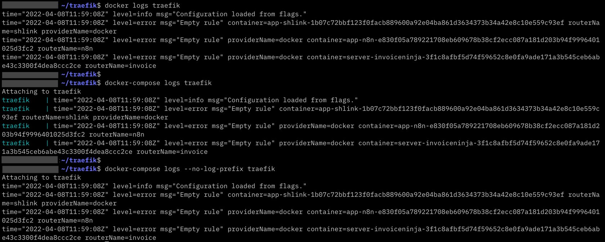
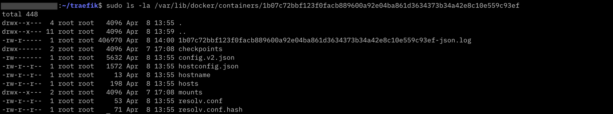
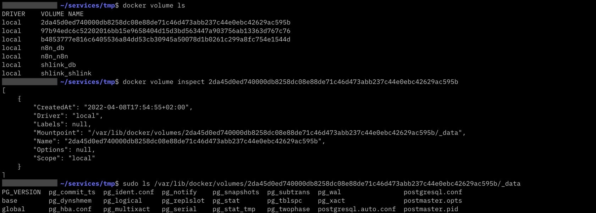

## TL;DR

Travailler avec Docker et Docker Compose n'est pas toujours une sinécure.
Avec le temps, j'ai pu me développer une petite boîte à outil et connaissances.
Celle-ci m'est bien pratique au quotidien pour gérer mes conteneurs, explorer les logs, gérer l'espace disque, etc.

## Table des matières

- [Arrêter / redémarrer Docker](#arrêter--redémarrer-docker)
- [Affichage des conteneurs Docker](#affichage-des-conteneurs-docker)
- [Gestion des logs](#gestion-des-logs)
  - [Afficher les logs de conteneurs](#afficher-les-logs-de-conteneurs)
  - [Logging drivers et rotation de logs](#logging-drivers-et-rotation-de-logs)
  - [Modifier le _logging driver_ par défaut](#modifier-le-_logging-driver_-par-défaut)
- [Libérer de l'espace disque](#libérer-de-lespace-disque)
- [Se connecter à un conteneur](#se-connecter-à-un-conteneur)
  - [Ouvrir un terminal bash au sein d'un conteneur](#ouvrir-un-terminal-bash-au-sein-dun-conteneur)
  - [Explorer une base PostgreSQL](#explorer-une-base-postgresql)
  - [Explorer une base MariaDB](#explorer-une-base-mariadb)
- [Mettre à jour un service](#mettre-à-jour-un-service)
- [Explorer les volumes](#explorer-les-volumes)
- [Connaître l'état du système lié à Docker](#conna%c3%aetre-l%c3%a9tat-du-syst%c3%a8me-li%c3%a9-%c3%a0-docker)
  - [Connaître l'espace-disque consommé par les objets Docker](#conna%c3%aetre-lespace-disque-consomm%c3%a9-par-les-objets-docker)

## Arrêter / redémarrer Docker

Parce que ça risque de nous être utile, un jour ou l'autre (et notamment, si vous appliquer l'un des tips ci-dessous) :

```shell
# As "root"
$ sudo systemctl stop docker    # arrêter
$ sudo systemctl start docker   # démarrer
$ sudo systemctl restart docker # redémarrer
```

## Affichage des conteneurs Docker

Voir tous les conteneurs déclarés, pas seulement ceux qui tournent :

```shell
$ docker ps -a 
```

Je ne sais pas vous, mais dans mon cas, à chaque fois que je fais un `docker ps`, les informations s'affichent sur plusieurs lignes et rende la lecture très compliquée. 
Il existe une option simple pour formatter l'affichage de `docker ps` :

```shell
$ docker ps --format 'table {{ .ID }}\t{{ .Names }}\t{{.Image}}\t{{ .Status }}\t{{ .Size }}'
```

Le langage de formattage utilisé est celui de templating de Go, ex : `{{ .MyVariable }}`.

> Rappel : pour beaucoup, [Docker est écrit en Go](https://thenewstack.io/go-programming-language-helps-docker-container-ecosystem/) 🎉

Les différentes [variables](https://docs.docker.com/engine/reference/commandline/ps/#formatting) possibles sont décrites dans la documentation.

Par exemple, le mot-clé `table`, utilisé ci-dessus, permet d'ajout un en-tête de colonnes et faire en sorte que chaque champ soit aligné (comme un tableau, quoi).

Cette astuce fonctionne aussi avec les images, les réseaux, les volumes, etc. : 

```shell
$ docker [image|network|volume|...] ls --format [...]`.
```

Il est possible de faire de ce format celui par défaut via le fichier de configuration utilsiateur `~/.docker/config.json`

```json
{
  "psFormat": "table {{ .ID }}\\t{{ .Names }}\\t{{.Image}}\\t{{ .Status }}\\t{{ .Size }}"
}
```
Pas besoin de redémarrer ou recharger quoi que ce soit pour que la configuration soit prise en compte. 

Ça fonctionne aussi avec les images (propriété `"imagesFormat"`) et [les autres objets Docker](https://docs.docker.com/engine/reference/commandline/cli/#customize-the-default-output-format-for-commands).

Les [mos-clé possibles](https://docs.docker.com/config/formatting/) sont : `join`, `table`, `json`, `lower`, `split`, `title`, `upper`, `println`.

## Gestion des logs

### Afficher les logs de conteneurs

Pour afficher les logs en temps réel pour une stack Docker Compose :

```shell
$ docker-compose logs -f  
```

Pour n'afficher que les logs d'un service en particulier :

```shell
$ docker-compose logs -f [service_name]  
```

À noter que l'affichage des logs via Docker Compose (`docker-compose logs`) est par défaut légèrement différent de celui proposé par Docker (`docker logs`).
L'option `--no-log-prefix` de Docker Compose CLI permet d'avoir le même rendu.
NDLA : je suis d'accord que cette astuce n'est pas très utile _a priori_.



### Logging drivers et rotation de logs

Un des problèmes récurrents avec les machines faisant tourne du Docker, c'est la consommation d'espace mémoire lié aux logs.
Docker utilise un mécanisme de [_logging drivers_](https://docs.docker.com/config/containers/logging/configure/) configurable pour gérer les logs.

Docker propose [une douzaine de drivers différents](https://docs.docker.com/config/containers/logging/configure/#supported-logging-drivers) : `local`, `syslog`, `journald`, `splunk`, etc.
Le driver par défaut de Docker est [`json-file`](https://docs.docker.com/config/containers/logging/json-file/), qui écrit les logs dans des fichiers JSON.

Sur une machine Linux, les logs sont stockés dans le répertoire : `/var/lib/docker/containers/<container_id>/<container_id>-json.log`



> ⚠️ Si, comme moi, vous privilégiez de passer par un compte utilisateur normal (i.e. non _root_), vous devez utiliser la commande `sudo` pour lister le répertoires "/var/lib/docker/*".

Pour en revenir à notre problématique de consommation inopinée de ressources, il existe plusieurs solutions :
- a) configurer le driver `json-file`
- b) utiliser un autre driver (ex : `local`)
- c) utiliser un outil externe (ex : image Docker [docker-logrotate](https://github.com/linkyard/docker-logrotate))

Chacune de ses solutions est valable au niveau d'un conteneur spécifique ou généralisable par défaut à tous les conteneurs qui seront créés (à partir du moment où la config devient active).

Pour configurer le driver au niveau d'un conteneur il est possible de passer les arguments en ligne de commande : 

```shell
$ docker run --rm --log-driver local --log-opt max-size=10m --log-opt max-file=3 hello-world
```

Ou avec Docker Compose :

```yaml
version: "3"

services:
  hello_world:
    image: 'hello-world'
    logging:
      driver: "local"
      options:
        max-size: 10m
        max-file: "3"
```

#### a) Configurer le driver `json-file`

[Le driver `json-file`](https://docs.docker.com/config/containers/logging/json-file/) est celui par défaut pour tous les conteneurs.

Initialement, il ne s'occupe pas de compresser les logs ou surveiller l'espace utilisé, ni ne gère de rotation des logs automatique.

Il est néanmoins possible de le configurer en ce sens.

Par exemple avec Docker Compose : 

```yaml
version: "3"

services:
  hello_world:
    image: 'hello-world'
    logging:
      driver: "json-file"
      options:
        max-size: 10m
        max-file: "3"
        compress: true
```

#### b) Utiliser un autre driver

Parmi les drivers proposés par Docker, [le driver `local`](https://docs.docker.com/config/containers/logging/local/) est prévu pour optimiser les performances et l'espace disque.

Par défaut, il conserve jusqu'à 100Mo de logs, compressées pour réduire la taille sur disque et permet jusqu'à 5 fichiers de logs, avec rotation automatique.

Par exemple avec Docker Compose :

```yaml
version: "3"

services:
  hello_world:
    image: 'hello-world'
    logging:
      driver: "local"
      options:
        max-size: 10m
        max-file: "3"
```

#### c) Utiliser un outil externe

Une troisième solution consiste à gérer la rotation des logs avec un outil tierce, elle-même exécutable via Docker : [docker-logrotate](https://github.com/linkyard/docker-logrotate).

Je n'ai personnellement pas testée cette solution, dont on m'a parlé.
Mais il me paraissait honnête et intéressante de l'évoquer ici.

Personnellement, je préfère avoir à installer le moins de choses possible sur une machine (sauf si j'ai au préalable tout automatisé, via Ansible & cie.).
Ainsi **mon option favorite reste la seconde, avec le logging driver `local`**.

### Modifier le _logging driver_ par défaut

Il est possible de faire en sorte que chaque nouveau conteneur utilise un driver ou une configuration spécifique.
Pour ce faire, il faut surcharger le paramétrage par défaut du _démon 😈 Docker 🐳_.

Concrètement, cela revient à créer (ou modifier si vous l'avez déjà créé) le fichier `/etc/docker/daemon.json`.
Pour cela, vous devez réaliser l'action en tant que super user via `sudo`.

```javascript
// /etc/docker/daemon.json
{
  "log-driver": "local",
  "log-opts": {
    "max-size": "100m",
    "max-file": "3"
  }
}
```

Pour que la configuration soit effective, vous devez relancer le démon Docker, comme vu en tout début : 

```shell
# As "root"
$ sudo systemctl restart docker
```

> ⚠️ Seuls les conteneurs instanciés après la prise en compte de la configuration utiliseront le nouveau driver.
> Vous devez re-générer les anciens conteneurs pour que la config soit prise en compte. 

## Libérer de l'espace disque

À un moment donné, il est possible que Docker consomme tout votre espace disque.
Cela peut survenir suite à un débordement de logs (cf ci-dessus), un surplus d'images obsolètes, des ressources temporaires devenues obsolètes lors de la compilation d'images ou des objets (ex : volumes) orphelins.
La liste est très loin d'être exhaustive.
Bref, tôt ou tard vous serez amenés à faire du nettoyage.

```shell
$ docker system prune -a -f --volumes
```

> 🚨 **Attention ! L'option `--volumes` supprime de façon définitive les données contenues dans le volume.** Assurez-vous de ne vraiment plus en avoir l'usage.

À noter que la sous-commande `prune` est disponible pour la majorité des commandes relatives à des objets Docker : containers, images, volumes, networks, etc.

De façon générale, quand je supprime une stack Compose, je veille à supprimer les objets orphelins (en cas de renommage de conteneur) et les volumes : 

```shell
$ docker-compose down --remove-orphans --volumes
```

## Se connecter à un conteneur

### Ouvrir un terminal bash au sein d'un conteneur

Souvent, il m'arrive de devoir me connecter à un conteneur pour le débugger ou simplement comprendre ce qu'il s'y passe.

```shell
$ docker-compose exec [service] /bin/bash # ou "bash" ou "/bin/sh" pour certaines images qui n'ont pas bash
```

> ⚠️ Attention ! Lorsque vous effectuez des modifications dans un conteneur, sauf si celles-ci ont lieu sur un fichier ou dossier montés sur un volume, vos modifications seront perdues lors d'une réinstanciation du conteneur.

### Explorer une base PostgreSQL

Un autre cas très fréquent est l'exploration d'une base de données.

Soit la stack Compose suivante : 

```yaml
# docker-compose.yml

version: '3'

services:
  postgres:
    image: postgres
    environment:
      POSTGRES_PASSWORD: postgres
      POSTGRES_USER: postgres
      POSTGRES_DB: postgres
```

On exécute la stack :

```shell
$ docker-compose up -d
```

L'image `postgres` contient un client `psql` (et l'utilitaire bash).
C'est lui qui nous intéresse.
Pour cela on peut utiliser la commande `docker-compose run postgres psql` ou se connecter au conteneur : 

```text
$ docker-compose exec postgres bash
> psql -U postgres
# \c postgres
# SELECT * FROM information_schema.tables;
```

Le moyen le plus simple reste encore de faire : 

```shell
# docker-compose exec <service> psql -U <user> -W <db>
$ docker-compose exec postgres psql -U postgres -W postgres
```
Il vous sera alors demandé le mot de passe de l'utilisateur.

### Explorer une base MariaDB

Soit la stack Compose suivante :

```yaml
# docker-compose.yml

version: '3'

services:
  mariadb:
    image: mariadb
    environment:
      MARIADB_ROOT_PASSWORD: mariadb
      MARIADB_DATABASE: mariadb
      MARIADB_USER: mariadb
```

```shell
$ docker-compose up -d
```

On peut désormais accéder au conteneur : 

```shell
$ docker-compose exec mariadb bash
> mariadb -p
# use mariadb
# show tables;
```

## Mettre à jour un service

> 💡 Il est vivement recommandé de fixer la version de chaque service utilisé en production, pour s'épargner des problèmes de montée de version non-voulue / incontrôlée ou nécessitant une intervention dédiée ! 

1/ Éditer le fichier `docker-compose.yml` pour spécifier la nouvelle version, ex : `shlinkio/shlink:3.5.2`.

2/ Récupérer la nouvelle image :

```shell
$ docker-compose pull
```

3/ Redémarrer la stack :

```shell
$ docker-compose up -d --remove-orphans
```

L'option `--remove-orphans` permet de s'assurer de supprimer l'ancienne vrsion de l'image, qui devient de fait obsolète.

4/ (optionnel) Dans le cas d'une application (⚠️ surtout pas d'une base de données), il peut arriver de devoir supprimer le volume.
J'ai eu le cas récemment avec Shlink.
C'est possible en faisant : 

```shell
# docker volume rm <volume>
$ docker volume rm shlink_shlink
```

## Explorer les volumes

Une autre façon de voir les fichiers générés et de se rendre compte du comportement d'une application est d'accéder et d'explorer le volume attaché à son conteneur.

Basiquement, pour lister les volumes :

```shell
$ docker volume ls
```

Pour savoir où sont stockés les fichiers au sein d'un volume d'un conteneur : 

```shell
$ docker volume inspect [container_id]
```



> ⚠️ Vous devez avoir les droits "root" pour pouvoir naviguer dans le répertoire du volume en question.

## Connaître l'état du système lié à Docker

Docker propose une commande (ainsi que des sous-commandes) bien pratique(s) pour connaître / comprendre l'état du système ralatif au programme : `docker system [df|events|info|prune]`.

> 💡 La commande `docker info` est en fait un alias de la commande `docker system info`.

### Connaître l'espace-disque consommé par les objets Docker

La technique la plus Unix pour connaître l'espace-disque requis par Docker est la suivante : 

```shell
$ sudo du -h --max-depth=0 /var/lib/docker/volumes && \
    sudo du -h --max-depth=0 /var/lib/docker/image && \
    sudo du -h --max-depth=0 /var/lib/docker/
```

L'inconvénient (en plus d'être moche et longue à taper) c'est qu'elle oblige à s'identifier en tant que `sudo`.

Il existe une façon plus simple et pratique permettant d'obtenir le même résultat (en mieux !) : la sous-commande `docker system df`. 

```shell
$ docker system df
```

```text
TYPE            TOTAL     ACTIVE    SIZE      RECLAIMABLE
Images          33        27        10.22GB   1.924GB (18%)
Containers      32        21        78.02MB   19.09MB (24%)
Local Volumes   31        19        2.321GB   518.6MB (22%)
Build Cache     0         0         0B        0B
```

