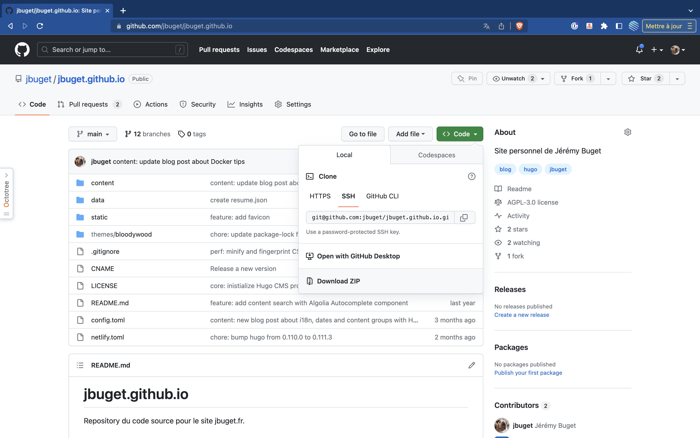
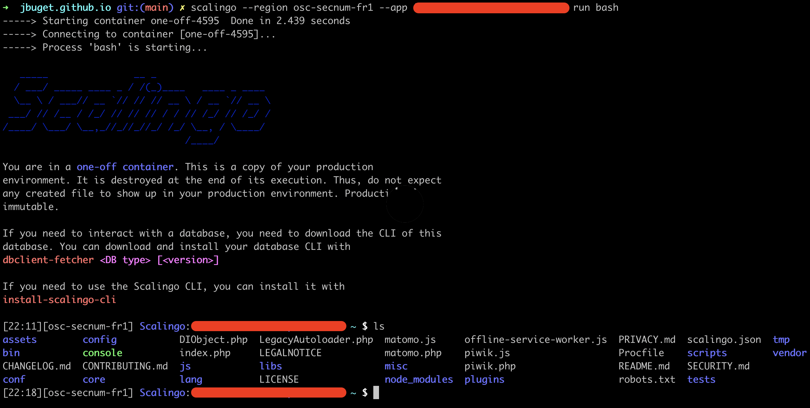
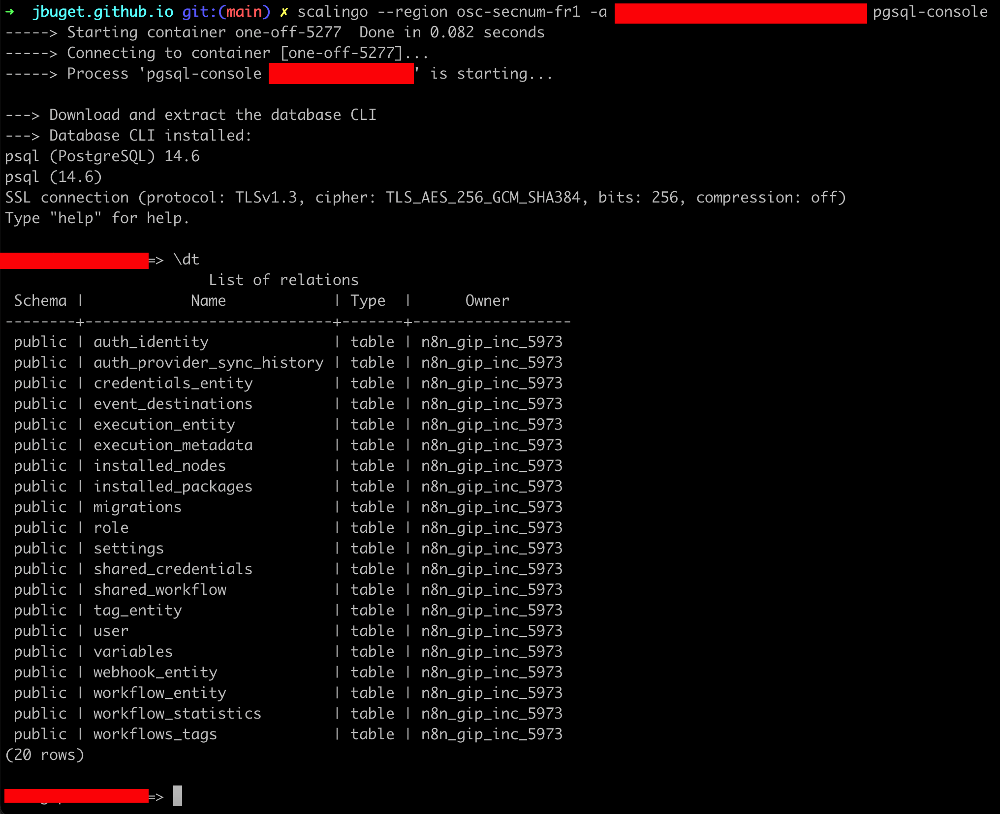
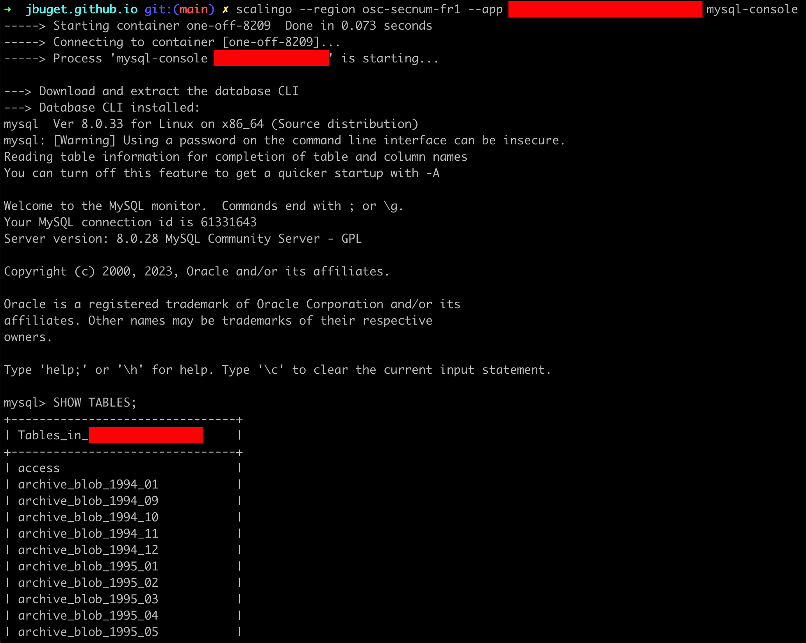
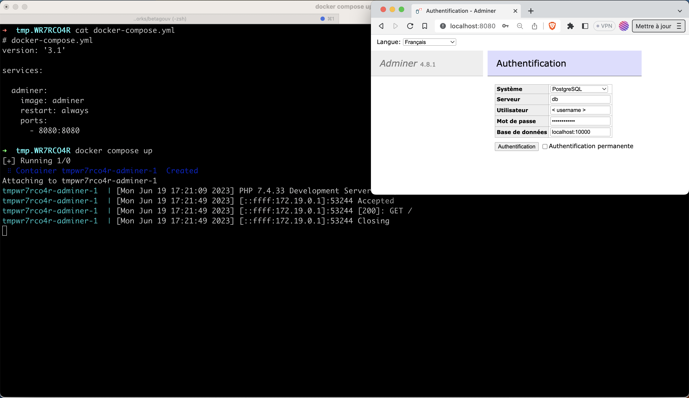
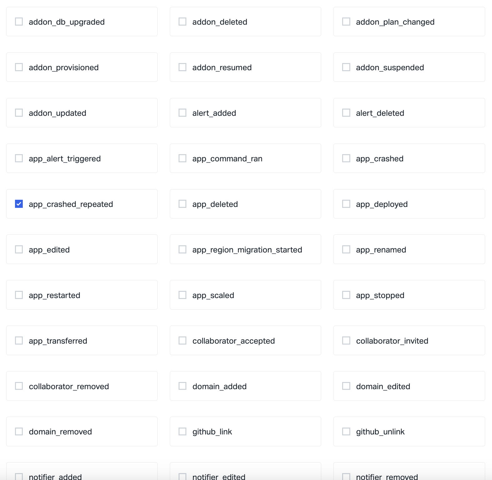
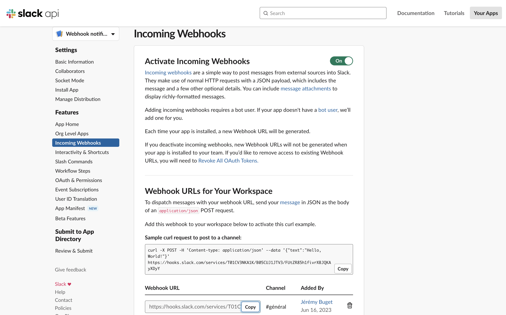
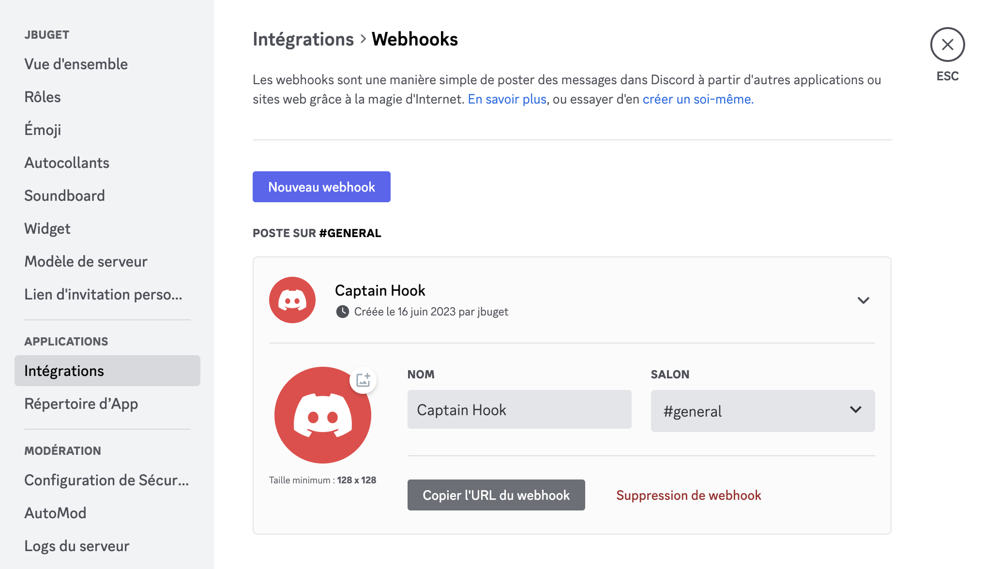
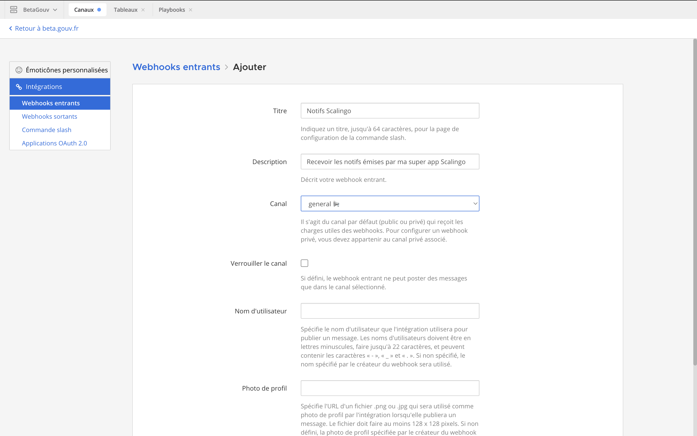

## TL;DR

- Runtime :
  - [Ajouter des variables d'environnement depuis un fichier `.env`](#ajouter-des-variables-denvironnement-depuis-un-fichier-env)
  - [Déployer une application via une archive de code au format tar.gz](#déployer-une-application-via-une-archive-de-code-au-format-targz)
  - [Optimiser ses ressources via `Paastis`](#optimiser-ses-ressources-grâce-à-paastis)
  - [Ouvrir une session Bash sur un one-off container](#ouvrir-une-session-bash-sur-un-one-off-container)
- Databases :
  - [Se connecter à une base de données via un conteneur one-off](#se-connecter-à-une-base-de-données-via-un-conteneur-one-off)
  - [Accéder à une base de données via un tunnel SSH](#accéder-à-une-base-de-données-via-un-tunnel-ssh)
  - [Accéder à une base de données via Adminer](#accéder-à-une-base-de-données-via-adminer)
    - [Adminer pour les apps en zone non-SecNumCloud](#adminer-pour-des-apps-en-zone-non-secnumcloud)
    - [Adminer pour les apps en zone SecNumCloud](#adminer-pour-les-apps-en-zone-secnumcloud)
- Misc :
  - [Localiser ses identifiants de connexion sur son poste](#localiser-ses-identifiants-de-connexion-sur-son-poste)
  - [Générer un `bearer token` d'API](#générer-un-bearer-token-dapi)
  - [Brancher les notifs Scalingo sur Slack, Discord ou Mattermost](#brancher-les-notifs-scalingo-sur-slack-discord-ou-mattermost)

## Introduction

[Scalingo](https://scalingo.com/) est un service d'hébergement de sites et applications Web de type Plateform-as-a-Service (PaaS).

Voilà maintenant plusieurs années que j'utilise ce service pour tout type de besoin : des applications temporaires, des applications de recette jetables (a.k.a. *review apps*), des side-projects, des POC, des MVP, des petits services d'état, des systèmes entiers (plusieurs centaines de milliers d'utilisateurs par jour), etc.

Avec le temps, la plateforme s'est considérablement développée, ainsi que mes connaissances ou outils l'exploitant.

Dans cet article - que je ferai évolue avec le temps, un peu comme mes articles sur [Docker](/posts/trucs-et-astuces-a-propos-de-docker-et-docker-compose/) ou [Traefik](/posts/techniques-et-outil-pour-deboguer-une-config-traefik/) - je documente et partage les trucs qui me sont le plus utiles au quotidien ou lors de moments compliqués.


## Runtime
### Ajouter des variables d'environnement depuis un fichier `.env`

**TL;DR**

```shell
$ scalingo --app my-app env-set --file .env
```

**Explications**

Le client en ligne de commande (CLI) de Scalingo permet de gérer (consulter, ajouter, modifier, supprimer) simplement les variables d'environnement (a.k.a. "varenv") d'une application, grâce aux commandes : `scalingo env|env-set|env-unset`.

Lorsqu'on crée une nouvelle application dans Scalingo, au moment du premier déploiement dans un environnement (dev, staging, prod), il peut être fastidieux de reporter une à une les varenv, quand bien même celles-ci sont déjà répertoriées dans un fichier `.env`.

Un autre cas d'usage similaire est lorsque l'on souhaite automatiser ou prendre la main sur la génération / administration de *review apps* (ou *preview deployments* chez d'autres hébergeur, comme Vercel).

Scalingo CLI propose l'option `--file` de la commande `scalingo env-set` qui permet de spécifier le chemin vers un fichier :

```shell
$ scalingo --app my-app env-set --file .env
```

Par défaut, la commande `scalingo env-set` permet de passer et définir d'un seul coup plusieurs variables d'environnement. Ce comportement est préservé avec l'emploi de l'option `--file`. Le cas échéant, les valeurs de variables spécifiées dans la ligne de commande prévalent sur celles déclarées dans le fichier `.env`.

```shell
$ scalingo --app my-app env-set --file .env VAR2=VAL2
```

### Déployer une application via une archive de code au format tar.gz

**TL;DR**

```shell
$ scalingo --app my-app deploy https://github.com/my-orga/my-app/archive/refs/heads/main.tar.gz
```

**Explications**

La façon la plus évidente, simple, basique, rapide, pratique et par défaut de déployer du code sur une infrastructure de type PaaS – ici Scalingo – est d'[associer directement le dépôt (ainsi que la ou les branches) GitHub ou GitLab à l'application](https://doc.scalingo.com/platform/deployment/deploy-with-github). Ainsi, lorsque l'on pousse un changement, la plateforme le détecte et met à jour l'application automatiquement. 

C'est exactement le confort et la productivité recherchés en phase de *build* ou pour des petites applications #DeveloperExperience.

Mes années de pratiques DevOps m'incitent toutefois à ne jamais mélanger l'environnement de production des autres environnements (développement, review apps, integration, qualification, staging, recette, etc.). Une escalade de droits malheureuse ou un leak de ssecrets de production via des environnements de dev mal isolés est si vite arrivé #vécu 😱.

Pour pallier à ce genre de risque, une pratique que j'ai adoptée, notamment avec Scalingo, est de créer 2 comptes (build/dev et run/prod) bien distincts, et qui ne partagent aucune application, ni aucun secret en commun. Aussi, je m'interdis d'associer la moindre application détenue par le compte de production à un quelconque repository de code tierce (GitHub, GitLab, autre).

Pour pousser en production une version - puisqu'à un moment, il faut bien envoyer du code à Scalingo ! - je passe par la fonctionnalité de [déploiement depuis une archive](https://doc.scalingo.com/platform/deployment/deploy-from-archive).

> 💡 Protip : GitHub permet, pour tout objet (commit, branche, ou tag), de [générer et télécharger à la volée et via une URL une archive au format `tar.gz`](https://docs.github.com/fr/rest/repos/contents?apiVersion=2022-11-28#download-a-repository-archive-tar) du code concerné. Pour ce faire, il suffit de récupérer l'URL de l'archive `zip` associé à l'objet et de modifier l'extension.



Par exemple, pour récupérer une archive au format `tar.gz` de la branche principale de ce blog, il suffit d'accéder à l'URL : https://github.com/jbuget/jbuget.github.io/archive/refs/heads/main.tar.gz.

En ligne de commande, ça donne : 

```shell
$ curl -O -L https://github.com/jbuget/jbuget.github.io/archive/refs/heads/main.tar.gz
```

Ainsi, pour déployer n'importe quel code sur une application Scalingo, il suffit d'utiliser la commande `scalingo deploy <tar_gz_archive_url>` : 

```shell
$ scalingo --app my-app deploy https://github.com/my-orga/my-app/archive/refs/heads/main.tar.gz
```

Si vous avez les droits sur l'application et que l'URL est correcte, alors, ça devrait déclencher un déploiement 🚀.

### Optimiser ses ressources via `Paastis`

**TL;DR**

```shell
$ PROVIDER_NAME=scalingo PROVIDER_HEROKU_API_TOKEN=tk-us-xxx npx paastis
```

**Explications**
[`Paastis`](https://github.com/paastis/paastis) est un programme de type proxy HTTP qui permet d'optimiser la consommation de ses ressources PaaS, grâce à un mécanisme d'auto-scale / scale-to-zero qui allume et éteint les applications en fonction de leur usage. Paastis est compatible avec plusieurs fournisseurs ou technologies de type PaaS : Scalingo, Clever Cloud, Heroku ou Kubernetes.

Paastis est spécialement adapté pour les équipes très consommatrices de review apps, notamment celles qui ont activé le déploiement automatique de review apps à chaque *fork* ou pull ou merge request. Paastis permet alors de diminuer sa consommation de ressources (et donc la facture 💰) de 85-95%.

Paastis est aussi adapté pour les applications en evnironnement de recette, staging, qualification, intégration, preprod, etc.

Enfin, Paastis peut être utile pour les personnes ou organisation au début d'un projet et qui veulent limiter leur coût, en exploitant le fait que, dans les premiers temps, celui-ci n'a pas besoin de tourner tout le temps (ex : business attendu entre 6h et 22h).

### Ouvrir une session Bash sur un one-off container

**TL;DR**

```shell
$ scalingo --app my-app run bash
```

**Explications**

Chaque conteneur ou instance d'une application infogérée par Scalingo tourne indépendamment des autres. Ainsi, des fichiers (cache ou config) générés sur le système de fichier au cours la vie d'une application, ne sont pas accessibles entre conteneurs.

> ⚠️ D'où l'importance capitale, quand la phase de compilation des sources intègre la génération de fichiers asssets optimisés de s'assurer que le build soit parfaitement déterministe (basé sur le code) plutôt qu'aléatoire (basé sur le temps, ou autres critères de randomisation).

Parfois, il est cependant utile, pour déboguer ou comprendre le comportemen de son application une foisdéployée, d'accéder à un simulacre d'environnement de l'app en fonctionnement. Par exemple, récemment, j'ai voulu voir ce que donnait le fichier `config.ini.php` généré par [une instance Matomo hébergée chez Scalingo](https://github.com/gip-inclusion/matomo-scalingo-deploy).

Pour ce type de besoin, Scalingo propose une fonctionnalité appelée `one-off container`. Un "conteneur one-off", est une copie de l'environnement de production, pratique pour exécuter une tâche, comme par exemple, lancer une session Bash dans un environnement donné.

```shell
$ scalingo --app my-app run bash
```

> ⚠️ Lorsqu'on instancie un conteneur one-off, il est important de penser à reproduire les éventuelles étapes post-déploiement. Ex : après le lancement du conteneur one-off Matomo via `scalingo run bash`, il convient de faire : `bin/generate-config-ini.sh` pour reproduire un état se rapprochant de la production, tel que le ferait le script `scripts/start-matomo.sh`, lui-même invoqué dans le fichier `Procfile` pour la déclaration du processus `web`.



## Bases de données

### Se connecter à une base de données via un conteneur one-off

**TL;DR**

```shell
# PostgreSQL
$ scalingo --app my-app pgsql-console

# MySQL
$ scalingo --app my-app mysql-console

# MongoDB
scalingo --app my-app mongo-console

# Redis
scalingo --app my-app redis-console

# InfluxDB
scalingo --app my-app influxdb-console
```

**Explications**

Il est très facile d'[accéder à une base de données](https://doc.scalingo.com/platform/databases/access) associée à une application dans Scalingo.

Exemple d'accès à une base de données PostgreSQL :



Exemple d'accès à une base de données MySQL :




### Accéder à une base de données via un tunnel SSH

**TL;DR**

```shell
$ scalingo --app my-app db-tunnel DATABASE_URL

# Informations de connexion :
#  "host": "127.0.0.1",
#  "user": "< username >",
#  "port": 10000,
#  "ssl": true,
#  "database": "< database >",
#  "password": "< password >"
```

**Explications**

Passer par un conteneur one-off, c'est une chose, mais parfois :
- on a besoin de brancher son application localement sur une base de données - non exposée sur Internet (ex : staging) - sur Scalingo
- on souhaite utiliser des outils localement sur son poste (ex : adminer local, DBNavigator, etc.)

Pour ce faire, il faut ouvrir un tunnel SSH. C'est très simple avec Scalingo CLI.

> ⚠️ Il faut au préalable [disposer d'une clé SSH valide](https://doc.scalingo.com/platform/databases/access#encrypted-tunnel) associée à son compte Scalingo.

**1.** Générer une clé SSH pour Scalingo :

```shell
$ ssh-keygen -t ed25519 -C "my.email@example.com"

# spécifier l'emplacement de la clé, ex : $HOME/.ssh/id_ed25519.pub
```

**2.** Référencer la clé au sein de son SSH agent (si ce n'est pas le cas) :

```shell
$ ssh-add $HOME/.ssh/id_ed25519.pub
```

**3.** Importer la clé sur son compte Scalingo :

```shell
$ scalingo keys-add "Laptop SSH key" $HOME/.ssh/id_ed25519.pub
```

**4.** Afficher les informations de connexion à la base de données :

```shell
$ scalingo --app my-app env | grep DATABASE_URL
```

**5.** Ouvrir le tunnel SSH :

```shell
$ scalingo --app my-app db-tunnel DATABASE_URL

# Pour une base de données PostgreSQL, la base de données est accessible à l'adresse 127.0.0.1 sur le port 10000
```

**6.** Se connecter au client :

Exemple pour [l'extension PostgreSQL de VSCode](https://marketplace.visualstudio.com/items?itemName=ckolkman.vscode-postgres) : 

```json
{
  "label": "Scalingo tunneled DB",
  "host": "127.0.0.1",
  "user": "< username >",
  "port": 10000,
  "ssl": true,
  "database": "< database >",
  "password": "< password >"
}
```


### Accéder à une base de données via Adminer

**TL;DR**

**Explications**

Adminer est une application web qui permet, à l'instar de PHPMyAdmin ou PGAdmin, de se connecter, consulter, éditer et gérer à une base de données, via une interface en ligne bien pratique au quotidien. Fait notable : il s'agit d'un produit [open source](https://www.adminer.org/), donc que l'on peut déployer, héberger et administrer soi-même.

> 🛵 Autant que possible, je privilégie et préconise la ligne de commande via des clients tels que `psql` ou `mysql`, mais tout le monde n'est pas dev, et j'avoue que des fois, j'ai la flemme de me souvenir comment on fait VS. taper une URL 😄

Scalingo met à disposition une instance d'Adminer, permettant de se connecter directement à une base SQL liée à une application sur la zone – et EXCLUSIVEMENT - `osc-fr1`.

Pour des raisons de sécurité et de conformité réglementraire, ils ont désactivés l'instance Adminer permettant d'exploiter des bases de données en zone SecNumCloud.

#### Adminer pour des apps en zone non-SecNumCloud

Il suffit de se rendre sur l'instance Adminer mise à disposition par Scalingo, et de saisir les informations de connexions de la base de données à accéder (en précisant bien le type de données).

Pour rappel, les informations de connexion peuvent être consulter dans les variables d'environnement de l'application ou en ligne de commande : 

```shell
$ scalingo --app my-app env | grep DATABASE_URL
```

#### Adminer pour les apps en zone SecNumCloud

L'histoire est un peu plus compliquée.

Je vois 2 moyens : 
1. déployer sa propre instance Adminer sur son propre compte Scalingo
2. lancer une instance Adminer en local (par exemple, grâce à Docker), ouvrir un tunnel SSH (cf. ci-dessus) et se brancher à la base via Adminer

> ⚠️ Pour les mêmes raisons de sécurité, je déconseille vivement la première solution, que je cite, par souci d'être un minimum complet.

```yaml
# docker-compose.yml
version: '3.1'

services:

  adminer:
    image: adminer
    restart: always
    ports:
      - 8080:8080
```

```shell
$ docker compose up -d
```

Attendre un peu que le conteneur soit bien initié et lancer puis accéder à http://localhost:8080.

Il ne reste plus qu'à saisir les informations de connexion, cf. ci-dessus.



> 💡 Pour tester l'image Docker, je me suis placé dans un dossier temporaire généré grâce à la commande :
> ```shell
> $ cd `mktemp -d`
> ```

## Misc

### Localiser ses identifiants de connexion sur son poste

**TL;DR**

```shell
# Vérifier avec quel compte on est connecté
$ scalingo whoami #ou scalingo self

# Lister les fichiers de config Scalingo liés à son compte sur son poste
$ ls ~/.config/scalingo

# Consulter ses informations de connexion
$ cat ~/.config/scalingo/auth | jq
```

**Explications**

*A priori*, on n'a pas besoin de connaître ni de se servir de cette astuce… sauf dans certains cas (cf. plus loin). Mais encore une fois, il me paraît intéressant de noter et partager tous ces petits bouts de connaissances, accumulés au fils des ans.

Avant toute chose, pour les personnes disposant de plusieurs comptes chez Scalingo (compte au boulot, compte perso, compte pour un side projet, etc.) il est facile de savoir avec quel compte on est connecté grâce à la commande `scalingo whoami`.

```shell
$ scalingo whoami
-----> You are logged in as john-doe (john.doe@example.com)
```

Scalingo CLI respecte un standard qui veut que les utilitaires Unix nécessitant connexion ou configuration stockent leurs informations dans un répertoire `.config`, à la racine du compte utilisateur de l'OS.

Ainsi, une fois que l'on est connecté - via la commande `scalingo login` - des fichiers sont générés dans le répertoire `~/.config/scalingo`.

On y trouve notamment un fichier `auth` qui contient les identifiants de connexion & session. Le fichier est au format JSON et peut être facilement manipulé grâce à notre fidèle ami `jq`.

```json
# cat ~/.config/scalingo/auth | jq

{
  "auth_data_version": "2.1",
  "last_update": "2023-05-xxTxx:xx:xx.588889+01:00",
  "auth_config_data": {
    "auth.scalingo.com": {
      "tokens": {
        "token": "tk-us-xxx-yyy-zzz"
      },
      "user": {
        "id": "us-ee80bf6d-xxx-yyy-zzz",
        "username": "< username >",
        "fullname": "Jérémy Buget",
        "email": "< email@example.com >",
        "flags": {
          "": true,
          "osc-secnum-fr1": true
        }
      }
    }
  }
}
```


### Générer un `bearer token` d'API

**TL;DR**

```shell
BEARER_TOKEN=$(curl -su ":$(< ~/.config/scalingo/auth jq -r '.auth_config_data["auth.scalingo.com"].tokens.token')" -X POST https://auth.scalingo.com/v1/tokens/exchange|jq -r .token);
```

**Explications**

Scalingo fait un gros boulot au niveau de sa CLI et la plupart des interactions possibles sur le site sont disponibles via la ligne de commande. Cependant, il existe certains cas d'usage très particuliers qui nécessitent de procéder autrement et d'utiliser directement l'API de Scalingo ou exécuter des requêtes HTTP un peu obscures.

Par exemple, lorsque l'on met en place un template de review apps pour un projet en contenant un petit paquet, on se retrouve rapidement à devoir inviter chacun des membres sur chacune des applications. Pour peu que votre application soit composée d'une instance front et une autre back, ça peut rapidement monter à une douzaine ou plus d'invitations à envoyer "à chaque personne", qui elle-même devra toutes les accepter une par une.

Un moyen pratique que nous avons trouvé - enfin, surtout [Jonathan Perret](https://twitter.com/jonathanperret) - est de faire un script Bash qui lance une boucle `for` avec autant de requêtes `POST` que nécessaire. Au préalable de ces appels HTTP, il est nécessaire de génrer un jeton d'appel sécurisé, a.k.a. `bearer token`.

Pour ce faire, c'est très simple : 
1. on récupère le token de session contenu dans le fichier `auth` (cf. ci-dessus)
2. on réalise un appel auprès de l'API Scalingo pour générer un bearer token
3. on peut ensuite appeler l'API selon notre usage

Pour générer un bearer token, la commande est la suivante : 

```shell
BEARER_TOKEN=$(curl -su ":$(< ~/.config/scalingo/auth jq -r '.auth_config_data["auth.scalingo.com"].tokens.token')" -X POST https://auth.scalingo.com/v1/tokens/exchange|jq -r .token);
```

### Brancher les notifs Scalingo sur Slack, Discord ou Mattermost

**Explications**

Scalingo permet de [recevoir des notifications](https://doc.scalingo.com/platform/app/notification) à propos d'un large panel d'évènements en rapport avec le déploiement ou l'exécution d'une application. La liste est vraiment conséquente et couvre un large spectre de situations susceptibles d'être monitorées *sur étagère*.



En revanche et une fois n'est pas coutume, la documentation officielle n'est ni généreuse, ni explicite, ni complète sur la façon de brancher les alertes à diverses messageries ou systèmes tiers.

Par le passé, j'ai été amené à brancher les alertes Scalingo sur Slack (pour [Pix](https://pix.fr)), Discord ([Immersion Facilité](https://immersion-facile.beta.gouv.fr/)) ou Mattermost ([Carnet de bord](https://carnetdebord.inclusion.beta.gouv.fr)).

Ça se passe en 2 étapes : 
1. Déclarer un webhook dans la messagerie pour obtenir une URL de webhook entrant
2. Renseigner cette URL dans un nouveau notifieur associé à l'app Scalingo

#### Etape 1 : déclarer une nouvelle intégration de type webhook pour obtenir une URL

**Slack**

C'est d'un compliqué… [La doc officielle est ici](https://api.slack.com/messaging/webhooks).

**1.** La première chose à faire est de déclarer une nouvelle application Slack au sein de l'espace de travail.

**2.** Ensuite, il faut activer les webhooks.

**3.** Puis il faut définir un nouveau webhook…



**4.** Pour enfin obtenir le graal : l'URL de webhook entrante 🙌

```txt
https://hooks.slack.com/services/MUvnc8Gg92c/hv8XZSCLPnP/bWT3jCadBdFEcvLsU9AnCZpn
```

**Discord**

Prérequis : disposer des droits d'administration de l'espace Discord.

Dans les paramètres du serveur Discord, dans la section "Applications > Intégrations", ajouter un nouveau webhook. Il faut spécifier le nom, le salon et une icône (optionnel).



On obtient une URL de webhook, ex :

```txt
https://discord.com/api/webhooks/99648495882345332489/3r6JYvepMUUu2ijW_6GWML37af3oXg4H9kQsgxQv23EpVxP_Cbeisq9JLZwVYhDK
```

**Mattermost**

Comme pour Discord, il faut accéder à l'interface de gestion des intégrations et déclarer un nouveau webhook (nom + chaîne) pour obtenir une URL.

> Le lien pour gérer les intégrations Mattermost n'est pas simple à trouver. Il se trouve dans le menu du serveur, tout en haut à gauche de l'interface.



Exemple d'URL :

```txt
https://mattermost.example.com/hooks/7QeQ8PSb4Q4SyvigWMZuYfXys7
```

#### Étape 2 : déclarer un notifieur associé à l'app Scalingo

Dans les paramètres de l'application Scalingo, dans la section "Notifiers", ajouter un nouveau notifieur de type Slack.

Il n'y a plus qu'à saisir l'URL obtenue précédemment et se laisser guider par l'interface.


