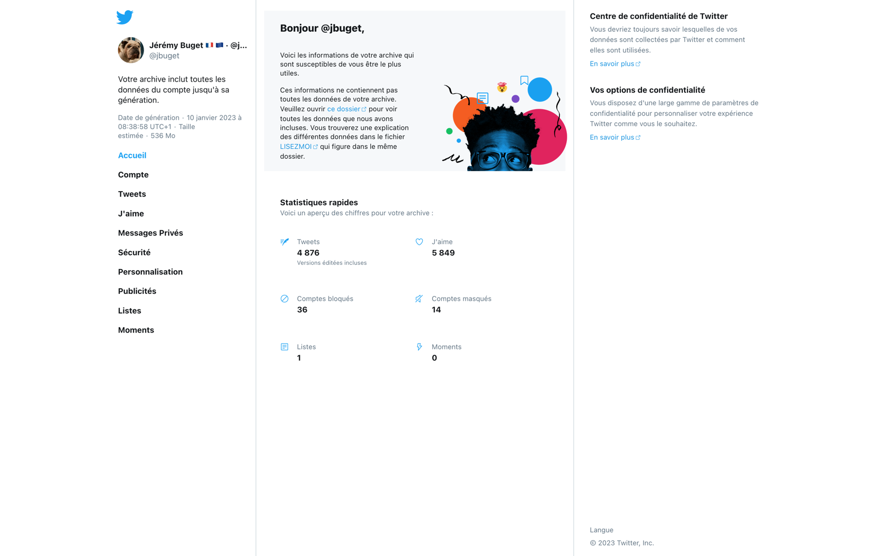
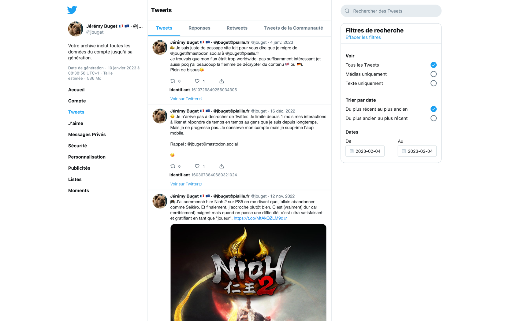
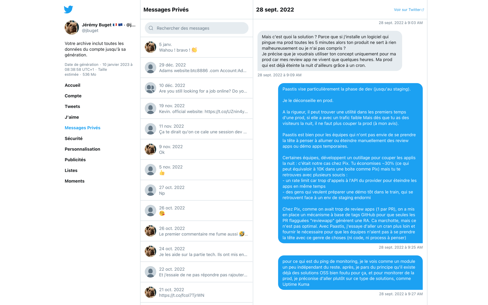

## TL;DR

Il est possible de récupérer l'ensemble de ses données Twitter via la fonctionnalité Twitter Archive. On obtient une archive compressée de fichiers HTML et JS (principalement) avec la quasi-totalité du contenu que l'on a produit (sauf la date d'ajout des abonnés 😢).
On peut ensuite exploiter ces données dans une instance ELK (modulo quelques manipulations et formatage de données bien sentis).
Je n'ai pas trouvé de cas d'usage véritablement pertinent, mais le défi et certains résultats obtenus sont amusants.
Le plus utile finalement est que ça fait une bonne introduction à Elasticsearch et Kibana. 

## Table des matières

- [Twitter migration](#twitter-migration)
- [Conclusion](#conclusion)

## 1. Récupérer une archive de ses données Twitter 

Octobre 2022 : Elon Musk rachète Twitter. Depuis, il se passe rarement une semaine sans que le premier fasse ou dise une connerie à propos et sur le second. 

**Conséquence n°1 :** il y a eu plusieurs vagues de départ vers une éventuelle alternative, le plus souvent Mastodon (mais d'autres pistes existent comme Hive, Tumblr, Clubhouse ou même LinkedIn).

> J'en profite pour annoncer qu'après avoir créché plusieurs mois sur l'instance mastodon.social, j'ai finalement établi mes nouveaux quartiers plutôt définitif du côté de @jbuget@piaille.fr.    

**Conséquence n°2 :** c'est le moment ou jamais pour s'intéresser à ses données personnelles sur Twitter et au contenu qu'on a produit ou consommé tout ce temps. Pour cela, Twitter propose [depuis décembre 2012](https://blog.twitter.com/en_us/a/2012/your-twitter-archive) un service gratuit permettant à tout utilisateur de récupérer la quasi-totalité des informations relatives de son compte Twitter.

La crainte de bon nombre d'internautes – que je partage(ais) – est de voir le service dysfonctionner / ne plus être maintenue, être volontairement dégradé ou tout simplement disparaître du jour au lendemain, sans préavis.

À l'heure où je publie ces lignes, il n'existe encore aucune garantie quant à la pérennité du service. À titre personnel, j'ai pu effectuer la procédure et j'ai désormais l'assurance de ne pas voir plus de 10 ans d'activité plus ou moins intense (cf. fin de l'article) m'être soustraite ou restreinte sur un coup de tête d'une quelconque autorité (modulo ma capacité à sauvegarder correctement mes données). Si vous disposez aussi d'un compte qui compte pour vous sur l'oiseau bleu, je ne peux que vous recommander chaudement de faire pareil, le plus vite possible.

La procédure pour [récupérer une archive de ses données personnelles](https://help.twitter.com/fr/managing-your-account/how-to-download-your-twitter-archive) est relativement simple. Elle fonctionne aussi bien depuis l'interface Web, que l'application native (iPhone ou Android). Il suffit de se rendre dans les "paramètres et confidentialités" de son "compte" et cliquer sur le lien "Téléchargez une archive de vos données".
{.pros}


Il vous est alors demandé de saisir votre mot de passe ainsi qu'un code pour l'authentification multi-facteurs (si vous l'avez activée). 
Votre demande est ensuite prise en compte par Twitter qui annonce un délai d'une journée avant de vous mettre à disposition votre archive fraîchement compactée.


> Dans mon cas, près de 12 ans d'activité, environ 5000 tweets et messages directs (4876 précisément), et plusieurs centaines de Mo de media en tout genre (images, gifs, audio, vidéos), il m'a effectivement fallu patienter une journée entière. 

Dès que votre archive est prête, vous êtes averti(e) par email ainsi que sur votre _timeline_.


Depuis l'email de notification ou depuis les paramètres de votre compte Twitter, vous pouvez désormais récupérer votre archive : dans mon cas, un fichier ZIP – `twitter-2023-01-10-08dfb...18375.zip` – de 546 Mo compressé pour 604.5 Mo décompressé.

> À noter : 
> - vous avez une semaine pour récupérer votre archive, après quoi elle n'est plus accessible
> - vous ne pouvez effectuer qu'une demande d'archive tous les 30 jours (très mal indiqué dans [la documentation à ce sujet](https://help.twitter.com/fr/managing-your-account/accessing-your-twitter-data))

Nous pouvons désormais passer aux choses sérieuses… 😋

## 2. Explorer le contenu d'une archive Twitter

Avant de plonger dans le contenu d'une archive Twitter, il me paraît utile et intéressant de se pencher sur [la documentation associée](https://help.twitter.com/fr/managing-your-account/accessing-your-twitter-data) qui, comme le reste, est bien faite, claire, complète et même plutôt transparente.
Je plaisante !
On n'a pas que ça à faire.
GO le code ! 🚀

### Contenu, fichiers et arborescence

Je pourrais utiliser l'explorateur de fichier de ma machine. Ce serait simple, rapide et efficace. Mais je suis d'humeur joueuse et un peu _geek_ sur les bords. Je décide de passer par la ligne de commande. 
Je découvre que le shell de mon Macbook ne propose pas la commande `tree`.
Bon, bah… GO l'installer avec Homebrew !

```shell
$ brew install tree
```

Après 5 mn à mettre à jour Homebrew et toutes mes dépendances et/ou programmes, me voilà prêt à faire un listing complet du contenu de mon archive Twitter, depuis mon terminal (trop la classe ! 😎).

```shell
$ tree --filelimit 90
```

> L'option `--filelimit` permet de n'explorer et dévoiler le contenu que des répertoires disposant de moins de `90` fichiers (hors répertoire racine).
> Je recommande aussi les options `-h` pour le côté "human readable" et `-C` pour la coloration syntaxique.

On obtient le listing ci-dessous (un tout petit peu modifié pour une meilleure lecture) : 

```shell
.
├── Your archive.html
├── assets
│   ├── fonts
│   │   ├── edge-icons-Regular.0e351.eot
│   │   ├── edge-icons-Regular.86a61.ttf
│   │   └── edge-icons-Regular.d0526.woff
│   ├── images
│   │   ├── defaultAvatar.svg
│   │   ├── favicon.ico
│   │   ├── groupAvatar.svg
│   │   ├── home-image.png
│   │   ├── spinner-rosetta-blue-14x14@2x.28c43.gif
│   │   ├── spinner-rosetta-blue-26x26@2x.51320.gif
│   │   ├── spinner-rosetta-blue-32x32@2x.652ac.gif
│   │   └── twemoji
│   │       └── v
│   │           └── latest
│   │               ├── 72x72  [3077 entries exceeds filelimit, not opening dir]
│   │               └── svg  [3077 entries exceeds filelimit, not opening dir]
│   └── js
│       ├── i18n.e27e67d39fcc91627cab.js
│       ├── main.0506aebee0a5b8f83a32.js
│       ├── modules.9072ed6e90fe38c485fe.js
│       ├── ondemand.App.ab1ee9b858dd3ab2e479.js
│       ├── ondemand.i18n.ar-js.ab2b9a62ec03147b025d.js
│       ├── ondemand.i18n.bn-js.252227ce669e6b08c576.js
│       ├── ... 
│       ├── ondemand.i18n.uk-js.b6eb73a117b5682329ad.js
│       ├── ondemand.i18n.vi-js.a4a476612c8f8311dab4.js
│       ├── ondemand.i18n.zh-Hant-js.fcd551759f2167b784c1.js
│       ├── ondemand.i18n.zh-js.fb73b6c67dcefc331d31.js
│       └── runtime.9662ea169e7e46b859ee.js
└── data
    ├── README.txt
    ├── account-creation-ip.js
    ├── account-label.js
    ├── account-suspension.js
    ├── account-timezone.js
    ├── account.js
    ├── ad-engagements.js
    ├── ad-free-article-visits.js
    ├── ad-impressions.js
    ├── ad-mobile-conversions-attributed.js
    ├── ad-mobile-conversions-unattributed.js
    ├── ad-online-conversions-attributed.js
    ├── ad-online-conversions-unattributed.js
    ├── ageinfo.js
    ├── app.js
    ├── block.js
    ├── branch-links.js
    ├── catalog-item.js
    ├── commerce-catalog.js
    ├── community-note-rating.js
    ├── community-note-tombstone.js
    ├── community-note.js
    ├── community-tweet.js
    ├── community_tweet_media
    ├── connected-application.js
    ├── contact.js
    ├── deleted-tweet-headers.js
    ├── deleted-tweets.js
    ├── deleted_tweets_media
    ├── device-token.js
    ├── direct-message-group-headers.js
    ├── direct-message-headers.js
    ├── direct-message-mute.js
    ├── direct-messages-group.js
    ├── direct-messages.js
    ├── direct_messages_group_media
    │   ├── 1363815325414920196-GBU9tBMV.jpg
    │   └── 1480902689278025736--wPZ7zALKpDoghOErAqsqO31ma4Mcc46NrIWX0enYN_IrqAVi_.mp4
    ├── direct_messages_media
    │   ├── 1110811775631589380-4SG_UxSo.jpg
    │   ├── 1126392494944657412-xzKOcxRr.jpg
    │   ├── ...
    │   ├── 1566354135041073156-0187wL5X.jpg
    │   ├── 1582768667158265862-MHuOgAzH.jpg
    │   └── 1584497370003394565-sBK4rUkt.png
    ├── email-address-change.js
    ├── ip-audit.js
    ├── like.js
    ├── lists-created.js
    ├── lists-member.js
    ├── lists-subscribed.js
    ├── manifest.js
    ├── moment.js
    ├── moments_media
    ├── moments_tweets_media
    ├── mute.js
    ├── ni-devices.js
    ├── periscope-account-information.js
    ├── periscope-ban-information.js
    ├── periscope-broadcast-metadata.js
    ├── periscope-comments-made-by-user.js
    ├── periscope-expired-broadcasts.js
    ├── periscope-followers.js
    ├── periscope-profile-description.js
    ├── personalization.js
    ├── phone-number.js
    ├── product-drop.js
    ├── product-set.js
    ├── professional-data.js
    ├── profile.js
    ├── profile_media
    │   ├── 113034197-1592737283.jpg
    │   └── 113034197-4i8VnyEI.jpg
    ├── protected-history.js
    ├── reply-prompt.js
    ├── saved-search.js
    ├── screen-name-change.js
    ├── shop-module.js
    ├── shopify-account.js
    ├── smartblock.js
    ├── spaces-metadata.js
    ├── sso.js
    ├── tweet-headers.js
    ├── tweetdeck.js
    ├── tweets.js
    ├── tweets_media  [513 entries exceeds filelimit, not opening dir]
    ├── twitter-article-metadata.js
    ├── twitter-article.js
    ├── twitter-circle-member.js
    ├── twitter-circle-tweet.js
    ├── twitter-circle.js
    ├── twitter-shop.js
    ├── twitter_article_media
    ├── twitter_circle_tweet_media
    ├── user-link-clicks.js
    └── verified.js

21 directories, 161 files
```

### Site statique

Mon regard se porte instinctivement sur la présence d'un fichier `Your archive.html`.

Twitter propose carrément un site web statique complet, navigable, recherchable, qui peut être hébergé quasiment tel quel ! 







Plusieurs petites choses que je note :
- pour les messages privés (MP), le nom de l'interlocuteur n'est pas affiché en clair (cf. capture ci-dessus)
- l'onglet "Sécurité" permet de connaître les comptes bloqués et masqués ; plus exactement, ils contiennent des liens vers le site de Twitter pour les gérer
- il y a un champ de recherche sur quasiment toutes les pages du site, mais elle semble plus ou moins bien fonctionner ; disons que l'essentiel est assuré

### Bonus : Twemoji

En parcourant les _assets_, je découvre la biliothèque d'emojis "Twemoji".

Les sources, assets et intégration sont disponibles dans l'archive. Mais le plus simple consiste à se rendre sur [le site officiel](https://twemoji.twitter.com/). 

Twemoji est un projet [open source](https://github.com/twitter/twemoji) sous licence `MIT License` exploitable pour un usage commercial ou non. 


### Données utilisateur

Le site statique et les ressources Web, c'est bien, mais l'essentiel est ailleurs : les données utilisateur.

Là aussi, Twitter fait bien les choses. 
Je retrouve bien toutes les informations et contenus que j'ai publiés sur la plateforme depuis le tout début.
J'ai l'impression que Twitter fournit même quelques données inférées, même si j'imagine qu'ils se gardent bien de fournir l'exhaustivité des données qu'ils déduisent de mon profil et de mes comportements au fil des ans.

La plupart des type de données (ex : tweets, DMs, likes, moments, listes, etc.) se décompose en 3 fichiers ou parties : 
- headers
- content


## 

## Conclusion
