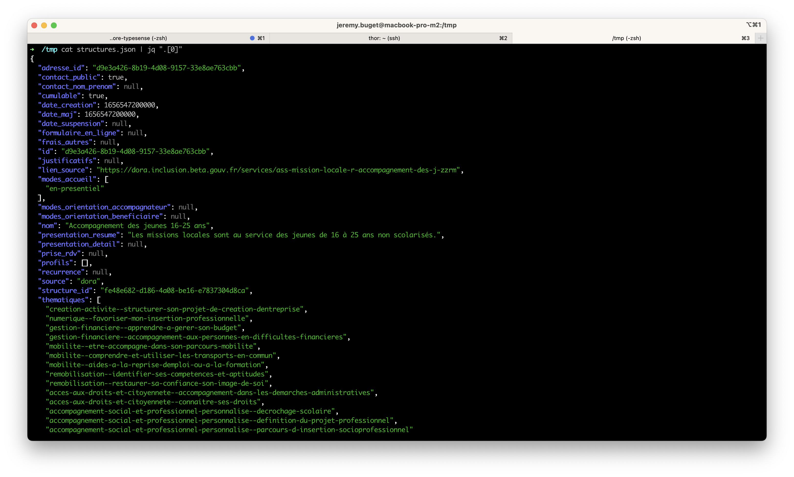
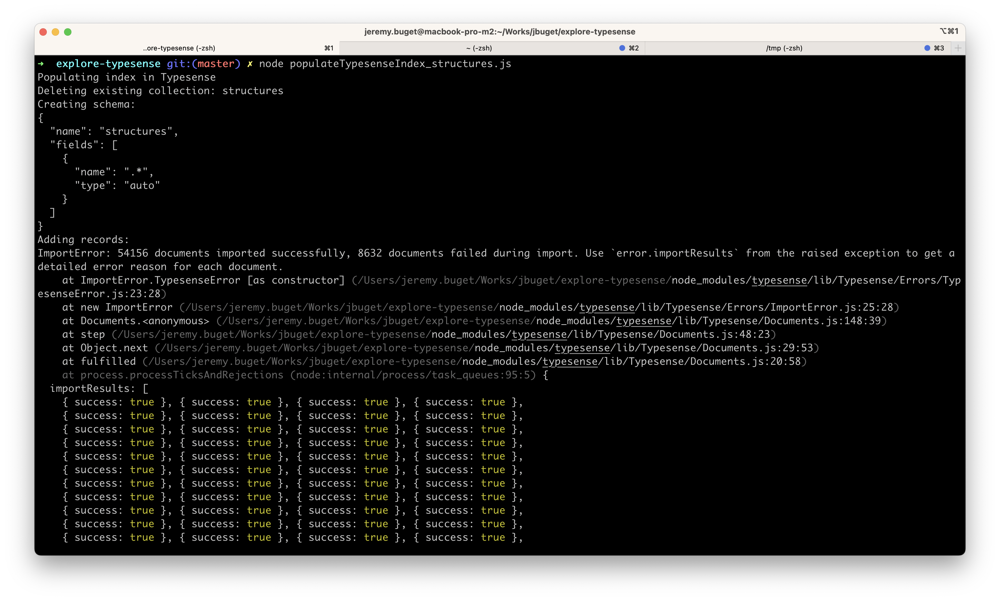
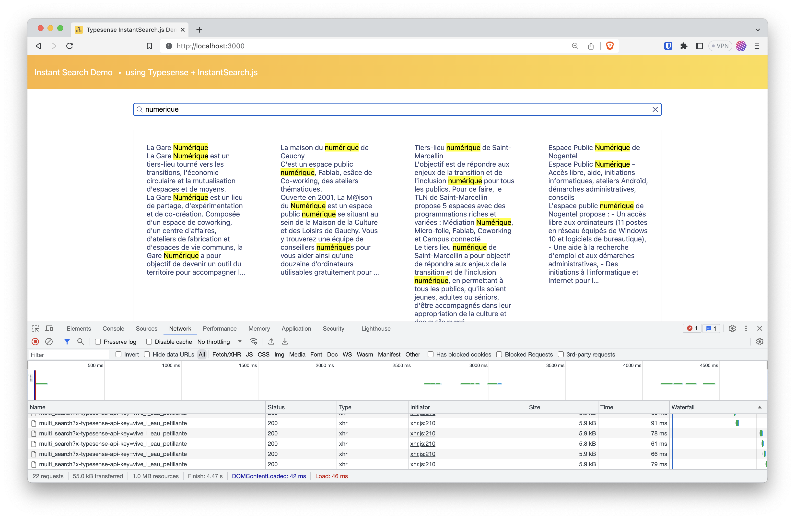

### Un vrai cas d'usage : donnnées de l'inclusion (feat. data.gouv.fr)

Au sein de la Plateforme de l'inclusion, nous recensons, raffinons et partageons les données publiques à notre disposition dans le cadre d'une démarche Open Data.

En particulier, l'équipe [data·inclusion](https://inclusion.beta.gouv.fr/nos-services/datainclusion/) collecte et expose les données des structures de l'inclusion et leurs offres de services via une API REST-ful sur [api.gouv.fr](https://api.gouv.fr/les-api/api-data-inclusion) et des jeux de données, très régulièrement et fréquemment mis à jour sur [data.gouv.fr](https://www.data.gouv.fr/fr/datasets/6233723c2c1e4a54af2f6b2d/) (depuis novembre 2021).

Les données peuvent être accédées ou récupérées dans différents formats : `.xlsx`, `.csv`, `.json`.
C'est ce dernier format qui nous intéresse et qu'on va exploiter.

**1/ Récupérer les données**

La première chose à faire est de télécharger les données. data·inclusion met à disposition deux types de données : les structures de l'insertion et les services (thématisés) qu'elles proposent pour les personnes en difficultés ou éloignées de l'emploi.

Pour nos travaux, nous utiliserons les données des structures de l'insertion, qui contient (entre autres) comme informations :
- le nom de la structure,
- son adresse,
- ses coordonnées de géolocalisation (longitude et latitude)
- la description courte et longue de la structure,
- sa typologie.

> Ce qui est intéressant avec ce dataset est la diversité de nature des informations : chaînes de caractères et textes (courts et longs), coordonnées spatiales, liste d'énumérations. Ça permet de tester pas mal de cas.

```shell
$ curl https://static.data.gouv.fr/resources/referentiel-de-loffre-dinsertion-liste-des-structures-et-services-dinsertion/20230703-175217/services-inclusion-2023-07-03.json -o data/structures.json
```

Dans mon cas, je décide de télécharger et manipuler le fichier dans mon répertoire `/tmp`.

**2/ Vérifier et comprendre les données**

On vérifie dans un premier temps que le fichier contient bien des données et les bonnes. Aussi, on analyse les champs et leur type à disposition.

```shell
$ cat ./data/structures.json | jq ".[0]"
```



**3/ Injecter les données dans Typesense**

Typesense maintient et met à disposition [plusieurs clients dans différents langages](https://typesense.org/docs/guide/installing-a-client.html) (JavaScript, PHP, Python, etc.).
Nous utiliserons le client JavaScript.

Le plus simple est de repartir et copier le fichier `populateTypesenseIndex.js` en `populateTypesenseIndex_structures.js`.

```javascript
const Typesense = require('typesense');

module.exports = (async () => {
  const typesense = new Typesense.Client({
    nodes: [
      {
        host: 'typesense.example.com',
        protocol: 'https',
      },
    ],
    apiKey: 'vive_les_vacances',
    connectionTimeoutSeconds: 120,
  });

  const schema = {
    name: 'structures',
    fields: [
      {"name": ".*", "type": "auto" }
    ]
  };

  console.log('Populating index in Typesense');

  try {
    await typesense.collections('structures').delete();
    console.log('Deleting existing collection: structures');
  } catch (error) {
    // Do nothing
  }

  console.log('Creating schema: ');
  console.log(JSON.stringify(schema, null, 2));
  await typesense.collections().create(schema);

  console.log('Adding records: ');
  const structures = require('./data/structures.json');
  try {
    const returnData = await typesense
      .collections('structures')
      .documents()
      .import(structures);
    console.log(returnData);
    console.log('Done indexing.');

    const failedItems = returnData.filter(item => item.success === false);
    if (failedItems.length > 0) {
      throw new Error(
        `Error indexing items ${JSON.stringify(failedItems, null, 2)}`
      );
    }

    return returnData;
  } catch (error) {
    console.log(error);
  }
})();
```

Dans les choses à noter, plutôt que déclarer chaque champs (et son type) à indexer dans le schéma, j'utilise [les capacités d'auto-détection de Typesense](https://typesense.org/docs/0.24.1/api/collections.html#with-auto-schema-detection) : 

```javascript
  const schema = {
    name: 'structures',
    fields: [
      {"name": ".*", "type": "auto" }
    ]
  };
```

On déclenche l'import grâce à Node : 

```shell
$ node populateTypesenseIndex_structures
```



**4/ Développer l'application cliente**

Là aussi, on se base et duplique le fichier `./app.js`

Par rapport à la dernière mise à jour du projet, il m'a fallu réaliser quelques changements pour que le tout fonctionne :
- dans le fichier `package.json` monter de version les dépendances `typesense` (*devDependencies*, de "^1.5.0-0", à "^1.5.4") et `typesense-instantsearch-adapter` (*depdendencies*, de "^2.5.0" à "^2.7.0")
- changer le style d'écriture des paramètres de requête : passer du *camelCase* au *pascal_case*
- dans le fichier `index.html`, mettre à jour la lib `instantsearch.js` (de "4.44.0" à "4.56.4") :

```html
<script src="https://cdn.jsdelivr.net/npm/instantsearch.js@4.56.4"></script>
```

- adapter le templating / rendering par rapport aux champs du schéma de données :

```javascript
/* global instantsearch */

import TypesenseInstantSearchAdapter from 'typesense-instantsearch-adapter';

const typesenseInstantsearchAdapter = new TypesenseInstantSearchAdapter({
  server: {
    apiKey: 'vive_les_vacances',
    nodes: [
      {
        host: 'typesense.example.com',
        protocol: 'https',
      },
    ],
  },
  additionalSearchParameters: {
    query_by: 'nom,presentation_detail,presentation_resume,thematiques'
  },
});
const searchClient = typesenseInstantsearchAdapter.searchClient;

const search = instantsearch({
  searchClient,
  indexName: 'structures',
});

search.addWidgets([
  instantsearch.widgets.searchBox({
    container: '#searchbox',
  }),
  instantsearch.widgets.configure({
    hitsPerPage: 8,
  }),
  instantsearch.widgets.hits({
    container: '#hits',
    templates: {
      item(item) {
        return `
        <div>
          <div class="hit-nom">
            ${item._highlightResult.nom.value}
          </div>
          ${item._highlightResult.presentation_resume
            ? `<div class="hit-presentation-resume">
            ${item._highlightResult.presentation_resume.value}
            </div>`
            : ``
          }
          ${item._highlightResult.presentation_detail
            ? `<div class="hit-presentation-detail">
            ${item._highlightResult.presentation_detail.value}
            </div>`
            : ``
          }
        </div>
      `;
      },
    },
  }),
  instantsearch.widgets.pagination({
    container: '#pagination',
  }),
]);

search.start();
```

**5/ Lancer et utiliser le tout**

```shell
$ npm start
```

Accéder à l'interface à l'interface via l'URL : [http://localhost:3000](http://localhost:3000).

