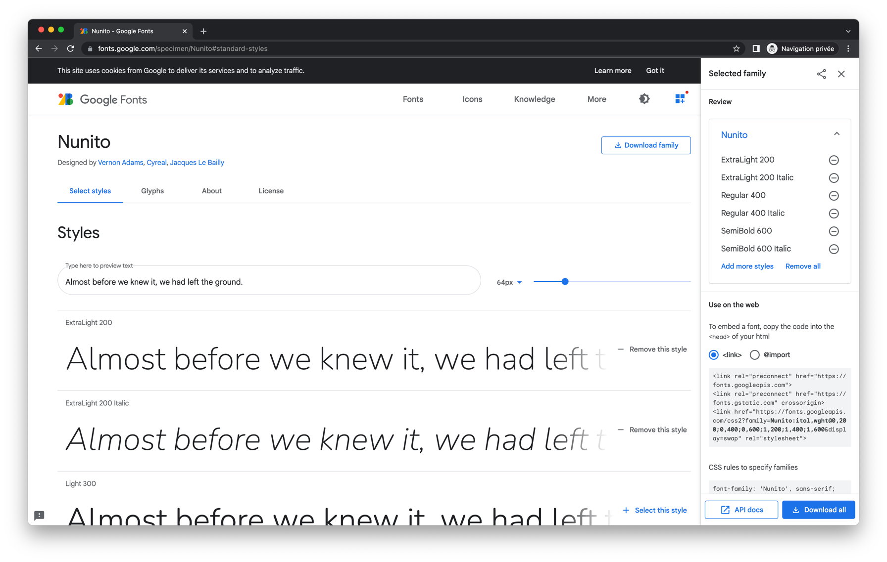
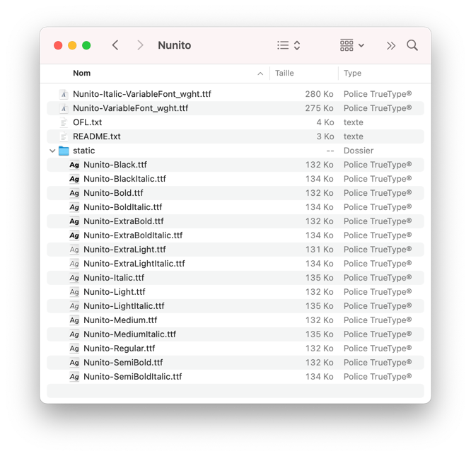
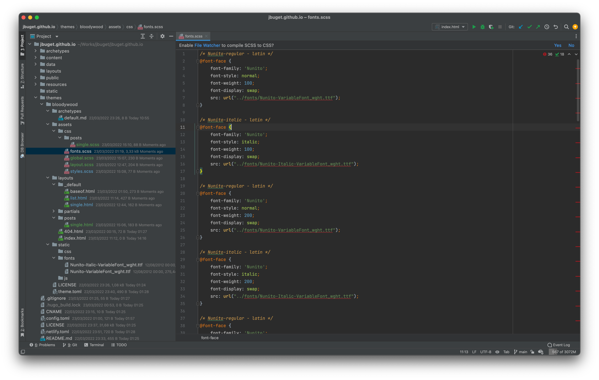
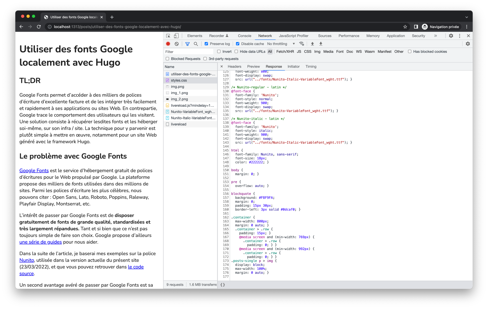
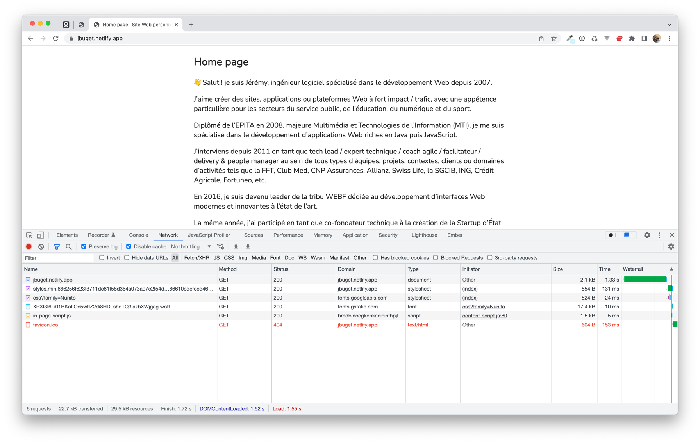
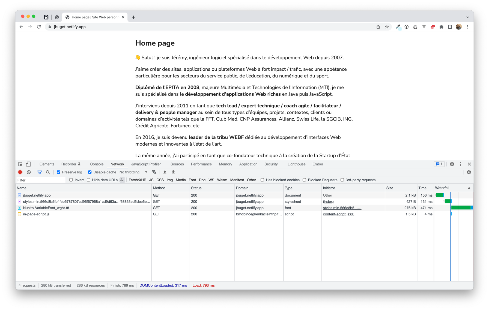
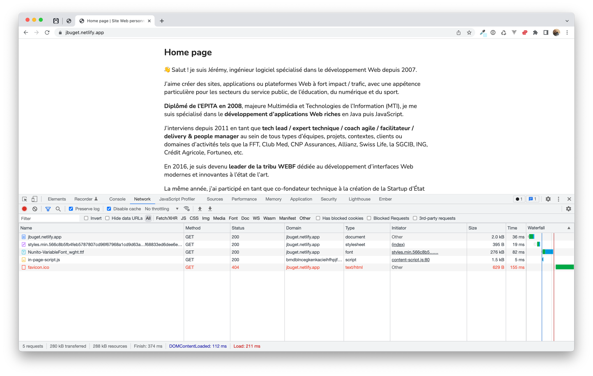

## TL;DR

Google Fonts permet d'accéder à des milliers de polices d'écriture d'excellente facture et de les intégrer très facilement et rapidement à ses applications ou sites Web.
En contrepartie, Google trace le comportement des utilisateurs qui les visitent.
Une solution consiste à récupérer lesdites fonts et les héberger soi-même, sur son infra / site.
La technique pour y parvenir est plutôt simple à mettre en œuvre, notamment pour un site Web généré avec le framework Hugo.

## Table des matières

- [I. Le problème avec Google Fonts](#i-le-problème-avec-google-fonts)
- [II. La solution pour un site généré avec Hugo](#ii-la-solution-pour-un-site-généré-avec-hugo)
- [III. Étude comparative](#iii-étude-comparative)
- [Conclusion](#conclusion)
- [Liens](#liens)

## I. Le problème avec Google Fonts

[Google Fonts](https://fonts.google.com/) est le service d’hébergement gratuit de polices d’écritures pour le Web propulsé par Google.
La plateforme propose des milliers de _fonts_ utilisées dans des millions de sites.
Parmi les polices d'écriture les plus célèbres, nous pouvons citer : Open Sans, Lato, Roboto, Poppins, Raleway, Playfair Display, Montserrat, etc.

L'intérêt de passer par Google Fonts est de **disposer gratuitement de fonts de grande qualité, standardisées et très largement répandues.**
Tant et si bien que ce n'est pas toujours simple de faire son choix.
Google propose d'ailleurs [une série de guides](https://fonts.google.com/knowledge/choosing_type) pour nous aider.
{.pros}

> Dans la suite de l'article, je baserai mes exemples sur la police [Nunito](https://fonts.google.com/specimen/Nunito), utilisée dans la version actuelle du présent site (23/03/2022), et que vous pouvez retrouver dans [le code source](https://github.com/jbuget/jbuget.github.io).

Un second avantage avéré de passer par Google Fonts est sa **simplicité d'intégration.**
{.pros}

Basiquement, l'intégration d'une police se fait en ajoutant un lien de ressource externe via [l'élément HTML `<link>`](https://developer.mozilla.org/fr/docs/Web/HTML/Element/link).
Il devient alors possible d'utiliser directement la police dans le code CSS.

```html
<html>
  <head>
    <link rel="stylesheet" href="https://fonts.googleapis.com/css?family=Nunito">
    <style>
      body {
        font-family: 'Nunito', sans-serif;
        font-size: 18px;
      }
    </style>
  </head>
  <body>
    <div>Ceci est un texte avec la police Nunito.</div>
  </body>
</html>
```

Un autre intérêt de cette technique est de **disposer de la puissance de mise à disposition des ressources de Google** et sa couverture d'infrastructure planétaire.
On peut difficilement espérer mieux en termes de temps de réponse de récupération des fonts que ce que fournit Google et son CDN.
{.pros}

Un dernier avantage de cette pratique est de **bénéficier automatiquement des éventuelles mises à jour** (ex : support de nouvelles graisses, corrections ou améliorations du rendu).
{.pros}

Ce qui nous fait basculer du côté des inconvénients.

> _« Si c'est gratuit, c'est que vous êtes le produit »_
> 
> -- Bruce Willis (enfin, [sa voix française](https://webdeveloppementdurable.com/bruce-willis-vous-explique-si-cest-gratuit-vous-etes-le-produit/) !)

Si la technique ci-dessus présente l'avantage d'être facile et rapide à mettre en œuvre, elle recèle en revanche un inconvénient majeur : **elle permet à Google de tracer les visiteurs qui accèdent à votre site**.
[Google ne s'en cache pas](https://developers.google.com/fonts/faq#what_does_using_the_google_fonts_api_mean_for_the_privacy_of_my_users) et l'écrit noir sur blanc sur la documentation en ligne à l'usage des développeurs :
{.cons}

> _« Google Fonts logs records of the CSS and the font file requests, and access to this data is kept secure. 
> Aggregate usage numbers track how popular font families are and are published on our analytics page. 
> We use data from Google’s web crawler to detect which websites use Google fonts. 
> To learn more about the information Google collects and how it is used and secured, see Google's Privacy Policy. »_

À noter que, pour ce faire, Google ne dépose pas de cookie tiers sur le navigateur de vos visiteurs au passage sur votre site.
Il n'est donc pas nécessaire d'ajouter un bandeau cookie spécifique (dans le cas où vous n'en n'auriez pas déjà un) ou de les gérer dans les options de consentement.
Il convient toutefois de rester très vigilant sur le sujet, car les autorités dédiées, elles, le sont et n'hésitent pas intervenir, [comme en Allemagne](https://web.developpez.com/actu/330644/Un-site-Web-condamne-a-une-amende-par-un-tribunal-allemand-pour-avoir-divulgue-l-adresse-IP-d-un-visiteur-via-Google-Fonts-le-proprietaire-du-site-risque-une-peine-de-prison-en-cas-de-recidive/).

Un autre point à risque à garder en tête est que le fait de **reposer sur le service Google Fonts crée une dépendance externe** de votre site ou SI.
Pour la plupart des sites, cela ne pose pas de problème.
Mais pour un acteur à l'éthique ou aux contraintes (politique, stratégique, juridique) plus marquées, cela peut être un sujet non négligeable.
{.cons}

Pour peu que votre direction artistique soit un point fondamental de votre site ou application (ex : marque de luxe) et repose beaucoup sur la font (ex : design très épuré), avoir **une police qui se charge mal, trop lentement ou pas du tout, du fait de restrictions (économiques, géopolitiques, géographiques) tierces, peut avoir un impact négatif (image, retombées financières)**.
Je conçois qu'il s'agit d'un cas extrême, qui concerne peut-être 0.01% des sites utilisant Google Fonts, mais il n'en demeure pas moins avéré.
{.cons}

Enfin, pour en revenir à l'avantage de bénéficier des mises à jour de police automatique, le revers de la médaille, c'est de **voir son design "chamboulé" du jour au lendemain** (là encore le terme est fort) sans réelle capacité de contrôle ou moyen de mitigation du risque.
{.cons}

## II. La solution pour un site généré avec Hugo

Il existe une solution à tous ces maux.
Celle-ci consiste à **télécharger, auto-héberger et gérer soi-même les polices d'écriture trouvées sur Google Fonts** dont nous avons besoin.

> [Hugo](https://gohugo.io/) est un logiciel libre, générateur de site statique écrit en langage Go. 
> C'est le framework utilisé pour développer ce site.

Les étapes ci-dessous expliquent :
- comment récupérer gratuitement les fichiers de police d'écriture depuis la plateforme Google Fonts, 
- où les mettre dans son projet de site Web développé avec le framework Hugo
- comment définir les classes de police CSS
- comment intégrer les sources CSS (avec Sass)

### 0/ Préambule

Avant toute chose, je me dois de préciser 2 éléments contextuels :

1. Ma pratique d'Hugo se limite à quelques semaines.
Auparavant, j'ai pratiqué pas mal de frameworks Web / front-end de différentes natures, dont des générateurs de sites statiques tel que Jekyll, mais il est possible que je passe à côté ou me méprends sur certains aspects techniques.
Je vous invite à me corriger en commentaire ou sur Twitter le cas échéant

2. Je rédige cet article dans le cadre du développement de la nouvelle mouture de mon site Web personnel.
En particulier, la mise en place de fonts custom a été l'une des toutes premières opérations que j'ai réalisées sur ce site.
Ceci explique le focus sur l'étape 4 à propos de Sass et de l'_asset processing_.
Il est possible que cette étape soit déjà réalisée sur votre propre projet.

### 1/ Récupérer la font et ses fichiers

La première chose à faire, une fois la police d'écriture sélectionnée, consiste à la télécharger.

Depuis la page de présentation de la police, il est possible de la récupérer très facilement en cliquant sur le bouton "Download family" disposé en haut à droite.



On obtient une archive au format ZIP, qui contient différents fichiers, notamment tout un tas de fichiers au format [TTF](https://fr.wikipedia.org/wiki/TTF). Ce sont ces derniers qui vont vraiment nous intéresser.



> Pour les amateurs de performance, il est possible de sélectionner un sous-ensemble de fonts, dans le cas où l'on anticipe que tous les styles relatifs à une police d'écriture donnée ne seront pas nécessaires.
> Pour ce faire, il faut sélectionner lesdits styles et accéder au lien indiqué dans l'encart "Use on the web".
> Une page de CSS s'ouvre alors avec la définition des différentes fonts / styles.
> 
> On remarque que le format de police indiqué n'est plus du TTF mais du WOFF2, qui est un format de données typographique optimisé pour le Web.
> Celui-ci est une évolution des formats standards (et un peu datés) OTF et TTF avec des meta-données supplémentaires permettant la compression des données et un temps de chargement réduit, compatible avec tous les navigateurs.
> 
> Bref, c'est la Ferrari des polices d'écriture, mais elle nécessite un petit plus de travail en aval, telle que la récupération individuelle de chaque style de police.

### 2/ Ajouter les fichiers de fonts au projet

Dans mon cas, je pars du principe que j'aurai besoin de la majorité des styles proposés.
Je considère que les quelques polices inutilisées ne justifient pas la complexité de gérer des fonts individuellement.

> À noter que dans le cadre de mon site, je passe par un thème _custom_ (a.k.a. "[bloodywood](https://www.youtube.com/watch?v=6uJoN_I9ebQ)").
> La plupart des ressources que je traite sont gérées dans le répertoire `~/themes/bloodywood/*`.

Je copie les 2 fichiers TTF à la racine de l'archive `Nunito-VariableFont_wght` et `Nunito-Italic-VariableFont_wght` dans le répertoire des ressources statiques : `~/themes/bloodywood/static/fonts`.



### 3/ Définir les polices CSS

La glue entre les fichiers de fonts TTF et la prise en compte par les navigateurs va s'effectuer côté CSS.
C'est dans les fichiers de styles que l'on indique, pour chaque élément HTML, quelle sera sa famille de police d'écriture (grâce à la classique option `font-family`).
Il faut au préalable définir les règles de police d'écriture - a.k.a. `@font-face` - pour les indiquer au moteur CSS.

```css
/* Nunito-regular - latin */
@font-face {
	font-family: 'Nunito';
	font-style: normal;
	font-weight: 400;
	font-display: swap;
	src: url("../fonts/Nunito-VariableFont_wght.ttf");
}

/* Nunito-italic - latin */
@font-face {
	font-family: 'Nunito';
	font-style: italic;
	font-weight: 400;
	font-display: swap;
	src: url("../fonts/Nunito-Italic-VariableFont_wght.ttf");
}

/* Nunito-regular - latin */
@font-face {
	font-family: 'Nunito';
	font-style: normal;
	font-weight: 600;
	font-display: swap;
	src: url("../fonts/Nunito-VariableFont_wght.ttf");
}

/* Nunito-italic - latin */
@font-face {
	font-family: 'Nunito';
	font-style: italic;
	font-weight: 600;
	font-display: swap;
	src: url("../fonts/Nunito-Italic-VariableFont_wght.ttf");
}
```

### 4/ Activer les CSS du projet (option)

Dans mon cas, je suis parti d'un projet _from scratch_, avec un thème sur-mesure créé au démarrage du site. Comme énoncé en préambule, il est possible que votre projet soit déjà configuré pour gérer le processing de ressources.

J'ai pris le parti personnel d'utiliser Sass, [fourni de base par Hugo](https://gohugo.io/hugo-pipes/scss-sass/).

À cette fin, je dois utiliser le mécanisme de Pipes promulgué par Hugo pour accomplir le processing des fichiers de style `.scss`.

Concrètement, cela revient à ajouter les lignes ci-dessous dans la partie `<head>` des documents HTML.

>  Dans mon cas, et suite à la génération du thème par le CLI Hugo, ces lignes sont à insérer dans le fichier `~/themes/bloodywood/layouts/partials/head.html`.

```html
<head>
  <!-- ... autres instructions head -->
  {{ $styleSass := resources.Get "css/styles.scss" }}
  {{ $styleCSS := $styleSass | resources.ToCSS }}
  <link rel="stylesheet" href="{{ $styleCSS.RelPermalink }}">
</head>
```

### 5/ Utiliser les familles de font

À partir de là, il ne reste plus qu'à utiliser les fonts ainsi définies.

```css
html {
    font-family: Nunito, sans-serif;
    font-size: 18px;
}
```

Et voilà !



## III. Étude comparative

L'objectif de cette section est de comparer les différences entre la version Google Fonts (échantillon `GF`) et la version auto-hébergée ou "_self hosted_" (échantillon `SH`).

### Échantillons

La version `SH` peut elle-même être divisée en 2 sous-versions, en fonction de la mise en cache ou non des fichiers de fonts (TTF) au sein de l'infrastructure (en l'occurrence ici, l'hébergeur de mon site Web est [Netlify](https://netlify.app/)) : 
- la version `SH-nocache` pour le tout premier chargement du site par un visiteur quelconque
- la version `SH-cached` dans le cas où le fichier TTF aurait déjà été chargé et mis en cache sur l'instance de serveur Netlify

### Résultats

Version Google Fonts `GF` :



Version _self hosted_ non cachée `SH-nocache` :



Version _self hosted_ cachée `SH-cached` : 



### Observations

**1/** Le chargement du fichier principal de styles CSS, qui est recalculé à chaque build est identique entre la version `GF` et `SH-nocache`.
Dans les deux cas, la ressource, générée lors du déploiement par Netlify et _fingerprintée_, coûte le même temps de transfert.

Dans la version `SH-cached`, le temps est passé de 131ms à 19ms.
Cela permet de constater que le cache de Netlify est performant.
Et ça donne un ordre de grandeur de son efficacité.

**2/** La version `GF` requiert 2 appels réseau, d'abord pour récupérer la ressource `css?family=Nunito` puis pour récupérer le fichier de font WOFF, lequel ne pèse "que" 17.4Kb.
La version `SH` (avec ou sans cache) ne nécessite qu'un seul appel réseau, pour le fichier de font TTF, beaucoup (15x) plus volumineux.

**3/** Dans le cas de la version `GF`, le temps cumulé des 2 requêtes vaut **34ms**.
Dans le cas de la version `SH-cached`, à mon sens la plus pertinente, celle qui devrait se produire le plus (NDLA: "j'espère !"), il n'y a qu'un seul appel réseau mais il coûte **82ms**.
C'est là qu'on voit toute la puissance de l'infrastructure de Google et Google Fonts.

**4/** Au passage, on notera que la version Google Fonts donne le sentiment d'être par défaut déjà mise en cache.
Cette intuition est très certainement dûe au fait que la police Nunito sur Google Fonts est l'une des plus utilisées, donc naturellement gardée en cache.

**5/** Finalement, on remarque dans les 3 cas, l'absence du téléchargement des styles de police "italiques".
Il faudrait creuser un peu plus le sujet, mais j'imagine que c'est dûe à une optimisation du runtime CSS, qui doit ne charger que les fichiers de fonts dont il est sûr d'avoir besoin.

## Conclusion

Nous avons vu, au travers de ce cas d'usage, qu'il est tout à fait judicieux et possible d'utiliser les police d'écritures proposées gratuitement sur la plateforme Google Fonts sans en subir (ou faire subir à nos visiteurs) les conséquences.

Pour cela, nous avons dû récupérer les sources et les traiter localement comme toute autre ressource du site Web qui les intègre.
Il a ensuite fallu déclarer les classes de police en CSS grâce à la fonction `@font-face` pour pouvoir les utiliser, chose que propose automatiquement le script Google Fonts.

Par ailleurs, un rapide benchmark a permis de confirmer que la solution proposée par Google Fonts est véritablement optimisée.
Il paraît difficile d'atteindre le même niveau de performance, en sachant pourtant que l'hébergeur du site (Netlify) propose lui aussi un niveau de performance élevé.

Finalement, on pourrait peut-être pousser un peu plus loin l'intégration en récupérant directement les fichiers WOFF propulsés par l'API de Google Fonts (via la requête `css?family=Nunito`). 

## Liens

- [Code source du présent site](https://github.com/jbuget/jbuget.github.io) #code
- [Why Google Fonts aren’t really open source](https://practicaltypography.com/why-google-fonts-arent-really-open-source.html) #article
- [https://github.com/google/fonts/issues/1307](https://github.com/google/fonts/issues/1307) #article
- [Why use Google Fonts? What are the advantages and disadvantages of using Google Fonts?](https://www.quora.com/Why-use-Google-Fonts-What-are-the-advantages-and-disadvantages-of-using-Google-Fonts) #article
- [The Best Google Web fonts & Why You Should Be Using Them](https://www.kanukadigital.com/2019/02/best-google-web-fonts-why-use-them/) #article
- [Why You Should STOP Using Google Fonts (And How to Self-Host Your Own Web Fonts)](https://www.youtube.com/watch?v=363s_ziVwTg) #video
- [Should you self-host Google Fonts?](https://www.tunetheweb.com/blog/should-you-self-host-google-fonts/) #article
